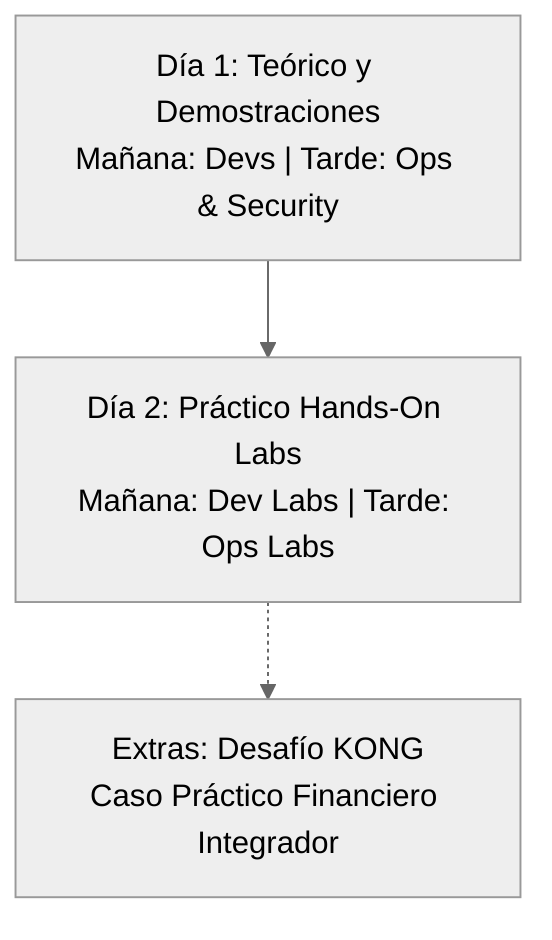

<div align="center">
  <h1>🚀 Kong API Gateway & Konnect</h1>
  <h2>Workshop Oficial (2 Días)</h2>
  <br>
  <p><strong>Formación práctica en API Gateway, GitOps, Seguridad y Observabilidad</strong></p>
  <p><em>Curso presencial de 16 horas divididas en dos audiencias</em></p>
  <br>
</div>

---

> **Nota histórica:** la entrega del curso a STP (septiembre 2026) se conserva en el tag [`v2026-09-stp`](https://github.com/rzengin/Kong-Training-STP/releases/tag/v2026-09-stp) del repositorio anterior `rzengin/Kong-Training-STP` (privado). Este repositorio arranca con un historial limpio.

## 📖 Descripción


Este repositorio contiene el material completo del **Workshop de Kong API Gateway & Konnect**. Está estructurado para un curso presencial de dos días, de 8 horas cada uno, orientados a audiencias específicas.

Todo el workshop utiliza un enfoque **GitOps** con gestión declarativa vía **decK**, automatización con **Terraform**, y backends simulados con Docker.

---

## 🗂️ Estructura del Proyecto

```text
Kong-Konnect-Fundamentals/
├── README.md                          ← Este archivo
├── Arquitectura.md                    ← Arquitectura unificada
├── 00-setup-entorno/                  ← Prerrequisitos y scripts de instalación inicial compartidos
├── dia-1-teoria-y-demos/                        ← Día 1: Development Team
│   ├── 00-arquitectura-setup/
│   ├── 01-kong-konnect-gateway/
│   ├── 02-developer-portal/
│   ├── 03-kong-plugins/
│   └── labs/
├── dia-1-teoria-y-demos/                     ← Día 2: Operations and Security Teams
│   ├── 01-gateway-operations/
│   ├── 02-monitoring-logging/
│   ├── 03-observability/
│   ├── 04-securing-api-traffic/
│   └── labs/
└── extras/                            ← Desafíos y material adicional
```

---

## 📋 Resumen del Temario

El contenido de este workshop ha sido diseñado para alinearse estrictamente con los siguientes requerimientos:

### Día 1: Bloque Teórico y Demostraciones
**Fundamentos, Operaciones y Seguridad**
- **Arquitectura Conceptual**: Entender la separación Control Plane (Konnect) y Data Plane (Kong Gateway basado en NGINX/OpenResty), y la comunicación vía túnel gRPC mTLS.
- **Developer Track**: Conceptos de Gateway Services, Routes, Plugins, Developer Portal (customización y onboarding) y publicación de API Products.
- **Operations Track**: Gobierno declarativo con decK/Terraform, monitoreo de tráfico y observabilidad avanzada con OpenTelemetry (OpenObserve + Arize Phoenix).
- **Security Track**: Estrategias Zero Trust, OIDC, RBAC, Key Auth, IP Restriction y control de acceso mediante OPA.

---

### Día 2: Bloque Práctico — Hands-On Labs y Desafío Final
**Laboratorios Guiados y Práctica**
- **Setup y Ruteo**: Inicialización del entorno local y despliegue declarativo de rutas.
- **Plugins y Portales**: Transformaciones de payload, ruteo inteligente y publicación de catálogos OAS.
- **Operaciones y Seguridad**: Despliegue de observabilidad local (OTel Collector + OpenObserve + Phoenix), aplicación de Key Auth, restricción de IPs y Autenticación Delegada Empresarial (OIDC).

---

### Agenda Completa de Navegación del Taller

El workshop está planificado en dos jornadas estructuradas de **08:00 a 17:00**:
- **Día 1: Bloque Teórico y Demostraciones** (Mañana: Developer Track | Tarde: Operations & Security Track).
- **Día 2: Bloque Práctico Hands-On Labs** (Mañana: Labs de Desarrollo | Tarde: Labs de Operaciones/Seguridad y Desafío Final).

### Pre-requisitos (Antes de comenzar)
| Módulo / Actividad | Documentación Principal |
|--------------------|-------------------------|
| **Prerrequisitos e Instalación** | [Software necesario y guía de instalación](00-setup-entorno/Prerequisitos_Workshop_Kong_Konnect_Instalacion.md) |

### Día 1: Teórico y Demostraciones
| Horario | Bloque | Tema / Módulo | Guía Teórica |
|---------|--------|---------------|--------------|
| **08:00 - 08:30** | Mañana (Todos) | **Bienvenida, Setup y Objetivos** | N/A |
| **08:30 - 09:15** | Mañana (Dev) | **Módulo 00: Arquitectura Conceptual y Setup Local** | [Guía Módulo 00](dia-1-teoria-y-demos/00-arquitectura-setup/Guia_00_Arquitectura_y_Setup.md) |
| **09:15 - 10:15** | Mañana (Dev) | **Módulo 01: Kong Konnect Gateway (Básico)** | [Guía Módulo 01](dia-1-teoria-y-demos/01-kong-konnect-gateway/Guia_01_Konnect_Basico.md) |
| **10:15 - 10:30** | *Descanso* | *Coffee Break* | N/A |
| **10:30 - 12:00** | Mañana (Dev) | **Módulo 02: Kong Plugins (Incluye OIDC, OPA, OTel, ACL, IP Restriction)** | [Guía Módulo 02](dia-1-teoria-y-demos/02-kong-plugins/Guia_02_Kong_Plugins.md) <br> *(Alt: [Windows](dia-1-teoria-y-demos/02-kong-plugins/Guia_Paso_a_Paso_002_Windows.md))* |
| **12:00 - 13:00** | Mañana (Dev) | **Módulo 03: Developer Portal, Customización y Onboarding** | [Guía Módulo 03](dia-1-teoria-y-demos/03-developer-portal/Guia_03_Developer_Portal.md) |
| **13:00 - 14:15** | *Descanso* | *Almuerzo (El equipo Dev puede retirarse)* | N/A |
| **14:15 - 15:15** | Tarde (Ops)  | **Módulo 04: Gateway Operations & GitOps (decK / Terraform)** | [Guía Módulo 04](dia-1-teoria-y-demos/04-gateway-operations/Guia_04_Gateway_Operations.md) <br> *(Alt: [Windows](dia-1-teoria-y-demos/04-gateway-operations/Guia_Paso_a_Paso_000_Windows.md))* |
| **15:15 - 15:45** | Tarde (Ops)  | **Módulo 05: Monitoring y Logging (Konnect Analytics)** | [Guía Módulo 05](dia-1-teoria-y-demos/05-monitoring-logging/Guia_05_Monitoring.md) |
| **15:45 - 16:00** | *Descanso* | *Coffee Break* | N/A |
| **16:00 - 16:45** | Tarde (Ops)  | **Módulo 06: Observabilidad Avanzada (OpenTelemetry, OpenObserve & Phoenix)** | [Guía Módulo 06](dia-1-teoria-y-demos/06-observability/Guia_06_Observability.md) |
| **16:45 - 17:30** | Tarde (Sec)  | **Módulo 07: Securing API Traffic (Práctico/Labs Index)** | [Guía Módulo 07](dia-1-teoria-y-demos/07-securing-api-traffic/Guia_07_Securing_API_Traffic.md) <br> *(Alt: [Windows](dia-1-teoria-y-demos/07-securing-api-traffic/Guia_Paso_a_Paso_001_Windows.md))* |
| **17:30 - 17:45** | Tarde (Todos)| **Health Check de Entornos** (Test Docker: `docker pull kong/kong-gateway`) | N/A |

### Día 2: Práctico — Hands-On Labs
| Horario | Bloque | Laboratorio / Actividad Práctica | Guía de Laboratorio |
|---------|--------|----------------------------------|---------------------|
| **08:00 - 08:15** | Mañana (Todos) | Bienvenida al Día Práctico, credenciales y repaso GitOps | N/A |
| **08:15 - 09:00** | Mañana (Dev) | **Lab:** Setup del Entorno Local | [Setup Local](dia-2-labs/Lab_00_Setup_Local.md) |
| **09:00 - 09:50** | Mañana (Dev) | **Lab:** Routing Declarativo + Upstreams & Health Checks | [Routing](dia-2-labs/Lab_01_Declarative_Routing.md) <br> [Upstreams](dia-2-labs/Lab_02_Upstreams_Health_Checks.md) |
| **09:50 - 10:05** | *Descanso* | *Coffee Break* | N/A |
| **10:05 - 11:20** | Mañana (Dev) | **Lab:** Catalog APIs & OAS + Transformaciones | [API Products](dia-2-labs/Lab_03_Catalog_APIs_OAS.md) <br> [Transformaciones](dia-2-labs/Lab_04_Transformaciones.md) |
| **11:20 - 12:00** | Mañana (Dev) | **Labs Avanzados:** Ruteo Inteligente y Validación JSON | [Ruteo Inteligente](dia-2-labs/Lab_05_Ruteo_Inteligente.md) <br> [Validación JSON](dia-2-labs/Lab_06_Validacion_JSON.md) |
| **12:00 - 13:00** | *Descanso* | *Almuerzo (Devs se retiran / Ingresa Ops)* | N/A |
| **13:00 - 13:15** | Tarde (Todos)| Bienvenida y sincronización de entornos (Ingresantes de la tarde) | N/A |
| **13:15 - 14:15** | Tarde (Ops) | **Lab:** Observabilidad Distribuida con OTel, OpenObserve y Phoenix | [Observabilidad](dia-2-labs/Lab_07_Observabilidad_Avanzada.md) |
| **14:15 - 15:25** | Tarde (Sec) | **Lab:** Zero Trust Key Auth + OIDC & ACL | [Zero Trust](dia-2-labs/Lab_08_Zero_Trust_Security.md) <br> [OIDC/ACL](dia-2-labs/Lab_10_Autenticacion_Avanzada.md) |
| **15:25 - 15:40** | *Descanso* | *Coffee Break* | N/A |
| **15:40 - 16:25** | Tarde (Sec) | **Lab:** Restricción de IPs + OPA Authorization | [Restricción IPs](dia-2-labs/Lab_09_IP_Restriction.md) <br> [OPA](dia-2-labs/Lab_11_OPA.md) |
| **16:25 - 17:00** | Tarde (Todos)| Cierre del taller, resolución de dudas y próximos pasos | N/A |

---

## Flujo de Aprendizaje



---

## Inicio Rápido

```bash
# 1. Clonar el repositorio
git clone <repo-url> && cd Kong-Konnect-Fundamentals

# 2. Instalar dependencias del proyecto
npm install

# 3. Instalar prerrequisitos (Desde el módulo de configuración inicial compartida)
cd 00-setup-entorno && ./scripts/install_prereqs.sh

# 4. Configurar variables de entorno
export KONNECT_TOKEN="kpat_..."
export DEMO_PREFIX="tu_nombre"

# 5. Levantar el sitio de documentación en modo desarrollo
npm run docs:dev
```

> El servidor de documentación (VitePress) se iniciará en `http://localhost:5173` con hot-reload habilitado.

---

## 📄 Documentación

### 🌐 Documentación Online (GitHub Pages)

La documentación generada de este workshop está disponible públicamente en internet a través de GitHub Pages. Puedes acceder en cualquier momento desde este enlace:

👉 **[https://rzengin.github.io/Kong-Konnect-Fundamentals/](https://rzengin.github.io/Kong-Konnect-Fundamentals/)**

> **Nota:** Este sitio se actualiza automáticamente cada vez que ejecutas el paso final del script `setup.sh` usando el comando `mkdocs gh-deploy`.

### 💻 Sitio de Documentación Local

El workshop incluye un sitio de documentación interactivo construido con **VitePress**. Para levantarlo localmente, ejecuta los siguientes comandos **desde la raíz del proyecto** (`Kong-Konnect-Fundamentals/`):

```bash
# Ubicarse en la raíz del proyecto
cd Kong-Konnect-Fundamentals/

# Instalar dependencias (si aún no lo hiciste)
npm install

# Iniciar el servidor de desarrollo
npm run docs:dev
```

El sitio estará disponible en `http://localhost:5173` y se actualizará automáticamente al editar los archivos Markdown.

### Documentos de Referencia

| Documento | Descripción |
|-----------|-------------|
| [Arquitectura](Arquitectura.md) | Arquitectura unificada del workshop |
| [Prerrequisitos](Prerequisitos_Workshop_Kong_Konnect_Instalacion.md) | Software necesario y guía de instalación |
| [Requerimientos de Red](Requerimientos_Red_Workshop.md) | Puertos, URLs y conectividad necesaria |

---

## 🛠️ Tecnologías Utilizadas

| Herramienta | Versión | Uso |
|-------------|---------|-----|
| Kong Gateway Enterprise | 3.15.x | API Gateway |
| Kong Konnect | SaaS | Control Plane en la nube |
| decK | 1.65+ | Gestión declarativa (GitOps) |
| Terraform | 1.5+ | IaC para Control Planes y Teams |
| OpenTelemetry Collector (contrib) | 0.161.0 | Recepción OTLP y reparto de telemetría |
| OpenObserve | v1.0.4 | Observabilidad (Traces, Métricas, Logs, Dashboards) |
| Arize Phoenix | 20.19.0 | Vista de trazas orientada a LLM / IA |
| Docker | 24+ | Contenedores locales |

---

## 📝 Generación de PDFs

Para generar los PDFs de todas las guías:

```bash
./generate_all_pdfs.sh
```

Requiere `npx` y `md-to-pdf` instalados.
