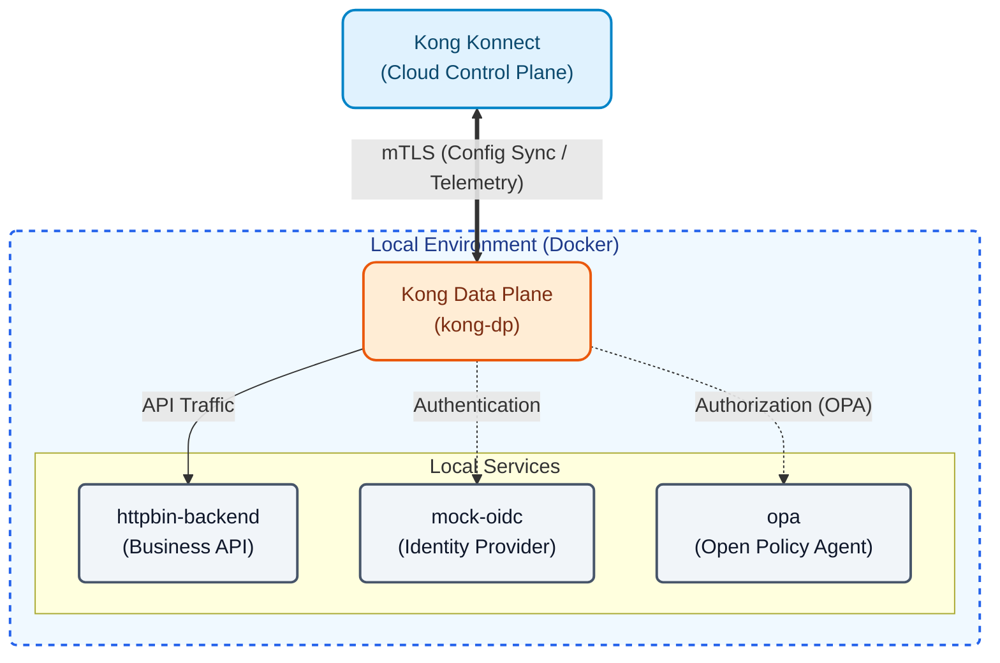
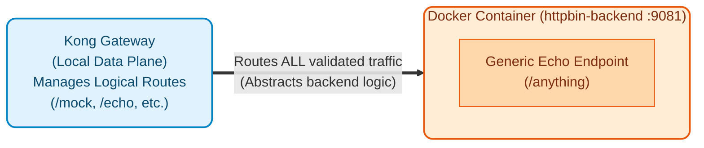
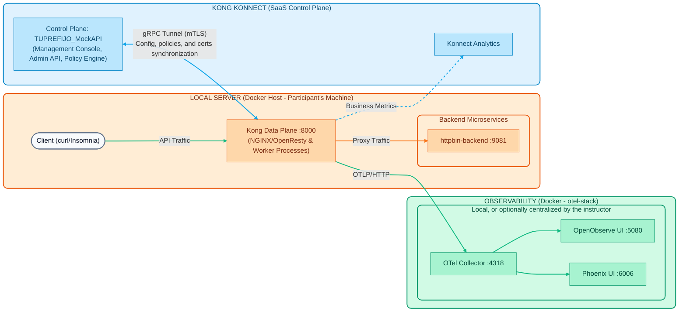

# Module 00: Architecture and Initial Setup

Before being able to interact with Kong, Konnect, or deploy configurations, it is **mandatory** to understand the architecture we will be working with and to have the work environment correctly installed.



### Elements of the Hybrid Architecture

The image describes Kong's hybrid deployment topology (Kong Hybrid Mode Architecture). In this model, traffic management and processing are divided into very specific components, as detailed below:

#### 1. Konnect Control Plane (CP)
It is the centralized "brain" managed in the cloud (SaaS) by Kong, with global reach. Its internal components are:

- **Management Console (UI)**: Web graphical interface where administrators interact to configure and monitor the API lifecycle.
- **Admin API**: RESTful programmatic interface. Everything done in the graphical interface goes through this API, allowing for automation (e.g., when using decK or CI/CD pipelines).
- **Analytics Dashboard**: Panel that processes and visualizes telemetry and usage "Data" (metrics) sent by the Data Planes.
- **Konnect Gateway (Cloud)**: The Control Plane's own internal gateway that protects and routes access to Konnect's administration services.
- **Policy Engine**: Logical engine that validates and compiles security rules, plugins, and policies before distributing them.
- **Control Plane DB**: Database managed by Kong that acts as the single Source of Truth for all configurations.

#### 2. Data Plane Connections
This is the link that securely connects the cloud to your local infrastructure:

- **gRPC Tunnel**: A persistent bidirectional tunnel that connects each Data Plane to the Control Plane. **gRPC** (*gRPC Remote Procedure Calls*) is a high-performance open-source framework (originally developed by Google). This protocol is used instead of traditional REST APIs for several key reasons: being based on HTTP/2, it supports **bidirectional streaming** and long-lived connections. This allows the Control Plane to instantly *push* any configuration changes to the Data Planes without them having to continuously poll, drastically reducing propagation latency, minimizing network consumption, and natively supporting mTLS security.
- **Mutual TLS (mTLS)**: Security protocol implemented in the gRPC tunnel that ensures both ends (CP and DP) present and validate digital certificates (Certificates), mutually authenticating each other.
- **CP <--> DP Sync**: Through this connection, the Control Plane synchronizes **Configurations**, **Policies**, and **Certificates** downwards to the Data Planes. *Note: Client data traffic (payload) never travels through here.*

#### 3. Local Data Plane (DP)
This is the local execution infrastructure that you host yourself (Self-hosted/On-premise) in Docker container format. Here, client requests (**Client Requests / API Traffic**) and returned responses (**API Responses**) converge.

- **Kong Gateway Nodes (1, 2, 3)**: Individual instances that make up the local processing cluster.
- **Kong Gateway (DP)**: The general platform responsible for orchestrating the proxy and evaluating configurations autonomously.
- **NGINX/OpenResty (Data Plane)**: Component that is "under the hood" (since Kong 3.x). Kong Gateway is built on NGINX and OpenResty (LuaJIT), being highly optimized to handle network-level connection input/output with microsecond latencies.
- **Worker Processes**: These are the multiple underlying worker processes that are responsible for executing business rules (plugins, authentication, rate limiting) in parallel for each concurrent request entering through NGINX/OpenResty.

#### 4. Backend Microservices and Underlying Environment

- **Backend Microservices (Service A, B, C)**: These are your actual applications, business APIs, or legacy systems to which Kong routes traffic once it has been validated and inspected.
- **Test Backend (httpbin)**: Throughout this workshop, we will use **httpbin** as our simulated backend. It is a generic tool that allows us to easily verify which requests reach the backend, without relying on complex business logic.
- **Docker Infrastructure / Local Server**: The base platform or operating host (in the case of this workshop, your own computer running Docker) where the local Data Planes and the test backend (in the `httpbin-backend` container) are physically installed.

**Internal Backend Structure (httpbin):**


## Objectives

- Understand the separation between the Control Plane (SaaS) and the Data Plane (Local).
- Install the required command-line tools (Docker, decK).
- Initialize the necessary environment variables.

---

## 1. The Architecture

In this workshop, we will use a hybrid topology:

1.  **Control Plane (Kong Konnect)**: Resides in the cloud managed by Kong. This is where we will declaratively configure our APIs, Plugins, and Security Policies. You will have a single Control Plane assigned (e.g., `YOURPREFIX_MockAPI`).
2.  **Data Plane (Kong Gateway)**: Runs locally on your machine using Docker containers. This is the node that actually receives application traffic and routes it to the backends. It is exposed on local port `8000`.

### Base Infrastructure


---

## 2. Environment Setup

> ** Operation Tip (Environment Cleanup)**
> If at any point you need to delete everything we've created in the demonstrations and return to the initial state of the cluster (keeping only the Healthcheck and the OpenTelemetry plugin), you can use the tags (`core`) we assigned to those base resources.
> You just need to run these two commands in your terminal to clean the Control Plane:
> ```bash
> deck gateway dump --select-tag core -o base.yaml
> deck gateway sync base.yaml
> ```
> This will export only the `core` resources and, upon synchronization, **delete** everything else not in that file.
> 
> Finally, shut down the local Data Plane to start from scratch:
> ```bash
> docker rm -f kong-dp
> ```

The objective of this module is to understand the fundamental components of **Kong Konnect** and prepare the demonstration environment that will serve as the basis for all practical labs.

During Day 1, you do not need to install or configure the environment on your workstation. We will focus on theory and conceptual demonstrations.

The instructor will use their own pre-configured environment to show the architecture live.

### Demonstration Script (Step-by-Step)

> **Note on Testing Tools**: The demonstrations in this and upcoming modules show `curl` commands for testing APIs. Alternatively, if you prefer to use a graphical interface, we have prepared an Insomnia collection with all requests ready to execute. You can import it from the `docs/insomnia_collection.json` file.

The goal of this demonstration is to make the architecture diagram tangible. Pay attention to the following steps you will observe on screen:

1.  **The Konnect Console (Control Plane)**:
    -   We will see the Kong Konnect web interface.
    -   In the **Gateway Manager**, we will confirm that the logical Control Plane (`YOURPREFIX_MockAPI`) is already created.
    -   When reviewing the **Data Plane Nodes** section, we will notice that there are currently **0 nodes** connected (the cloud is ready, but there are no engines running traffic yet).

2.  **Bringing up the Local Data Plane (DP)**:
    -   In the local terminal, the instructor will show you that their credentials (`KONNECT_TOKEN`) are already configured.
    -   We will observe the execution of the initialization script to bring up the local Data Plane in Docker:
        ```bash
        cd docs/00-setup-entorno
        ./scripts/start_dps.sh
        ```
    -   With a `docker ps`, we will verify that the **Kong Data Plane** (port `8000`) and the simulated backend (`httpbin-backend`) are now physically running on their computer.

3.  **Verifying the gRPC Tunnel Connection**:
    -   Upon returning to the Konnect web interface (in the cloud) and refreshing the **Data Plane Nodes** view...
    -   The local node will now appear **Online**! This visually demonstrates that the secure tunnel (mTLS) has been successfully established and that the DP is ready to receive configurations.

4.  **Testing the Backend Directly (Without going through Kong)**:
    -   Before sending traffic through Kong, the instructor will validate that the test backend (httpbin) is functioning independently and responding to HTTP requests.
    -   They will execute the following command in the terminal pointing to port **9081** (where the `httpbin-backend` container runs) and requesting that the headers be printed to standard error output (`-D /dev/stderr`):
        ```bash
        http localhost:9081/anything/mock
        ```

    -   The result will be a successful response generated directly by our simulated backend, returning the received request raw (since it uses the `go-httpbin` image). We will see that the HTTP response headers have no trace of Kong:
        ```http
        HTTP/1.1 200 OK
        Content-Type: application/json
        Date: Thu, 29 Aug 2026 15:10:00 GMT
        
        {
         "headers": {
          "Accept": "*/*",
          "User-Agent": "curl/7.81.0"
         },
         "method": "GET",
         "url": "http://localhost:9081/anything/mock"
        }
        ```

5.  **Testing the Local Traffic Flow through Kong**:
    -   To confirm that the proxy (Kong) is processing requests locally, we will see the execution of the following command in the terminal pointing to port **8000** (sending headers to stderr):
        ```bash
        curl -k -i https://localhost:8443/healthcheck
        
        # Using curl (alternative)
        curl -k -i https://localhost:8443/healthcheck
        ```

    -   The result we will observe will be a successful response (HTTP 200) generated by the `request-termination` plugin from the Gateway itself (without reaching any real backend):
        ```http
        HTTP/1.1 200 OK
        Content-Type: application/json; charset=utf-8
        X-Kong-Proxy-Latency: 1

        {
         "message": "Kong Gateway is Alive! Control Plane Sync is working."
        }
        ```

    -   By reviewing the response headers (like `X-Kong-Proxy-Latency`), we will confirm how the request entered the local Data Plane (port 8000) and was responded to autonomously. This practically validates that the *payload* does not travel to the cloud and that the configuration tunnel correctly downloaded the rules to the local node.

Tomorrow (Day 2), you yourselves will execute **Lab 00: Local Environment Setup** and replicate this process to bring up your own cluster.

---
## Conclusion
Congratulations! You have a clear understanding of the hybrid architecture we will be using and know how the different pieces connect. You are ready to move on to **Module 01**, where we will begin to explore the fundamental concepts of Kong Konnect Gateway.