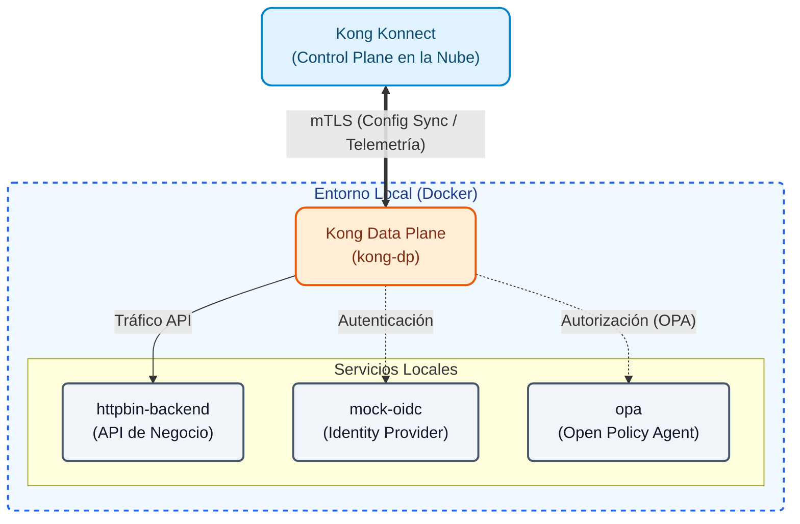
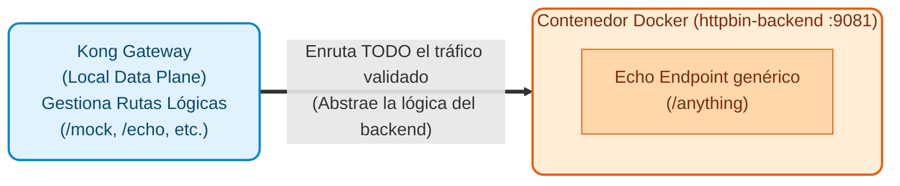
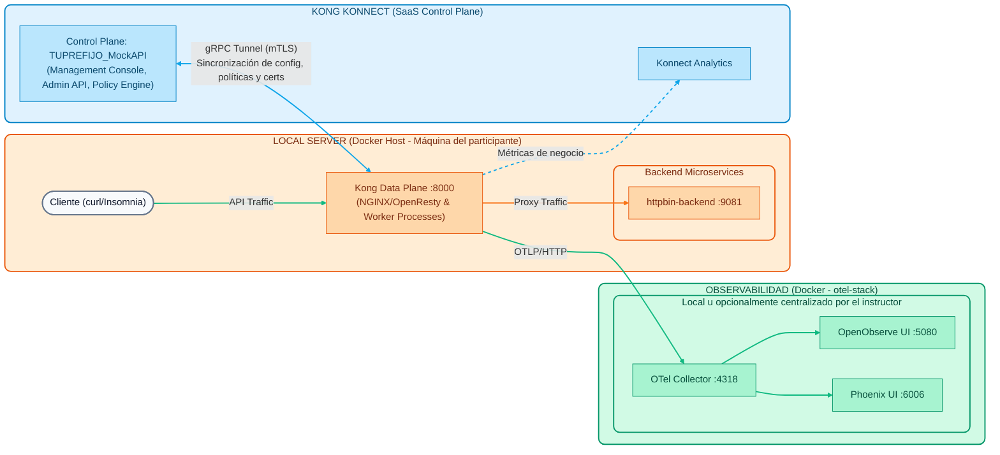

# Módulo 00: Arquitectura y Setup Inicial

Antes de poder interactuar con Kong, Konnect o desplegar configuraciones, **es obligatorio** comprender la arquitectura sobre la que trabajaremos y tener el entorno de trabajo correctamente instalado.



### Elementos de la Arquitectura Híbrida

La imagen describe la topología de despliegue híbrido de Kong (Kong Hybrid Mode Architecture). En este modelo, la gestión y el procesamiento de tráfico se dividen en componentes muy específicos, como se detalla a continuación:

#### 1. Konnect Control Plane (CP)
Es el "cerebro" centralizado administrado en la nube (SaaS) por Kong, de alcance global. Sus componentes internos son:

- **Management Console (UI)**: Interfaz gráfica web donde los administradores interactúan para configurar y monitorear el ciclo de vida de las APIs.
- **Admin API**: Interfaz programática RESTful. Todo lo que se hace en la interfaz gráfica pasa por esta API, permitiendo la automatización (por ejemplo, al usar decK o pipelines CI/CD).
- **Analytics Dashboard**: Panel que procesa y visualiza la "Data" de telemetría y uso (métricas) que envían los Data Planes.
- **Konnect Gateway (Cloud)**: El gateway interno del propio Control Plane que protege y enruta el acceso a los servicios de administración de Konnect.
- **Policy Engine**: Motor lógico que valida y compila las reglas, plugins y políticas de seguridad antes de distribuirlas.
- **Control Plane DB**: Base de datos gestionada por Kong que actúa como única fuente de verdad (Source of Truth) de todas las configuraciones.

#### 2. Data Plane Connections
Es el vínculo que enlaza de manera segura la nube con tu infraestructura local:

- **gRPC Tunnel**: Túnel persistente bidireccional que conecta cada Data Plane con el Control Plane. **gRPC** (*gRPC Remote Procedure Calls*) es un framework open source de alto rendimiento (originalmente desarrollado por Google). Se utiliza este protocolo en lugar de APIs REST tradicionales por varias razones clave: al estar basado en HTTP/2 soporta **streaming bidireccional** y conexiones de larga duración. Esto permite que el Control Plane pueda empujar (*push*) instantáneamente cualquier cambio de configuración hacia los Data Planes sin que estos tengan que estar sondeando (polling) continuamente, reduciendo drásticamente la latencia de propagación, minimizando el consumo de red y soportando seguridad mTLS de forma nativa.
- **Mutual TLS (mTLS)**: Protocolo de seguridad implementado en el túnel gRPC que garantiza que ambos extremos (CP y DP) presenten y validen certificados digitales (Certificates) autenticándose mutuamente.
- **CP <--> DP Sync**: A través de esta conexión, el Control Plane sincroniza hacia abajo **Configuraciones (Configurations)**, **Políticas (Policies)** y **Certificados (Certificates)** hacia los Data Planes. *Nota: El tráfico de datos (payload) de los clientes nunca viaja por aquí.*

#### 3. Local Data Plane (DP)
Es la infraestructura de ejecución local que hospedas tú mismo (Self-hosted/On-premise) en formato de contenedores Docker. Aquí convergen las peticiones de los clientes (**Client Requests / API Traffic**) y las respuestas devueltas (**API Responses**).

- **Kong Gateway Nodes (1, 2, 3)**: Instancias individuales que conforman el clúster local de procesamiento.
- **Kong Gateway (DP)**: La plataforma general encargada de orquestar el proxy y evaluar las configuraciones de manera autónoma.
- **NGINX/OpenResty (Data Plane)**: Componente que se encuentra "bajo el capó" (desde Kong 3.x). Kong Gateway está construido sobre NGINX y OpenResty (LuaJIT), siendo altamente optimizado que maneja la entrada/salida de conexiones a nivel de red con latencias de microsegundos.
- **Worker Processes**: Son los múltiples procesos de trabajo subyacentes que se encargan de ejecutar paralelamente las reglas de negocio (plugins, autenticación, rate limiting) sobre cada petición concurrente que entra por NGINX/OpenResty.

#### 4. Backend Microservices y Entorno Subyacente

- **Backend Microservices (Service A, B, C)**: Son tus verdaderas aplicaciones, APIs de negocio o sistemas legacy a los cuales Kong enruta el tráfico una vez que este ha sido validado e inspeccionado.
- **Backend de Pruebas (httpbin)**: A lo largo de este taller utilizaremos **httpbin** como nuestro backend simulado. Es una herramienta genérica que nos permite verificar fácilmente qué peticiones llegan al backend, sin depender de lógica de negocio compleja.
- **Docker Infrastructure / Local Server**: La plataforma base u host operativo (en el caso de este taller, tu propia computadora corriendo Docker) donde se instalan físicamente los Data Planes locales y el backend de pruebas (en el contenedor `httpbin-backend`).

**Estructura Interna del Backend (httpbin):**


## Objetivos

- Comprender la separación entre el Control Plane (SaaS) y el Data Plane (Local).
- Instalar las herramientas de línea de comandos requeridas (Docker, decK).
- Inicializar las variables de entorno necesarias.

---

## 1. La Arquitectura

En este workshop utilizaremos una topología híbrida:

1. **Control Plane (Kong Konnect)**: Reside en la nube gestionada por Kong. Es donde configuraremos nuestras APIs, Plugins y Políticas de Seguridad de manera declarativa. Tendrás un único Control Plane asignado (ej: `TUPREFIJO_MockAPI`).
2. **Data Plane (Kong Gateway)**: Se ejecuta de manera local en tu máquina mediante contenedores Docker. Es el nodo que realmente recibe el tráfico de las aplicaciones y lo rutea hacia los backends. Se expone en el puerto local `8000`.

### Infraestructura Base


---

## 2. Setup del Entorno

> ** Tip de Operación (Limpieza del Entorno)**
> Si en algún momento necesitas borrar todo lo que hemos creado en las demostraciones y volver al estado inicial del clúster (conservando solo el Healthcheck y el plugin de OpenTelemetry), puedes utilizar los tags (`core`) que asignamos a esos recursos base. 
> Solo tienes que ejecutar estos dos comandos en tu terminal para limpiar el Control Plane:
> ```bash
> deck gateway dump --select-tag core -o base.yaml
> deck gateway sync base.yaml
> ```
> Esto exportará solo los recursos `core` y, al sincronizar, **eliminará** todo lo demás que no esté en ese archivo.
> 
> Finalmente, apaga el Data Plane local para arrancar desde cero:
> ```bash
> docker rm -f kong-dp
> ```

El objetivo de este módulo es comprender los componentes fundamentales de **Kong Konnect** y preparar el entorno de demostración que servirá como base para todos los laboratorios prácticos.

Durante el Día 1, no es necesario que instales ni configures el entorno en tu estación de trabajo. Nos centraremos en la teoría y en demostraciones conceptuales. 

El instructor utilizará su propio entorno pre-configurado para mostrar la arquitectura en vivo.

### Guion de Demostración (Paso a Paso)

> **Nota sobre Herramientas de Prueba**: Las demostraciones de este y los próximos módulos muestran comandos `curl` para probar las APIs. Alternativamente, si prefieres usar una interfaz gráfica, hemos preparado una colección de Insomnia con todas las peticiones listas para ejecutar. Puedes importarla desde el archivo `docs/insomnia_collection.json`.

El objetivo de esta demostración es hacer tangible el diagrama de arquitectura. Presta atención a los siguientes pasos que observarás en pantalla:

1. **La Consola de Konnect (Control Plane)**: 

  - Veremos la interfaz web de Kong Konnect.
  - En el **Gateway Manager**, confirmaremos que el Control Plane lógico (`TUPREFIJO_MockAPI`) ya está creado.
  - Al revisar la sección de **Data Plane Nodes**, notaremos que actualmente hay **0 nodos** conectados (la nube está lista, pero aún no hay motores ejecutando el tráfico).
  
2. **Levantando el Local Data Plane (DP)**:

  - En la terminal local, el instructor te mostrará que ya tiene configuradas sus credenciales (`KONNECT_TOKEN`).
  - Observaremos la ejecución del script de inicialización para levantar el Data Plane local en Docker:
   ```bash
   cd docs/00-setup-entorno
   ./scripts/start_dps.sh
   ```
  - Con un `docker ps`, comprobaremos que el **Kong Data Plane** (puerto `8000`) y el backend simulado (`httpbin-backend`) ahora están corriendo físicamente en su computadora.

3. **Verificando la Conexión del Túnel gRPC**:

  - Al volver a la interfaz web de Konnect (en la nube) y refrescar la vista de **Data Plane Nodes**...
  - ¡El nodo local ahora aparecerá **Online**! Esto te demuestra visualmente que el túnel seguro (mTLS) se ha establecido con éxito y que el DP está listo para recibir configuraciones.

4. **Probando el Backend Directamente (Sin pasar por Kong)**:

  - Antes de enviar tráfico a través de Kong, el instructor validará que el backend de pruebas (httpbin) está funcionando de manera independiente y respondiendo a peticiones HTTP.
  - Ejecutará el siguiente comando en la terminal apuntando al puerto **9081** (donde corre el contenedor `httpbin-backend`) y pidiendo que los headers se impriman en la salida de error estándar (`-D /dev/stderr`):
   ```bash
   http localhost:9081/anything/mock
   ```

  - El resultado será una respuesta exitosa generada directamente por nuestro backend simulado, devolviendo en crudo la petición que recibió (dado que usa la imagen `go-httpbin`). Veremos que los headers de la respuesta HTTP no tienen ningún rastro de Kong:
   ```http
   HTTP/1.1 200 OK
   Content-Type: application/json
   Date: Thu, 29 Aug 2026 15:10:00 GMT
   
   {
    "headers": {
     "Accept": "*/*",
     "User-Agent": "curl/7.81.0"
    },
    "method": "GET",
    "url": "http://localhost:9081/anything/mock"
   }
   ```

5. **Probando el Flujo de Tráfico Local a través de Kong**:

  - Para confirmar que el proxy (Kong) está procesando peticiones localmente, veremos la ejecución del siguiente comando en la terminal apuntando al puerto **8000** (enviando headers a stderr):
   ```bash
   curl -k -i https://localhost:8443/healthcheck
   
   # Usando curl (alternativa)
   curl -k -i https://localhost:8443/healthcheck
   ```

  - El resultado que observaremos será una respuesta exitosa (HTTP 200) generada por el plugin `request-termination` desde el propio Gateway (sin llegar a ningún backend real):
   ```http
   HTTP/1.1 200 OK
   Content-Type: application/json; charset=utf-8
   X-Kong-Proxy-Latency: 1

   {
    "message": "Kong Gateway is Alive! Control Plane Sync is working."
   }
   ```

  - Al revisar los headers de respuesta (como `X-Kong-Proxy-Latency`), confirmaremos cómo la petición entró al Data Plane local (puerto 8000) y fue respondida de forma autónoma. Esto valida de forma práctica que el *payload* no viaja hacia la nube y que el túnel de configuración descargó las reglas correctamente en el nodo local.

Mañana (Día 2), ustedes mismos ejecutarán el **Lab 00: Setup del Entorno Local** y replicarán este proceso para levantar su propio clúster.

---
## Conclusión
¡Felicidades! Tienes clara la arquitectura híbrida que estaremos utilizando y sabes cómo se conectan las distintas piezas. Estás listo para avanzar al **Módulo 01**, donde empezaremos a explorar los conceptos fundamentales de Kong Konnect Gateway.
