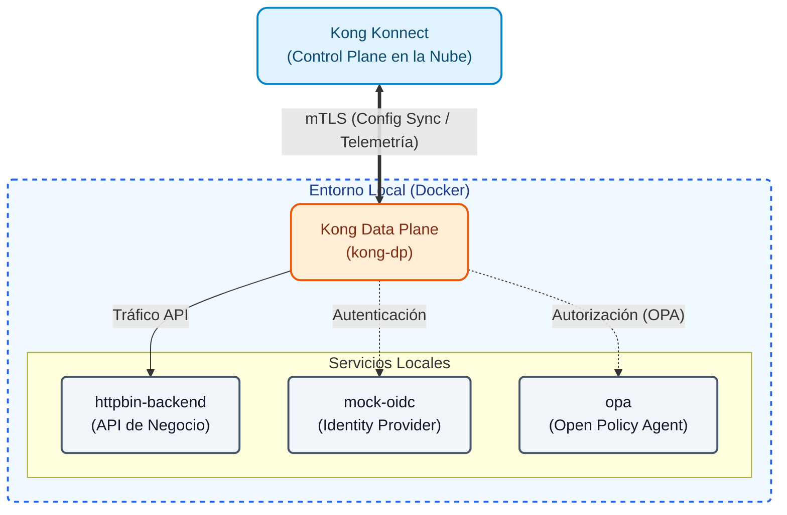
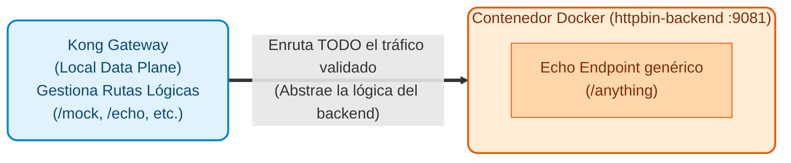
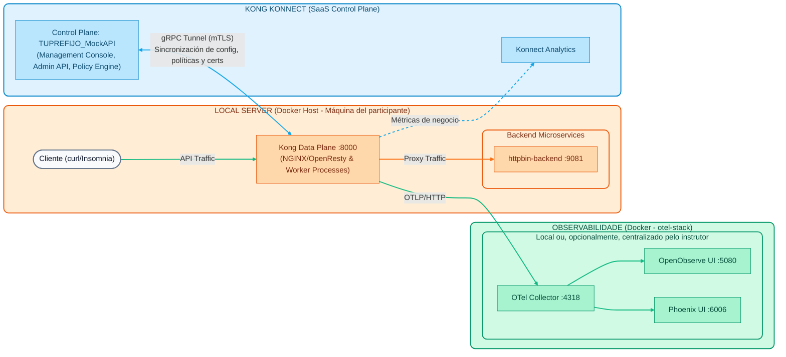

# Módulo 00: Arquitetura e configuração inicial

Antes de poder interagir com Kong, Konnect ou implantar configurações, é **obrigatório** entender a arquitetura na qual trabalharemos e ter o ambiente de trabalho corretamente instalado.


## # Elementos de arquitetura híbrida

A imagem descreve a arquitetura do modo híbrido Kong (arquitetura do modo híbrido Kong). Neste modelo, a gestão e processamento do tráfego são divididos em componentes bem específicos, conforme detalhado a seguir:

## ## 1. Plano de controle Konnect (CP)
É o “cérebro” centralizado gerido na nuvem (SaaS) pela Kong, com alcance global. Seus componentes internos são:

- **Console de gerenciamento (UI)**: interface gráfica da web onde os administradores interagem para configurar e monitorar o ciclo de vida das APIs.
- **API Admin**: interface programática RESTful. Tudo o que é feito na interface gráfica passa por esta API, permitindo a automação (por exemplo, ao utilizar deck ou pipelines de CI/CD).
- **Analytics Dashboard**: Painel que processa e exibe os dados (métricas) de telemetria e utilização enviados pelos Planos de Dados.
- **Konnect Gateway (Cloud)**: O gateway interno do próprio Control Plane que protege e roteia o acesso aos serviços de administração do Konnect.
- **Policy Engine**: Motor lógico que valida e compila regras, plugins e políticas de segurança antes de distribuí-los.
- **Control Plane DB**: banco de dados gerenciado pelo Kong que atua como a única fonte de verdade para todas as configurações.

## ## 2. Conexões do plano de dados
É o link que conecta com segurança a nuvem à sua infraestrutura local:
- **túnel gRPC**: túnel persistente bidirecional que conecta cada plano de dados ao plano de controle. **gRPC** (*gRPC Remote Procedure Calls*) é uma estrutura de código aberto de alto desempenho (originalmente desenvolvida pelo Google). Este protocolo é usado em vez das APIs REST tradicionais por vários motivos principais: sendo baseado em HTTP/2, ele suporta **streaming bidirecional** e conexões de longa duração. Isso permite que o Plano de Controle envie instantaneamente qualquer alteração de configuração para os Planos de Dados sem que eles tenham que pesquisar continuamente, reduzindo drasticamente a latência de propagação, minimizando o consumo da rede e oferecendo suporte nativo à segurança mTLS.
- **TLS mútuo (mTLS)**: Protocolo de segurança implementado no túnel gRPC que garante que ambas as extremidades (CP e DP) apresentem e validem certificados digitais (Certificates) autenticando-se mutuamente.
- **CP <--> DP Sync**: Através desta conexão, o Plano de Controle sincroniza **Configurações**, **Políticas** e **Certificados** para baixo com os Planos de Dados. *Observação: a carga útil do cliente nunca viaja aqui.*

## ## 3. Plano de dados local (DP)
É a infraestrutura de execução local que você mesmo hospeda (auto-hospedado/no local) em formato de contêiner Docker. Aqui convergem as solicitações do cliente (**Solicitações do cliente/Tráfego de API**) e as respostas retornadas (**Respostas da API**).

- **Kong Gateway Nodes (1, 2, 3)**: Instâncias individuais que compõem o cluster de processamento local.
- **Kong Gateway (DP)**: Plataforma geral responsável por orquestrar o proxy e avaliar as configurações de forma autônoma.
- **NGINX/OpenResty (Data Plane)**: Componente que está "nos bastidores" (desde Kong 3.x). Kong Gateway é construído em NGINX e OpenResty (LuaJIT), sendo altamente otimizado para lidar com a entrada/saída de conexões no nível da rede com latências de microssegundos.
- **Processos de trabalho**: são os vários processos de trabalho subjacentes responsáveis ​​pela execução paralela das regras de negócios (plugins, autenticação, limitação de taxa) em cada solicitação simultânea que chega por meio do NGINX/OpenResty.

## ## 4. Microsserviços de back-end e ambiente subjacente

- **Microsserviços de back-end (serviço A, B, C)**: são seus aplicativos reais, APIs de negócios ou sistemas legados para os quais o Kong roteia o tráfego depois de validado e inspecionado.
- **Backend de teste (httpbin)**: Ao longo deste workshop usaremos **httpbin** como nosso backend simulado. É uma ferramenta genérica que nos permite verificar facilmente quais solicitações chegam ao backend, sem depender de lógicas de negócios complexas.
- **Infraestrutura Docker/Servidor Local**: A plataforma base ou host operacional (no caso deste workshop, seu próprio computador rodando Docker) onde os Planos de Dados locais e o backend de teste estão fisicamente instalados (no contêiner `httpbin-backend`).

**Estrutura interna de back-end (httpbin):**


## Objetivos

- Compreender a separação entre o Plano de Controlo (SaaS) e o Plano de Dados (Local).
- Instale as ferramentas de linha de comando necessárias (Docker, deck).
- Inicialize as variáveis ​​de ambiente necessárias.

---

## 1. Arquitetura

Neste workshop usaremos uma topologia híbrida:

1. **Avião de Controle (Kong Konnect)**: Reside na nuvem gerenciada por Kong. É onde configuraremos nossas APIs, Plugins e Políticas de Segurança de forma declarativa. Você terá um único plano de controle atribuído (por exemplo, `TUPREFIX_MockAPI`).
2. **Data Plane (Kong Gateway)**: é executado localmente em sua máquina usando contêineres Docker. É o nó que realmente recebe o tráfego das aplicações e o encaminha para os backends. Está exposto na porta local `8000`.

## # Infraestrutura Básica


---

## 2. Configuração do ambiente

> **Dica de Operação (Limpeza de Ambiente)**
> Se em algum momento você precisar deletar tudo o que criamos nas demos e retornar ao estado inicial do cluster (mantendo apenas o Healthcheck e o plugin OpenTelemetry), você pode usar as tags (`core`) que atribuímos a esses recursos base. 
> Você só precisa executar estes dois comandos em seu terminal para limpar o Plano de Controle:
> 

```bash
> despejo de gateway de deck --select-tag core -o base.yaml
> sincronização do gateway do deck base.yaml
> 

```
> Isso exportará apenas os recursos `principais` e durante a sincronização **removerá** tudo o mais que não estiver nesse arquivo.
> 
> Finalmente, desligue o Data Plane local para inicializar do zero:
> 

```bash
> docker rm -f kong-dp
> 

```

O objetivo deste módulo é compreender os componentes fundamentais do **Kong Konnect** e preparar o ambiente de demonstração que servirá de base para todos os laboratórios práticos.

Durante o Dia 1, você não precisa instalar ou configurar o ambiente na sua estação de trabalho. Vamos nos concentrar na teoria e nas demonstrações conceituais. 

O instrutor usará seu próprio ambiente pré-configurado para demonstrar a arquitetura ao vivo.

## # Script de demonstração (passo a passo)

> **Nota sobre ferramentas de teste**: As demonstrações deste e dos próximos módulos mostram comandos `curl` para testar APIs. Alternativamente, se preferir utilizar uma interface gráfica, preparamos uma coleção Insomnia com todas as solicitações prontas para serem executadas. Você pode importá-lo do arquivo `docs/insomnia_collection.json`.

O objetivo desta demonstração é tornar o diagrama de arquitetura tangível. Preste atenção nas seguintes etapas que você verá na tela:

1. **O Console Konnect (Plano de Controle)**: 

  - Veremos a interface web do Kong Konnect.
  - No **Gateway Manager**, confirmaremos se o Plano de Controle lógico (`TUPREFIX_MockAPI`) já está criado.
- Ao revisar a seção **Nós do plano de dados**, notaremos que atualmente há **0 nós** conectados (a nuvem está pronta, mas ainda não há mecanismos executando tráfego).
  
2. **Aumentando o Plano de Dados Local (DP)**:

  - No terminal local, o instrutor mostrará que já tem suas credenciais configuradas (`KONNECT_TOKEN`).
  - Observaremos a execução do script de inicialização para construir o Data Plane local no Docker:   

```bash
   cd docs/00-setup-entorno
   ./scripts/start_dps.sh
   

```
- Com um `docker ps`, verificaremos se o **Kong Data Plane** (porta `8000`) e o backend simulado (`httpbin-backend`) agora estão fisicamente em execução no seu computador.

3. **Verificando a conexão do túnel gRPC**:

  - Ao retornar à interface web do Konnect (na nuvem) e atualizar a visualização dos **Data Plane Nodes**...
  - O nó local agora aparecerá **Online**! Isto mostra visualmente que o túnel seguro (mTLS) foi estabelecido com sucesso e que o DP está pronto para receber configurações.

4. **Testando o backend diretamente (sem passar pelo Kong)**:

  - Antes de enviar tráfego através do Kong, o instrutor irá validar se o backend de teste (httpbin) está funcionando de forma independente e respondendo às solicitações HTTP.
  - Ele executará o seguinte comando no terminal apontando para a porta **9081** (onde o contêiner `httpbin-backend` é executado) e solicitando que os cabeçalhos sejam impressos na saída de erro padrão (`-D /dev/stderr`):   

```bash
   http localhost:9081/anything/mock
   

```
- O resultado será uma resposta bem-sucedida gerada diretamente pelo nosso backend simulado, retornando a solicitação bruta recebida (já que usa a imagem `go-httpbin`). Veremos que os cabeçalhos de resposta HTTP não possuem nenhum vestígio de Kong:   

```http
   HTTP/1.1 200 OK
   Content-Type: application/json
   Date: Thu, 29 Aug 2026 15:10:00 GMT
   
   {
    "headers": {
     "Accept": "*/*",
     "User-Agent": "curl/7.81.0"
    },
    "method": "GET",
    "url": "http://localhost:9081/anything/mock"
   }
   

```
5. **Testando o fluxo de tráfego local através de Kong**:

  - Para confirmar se o proxy (Kong) está processando solicitações localmente, veremos a execução do seguinte comando no terminal apontando para a porta **8000** (enviando cabeçalhos para stderr):   

```bash
   curl -k -i https://localhost:8443/healthcheck
   
   # Usando curl (alternativa)
   curl -k -i https://localhost:8443/healthcheck
   

```
- O resultado que observaremos será uma resposta bem-sucedida (HTTP 200) gerada pelo plugin `request-termination` do próprio Gateway (sem atingir nenhum backend real):   

```http
   HTTP/1.1 200 OK
   Content-Type: application/json; charset=utf-8
   X-Kong-Proxy-Latency: 1

   {
    "message": "Kong Gateway is Alive! Control Plane Sync is working."
   }
   

```
- Ao revisar os cabeçalhos de resposta (como `X-Kong-Proxy-Latency`), confirmaremos como a solicitação entrou no Data Plane local (porta 8000) e foi respondida de forma autônoma. Isso valida convenientemente que a *carga útil* não viaja para a nuvem e que o túnel de configuração baixou as regras corretamente para o nó local.

Amanhã (dia 2), vocês mesmos executarão o **Laboratório 00: Configuração do ambiente local** e replicarão esse processo para criar seu próprio cluster.

---
## Conclusão
Parabéns! Você tem clareza sobre a arquitetura híbrida que usaremos e sabe como as diferentes peças estão conectadas. Você está pronto para avançar para o **Módulo 01**, onde começaremos a explorar os conceitos fundamentais do Kong Konnect Gateway.
