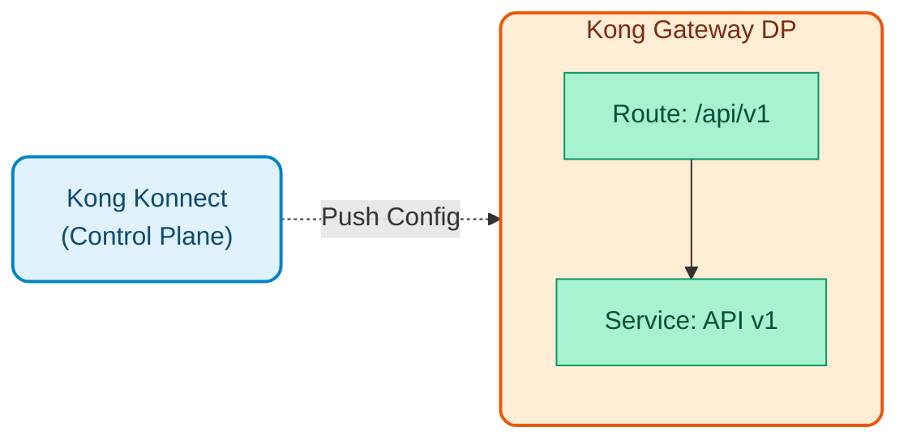
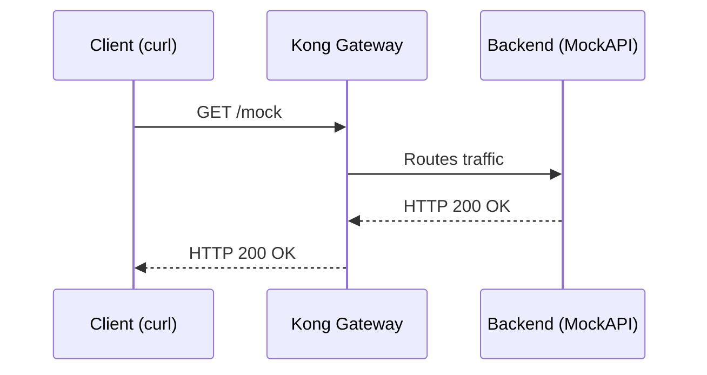
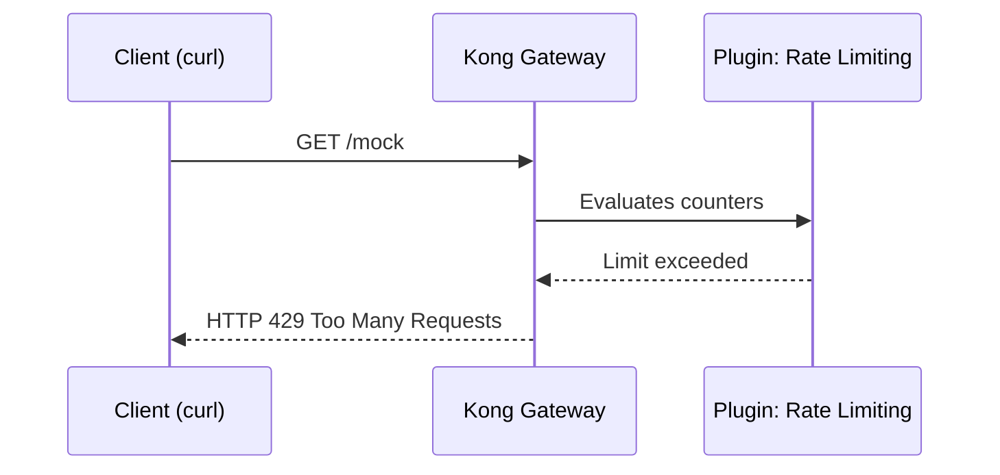
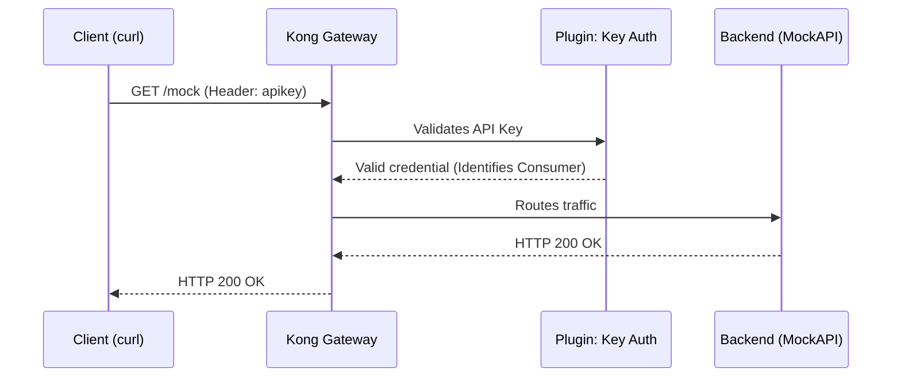
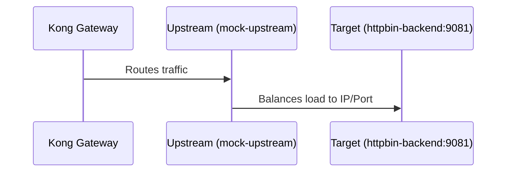
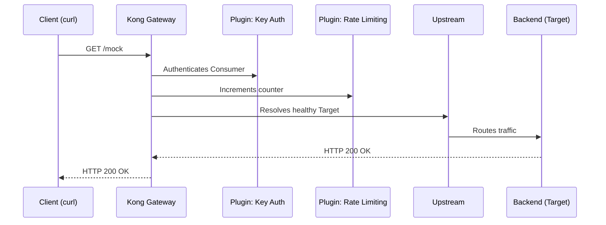

# Module 01: Kong Konnect Gateway (Basic)

This module introduces developers to Kong Konnect, showing how to navigate the interface and create basic services manually, using our local simulated backend (MockAPI).



## Module Objectives

1. **Explore the Konnect interface**: Understand the concepts of Gateway Services and Routes.
2. **Create a Service**: Configure a service (upstream) pointing to the mock backend `httpbin-backend:9081`.
3. **Create a Route**: Expose the service via the `/mock` path.
4. **Test the flow**: Consume the API through the Data Plane using `curl`.

---

## Fundamental Concepts of Kong Konnect

Before diving into practice, it's vital to understand the basic building blocks Kong uses to govern traffic. The Control Plane manages various **Logical Entities**; these are the main ones:

### 1. Gateway Services
* [Official Doc: Services](https://docs.konghq.com/gateway/latest/admin-api/#service-object)*

A **Service** in Kong is the logical representation of your backend API or microservice.

- It functions as the "destination" to which Kong should route traffic after processing it.
- It contains crucial information such as the protocol (`http` or `https`), the host (IP or domain name), the port, and the base path of your real backend.
- **Analogy**: If Kong were an airport, the Gateway Service would be the "Plane" or final destination that passengers (requests) must reach.

### 2. Routes
* [Official Doc: Routes](https://docs.konghq.com/gateway/latest/admin-api/#route-object)*

A **Route** defines the rules about *how* external requests can access a Gateway Service.

- It functions as the "entrypoint" for external clients.
- A route is evaluated based on HTTP request attributes, primarily: `paths` (e.g., `/mock`), `hosts`, `methods`, or `headers`.
- Each Route must be obligatorily associated with a Gateway Service.
- **Analogy**: Following the airport example, the Route would be the "Boarding Gate".

### 3. Plugins
* [Official Doc: Plugins](https://docs.konghq.com/hub/)*

**Plugins** are interceptor logic pieces that add functionalities (security, transformations, observability, *rate limiting*, etc.) in real-time, without modifying the code of your microservices.

- They can be applied Globally, or specifically to a Service, a Route, or a Consumer.

### 4. Consumers
* [Official Doc: Consumers](https://docs.konghq.com/gateway/latest/admin-api/#consumer-object)*

A **Consumer** represents a user, client application, or external device that consumes your APIs.

- Identifying Consumers allows applying tailored policies (e.g., different quota limits based on subscription plan) and is the basis for authentication (API Keys, JWT, OIDC).

### 5. Upstreams and Targets
* [Official Doc: Upstreams](https://docs.konghq.com/gateway/latest/admin-api/#upstream-object) | [Targets](https://docs.konghq.com/gateway/latest/admin-api/#target-object)*

While a Service points to an address, an **Upstream** represents a virtual load balancer within Kong itself.

- **Targets**: These are the actual physical IPs/ports of each instance of your backend.
- Kong will intelligently distribute traffic among an Upstream's Targets, monitoring their health status (Active/Passive Health Checks).

### 6. Certificates and SNIs
* [Official Doc: Certificates](https://docs.konghq.com/gateway/latest/admin-api/#certificate-object) | [SNIs](https://docs.konghq.com/gateway/latest/admin-api/#sni-object)*

Kong centrally manages TLS/SSL certificates to enable HTTPS to end clients (TLS termination), determining which certificate to present based on the domain (Server Name Indication - SNI).

---

## Demonstration Sequence

In this section, the instructor will demonstrate live how Kong manages traffic by assembling each of the logical entities explained above.

> **Note for the instructor**: Use your assigned Control Plane and perform tests via the terminal connected to your local Data Plane (`localhost:8443` with HTTPS). Alternatively, remember that you can use the graphical test collection by importing the `docs/insomnia_collection.json` file.

---

### Prerequisites

Open your terminal at the root of the repository and navigate to this module's directory:

```bash
cd workshop-assets/dia-1/01-kong-konnect-gateway
```

---

### Demonstration 1: Gateway Services and Routes (The Basic Flow)



First, we will connect Kong with our simulated backend that is already running in Docker and expose it publicly.

1. **Create the Gateway Service (The Backend)**

    - In Konnect, go to **Gateway Services** and click on **New Gateway Service**.
    - **Name**: `mock-service`
    - **Upstream URL**: `http://httpbin-backend:9081/anything` *(Kong will resolve this name thanks to the Docker network)*
    - Click on **Save**.

2. **Create the Route**

    - Inside the `mock-service`, go to the **Routes** section and click on **New Route**.
    - **Name**: `mock-route`
    - **Paths**: `/mock`
    - Click on **Save**.

3. **Validation**

    - Execute the following command to query the backend through Kong:
    ```bash
    curl -k -i  https://localhost:8443/mock
    
    # Using curl (alternative)
    curl -k -i https://localhost:8443/mock
    ```

    - *Expected result*: HTTP 200 OK. The request reached the backend without issues.

---

### Demonstration 2: Plugins (Governance)



We will add governance to our route by applying a request limit without having to program it in the backend.

1. **Enable Rate Limiting Plugin**

    - Go to the `mock-route`.
    - In the **Plugins** section, click on **Add Plugin**.
    - Search for **Rate Limiting** and enable it.
    - Configure: **Config.Minute** = `3`
    - Click on **Save**.

2. **Validation**

    - Execute the `curl` validation repeatedly (more than 3 times) quickly:
    ```bash
    curl -k -i  https://localhost:8443/mock
    
    # Using curl (alternative)
    curl -k -i https://localhost:8443/mock
    ```

    - *Expected result*: On the fourth request, Kong will respond with an `HTTP 429 Too Many Requests`.

---

### Demonstration 3: Consumers and Security



We will protect the API by requiring users (Consumers) to identify themselves to use it.

1. **Secure the Service**

    - Go to **Gateway Services** -> `mock-service` -> **Plugins**.
    - Enable the **Key Authentication** plugin.
    - *If you run the `curl` now, you will get an `HTTP 401 Unauthorized`*.

2. **Create the Consumer and Credential**

    - In the main menu, go to **Consumers** and click on **New Consumer**.
    - **Username**: `app-movil-ios`
    - Click on **Save**.
    - Inside the Consumer, go to the **Credentials** tab and add an **API Key**.
    - In the **Key** field, manually enter the key: `kong-secret-key-123` and save it.

3. **Validation**

    - Send the configured key in the header to authenticate the request:
    ```bash
    curl -k -i -H "apikey: kong-secret-key-123" https://localhost:8443/mock
    
    # Using curl (alternative)
    curl -k -i -H "apikey: kong-secret-key-123" https://localhost:8443/mock
    ```

    - *Expected result*: HTTP 200 OK.

---

### Demonstration 4: Upstreams and Targets (Load Balancing)



To prepare for traffic spikes, we will abstract the backend behind a virtual load balancer (Upstream).

1. **Create the Upstream**

    - In the main menu, go to **Upstreams** and click on **New Upstream**.
    - **Name**: `mock-upstream`
    - Click on **Save**.
    - Inside the Upstream, go to **Targets** and add a new Target pointing to our Docker container: `httpbin-backend:9081`.

2. **Redirect the Service to the Upstream**

    - Go to **Gateway Services** and edit the `mock-service`.
    - Change the **Upstream URL** by replacing the direct IP/Host with the Upstream name. It should look like this: `http://mock-upstream/anything`.
    - Click on **Save**.

3. **Validation**

    - Execute the request again to verify that Kong resolves the Upstream correctly:
    ```bash
    curl -k -i -H "apikey: kong-secret-key-123" https://localhost:8443/mock
    
    # Using curl (alternative)
    curl -k -i -H "apikey: kong-secret-key-123" https://localhost:8443/mock
    ```

    - *Expected result*: `HTTP 200 OK`. The request still reaches the backend, but this time through the logical load balancer (Upstream) instead of a direct IP/Port connection. You will notice this in the JSON response, where the `"url"` field will show `"https://httpbin-backend:9081/anything"`.
    
    > **Note**: If you receive an `HTTP 429 Too Many Requests` error (like `API rate limit exceeded`) when testing, this is completely normal and demonstrates that the **Rate Limiting** plugin we configured in Demonstration 2 is still active. You just need to wait for the time window to reset (1 minute maximum, checking the `RateLimit-Reset` header) and try again.

---

### Demonstration 5: End-to-End Integration Test



We have configured routing (Service/Route), request limiting (Plugin), security (Consumer/Key Auth), and load balancing (Upstream). Everything executes in milliseconds in the Data Plane.

> **Note for the instructor**: In this demonstration, nothing new needs to be configured in Konnect. The goal is to launch a final request to demonstrate how Kong assembles and executes the entire flow (built incrementally in demonstrations 1 to 4) in a single call.

1. **Final Validation**

    - Repeat the authenticated request:
    ```bash
    curl -k -i -H "apikey: kong-secret-key-123" https://localhost:8443/mock
    
    # Using curl (alternative)
    curl -k -i -H "apikey: kong-secret-key-123" https://localhost:8443/mock
    ```

    - *Expected Result and Inspection*: The request returns `HTTP 200 OK`. To empirically verify that the sequence diagram was followed step-by-step, inspect the command output (the HTTP response headers and the JSON payload):
        1. **Security (Key Auth)**: In the JSON returned by the backend, verify that `"X-Consumer-Username": ["app-movil-ios"]` exists. This demonstrates that Kong intercepted the API Key, validated it, and successfully identified the consumer *before* sending traffic to the backend.
        2. **Traffic Control (Rate Limiting)**: Observe Kong's HTTP response headers, such as `RateLimit-Limit: 3` and `RateLimit-Remaining: 2`. This confirms that the plugin evaluated your quota and deducted the current request.
        3. **Load Balancing (Upstream and Target)**: In the JSON, the `"url"` property will show `"https://httpbin-backend:9081/anything"`. This demonstrates that Kong transparently resolved the Upstream (`mock-upstream`) to the actual Target.
        4. **Gateway (Timings)**: The `X-Kong-Proxy-Latency` (time Kong spent executing plugins) and `X-Kong-Upstream-Latency` (time the backend took) headers demonstrate how Kong orchestrates this entire flow in milliseconds.
        
        *(Optional: To visualize this graphically in Konnect, you can go to the **Analytics -> API Requests** menu to explore the details of these transactions. Keep in mind that telemetry may take a couple of minutes to reflect in the dashboard).*

---

## Summary
You have seen how Kong builds an intelligent network to govern traffic. On Day 2 of this workshop, in the `labs/` folder, you will execute similar configurations practically and scalably (as code using **decK** and **GitOps**).