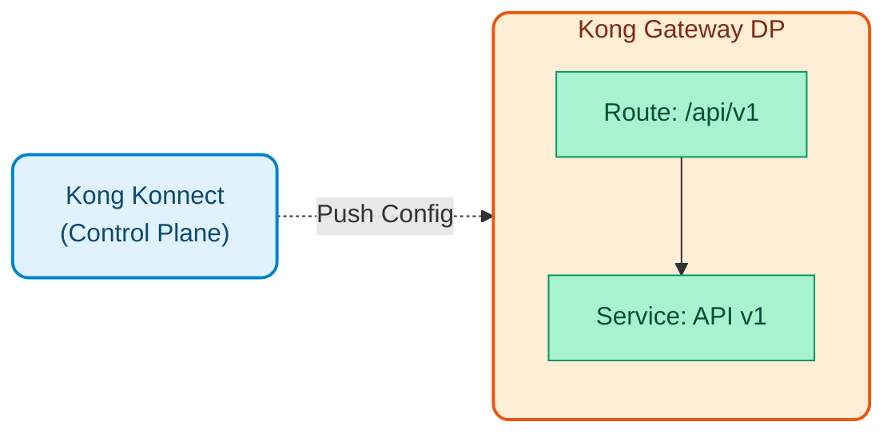
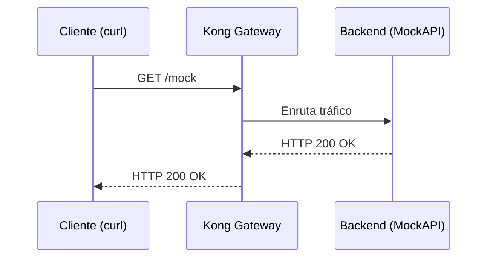
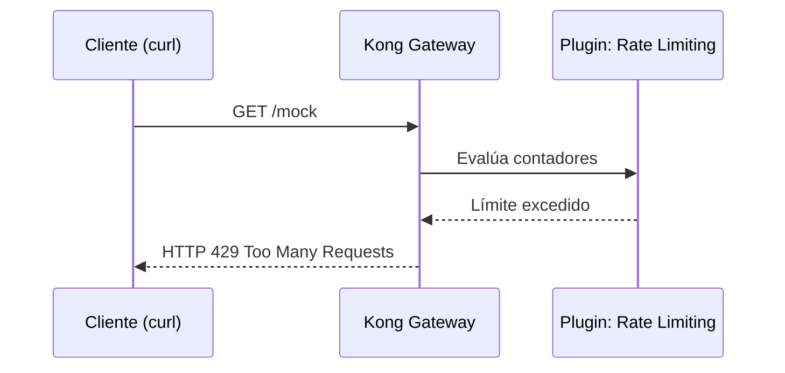
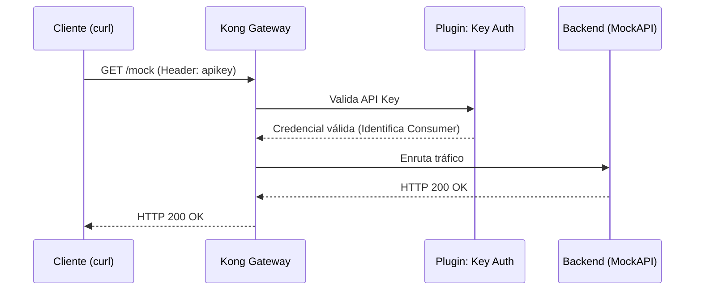
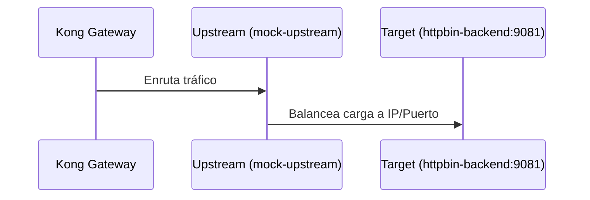
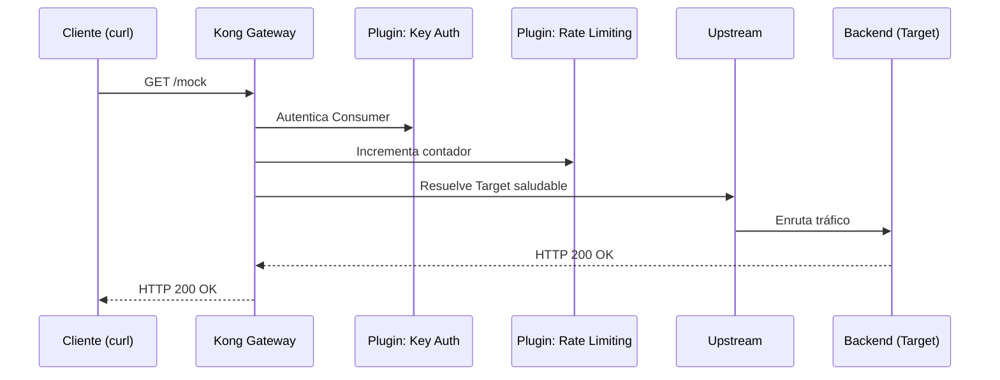

# Módulo 01: Kong Konnect Gateway (Básico)

Este módulo introduce a los desarrolladores a Kong Konnect, mostrando cómo navegar por la interfaz y crear servicios básicos de forma manual, utilizando nuestro backend simulado (MockAPI) local.



## Objetivos del Módulo

1. **Explorar la interfaz de Konnect**: Entender los conceptos de Gateway Services y Routes.
2. **Crear un Servicio**: Configurar un servicio (upstream) apuntando al backend mock `httpbin-backend:9081`.
3. **Crear una Ruta**: Exponer el servicio mediante el path `/mock`.
4. **Probar el flujo**: Consumir la API a través del Data Plane utilizando `curl`.

---

## Conceptos Fundamentales de Kong Konnect

Antes de ir a la práctica, es vital entender los bloques de construcción básicos que utiliza Kong para gobernar el tráfico. El Control Plane gestiona diversas **Entidades Lógicas**; estas son las principales:

### 1. Gateway Services (Servicios)
* [Doc Oficial: Services](https://docs.konghq.com/gateway/latest/admin-api/#service-object)*

Un **Service** (Servicio) en Kong es la representación lógica de tu API o microservicio de backend. 

- Funciona como el "destino" al que Kong debe enrutar el tráfico después de procesarlo.
- Contiene información crucial como el protocolo (`http` o `https`), el host (IP o nombre de dominio), el puerto y el path base de tu backend real.
- **Analogía**: Si Kong fuera un aeropuerto, el Gateway Service sería el "Avión" o destino final al que los pasajeros (peticiones) deben llegar.

### 2. Routes (Rutas)
* [Doc Oficial: Routes](https://docs.konghq.com/gateway/latest/admin-api/#route-object)*

Una **Route** (Ruta) define las reglas sobre *cómo* las peticiones externas pueden acceder a un Gateway Service.

- Funciona como el punto de entrada ("entrypoint") para los clientes externos.
- Una ruta se evalúa basándose en atributos de la petición HTTP, principalmente: `paths` (ej. `/mock`), `hosts`, `methods` o `headers`.
- Cada Ruta debe estar obligatoriamente asociada a un Gateway Service.
- **Analogía**: Siguiendo el ejemplo del aeropuerto, la Ruta sería la "Puerta de Embarque".

### 3. Plugins
* [Doc Oficial: Plugins](https://docs.konghq.com/hub/)*

Los **Plugins** son piezas de lógica interceptora que añaden funcionalidades (seguridad, transformaciones, observabilidad, *rate limiting*, etc.) en tiempo real, sin modificar el código de tus microservicios.

- Pueden aplicarse de manera Global, o específicamente a un Service, una Route o un Consumer.

### 4. Consumers (Consumidores)
* [Doc Oficial: Consumers](https://docs.konghq.com/gateway/latest/admin-api/#consumer-object)*

Un **Consumer** representa a un usuario, aplicación cliente o dispositivo externo que consume tus APIs.

- Identificar a los Consumers permite aplicar políticas a medida (ej. distintos límites de cuota según el plan de suscripción) y es la base de la autenticación (API Keys, JWT, OIDC).

### 5. Upstreams y Targets
* [Doc Oficial: Upstreams](https://docs.konghq.com/gateway/latest/admin-api/#upstream-object) |  [Targets](https://docs.konghq.com/gateway/latest/admin-api/#target-object)*

Mientras un Service apunta a una dirección, un **Upstream** representa un balanceador de carga virtual (Load Balancer) dentro del propio Kong.

- **Targets**: Son las IPs/puertos físicos reales de cada instancia de tu backend.
- Kong distribuirá el tráfico entre los Targets de un Upstream de forma inteligente, monitoreando su estado de salud (Active/Passive Health Checks).

### 6. Certificates y SNIs (Certificados)
* [Doc Oficial: Certificates](https://docs.konghq.com/gateway/latest/admin-api/#certificate-object) |  [SNIs](https://docs.konghq.com/gateway/latest/admin-api/#sni-object)*

Kong gestiona de manera centralizada los certificados TLS/SSL para habilitar HTTPS hacia los clientes finales (terminación TLS), determinando qué certificado presentar en función del dominio (Server Name Indication - SNI).

---

## Secuencia de Demostraciones

En esta sección, el instructor demostrará en vivo cómo Kong gestiona el tráfico ensamblando cada una de las entidades lógicas explicadas anteriormente.

> **Nota para el instructor**: Utiliza tu Control Plane asignado y realiza las pruebas a través de la terminal conectada a tu Data Plane local (`localhost:8443` con HTTPS). Alternativamente, recuerda que puedes usar la colección gráfica de pruebas importando el archivo `docs/insomnia_collection.json`.

---

### Prerrequisitos

Abre tu terminal en la raíz del repositorio y navega al directorio de este módulo:

```bash
cd workshop-assets/dia-1/01-kong-konnect-gateway
```

---

### Demostración 1: Gateway Services y Routes (El Flujo Básico)



Primero, conectaremos Kong con nuestro backend simulado que ya está corriendo en Docker y lo expondremos públicamente.

1. **Crear el Gateway Service (El Backend)**

    - En Konnect, ve a **Gateway Services** y haz clic en **New Gateway Service**.
    - **Name**: `mock-service`
    - **Upstream URL**: `http://httpbin-backend:9081/anything` *(Kong resolverá este nombre gracias a la red de Docker)*
    - Haz clic en **Save**.

2. **Crear la Ruta (Route)**

    - Dentro del servicio `mock-service`, ve a la sección **Routes** y haz clic en **New Route**.
    - **Name**: `mock-route`
    - **Paths**: `/mock`
    - Haz clic en **Save**.

3. **Validación**

    - Ejecuta el siguiente comando para consultar el backend a través de Kong:
    ```bash
    curl -k -i  https://localhost:8443/mock
    
    # Usando curl (alternativa)
    curl -k -i https://localhost:8443/mock
    ```

    - *Resultado esperado*: HTTP 200 OK. La petición llegó al backend sin problemas.

---

### Demostración 2: Plugins (Gobernanza)



Añadiremos gobernanza a nuestra ruta aplicando límite de peticiones sin tener que programarlo en el backend.

1. **Habilitar Plugin de Rate Limiting**

    - Ve a la ruta `mock-route`.
    - En la sección **Plugins**, haz clic en **Add Plugin**.
    - Busca **Rate Limiting** y habilítalo.
    - Configura: **Config.Minute** = `3`
    - Haz clic en **Save**.

2. **Validación**

    - Ejecuta el `curl` de validación repetidas veces (más de 3) de forma rápida:
    ```bash
    curl -k -i  https://localhost:8443/mock
    
    # Usando curl (alternativa)
    curl -k -i https://localhost:8443/mock
    ```

    - *Resultado esperado*: A la cuarta petición, Kong responderá con un `HTTP 429 Too Many Requests`.

---

### Demostración 3: Consumers y Seguridad



Protegeremos la API obligando a que los usuarios (Consumers) se identifiquen para poder usarla.

1. **Asegurar el Servicio**

    - Ve a **Gateway Services** -> `mock-service` -> **Plugins**.
    - Habilita el plugin **Key Authentication**.
    - *Si ejecutas el `curl` ahora, obtendrás un `HTTP 401 Unauthorized`*.

2. **Crear el Consumer y la Credencial**

    - En el menú principal, ve a **Consumers** y haz clic en **New Consumer**.
    - **Username**: `app-movil-ios`
    - Haz clic en **Save**.
    - Dentro del Consumer, ve a la pestaña **Credentials** y añade una **API Key**.
    - En el campo **Key**, ingresa manualmente la clave: `kong-secret-key-123` y guárdala.

3. **Validación**

    - Envía la clave configurada en el header para autenticar la petición:
    ```bash
    curl -k -i -H "apikey: kong-secret-key-123" https://localhost:8443/mock
    
    # Usando curl (alternativa)
    curl -k -i -H "apikey: kong-secret-key-123" https://localhost:8443/mock
    ```

    - *Resultado esperado*: HTTP 200 OK.

---

### Demostración 4: Upstreams y Targets (Load Balancing)



Para prepararnos ante picos de tráfico, abstraeremos el backend detrás de un balanceador de carga virtual (Upstream).

1. **Crear el Upstream**

    - En el menú principal, ve a **Upstreams** y haz clic en **New Upstream**.
    - **Name**: `mock-upstream`
    - Haz clic en **Save**.
    - Dentro del Upstream, ve a **Targets** y añade un nuevo Target apuntando a nuestro contenedor de Docker: `httpbin-backend:9081`.

2. **Redirigir el Servicio al Upstream**

    - Ve a **Gateway Services** y edita el `mock-service`.
    - Cambia la **Upstream URL** reemplazando la IP/Host directo por el nombre del Upstream. Debe quedar así: `http://mock-upstream/anything`.
    - Haz clic en **Save**.

3. **Validación**

    - Ejecuta la petición nuevamente para verificar que Kong resuelve el Upstream correctamente:
    ```bash
    curl -k -i -H "apikey: kong-secret-key-123" https://localhost:8443/mock
    
    # Usando curl (alternativa)
    curl -k -i -H "apikey: kong-secret-key-123" https://localhost:8443/mock
    ```

    - *Resultado esperado*: `HTTP 200 OK`. La petición sigue llegando al backend, pero esta vez a través del balanceador lógico (Upstream) en lugar de una conexión directa IP/Puerto. Podrás notarlo en la respuesta JSON, donde el campo `"url"` mostrará `"https://httpbin-backend:9081/anything"`.
    
    > **Nota**: Si al hacer la prueba recibes un error `HTTP 429 Too Many Requests` (como `API rate limit exceeded`), esto es completamente normal y demuestra que el plugin de **Rate Limiting** que configuramos en la Demostración 2 sigue activo. Solo debes esperar a que se reinicie la ventana de tiempo (1 minuto máximo, revisando el header `RateLimit-Reset`) y volver a intentar.

---

### Demostración 5: Prueba Integradora End-to-End



Hemos configurado ruteo (Service/Route), límite de peticiones (Plugin), seguridad (Consumer/Key Auth) y balanceo (Upstream). Todo se ejecuta en milisegundos en el Data Plane.

> **Nota para el instructor**: En esta demostración no hay que configurar nada nuevo en Konnect. El objetivo es lanzar una petición final para demostrar cómo Kong ensambla y ejecuta todo el flujo (construido de manera incremental en las demostraciones 1 a 4) en una sola llamada.

1. **Validación Final**

    - Repite la petición autenticada:
    ```bash
    curl -k -i -H "apikey: kong-secret-key-123" https://localhost:8443/mock
    
    # Usando curl (alternativa)
    curl -k -i -H "apikey: kong-secret-key-123" https://localhost:8443/mock
    ```

    - *Resultado esperado e Inspección*: La petición devuelve `HTTP 200 OK`. Para comprobar empíricamente que se cumplió el diagrama de secuencia paso a paso, inspecciona el output del comando (las cabeceras HTTP de respuesta y el payload JSON):
        1. **Seguridad (Key Auth)**: En el JSON devuelto por el backend, comprueba que existe `"X-Consumer-Username": ["app-movil-ios"]`. Esto demuestra que Kong interceptó la API Key, la validó, e identificó exitosamente al consumidor *antes* de enviar el tráfico al backend.
        2. **Control de Tráfico (Rate Limiting)**: Observa las cabeceras HTTP de respuesta de Kong, como `RateLimit-Limit: 3` y `RateLimit-Remaining: 2`. Esto confirma que el plugin evaluó tu cuota y descontó la petición actual.
        3. **Balanceo (Upstream y Target)**: En el JSON, la propiedad `"url"` mostrará `"https://httpbin-backend:9081/anything"`. Esto evidencia que Kong resolvió de forma transparente el Upstream (`mock-upstream`) hacia el Target real.
        4. **Gateway (Tiempos)**: Las cabeceras `X-Kong-Proxy-Latency` (tiempo que Kong gastó ejecutando los plugins) y `X-Kong-Upstream-Latency` (tiempo que tardó el backend) evidencian cómo Kong orquesta todo este flujo en milisegundos.
        
        *(Opcional: Para visualizar esto gráficamente en Konnect, puedes ir al menú **Analytics -> API Requests** para explorar el detalle de estas transacciones. Ten en cuenta que la telemetría puede tardar un par de minutos en reflejarse en el dashboard).*

---

## Resumen
Has visto cómo Kong construye una red inteligente para gobernar el tráfico. En el Día 2 de este workshop, en los laboratorios de la carpeta `labs/`, tú mismo ejecutarás configuraciones similares de forma práctica y escalable (como código utilizando **decK** y **GitOps**).
