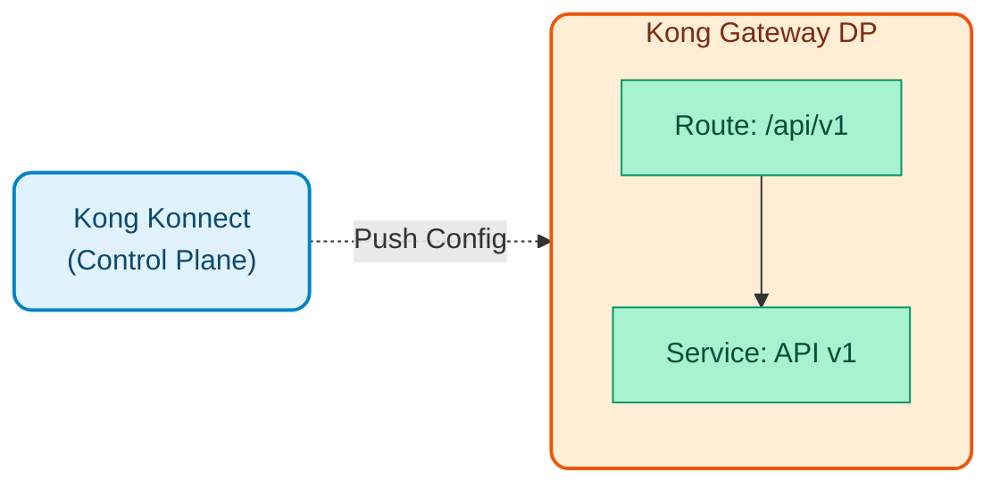
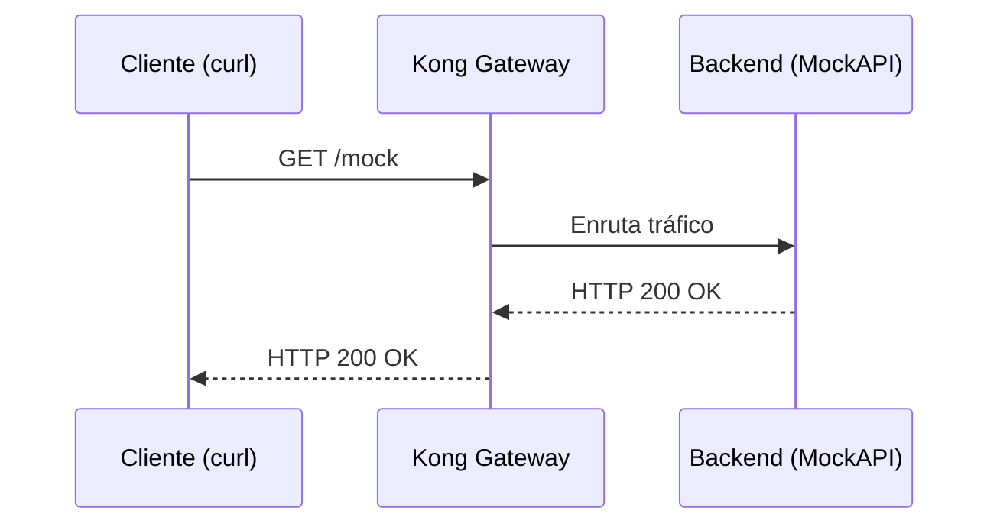
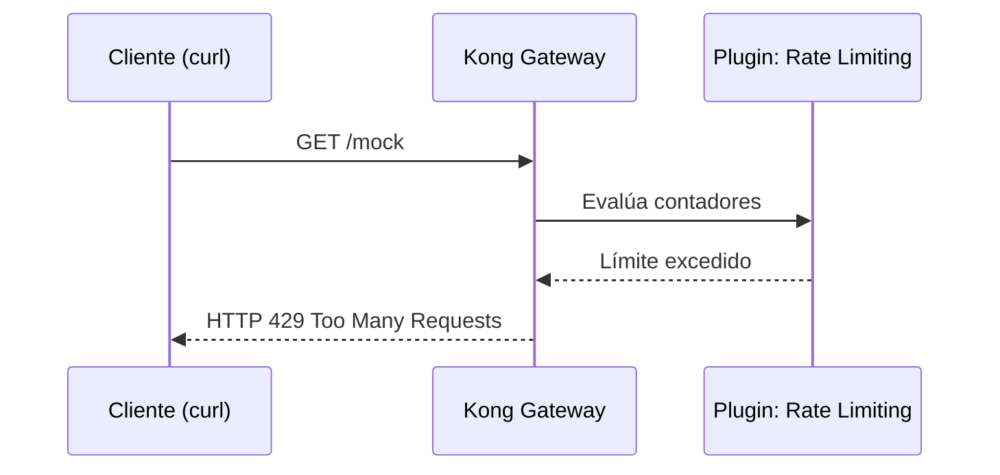
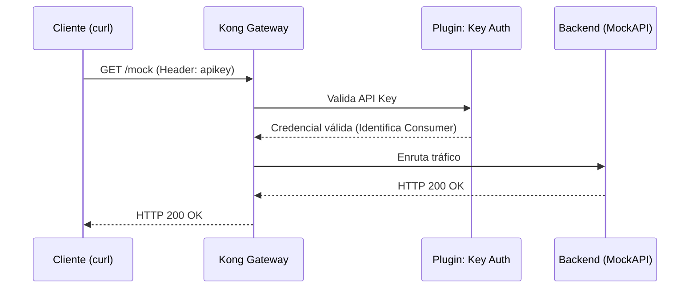
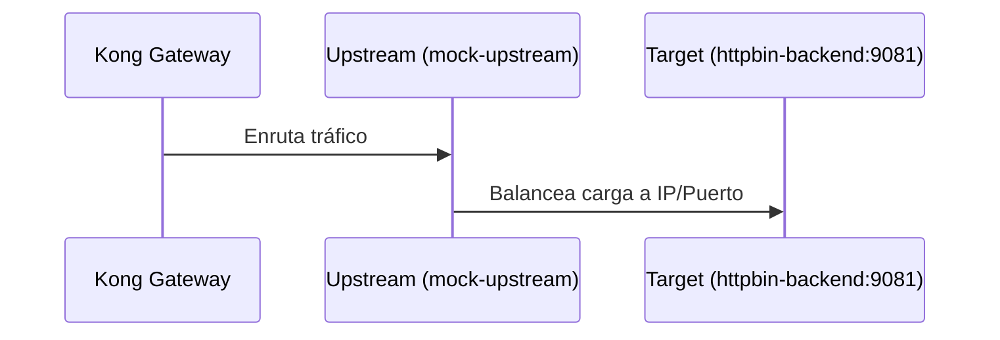
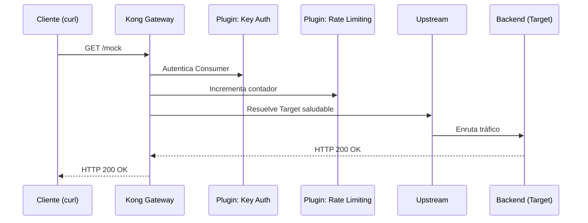

# Módulo 01: Kong Konnect Gateway (Básico)

Este módulo apresenta o Kong Konnect aos desenvolvedores, mostrando como navegar na interface e criar serviços básicos manualmente, usando nosso backend simulado local (MockAPI).


## Objetivos do Módulo

1. **Explore a interface do Konnect**: Entenda os conceitos de Gateway Services e Routes.
2. **Criar um serviço**: Configure um serviço (upstream) apontando para o backend simulado `httpbin-backend:9081`.
3. **Crie uma rota**: exponha o serviço usando o caminho `/mock`.
4. **Teste o fluxo**: consuma a API por meio do plano de dados usando `curl`.

---

## Fundamentos do Kong Konnect

Antes de entrar em prática, é vital compreender os blocos de construção básicos que Kong usa para controlar o tráfego. O Plano de Controle gerencia diversas **Entidades Lógicas**; Estes são os principais:

## # 1. Serviços de gateway
* [Documento oficial: Serviços](https://docs.konghq.com/gateway/latest/admin-api/#service-object)*

Um **Serviço** em Kong é a representação lógica de sua API ou microsserviço de back-end. 

- Funciona como o "destino" para o qual Kong deve encaminhar o tráfego após processá-lo.
- Contém informações cruciais como protocolo (`http` ou `https`), host (IP ou nome de domínio), porta e caminho base do seu backend real.
- **Analogia**: Se Kong fosse um aeroporto, o Gateway Service seria o “Avião” ou destino final ao qual os passageiros (solicitações) devem chegar.

## # 2. Rotas
* [Documento oficial: Rotas](https://docs.konghq.com/gateway/latest/admin-api/#route-object)*

Uma **Rota** define as regras sobre *como* solicitações externas podem acessar um serviço de gateway.

- Funciona como porta de entrada para clientes externos.
- Uma rota é avaliada com base nos atributos da solicitação HTTP, principalmente: `paths` (por exemplo, `/mock`), `hosts`, `methods` ou `headers`.
- Cada Rota deverá estar associada a um Serviço Gateway.
- **Analogia**: Seguindo o exemplo do aeroporto, a Rota seria o “Portão de Embarque”.

## # 3. Plug-ins
* [Documento oficial: Plugins](https://docs.konghq.com/hub/)*
**Plugins** são partes da lógica do interceptador que adicionam funcionalidades (segurança, transformações, observabilidade, *limitação de taxa* etc.) em tempo real, sem modificar o código dos seus microsserviços.

- Podem ser aplicados Globalmente, ou especificamente a um Serviço, a uma Rota ou a um Consumidor.

## # 4. Consumidores
* [Documento oficial: Consumidores](https://docs.konghq.com/gateway/latest/admin-api/#consumer-object)*

Um **Consumidor** representa um usuário, aplicativo cliente ou dispositivo externo que consome suas APIs.

- A identificação de consumidores permite aplicar políticas personalizadas (por exemplo, diferentes limites de cota dependendo do plano de assinatura) e é a base da autenticação (chaves API, JWT, OIDC).

## # 5. Upstreams e alvos
* [Documento oficial: Upstreams](https://docs.konghq.com/gateway/latest/admin-api/#upstream-object) |  [Alvos](https://docs.konghq.com/gateway/latest/admin-api/#target-object)*

Enquanto um serviço aponta para um endereço, um **Upstream** representa um balanceador de carga virtual (Load Balancer) dentro do próprio Kong.

- **Alvos**: Estes são os IPs/portas físicas reais de cada instância do seu backend.
- Kong distribuirá o tráfego entre os Targets de um Upstream de forma inteligente, monitorando seu status de saúde (Checks de Saúde Ativos/Passivos).

## # 6. Certificados e SNIs (Certificados)
* [Documento Oficial: Certificados](https://docs.konghq.com/gateway/latest/admin-api/#certificate-object) |  [SNIs](https://docs.konghq.com/gateway/latest/admin-api/#sni-object)*

Kong gerencia centralmente certificados TLS/SSL para habilitar HTTPS para clientes finais (terminação TLS), determinando qual certificado apresentar com base no domínio (Server Name Indication - SNI).

---

## Sequência de Demonstração

Nesta seção, o instrutor demonstrará ao vivo como o Kong gerencia o tráfego montando cada uma das entidades lógicas explicadas acima.
> **Nota do instrutor**: Use o plano de controle atribuído e execute os testes através do terminal conectado ao seu plano de dados local (`localhost:8443` com HTTPS). Alternativamente, lembre-se que você pode usar a coleção de testes gráficos importando o arquivo `docs/insomnia_collection.json`.

---

## # Pré-requisitos

Abra seu terminal na raiz do repositório e navegue até o diretório deste módulo:

```bash
cd workshop-assets/dia-1/01-kong-konnect-gateway
```
---

## # Demonstração 1: Serviços e rotas de gateway (o fluxo básico)


Primeiro, conectaremos o Kong ao nosso backend simulado que já está em execução no Docker e o exporemos publicamente.

1. **Crie o serviço de gateway (backend)**

    - No Konnect, vá para **Gateway Services** e clique em **New Gateway Service**.
    - **Nome**: `mock-service`
    - **URL upstream**: `http://httpbin-backend:9081/anything` *(Kong resolverá esse nome graças à rede Docker)*
    - Clique em **Salvar**.

2. **Crie a rota**

    - Dentro do serviço `mock-service`, vá até a seção **Rotas** e clique em **Nova Rota**.
    - **Nome**: `mock-route`
    - **Caminhos**: `/mock`
    - Clique em **Salvar**.

3. **Validação**

    - Execute o seguinte comando para consultar o backend através do Kong:    

```bash
    curl -k -i  https://localhost:8443/mock
    
    # Usando curl (alternativa)
    curl -k -i https://localhost:8443/mock
    

```
- *Resultado esperado*: HTTP 200 OK. A solicitação chegou ao backend sem problemas.

---

## # Demonstração 2: Plugins (Governança)


Adicionaremos governança à nossa rota aplicando limites de solicitação sem ter que programá-lo no backend.

1. **Ativar plug-in de limitação de taxa**

    - Vá para a rota `mock-route`.
    - Na seção **Plugins**, clique em **Adicionar Plugin**.
    - Pesquise **Rate Limiting** e ative-o.
    - Configurar: **Config.Minuto** = `3`
    - Clique em **Salvar**.

2. **Validação**

    - Execute a validação `curl` repetidamente (mais de 3) rapidamente:    

```bash
    curl -k -i  https://localhost:8443/mock
    
    # Usando curl (alternativa)
    curl -k -i https://localhost:8443/mock
    

```
- *Resultado esperado*: Na quarta solicitação, Kong responderá com `HTTP 429 Too Many Requests`.

---

## # Demonstração 3: Consumidores e Segurança


Protegeremos a API exigindo que os usuários (Consumidores) se identifiquem para utilizá-la.

1. **Proteja o serviço**

    - Vá para **Serviços de Gateway** -> `mock-service` -> **Plugins**.
    - Habilite o plugin **Autenticação de chave**.
    - *Se você executar `curl` agora, você receberá um `HTTP 401 Unauthorized`*.

2. **Crie o Consumidor e a Credencial**

    - No menu principal, acesse **Consumidores** e clique em **Novo Consumidor**.
    - **Nome de usuário**: `app-mobile-ios`
    - Clique em **Salvar**.
    - Dentro do Consumidor, acesse a aba **Credenciais** e adicione uma **Chave de API**.
    - No campo **Chave**, insira manualmente a chave: `kong-secret-key-123` e salve-a.

3. **Validação**

    - Envie a chave configurada no cabeçalho para autenticar a solicitação:    

```bash
    curl -k -i -H "apikey: kong-secret-key-123" https://localhost:8443/mock
    
    # Usando curl (alternativa)
    curl -k -i -H "apikey: kong-secret-key-123" https://localhost:8443/mock
    

```
- *Resultado esperado*: HTTP 200 OK.

---

## # Demonstração 4: Upstreams e destinos (balanceamento de carga)


Para nos prepararmos para picos de tráfego, abstrairemos o back-end por trás de um balanceador de carga virtual (Upstream).

1. **Crie o upstream**

    - No menu principal, vá em **Upstreams** e clique em **Novo Upstream**.
    - **Nome**: `mock-upstream`
    - Clique em **Salvar**.
    - Dentro do Upstream, vá em **Targets** e adicione um novo Target apontando para nosso contêiner Docker: `httpbin-backend:9081`.

2. **Redirecionar o serviço para upstream**

    - Vá para **Gateway Services** e edite o `mock-service`.
    - Altere o **URL Upstream** substituindo o IP/Host direto pelo nome Upstream. Deve ficar assim: `http://mock-upstream/anything`.
    - Clique em **Salvar**.

3. **Validação**

    - Execute a solicitação novamente para verificar se o Kong resolve o Upstream corretamente:    

```bash
    curl -k -i -H "apikey: kong-secret-key-123" https://localhost:8443/mock
    
    # Usando curl (alternativa)
    curl -k -i -H "apikey: kong-secret-key-123" https://localhost:8443/mock
    

```
- *Resultado esperado*: `HTTP 200 OK`. A solicitação continua chegando ao backend, mas desta vez através do balanceador lógico (Upstream) em vez de uma conexão IP/Porta direta. Você notará isso na resposta JSON, onde o campo `"url"` mostrará `"https://httpbin-backend:9081/anything"`.
    
    > **Nota**: Se durante o teste você receber um erro `HTTP 429 Too Many Requests` (como `Limite de taxa de API excedido`), isso é completamente normal e mostra que o plugin **Rate Limiting** que configuramos na Demo 2 ainda está ativo. Basta aguardar a reinicialização da janela de tempo (1 minuto no máximo, verificando o cabeçalho `RateLimit-Reset`) e tentar novamente.

---

## # Demonstração 5: Teste integrativo de ponta a ponta


Configuramos roteamento (Serviço/Rota), limite de solicitação (Plugin), segurança (Consumidor/Autenticação de chave) e balanceamento (Upstream). Tudo é executado em milissegundos no Plano de Dados.

> **Nota para o instrutor**: Nesta demonstração não há necessidade de configurar nada novo no Konnect. O objetivo é lançar uma solicitação final para demonstrar como o Kong monta e executa todo o fluxo (construído de forma incremental nas demonstrações 1 a 4) em uma única chamada.

1. **Validação Final**

    - Repita a solicitação autenticada:    

```bash
    curl -k -i -H "apikey: kong-secret-key-123" https://localhost:8443/mock
    
    # Usando curl (alternativa)
    curl -k -i -H "apikey: kong-secret-key-123" https://localhost:8443/mock
    

```
- *Resultado Esperado e Inspeção*: A solicitação retorna `HTTP 200 OK`. Para verificar empiricamente se o diagrama de sequência passo a passo foi seguido, inspecione a saída do comando (os cabeçalhos de resposta HTTP e a carga JSON):
        1. **Segurança (Key Auth)**: No JSON retornado pelo backend, verifique se `"X-Consumer-Username": ["app-movil-ios"]` existe. Isso mostra que Kong interceptou a chave de API, validou-a e identificou com sucesso o consumidor *antes* de enviar o tráfego para o backend.
        2. **Controle de tráfego (limitação de taxa)**: Observe os cabeçalhos de resposta HTTP do Kong, como `RateLimit-Limit: 3` e `RateLimit-Remaining: 2`. Isso confirma que o plugin avaliou sua cota e descontou a solicitação atual.
        3. **Balance (Upstream e Target)**: No JSON, a propriedade `"url"` exibirá `"https://httpbin-backend:9081/anything"`. Isso mostra que Kong resolveu de forma transparente o Upstream (`mock-upstream`) em direção ao alvo real.
        4. **Gateway (Times)**: Os cabeçalhos `X-Kong-Proxy-Latency` (tempo que Kong gastou executando os plugins) e `X-Kong-Upstream-Latency` (tempo gasto pelo backend) mostram como Kong orquestra todo esse fluxo em milissegundos.
        
        *(Opcional: para visualizar isso graficamente no Konnect, você pode acessar o menu **Analytics -> API Requests** para explorar os detalhes dessas transações. Observe que a telemetria pode levar alguns minutos para refletir no painel.)*

---

## Resumo
Você viu como Kong constrói uma rede inteligente para controlar o tráfego. No segundo dia deste workshop, nos laboratórios da pasta `labs/`, você mesmo executará configurações semelhantes de maneira prática e escalável (como código usando **decK** e **GitOps**).
