# Module 02: Kong Plugins (Advanced Edition)

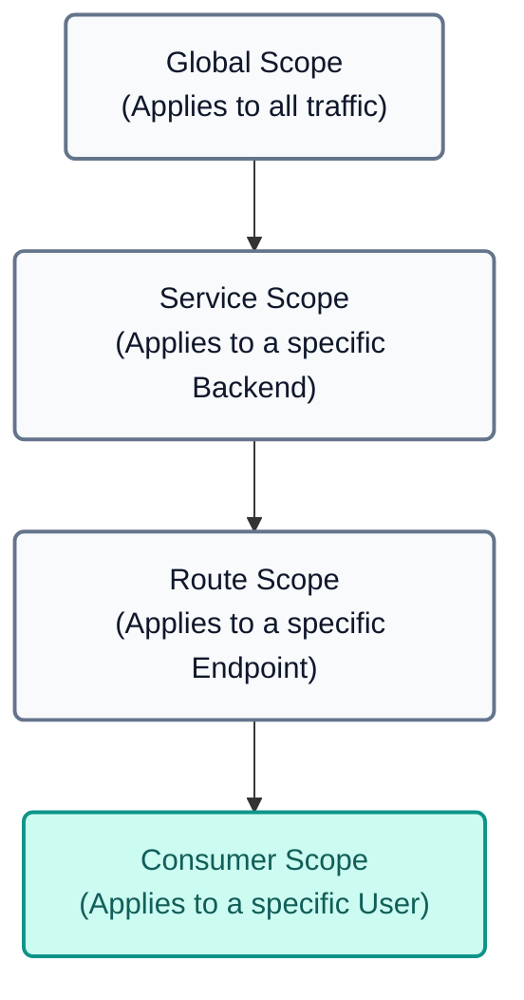

---

## Theoretical Introduction: Plugins and Advanced Capabilities
Kong API Gateway bases its extreme flexibility on the use of **Plugins**, which intercept requests in the request/response lifecycle to apply business logic, security, observability, and transformation. When using Kong in declarative mode (with `deck`), plugins are attached to different entities (Services, Routes, Consumers) or globally.

Below is a list of the main official plugins available in the Kong ecosystem, classified by category (excluding those for AI Gateway):

| Plugin | Category | Description |
|---|---|---|
| **Basic Authentication** | Authentication | Adds HTTP Basic Authentication (username and password) to an API or service. |
| **HMAC Authentication** | Authentication | Authentication using HMAC signature for increased transmission security. |
| **JWT** | Authentication | Validates JSON Web Tokens (JWT) using symmetric or asymmetric signatures. |
| **Key Authentication** | Authentication | Protects routes or services by requiring a static key in headers or querystring. |
| **LDAP Authentication** | Authentication | Integrates Kong with an LDAP/Active Directory server to validate credentials. |
| **OAuth 2.0 Authentication** | Authentication | Implements OAuth 2.0 authorization flows (Authorization Code, Client Credentials). |
| **OpenID Connect (OIDC)** (Enterprise) | Authentication | Delegates authentication to external Identity Providers (Okta, Auth0, Keycloak). |
| **SAML** (Enterprise) | Authentication | Native integration with SAML v2.0-based identity providers. |
| **ACME** | Security | Automates TLS certificate generation and renewal using Let's Encrypt. |
| **Bot Detection** | Security | Blocks or restricts access from bots and crawlers by analyzing the User-Agent. |
| **CORS** | Security | Enables Cross-Origin Resource Sharing for frontend applications/SPAs. |
| **IP Restriction** | Security | Defines allowlist/denylist of IP addresses or CIDR blocks. |
| **Upstream TLS** | Security | Enforces TLS usage when communicating from Kong to backend microservices. |
| **Proxy Cache** | Traffic Control | Stores successful HTTP responses in memory to accelerate repetitive requests. |
| **Proxy Cache Advanced** (Enterprise) | Traffic Control | Redis cache support and advanced invalidation schemes. |
| **Rate Limiting** | Traffic Control | Limits the number of requests allowed per IP or Consumer within a time period. |
| **Rate Limiting Advanced** (Enterprise) | Traffic Control | Distributed and synchronized traffic limiting in clusters using Redis. |
| **Request Size Limiting** | Traffic Control | Blocks requests whose payload exceeds a configured size in bytes. |
| **GraphQL Rate Limiting Advanced** (Enterprise) | Traffic Control | Applies rate limits by analyzing the complexity of GraphQL queries. |
| **AWS Lambda** | Serverless | Directly invokes AWS Lambda functions and proxies their responses. |
| **Azure Functions** | Serverless | Invokes Microsoft Azure Serverless functions. |
| **Pre-function / Post-function** | Serverless | Executes custom Lua logic at the beginning or end of the request lifecycle. |
| **Datadog** | Analytics & Monitoring | Sends detailed metrics to Datadog. |
| **Prometheus** | Analytics & Monitoring | Exposes Kong operational metrics to be scraped by Prometheus. |
| **Zipkin / OpenTelemetry** | Analytics & Monitoring | Integrates distributed tracing to graph latency times. |
| **Correlation ID** | Transformations | Injects or forwards a unique UUID per request to correlate logs in microservices. |
| **Exit Transformer** (Enterprise) | Transformations | Modifies and standardizes error messages generated by Kong. |
| **Request Transformer** | Transformations | Adds, replaces, or removes headers, query parameters, or body fields in the request. |
| **Response Transformer** | Transformations | Adds, replaces, or removes headers or body fields in the response. |
| **Route Transformer Adv.** (Enterprise) | Transformations | Allows modifying the destination route on the fly by evaluating variables. |
| **HTTP Log / TCP Log / UDP Log** | Logging | Sends access logs to remote servers via HTTP, TCP, or UDP. |
| **Kafka Log** | Logging | Sends transactional logs directly to an Apache Kafka topic. |
| **File Log** | Logging | Writes transaction logs to a physical file on the server's disk. |
| **Syslog / StatsD** | Logging | Integration with local Syslog daemons and StatsD metrics collection. |

 **[Explore all plugins in the Kong Plugin Hub](https://docs.konghq.com/hub/)**

---

## Demonstration Sequence

This module is a **direct continuation of Modules 000 and 001**. It reuses all already deployed infrastructure to apply the theoretical policies described.

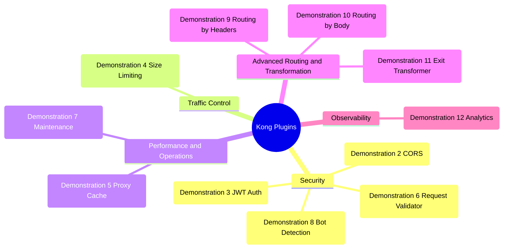

> **Important:** All plugins used in this module are included in Kong Gateway Enterprise (available through Konnect). No additional external components need to be installed or configured.

---

## Prerequisites

This module requires successfully completing **Modules 000** (Environment Preparation) and **001** (Security and Traffic Control). Verify that you have:

1.  **Control Plane** created in Konnect — Module 000.
2.  **Data Plane** connected and in "In Sync" status — Module 000.
3.  **Backend mock** (MockAPI) running at `http://localhost:9081` — Module 000.
4.  **Environment variables** configured (`KONNECT_TOKEN`, `KONNECT_CONTROL_PLANE_NAME`, etc.).

---

## Demonstration 1 Preparation: Module 002 Base State (5 min)
**Objective:** Clean up the External Control Plane configuration and synchronize a clean base state with Module 001 policies as a unified starting point.

1. Open your terminal and navigate to the `módulo-002` directory:
    ```text
    cd workshop-assets/dia-1/02-kong-plugins
    ```

2. **Control Plane Cleanup:** Before starting, we will remove all existing External Control Plane configuration to start from a clean state. This is especially important if you experimented with additional plugins or configurations during Module 001.

    ```text
    deck gateway reset --konnect-token "$KONNECT_TOKEN" --konnect-control-plane-name "$KONNECT_CONTROL_PLANE_NAME" --force
    ```
    > **What does `deck gateway reset` do?** It deletes **all** services, routes, plugins, and consumers from the Control Plane, leaving it completely empty. The `--force` flag bypasses interactive confirmation.

3. We will use the file `archivos-deck/00-demo1-estado-base-002.yaml`. This file contains the final state of Module 001 (services, consumers, security and transformation plugins) as a starting point:
    ```yaml
    # Conceptual excerpt (configuration omitted for brevity):
    services:
     - name: mock
       url: http://httpbin-backend:9081/anything/mock
       plugins:
         - name: key-auth    # Authentication
         - name: acl          # Authorization
       routes:
         - name: mock-route
           plugins:
             - name: response-transformer
    consumers:
     - username: App-External   # rate-limiting: 20/min
     - username: App-Internal   # rate-limiting: 3/min
    ```
4. Synchronize the base state to the External Control Plane:
    
    ```text
    deck gateway sync archivos-deck/00-demo1-estado-base-002.yaml \
        --konnect-token \
        "$KONNECT_TOKEN" \
        --konnect-control-plane-name \
        "$KONNECT_CONTROL_PLANE_NAME"
    ```
6. **Validation:** Execute a request to confirm that everything is working. Note that the file created the `App-External` consumer with the key `external-secret-123`:
    
    ```bash
    curl -k -i -H "apikey: external-secret-123" https://localhost:8443/mock
    
    ```
    **Using curl (alternative):**
    ```bash
    curl -k -i -H "apikey: external-secret-123" https://localhost:8443/mock
    
    ```
    **Expected result:** `200 OK` with the `x-kong: true` header.

---

## Demonstration 2 Interoperability: CORS (5 min)
**Objective:** Enable cross-origin access so that frontend applications (SPAs) can consume the flight API.

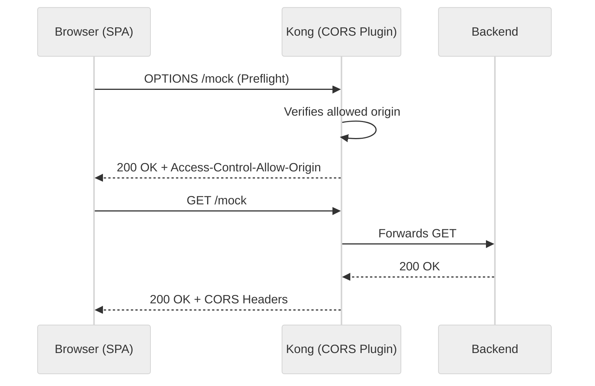

1. We will use the file `archivos-deck/01-demo2-cors.yaml`. You can inspect how the `cors` plugin was added to the `mock` service:
    ```yaml
    services:
     - name: mock
       plugins:
         - name: cors
           config:
             origins:
               - "https://mock.example.com"
               - "http://localhost:3000"
             methods:
               - GET
               - POST
               - OPTIONS
             headers:
               - Authorization
               - Content-Type
               - apikey
             max_age: 3600
             credentials: true
    ```
2. Synchronize the changes:
    
    ```text
    deck gateway sync archivos-deck/01-demo2-cors.yaml \
        --konnect-token \
        "$KONNECT_TOKEN" \
        --konnect-control-plane-name \
        "$KONNECT_CONTROL_PLANE_NAME"
    ```
3. Test the CORS preflight request:
    
    ```bash
    curl -k -i  https://localhost:8443/mock \
     Origin:"http://localhost:3000" \
     Access-Control-Request-Method:"GET" \
     Access-Control-Request-Headers:"apikey"
    ```
    **Using curl (alternative):**
    ```bash
    curl -k -i -X OPTIONS https://localhost:8443/mock \
     -H "Origin: http://localhost:3000" \
     -H "Access-Control-Request-Method: GET" \
     -H "Access-Control-Request-Headers: apikey"
    ```
    **Expected result:** `200 OK` with headers:

    - `Access-Control-Allow-Origin: http://localhost:3000`
    - `Access-Control-Allow-Methods: GET, POST, OPTIONS`
    - `Access-Control-Allow-Credentials: true`

4. Test with a NOT allowed origin:
    
    ```bash
    curl -k -i  https://localhost:8443/mock \
     Origin:"https://malicious-site.com" \
     Access-Control-Request-Method:"GET"
    ```
    **Using curl (alternative):**
    ```bash
    curl -k -i -X OPTIONS https://localhost:8443/mock \
     -H "Origin: https://malicious-site.com" \
     -H "Access-Control-Request-Method: GET"
    ```
    **Expected result:** You will receive an `HTTP/1.1 200 OK` but the response will **NOT** include the `Access-Control-Allow-Origin` header. 
    
    > **💡 Why 200 OK and not an error?** In the CORS standard, the Gateway responds to the `OPTIONS` preflight by informing the access rules (in this case, omitting the allowed origin header). It is the **web browser** that interprets this omission as a rejection and is responsible for throwing the security error and blocking the actual `GET`/`POST` request.

---

## Demonstration 3 Security: JWT authentication (15 min)
**Objective:** Implement JSON Web Token (JWT) based authentication as a modern alternative to API Keys, demonstrating the contrast between both mechanisms.

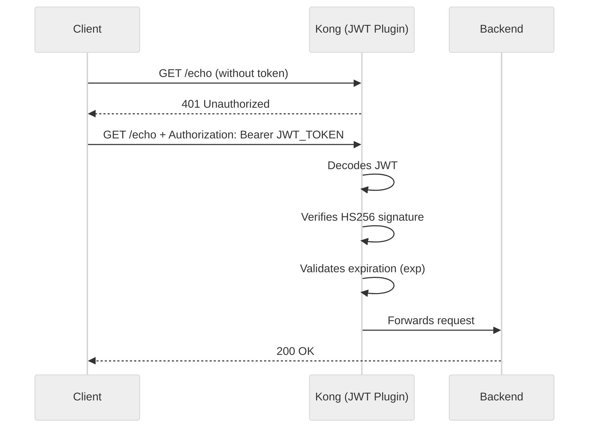

1. We will use the file `archivos-deck/02-demo3-jwt.yaml`. You can inspect the main changes:
    ```yaml
    # New echo service with JWT authentication
    services:
     - name: echo-external
       url: http://httpbin-backend:9081/anything/echo
       plugins:
         - name: jwt
           config:
             claims_to_verify:
               - exp
       routes:
         - name: echo-get-route
           paths: [/echo]
           methods: [GET]
         - name: echo-post-route
           paths: [/echo]
           methods: [POST]

    # New consumer with JWT credentials (HS256)
    consumers:
     - username: App-JWT
       jwt_secrets:
         - algorithm: HS256
           key: "mock-jwt-issuer"
           secret: "my-super-secret-key-for-workshop"
    ```
    > **Note:** We use HS256 (symmetric key) to simplify token generation in the workshop. In production, RS256 (asymmetric key) is recommended for greater security.

2. Synchronize the changes:
    
    ```text
    deck gateway sync archivos-deck/02-demo3-jwt.yaml \
        --konnect-token \
        "$KONNECT_TOKEN" \
        --konnect-control-plane-name \
        "$KONNECT_CONTROL_PLANE_NAME"
    ```
3. **Generate a JWT token** using the provided script:

    ```text
    export JWT_TOKEN=$(./scripts/generate_jwt.sh | grep -A1 "Token:" | tail -1)
    echo $JWT_TOKEN
    ```
    
    > **💡 Where does this token come from?** In this exercise, we are **not** requesting the token from any external identity provider (like Okta or Keycloak). The `generate_jwt.sh` script generates the token locally (offline) using basic tools like `openssl`. 
    > It simply builds a Payload and signs it using the secret `my-super-secret-key-for-workshop` with the symmetric HS256 algorithm. Since Kong has that exact same key configured in the decK file, it is able to verify the signature and authorize the request. We will see a "real" integration with an Identity Server in Module 07 (mTLS + OIDC).
    > *(Optional)* If you are using the classic Windows console (CMD) where `export` does not work, you will need to copy the generated token and configure it manually with `set JWT_TOKEN=<paste_token_here>`. For Mac, Linux, or GitBash, the previous command has already done it for you.

4. Test without token and with token:

    Without token:
    ```bash
    curl -k -i  https://localhost:8443/echo
    ```
    **Using curl (alternative):**
    ```bash
    curl -k -i  https://localhost:8443/echo
    ```
    **Expected result:** `HTTP/1.1 401 Unauthorized`

    With valid token:
    ```bash
    curl -k -i -H "Authorization: Bearer $JWT_TOKEN" https://localhost:8443/echo
    ```
    **Using curl (alternative):**
    ```bash
    curl -k -i -H "Authorization: Bearer $JWT_TOKEN" https://localhost:8443/echo
    ```
    **Expected result:** `HTTP/1.1 200 OK`

5. **Pedagogical Contrast:** Observe that we now have two authentication mechanisms coexisting in the same gateway:

    - `mock` → protected with **Key Auth** (static API Key in `apikey` header)
    - `echo` → protected with **JWT** (signed token with expiration in `Authorization` header)
    
    > **💡 Observability Tip:** If you go to the **Konnect > Analytics > API Requests** web console, you will be able to see how Kong logs these accesses. When using authentication (either JWT or Key Auth), Kong identifies the "Consumer". In the graphs, you can group and filter traffic to see exactly how many requests `App-JWT` made versus `App-External`.

---

## Demonstration 4 Protection: Request Size Limiting (5 min)
**Objective:** Protect the backend against requests with excessively large payloads (DoS prevention by payload).

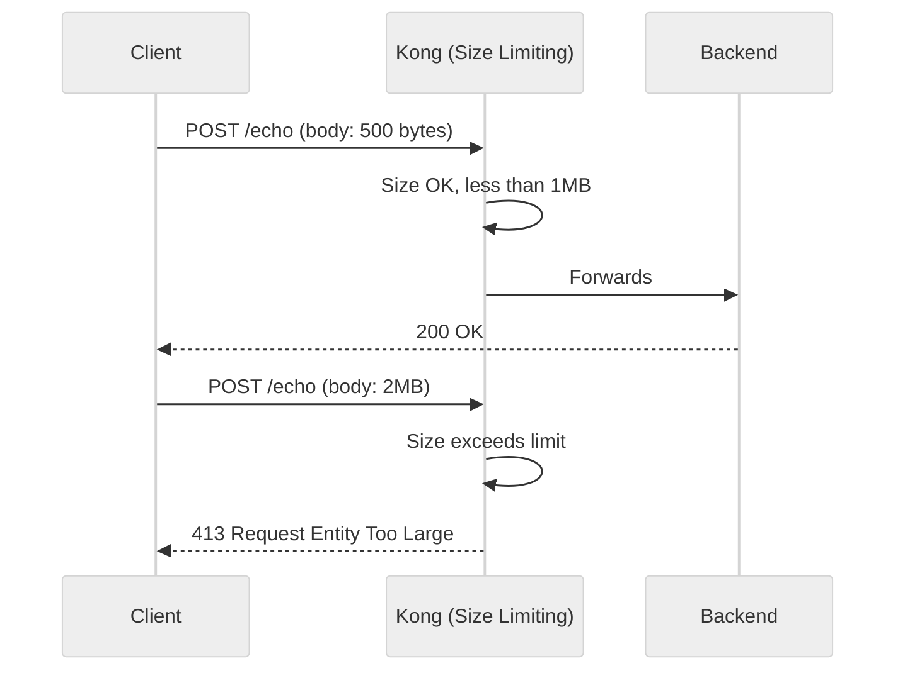

1. We will use the file `archivos-deck/03-demo4-request-size-limiting.yaml`. You can inspect how the plugin was added:
    ```yaml
    services:
     - name: echo-external
       plugins:
         - name: request-size-limiting
           config:
             allowed_payload_size: 1
             size_unit: megabytes
             require_content_length: false
    ```

2. Synchronize the changes:
    
    ```text
    deck gateway sync archivos-deck/03-demo4-request-size-limiting.yaml \
        --konnect-token \
        "$KONNECT_TOKEN" \
        --konnect-control-plane-name \
        "$KONNECT_CONTROL_PLANE_NAME"
    ```
3. Test with a payload within the limit and another excessive one:

    Small payload → 200 OK:

    ```bash
    curl -k -i -X POST https://localhost:8443/echo -H "Authorization: Bearer $JWT_TOKEN" -H "Content-Type: application/json" -d '{"test": "pequeno"}'
    ```

    Excessive payload (2MB) → 413:

    1. Generate temporary file with the payload:
    ```bash
    python3 -c "print('{\"data\":\"' + 'X'*2000000 + '\"}')" > payload.json
    ```
    2. Execute request reading the file (note the @):
    
    ```bash
    curl -k -i  https://localhost:8443/echo \
        Authorization:"Bearer $JWT_TOKEN" \
        @payload.json
    ```
    **Using curl (alternative):**
    ```bash
    curl -k -i \
        -X POST \
        -H "Authorization: Bearer $JWT_TOKEN" \
        -H "Content-Type: application/json" \
        -d "@payload.json" \
        https://localhost:8443/echo
    ```
    *(To generate the large payload in Windows, use PowerShell to create the file and then curl):*
    ```text
    powershell -Command "$body = '{\"data\":\"' + ('X' * 2000000) + '\"}'; Set-Content -Path payload.json -Value $body; curl.exe -i -X POST http://localhost:8000/echo -H 'Authorization: Bearer %JWT_TOKEN%' -H 'Content-Type: application/json' -d '@payload.json'"
    ```
    **Expected result:** `200 OK` for the small payload and `413 Request Entity Too Large` for the excessive one.

---

## Demonstration 5 Performance: Gateway Cache (10 min)
**Objective:** Reduce latency and backend load by implementing caching at the API Gateway level, without modifying the backend.

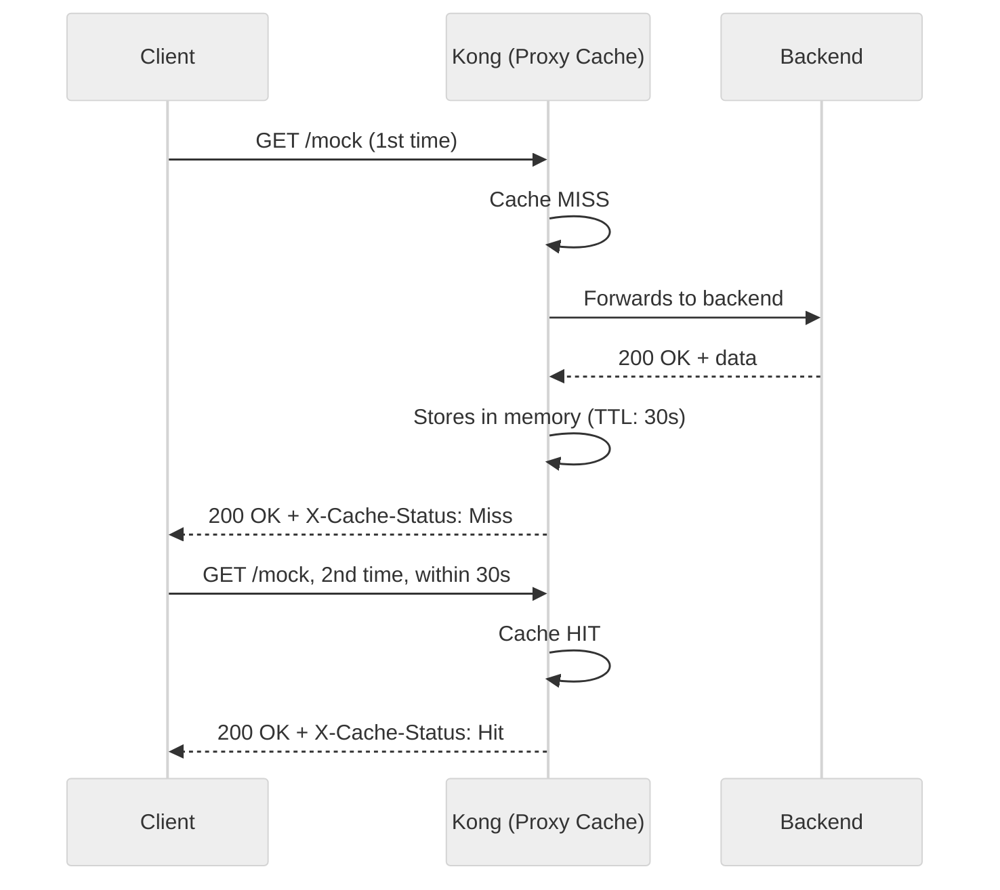

1. We will use the file `archivos-deck/04-demo5-proxy-cache.yaml`. You can inspect how the `proxy-cache` plugin was added to the mock route:
    ```yaml
    routes:
     - name: mock-route
       plugins:
         - name: proxy-cache
           config:
             strategy: memory
             content_type:
               - "application/json"
               - "text/plain; charset=utf-8"
             cache_ttl: 30
             cache_control: false
             response_code:
               - 200
             request_method:
               - GET
    ```

2. Synchronize the changes:
    
    ```text
    deck gateway sync archivos-deck/04-demo5-proxy-cache.yaml \
        --konnect-token \
        "$KONNECT_TOKEN" \
        --konnect-control-plane-name \
        "$KONNECT_CONTROL_PLANE_NAME"
    ```
3. Make two consecutive requests and observe the cache headers:

    First request → MISS:
    ```bash
    curl -k -i -H "apikey: external-secret-123" https://localhost:8443/mock
    
    ```
    **Using curl (alternative):**
    ```bash
    curl -k -i -H "apikey: external-secret-123" https://localhost:8443/mock
    ```
    **Expected result:** `HTTP/1.1 200 OK` with the `X-Cache-Status: Miss` header (the gateway went to the backend).

    Second request (within 30s) → HIT:
    ```bash
    curl -k -i -H "apikey: external-secret-123" https://localhost:8443/mock
    ```
    **Using curl (alternative):**
    ```bash
    curl -k -i -H "apikey: external-secret-123" https://localhost:8443/mock
    ```
    **Expected result:** `HTTP/1.1 200 OK` with the `X-Cache-Status: Hit` header (the gateway served the response from the cache memory, bypassing the backend).

4. **Observation:** Check the file-log to compare the latency of a `Miss` request vs. a `Hit`. Observing the reported times, you will see that in a `Hit`, the value drastically decreases because the request is cached in the gateway without reaching the backend.

5. Wait 30 seconds and repeat the request. You will see that it becomes `Miss` again because the TTL expired.

---

## Demonstration 6 Governance: JSON Schema Validation (15 min)
**Objective:** Ensure that POST requests to the echo service comply with a data contract (JSON schema) before reaching the backend.

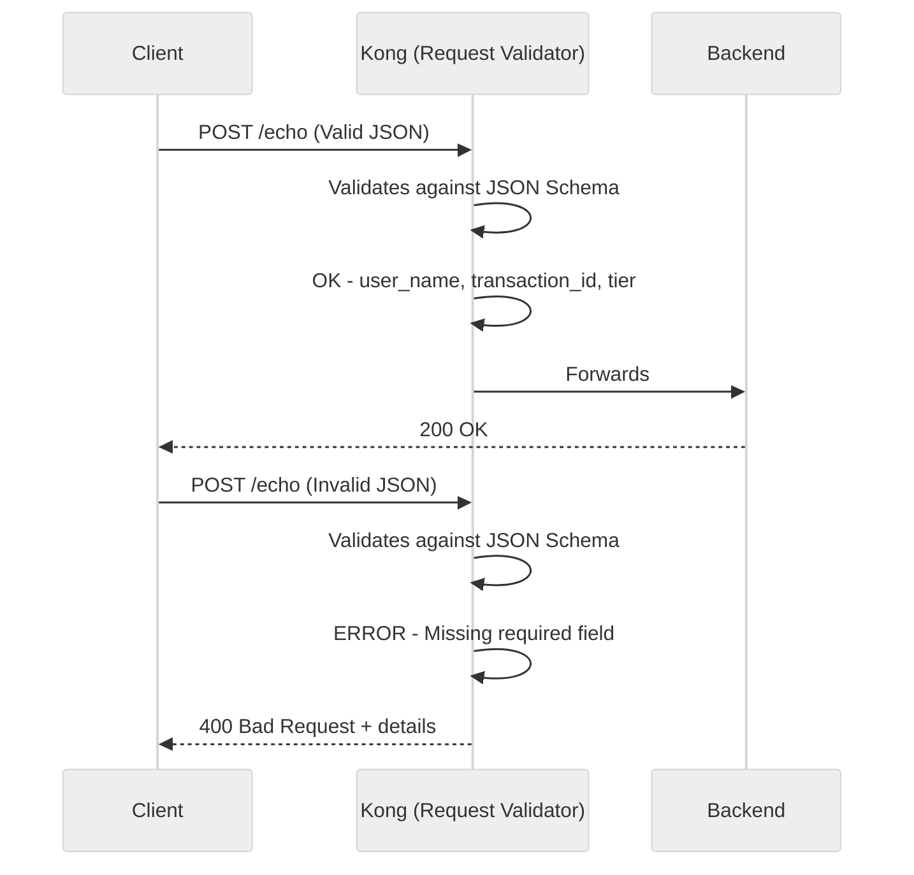

1. We will use the file `archivos-deck/05-demo6-request-validator.yaml`. You can inspect the validation schema configured on the echo POST route:
    ```yaml
    routes:
     - name: echo-post-route
       paths: [/echo]
       methods: [POST]
       plugins:
         - name: request-validator
           config:
             body_schema: '[{
               "user_name": {"type":"string","required":true},
               "transaction_id":      {"type":"string","required":true},
               "tier":   {"type":"string","required":true,
                                  "one_of":["standard","premium","vip"]},
               "preference":{"type":"string",
                                  "one_of":["window","aisle","middle"]}
             }]'
             verbose_response: true
             allowed_content_types: ["application/json"]
    ```

2. Synchronize the changes:
    
    ```text
    deck gateway sync archivos-deck/05-demo6-request-validator.yaml \
        --konnect-token \
        "$KONNECT_TOKEN" \
        --konnect-control-plane-name \
        "$KONNECT_CONTROL_PLANE_NAME"
    ```
3. Test with a valid JSON:

    ```bash
    curl -k -i  https://localhost:8443/echo \
        Authorization:"Bearer $JWT_TOKEN" \
        user_name="Juan Pérez" \
        transaction_id="TX-101" \
        tier="premium" \
        preference="window"
    ```
    **Using curl (alternative):**
    ```bash
    curl -k -i \
        -X POST \
        -H "Authorization: Bearer $JWT_TOKEN" \
        -H "Content-Type: application/json" \
        -d '{"user_name":"Juan Pérez","transaction_id":"TX-101","tier":"premium","preference":"window"}' \
        https://localhost:8443/echo
    ```
    **Expected result:** `200 OK`.

4. Test with a JSON that has a missing required field:

    ```bash
    curl -k -i  https://localhost:8443/echo \
        Authorization:"Bearer $JWT_TOKEN" \
        user_name="Juan Pérez"
    ```
    **Using curl (alternative):**
    ```bash
    curl -k -i \
        -X POST \
        -H "Authorization: Bearer $JWT_TOKEN" \
        -H "Content-Type: application/json" \
        -d '{"user_name":"Juan Pérez"}' \
        https://localhost:8443/echo
    ```
    **Expected result:** `400 Bad Request` with details indicating which fields are missing.

5. Test with a value not allowed in the enum:

    ```bash
    curl -k -i  https://localhost:8443/echo \
        Authorization:"Bearer $JWT_TOKEN" \
        user_name="Ana López" \
        transaction_id="KA-202" \
        tier="ultra-mega"
    ```
    **Using curl (alternative):**
    ```bash
    curl -k -i \
        -X POST \
        -H "Authorization: Bearer $JWT_TOKEN" \
        -H "Content-Type: application/json" \
        -d '{"user_name":"Ana López","transaction_id":"KA-202","tier":"ultra-mega"}' \
        https://localhost:8443/echo
    ```
    **Expected result:** `400 Bad Request` indicating that `ultra-mega` is not a valid value for `tier`.

---

## Demonstration 7 Operations: Maintenance Mode (5 min)
**Objective:** Put an API into maintenance mode from the gateway without touching or restarting the backend, demonstrating the power of declarative configuration.

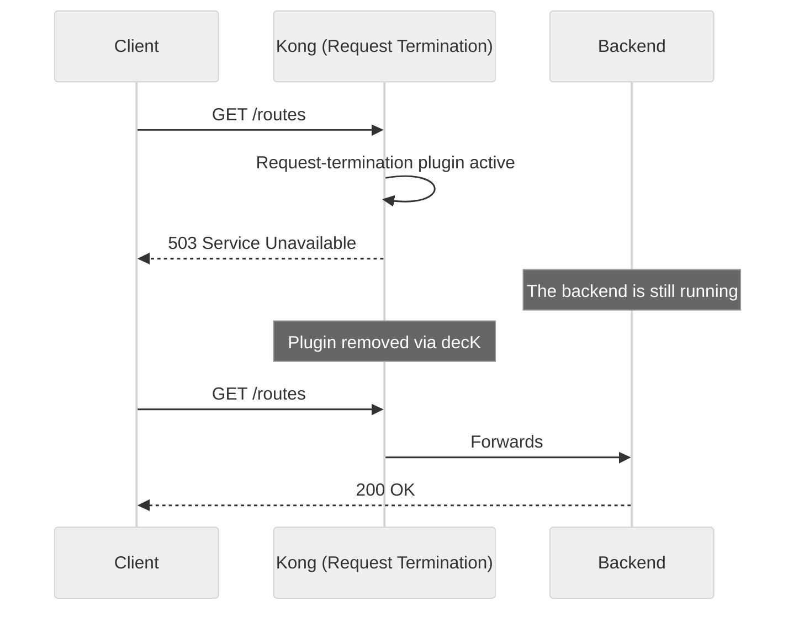

1. We will use the file `archivos-deck/06-demo7-request-termination.yaml`. You can inspect how the plugin was added to the `/routes` route:
    ```yaml
    - name: routes
     routes:
       - name: routes-route
         paths: [/routes]
         plugins:
           - name: request-termination
             config:
               status_code: 503
               message: "The routes service is under scheduled maintenance. Please try again in 30 minutes."
    ```

2. Synchronize the changes:
    
    ```text
    deck gateway sync archivos-deck/06-demo7-request-termination.yaml \
        --konnect-token \
        "$KONNECT_TOKEN" \
        --konnect-control-plane-name \
        "$KONNECT_CONTROL_PLANE_NAME"
    ```
3. Test the API in maintenance:

    ```bash
    curl -k -i  https://localhost:8443/routes
    
    ```
    **Using curl (alternative):**
    ```bash
    curl -k -i  https://localhost:8443/routes
    
    ```
    **Expected result:** `503 Service Unavailable` with the maintenance message.

4. Meanwhile, other APIs continue to function normally:

    ```bash
    curl -k -i -H "apikey: external-secret-123" https://localhost:8443/mock
    
    ```
    **Using curl (alternative):**
    ```bash
    curl -k -i -H "apikey: external-secret-123" https://localhost:8443/mock
    
    ```
    **Expected result:** `200 OK`. The mock service is not affected.

> **Note:** In the next step (Demonstration 8), when synchronizing a file that does NOT include the `request-termination` plugin, it will be automatically removed and the routes service will resume functioning. This is the power of declarative management: the desired state is always defined by the file.

---

## Demonstration 8 Security: Bot Detection (5 min)
**Objective:** Automatically block traffic from known bots (crawlers) at the gateway's global level.

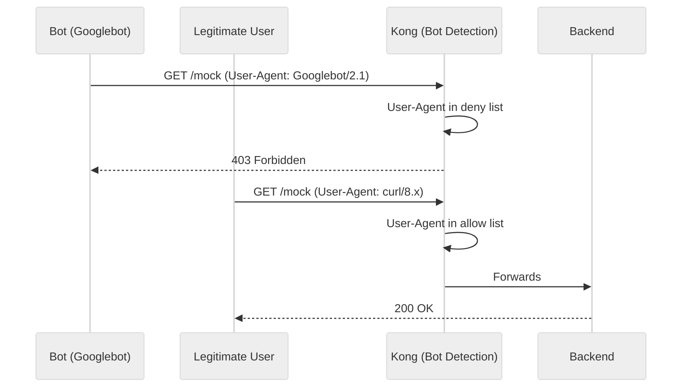

1. We will use the file `archivos-deck/07-demo8-bot-detection.yaml`. This file:

    - **Adds** the `bot-detection` plugin globally
    - **Removes** the `request-termination` from the previous step (the `/routes` service resumes functioning)
    ```yaml
    plugins:
     - name: bot-detection
       config:
         deny:
           - "Googlebot"
           - "Bingbot"
           - "Baiduspider"
         allow:
           - "curl"
           - "insomnia"
           - "postman"
    ```

2. Synchronize the changes:
    
    ```text
    deck gateway sync archivos-deck/07-demo8-bot-detection.yaml \
        --konnect-token \
        "$KONNECT_TOKEN" \
        --konnect-control-plane-name \
        "$KONNECT_CONTROL_PLANE_NAME"
    ```
3. Test with a bot User-Agent vs. a legitimate one:

    Simulate Googlebot:
    ```bash
    curl -k -i -H "User-Agent: Googlebot/2.1" https://localhost:8443/routes
    ```
    **Using curl (alternative):**
    ```bash
    curl -k -i -H "User-Agent: Googlebot/2.1" https://localhost:8443/routes
    ```
    **Expected result:** `HTTP/1.1 403 Forbidden`

    Normal request (without malicious user-agent):
    ```bash
    curl -k -i  https://localhost:8443/routes
    ```
    **Using curl (alternative):**
    ```bash
    curl -k -i  https://localhost:8443/routes
    ```
    **Expected result:** `HTTP/1.1 200 OK`

4. Verify that `/routes` was restored (the `request-termination` was removed):

    ```text
    curl -s -o /dev/null -w "%{http_code}" http://localhost:8000/routes
    ```
    **Expected result:** `200` (no longer `503`).

---

## Demonstration 9 Intelligent Routing: by Header Values (15 min)
**Objective:** Demonstrate how Kong can direct traffic to different backends based on the value of an HTTP header, implementing a **regional routing** strategy.

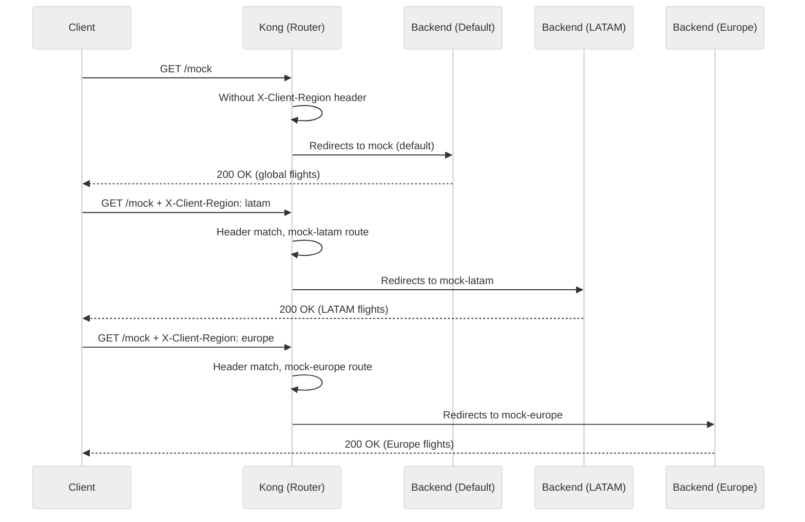

> **Business Case:** MockAPI operates in multiple regions. Clients send the `X-Client-Region` header to get flights from their specific region. Kong directs each request to the corresponding regional backend without needing additional logic in the code.

1. We will use the file `archivos-deck/08-demo9-ruteo-por-header.yaml`. You can inspect how two new services with routes that filter by header were added:
    ```yaml
    # Service for LATAM (only activated with X-Client-Region: latam)
    - name: mock-latam
      url: http://httpbin-backend:9081/anything/mock-latam
      routes:
        - name: mock-latam-route
          paths: [/mock]
          methods: [GET]
          headers:
            x-client-region:
              - latam

    # Service for EUROPE (only activated with X-Client-Region: europe)
    - name: mock-europe
      url: http://httpbin-backend:9081/anything/mock-europe
      routes:
        - name: mock-europe-route
          paths: [/mock]
          methods: [GET]
          headers:
            x-client-region:
              - europe

    # DEFAULT Service (no header restriction = catch-all)
    - name: mock
      url: http://httpbin-backend:9081/anything/mock
      routes:
        - name: mock-route
          paths: [/mock]
          methods: [GET]
    # Without 'headers' field → catches everything else
    ```

    > **How does it work?** Kong evaluates routes from most specific to least specific. Routes with `headers` restriction are more specific than those without. Therefore, if the request includes `X-Client-Region: latam`, it will match `mock-latam-route` first. If it doesn't bring that header, it will fall to the default `mock-route`.

2. Synchronize the changes:
    
    ```text
    deck gateway sync archivos-deck/08-demo9-ruteo-por-header.yaml \
        --konnect-token \
        "$KONNECT_TOKEN" \
        --konnect-control-plane-name \
        "$KONNECT_CONTROL_PLANE_NAME"
    ```
3. Test regional routing:

    Routing to LATAM:
    ```bash
    curl -k -i  https://localhost:8443/mock \
        X-Client-Region:"latam" \
        apikey:"external-secret-123"
    ```
    **Using curl (alternative):**
    ```bash
    curl -k -i \
        -H "X-Client-Region: latam" \
        -H "apikey: external-secret-123" \
        https://localhost:8443/mock
    ```
    **Expected result:** `HTTP/1.1 200 OK` and in the JSON response, the `url` field will show `"http://httpbin-backend:9081/anything/mock-latam"`.

    Routing to EUROPE:
    ```bash
    curl -k -i  https://localhost:8443/mock \
        X-Client-Region:"europe" \
        apikey:"external-secret-123"
    ```
    **Using curl (alternative):**
    ```bash
    curl -k -i \
        -H "X-Client-Region: europe" \
        -H "apikey: external-secret-123" \
        https://localhost:8443/mock
    ```
    **Expected result:** `HTTP/1.1 200 OK` and in the JSON response, the `url` field will show `"http://httpbin-backend:9081/anything/mock-europe"`.

    DEFAULT Routing (without regional header):
    ```bash
    curl -k -i -H "apikey: external-secret-123" https://localhost:8443/mock
    ```
    **Using curl (alternative):**
    ```bash
    curl -k -i -H "apikey: external-secret-123" https://localhost:8443/mock
    ```
    **Expected result:** `HTTP/1.1 200 OK` and in the JSON response, the `url` field will show `"http://httpbin-backend:9081/anything/mock"` (It fell to the default as it had no header).

4. **Observation:** Reviewing **Konnect Analytics > API Requests**, grouping the view by **Service**, you will be able to observe that traffic is distributed in different bars for `mock`, `mock-latam`, and `mock-europe`, confirming that Kong dynamically routed to the correct backend.

---

## Demonstration 10 Intelligent Routing: by Body Content (20 min)
**Objective:** Demonstrate how Kong can inspect the JSON body content of a request and dynamically redirect to different backends based on the values found, using the `pre-function` plugin.

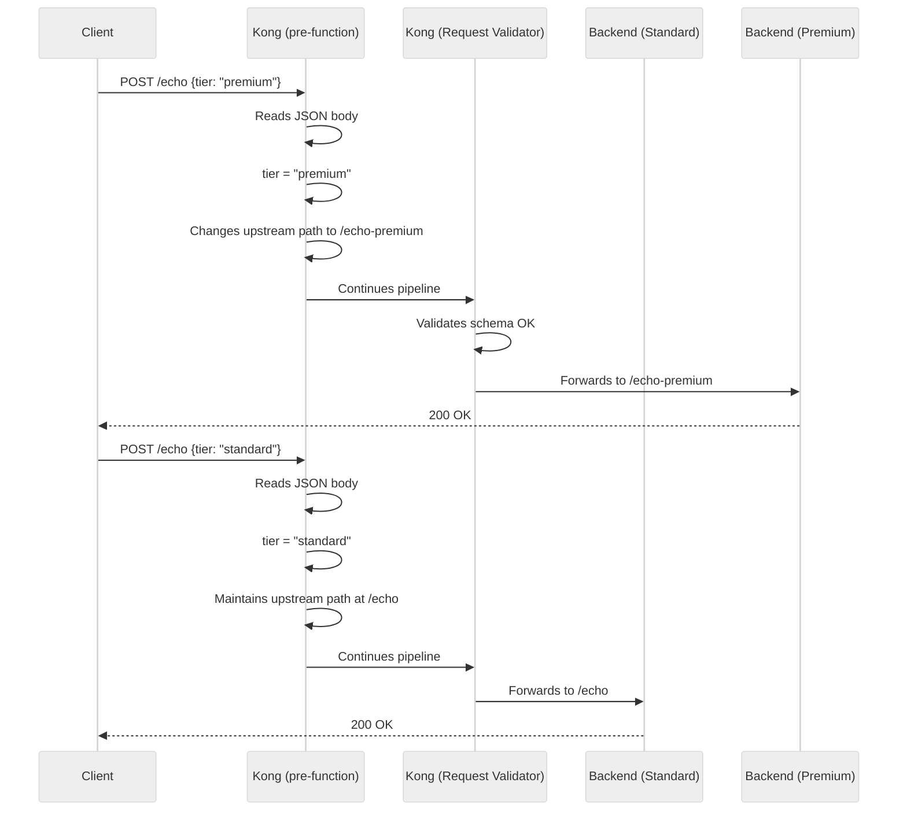

> **Business Case:** When a passenger creates a reservation, the `tier` field in the JSON determines whether it is processed by the standard flow or the premium flow (which could have its own backend with differentiated billing logic, seating, etc.).

1. We will use the file `archivos-deck/09-demo10-ruteo-por-body.yaml`. You can inspect the `pre-function` plugin added to the echo POST route:
    ```yaml
    routes:
     - name: echo-post-route
       paths: [/echo]
       methods: [POST]
       plugins:
         - name: pre-function
           config:
             access:
               - |
                 -- Dynamic routing by body content
                 local cjson = require("cjson.safe")
                 local body = kong.request.get_raw_body()
                 if not body then return end

                 local json = cjson.decode(body)
                 if not json or not json.tier then return end

                 if json.tier == "premium"
                    or json.tier == "vip" then
                   -- Redirects to premium backend
                   kong.service.request.set_path(
                     "/anything/echo-premium")
                   kong.service.request.set_header(
                     "X-Routed-By", "body-content")
                   kong.service.request.set_header(
                     "X-Tier", "premium")
                 else
                   kong.service.request.set_header(
                     "X-Routed-By", "body-content")
                   kong.service.request.set_header(
                     "X-Tier", "standard")
                 end
    ```

    > **How does it work?** The `pre-function` plugin executes Lua code in the `access` phase (before the request reaches the upstream). It reads the JSON body, extracts the `tier` field, and if it is `premium` or `vip`, dynamically changes the upstream path using `kong.service.request.set_path()`. This redirects the request to `/anything/echo-premium` without the client knowing. Additionally, it injects diagnostic headers (`X-Routed-By`, `X-Tier`) that the backend receives.

2. Synchronize the changes:
    
    ```text
    deck gateway sync archivos-deck/09-demo10-ruteo-por-body.yaml \
        --konnect-token \
        "$KONNECT_TOKEN" \
        --konnect-control-plane-name \
        "$KONNECT_CONTROL_PLANE_NAME"
    ```
3. Test **PREMIUM** reservation → premium backend:

    ```bash
    curl -k -i  https://localhost:8443/echo \
        Authorization:"Bearer $JWT_TOKEN" \
        user_name="Juan Pérez" \
        transaction_id="TX-101" \
        tier="premium" \
        preference="window"
    ```
    **Using curl (alternative):**
    ```bash
    curl -k -i \
        -X POST \
        -H "Authorization: Bearer $JWT_TOKEN" \
        -H "Content-Type: application/json" \
        -d '{"user_name":"Juan Pérez","transaction_id":"TX-101","tier":"premium","preference":"window"}' \
        https://localhost:8443/echo
    ```
    **Expected result:** In the echo backend's JSON response:

    - `"url": "http://httpbin-backend:9081/anything/echo-premium"` ← It went to the premium backend!
    - The `X-Tier: premium` header will appear in the headers received by the backend.

4. Test **STANDARD** reservation → standard backend:

    ```bash
    curl -k -i  https://localhost:8443/echo \
        Authorization:"Bearer $JWT_TOKEN" \
        user_name="María López" \
        transaction_id="KA-202" \
        tier="standard"
    ```
    **Using curl (alternative):**
    ```bash
    curl -k -i \
        -X POST \
        -H "Authorization: Bearer $JWT_TOKEN" \
        -H "Content-Type: application/json" \
        -d '{"user_name":"María López","transaction_id":"KA-202","tier":"standard"}' \
        https://localhost:8443/echo
    ```
    **Expected result:**

    - `"url": "http://httpbin-backend:9081/anything/echo"` ← It remained on the standard backend.
    - The `X-Tier: standard` header will appear in the received headers.

5. Test **VIP** reservation → also goes to premium backend:

    ```bash
    curl -k -i  https://localhost:8443/echo \
        Authorization:"Bearer $JWT_TOKEN" \
        user_name="Carlos Ruiz" \
        transaction_id="KA-303" \
        tier="vip" \
        preference="aisle"
    ```
    **Using curl (alternative):**
    ```bash
    curl -k -i \
        -X POST \
        -H "Authorization: Bearer $JWT_TOKEN" \
        -H "Content-Type: application/json" \
        -d '{"user_name":"Carlos Ruiz","transaction_id":"KA-303","tier":"vip","preference":"aisle"}' \
        https://localhost:8443/echo
    ```
    **Expected result:** `"url": "http://httpbin-backend:9081/anything/echo-premium"` ← VIP is also routed to the premium backend.

6. **Summary of the two routing types:**

    | Method | Routing Criterion | Kong Mechanism | Advantage |
    |--------|-------------------|----------------|---------|
    | **Header** (Demonstration 9) | Value of the `X-Client-Region` header | Native: `headers` field in the Route | Declarative, no code |
    | **Body** (Demonstration 10) | Value of the `tier` field in the JSON | `pre-function` Plugin (Lua) | Flexible, customizable logic |

---

## Demonstration 11 Customization: Standardized Corporate Errors (10 min)
**Objective:** Standardize all error responses generated by Kong into a consistent corporate JSON format.

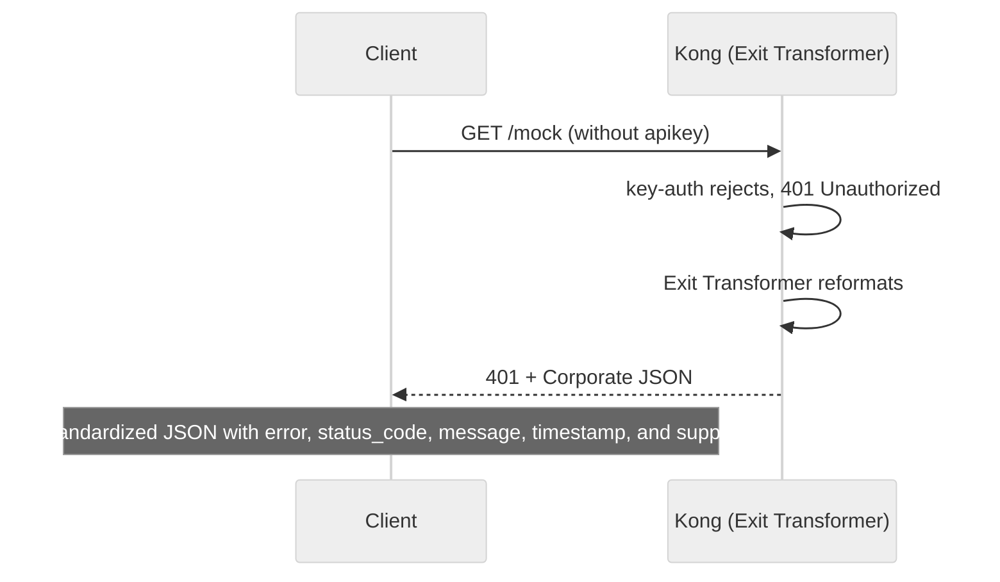

1. We will use the file `archivos-deck/10-demo11-exit-transformer.yaml`. You can inspect the `exit-transformer` plugin added globally:
    ```yaml
    plugins:
     - name: exit-transformer
       config:
         functions:
           - |
             return function(status, body, headers)
               if status >= 400 then
                 local new_body = {
                   error = true,
                   status_code = status,
                   message = body.message or body.msg
                             or "Unknown error",
                   service = "MockAPI API Gateway",
                   timestamp = os.date("!%Y-%m-%dT%H:%M:%SZ"),
                   support = "support@mock.com"
                 }
                 return status, new_body, headers
               end
               return status, body, headers
             end
    ```

2. Synchronize the changes:
    
    ```text
    deck gateway sync archivos-deck/10-demo11-exit-transformer.yaml \
        --konnect-token \
        "$KONNECT_TOKEN" \
        --konnect-control-plane-name \
        "$KONNECT_CONTROL_PLANE_NAME"
    ```
3. Test different errors and verify the standardized format:

    **Error 401 (without authentication):**
    
    ```bash
    curl -k -i  https://localhost:8443/mock
    ```
    Using curl (alternative):
    ```bash
    curl -k -i https://localhost:8443/mock
    ```

    **Error 403 (consumer without ACL permissions):**
    
    ```bash
    curl -k -i -H "apikey: internal-secret-123" https://localhost:8443/mock
    ```
    Using curl (alternative):
    ```bash
    curl -k -i -H "apikey: internal-secret-123" https://localhost:8443/mock
    ```

    **Error 403 (bot detected):**
    
    ```bash
    curl -k -i -H "User-Agent: Googlebot/2.1" https://localhost:8443/routes
    ```
    Using curl (alternative):
    ```bash
    curl -k -i -H "User-Agent: Googlebot/2.1" https://localhost:8443/routes
    ```

    **Expected result:** All errors executed previously (401, 403, 403) will now return a standardized corporate JSON with this structure, instead of Kong's plain message:
    
    ```json
    {
     "error": true,
     "status_code": 401,
     "message": "No credentials found for given 'iss'",
     "service": "MockAPI API Gateway",
     "timestamp": "2026-05-29T05:30:00Z",
     "support": "support@mock.com"
    }
    ```
    *(The `status_code` and `message` vary depending on the error, but the fields are identical).*

4. Successful responses (`200 OK`) are NOT affected by the exit-transformer:

    ```bash
    curl -k -i -H "apikey: external-secret-123" https://localhost:8443/mock
    ```
    **Using curl (alternative):**
    ```bash
    curl -k -i -H "apikey: external-secret-123" https://localhost:8443/mock
    ```
    **Expected result:** The backend's JSON response is returned without modifications.

---

## Demonstration 12: Observability and Consolidated Review in Konnect Analytics (10 min)
**Objective:** Centralized visualization and analysis of all traffic generated and blocked during this module's demonstrations, using the observability tools integrated into Kong Konnect.

Throughout this lab, we have injected valid and invalid requests, activated security blocks, and forced dynamic routing. Kong captures telemetry for all these events and sends it to the cloud control plane.

### Step-by-step in Konnect Analytics Explorer

1. **Access the Analytics Dashboard:**
    - Open your browser and ensure you are logged into the **Kong Konnect** console.
    - In the left sidebar menu, go to the **Analytics** section and click on **Explorer**.

2. **Configure the time range and filters:**
    - In the upper right corner, adjust the time selector to **Last 60 minutes** or to the range in which you ran the lab.
    - In the main filter bar (`+ Add Filter` button), select `Control Plane` and choose your environment name (the one you assigned to the `$KONNECT_CONTROL_PLANE_NAME` variable).

3. **Analyze the distribution of Status Codes:**
    - In the graph section, find the grouping selector ("Group by" or "Dimension") and change it to **Status Code**.
    - You will be able to visually observe all the scenarios we provoked. Click on the different bar colors to isolate traffic. You should clearly identify:

    | Status Code | Originated by (Module Context) |
    |-------------|-------------------------------------|
    | `200` | **Successful traffic**: Valid requests to mock, echo, and regional routing. |
    | `400` | **Request Validator**: Failed POST attempts to `/echo` due to missing required fields in the JSON (Demo 6). |
    | `401` | **Key Auth / JWT**: Requests rejected due to missing API Key or sending an absent/expired JWT Token (Demos 1 and 3). |
    | `403` | **ACL / Bot Detection**: Consumers attempting to access unauthorized routes (Demo 1) or blocked User-Agents like `Googlebot` (Demo 8). |
    | `413` | **Request Size Limiting**: Attempts to send payloads larger than 1MB (Demo 4). |
    | `503` | **Request Termination**: Requests to `/routes` during the scheduled maintenance simulation (Demo 7). |

4. **Group by Service and Route:**
    - Change the main dimension ("Group by") from `Status Code` to **Service**.
    - Observe how the volume of requests was distributed. You should notice the presence of regular services (`mock`, `echo-external`) alongside the regional services that were dynamically invoked (`mock-latam` and `mock-europe`) configured in Demo 9.
    - Change the dimension to **Route** to observe the granular load received by each particular route.

5. **Analyze Consumer Activity:**
    - Change the dimension to **Consumer**.
    - Identify how much traffic originated from `App-External` (authenticated via API Keys) versus `App-JWT` (authenticated via Tokens).
    - This view is vital for audits: it allows you to isolate a specific consumer and see exactly which endpoints they are consuming or if they are generating high error rates (for example, multiple `401` or `429` responses).

> **💡 Best Practices:** In a production environment, Analytics Explorer is your first line of defense for *troubleshooting*. If you suddenly notice an error spike on the platform, you can group traffic by "Route" or "Consumer" in seconds to identify which exact client or endpoint is experiencing the incident, without needing to SSH into servers or manually parse access logs.

---

## Module 002 Plugin Summary

| Step | Plugin | Level | Main Function |
|------|--------|-------|-------------------|
| Demo 2 | `cors` | Service | Enables cross-origin access for SPAs |
| Demo 3 | `jwt` | Service | Authentication with signed tokens (HS256) |
| Demo 4 | `request-size-limiting` | Service | Protection against excessive payloads |
| Demo 5 | `proxy-cache` | Route | In-memory cache with configurable TTL |
| Demo 6 | `request-validator` | Route | JSON body schema validation |
| Demo 7 | `request-termination` | Route | Maintenance mode without touching backend |
| Demo 8 | `bot-detection` | Global | Bot blocking by User-Agent |
| Demo 9 | *(native)* | Route | Routing by `X-Client-Region` header |
| Demo 10 | `pre-function` | Route | Routing by `tier` field in the body |
| Demo 11 | `exit-transformer` | Global | Standardization of JSON errors |

---

Congratulations! You have completed Module 002, implementing advanced security, intelligent routing, and governance capabilities on the platform built in Module 001.