# Módulo 02: Kong Plugins (Edición Avanzada)

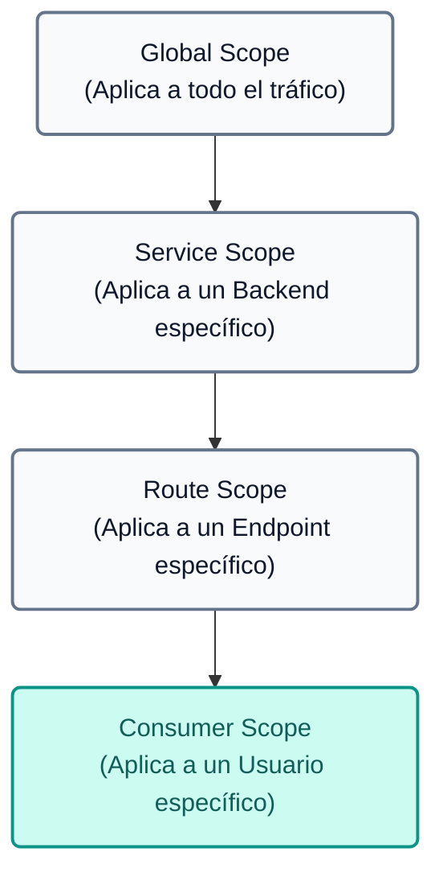

---

## Introducción Teórica: Plugins y Capacidades Avanzadas
Kong API Gateway basa su extrema flexibilidad en el uso de **Plugins**, los cuales interceptan las peticiones en el ciclo de vida del request/response para aplicar lógica de negocio, seguridad, observabilidad y transformación. Al utilizar Kong en modo declarativo (con `deck`), los plugins se acoplan a distintas entidades (Servicios, Rutas, Consumers) o de manera Global.

A continuación, se presenta un listado de los principales plugins oficiales disponibles en el ecosistema de Kong, clasificados por categoría (excluyendo aquellos de AI Gateway):

| Plugin | Categoría | Descripción |
|---|---|---|
| **Basic Authentication** | Autenticación | Añade autenticación básica HTTP (usuario y contraseña) a una API o servicio. |
| **HMAC Authentication** | Autenticación | Autenticación mediante firma HMAC para mayor seguridad en la transmisión. |
| **JWT** | Autenticación | Valida JSON Web Tokens (JWT) mediante firmas simétricas o asimétricas. |
| **Key Authentication** | Autenticación | Protege rutas o servicios requiriendo una clave estática en headers o querystring. |
| **LDAP Authentication** | Autenticación | Integra Kong con un servidor LDAP/Active Directory para validar credenciales. |
| **OAuth 2.0 Authentication** | Autenticación | Implementa flujos de autorización OAuth 2.0 (Authorization Code, Client Credentials). |
| **OpenID Connect (OIDC)** (Enterprise) | Autenticación | Delega la autenticación a Identity Providers externos (Okta, Auth0, Keycloak). |
| **SAML** (Enterprise) | Autenticación | Integración nativa con proveedores de identidad basados en SAML v2.0. |
| **ACME** | Seguridad | Automatiza la generación y renovación de certificados TLS usando Let's Encrypt. |
| **Bot Detection** | Seguridad | Bloquea o restringe el acceso de bots y crawlers analizando el User-Agent. |
| **CORS** | Seguridad | Habilita el intercambio de recursos de origen cruzado para aplicaciones frontend/SPAs. |
| **IP Restriction** | Seguridad | Define listas blancas o negras (allowlist/denylist) de direcciones IP o bloques CIDR. |
| **Upstream TLS** | Seguridad | Obliga a usar TLS al comunicarse desde Kong hacia los microservicios backend. |
| **Proxy Cache** | Control de Tráfico | Almacena respuestas HTTP exitosas en memoria para acelerar peticiones repetitivas. |
| **Proxy Cache Advanced** (Enterprise) | Control de Tráfico | Soporte de caché en Redis y esquemas de invalidación avanzados. |
| **Rate Limiting** | Control de Tráfico | Limita la cantidad de peticiones permitidas por IP o Consumer en un lapso de tiempo. |
| **Rate Limiting Advanced** (Enterprise) | Control de Tráfico | Límite de tráfico distribuido y sincronizado en clústeres mediante Redis. |
| **Request Size Limiting** | Control de Tráfico | Bloquea peticiones cuyo payload exceda un tamaño en bytes configurado. |
| **GraphQL Rate Limiting Advanced** (Enterprise) | Control de Tráfico | Aplica límites de velocidad analizando la complejidad de las consultas GraphQL. |
| **AWS Lambda** | Serverless | Invoca funciones AWS Lambda directamente y proxy de sus respuestas. |
| **Azure Functions** | Serverless | Invoca funciones Serverless de Microsoft Azure. |
| **Pre-function / Post-function** | Serverless | Ejecuta lógica Lua personalizada al inicio o al final del ciclo de vida del request. |
| **Datadog** | Analytics & Monitoring | Envía métricas detalladas a Datadog. |
| **Prometheus** | Analytics & Monitoring | Expone métricas operativas de Kong para ser scrapeadas por Prometheus. |
| **Zipkin / OpenTelemetry** | Analytics & Monitoring | Integra rastreo distribuido (tracing) para graficar tiempos de latencia. |
| **Correlation ID** | Transformaciones | Inyecta o reenvía un UUID único por request para correlacionar logs en microservicios. |
| **Exit Transformer** (Enterprise) | Transformaciones | Modifica y estandariza los mensajes de error generados por Kong. |
| **Request Transformer** | Transformaciones | Añade, reemplaza o elimina headers, query parameters o campos del body en el request. |
| **Response Transformer** | Transformaciones | Añade, reemplaza o elimina headers o campos del body en el response. |
| **Route Transformer Adv.** (Enterprise) | Transformaciones | Permite modificar la ruta de destino al vuelo evaluando variables. |
| **HTTP Log / TCP Log / UDP Log** | Logging | Envía logs de acceso a servidores remotos a través de HTTP, TCP o UDP. |
| **Kafka Log** | Logging | Envía logs transaccionales directamente a un tópico de Apache Kafka. |
| **File Log** | Logging | Escribe logs de las transacciones en un archivo físico del disco del servidor. |
| **Syslog / StatsD** | Logging | Integración con demonios Syslog locales y recolección de métricas StatsD. |

 **[Explorar todos los plugins en el Kong Plugin Hub](https://docs.konghq.com/hub/)**

---

## Secuencia de Demostraciones

Este módulo es la **continuación directa de los Módulos 000 y 001**. Reutiliza toda la infraestructura ya desplegada para aplicar las políticas teóricas descritas.

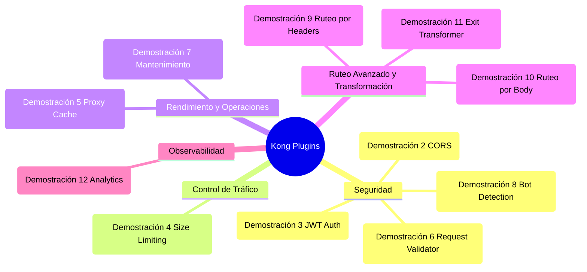

> **Importante:** Todos los plugins utilizados en este módulo vienen incluidos en Kong Gateway Enterprise (disponible a través de Konnect). No se requiere instalar ni configurar ningún componente externo adicional.

---

## Pre-requisitos

Este módulo requiere haber completado exitosamente los **Módulos 000** (Preparación del Entorno) y **001** (Seguridad y Control de Tráfico). Verifica que tengas:

1.  **Control Plane** creado en Konnect — Módulo 000.
2.  **Data Plane** conectado y en estado "In Sync" — Módulo 000.
3.  **Backend mock** (MockAPI) ejecutándose en `http://localhost:9081` — Módulo 000.
4.  **Variables de entorno** configuradas (`KONNECT_TOKEN`, `KONNECT_CONTROL_PLANE_NAME`, etc.).

---

## Demostración 1 Preparación: estado base del Módulo 002 (5 min)
**Objetivo:** limpiar la configuración del Control Plane External y sincronizar un estado base limpio con las políticas del Módulo 001 como punto de partida unificado.

1. Abre tu terminal y navega al directorio `módulo-002`:
    ```text
    cd workshop-assets/dia-1/02-kong-plugins
    ```

2. **Limpieza del Control Plane:** Antes de comenzar, eliminamos toda la configuración existente del Control Plane External para partir de un estado limpio. Esto es especialmente importante si experimentaste con plugins o configuraciones adicionales durante el Módulo 001.

    ```text
    deck gateway reset --konnect-token "$KONNECT_TOKEN" --konnect-control-plane-name "$KONNECT_CONTROL_PLANE_NAME" --force
    ```
    > **¿Qué hace `deck gateway reset`?** Elimina **todos** los servicios, rutas, plugins y consumers del Control Plane, dejándolo completamente vacío. El flag `--force` evita la confirmación interactiva.

3. Utilizaremos el archivo `archivos-deck/00-demo1-estado-base-002.yaml`. Este archivo contiene el estado final del Módulo 001 (servicios, consumers, plugins de seguridad y transformación) como punto de partida:
    ```yaml
    # Extracto conceptual (configuración omitida por brevedad):
    services:
     - name: mock
       url: http://httpbin-backend:9081/anything/mock
       plugins:
         - name: key-auth    # Autenticación
         - name: acl          # Autorización
       routes:
         - name: mock-route
           plugins:
             - name: response-transformer
    consumers:
     - username: App-External   # rate-limiting: 20/min
     - username: App-Internal   # rate-limiting: 3/min
    ```
4. Sincroniza el estado base al Control Plane External:
    
    ```text
    deck gateway sync archivos-deck/00-demo1-estado-base-002.yaml \
        --konnect-token \
        "$KONNECT_TOKEN" \
        --konnect-control-plane-name \
        "$KONNECT_CONTROL_PLANE_NAME"
    ```
6. **Validación:** Ejecuta una petición para confirmar que todo funciona. Nota que el archivo creó el consumer `App-External` con la llave `external-secret-123`:
    
    ```bash
    curl -k -i -H "apikey: external-secret-123" https://localhost:8443/mock
    
    ```
    **Usando curl (alternativa):**
    ```bash
    curl -k -i -H "apikey: external-secret-123" https://localhost:8443/mock
    
    ```
    **Resultado esperado:** `200 OK` con el header `x-kong: true`.

---

## Demostración 2 Interoperabilidad: CORS (5 min)
**Objetivo:** habilitar el acceso cross-origin para que aplicaciones frontend (SPAs) puedan consumir la API de vuelos.

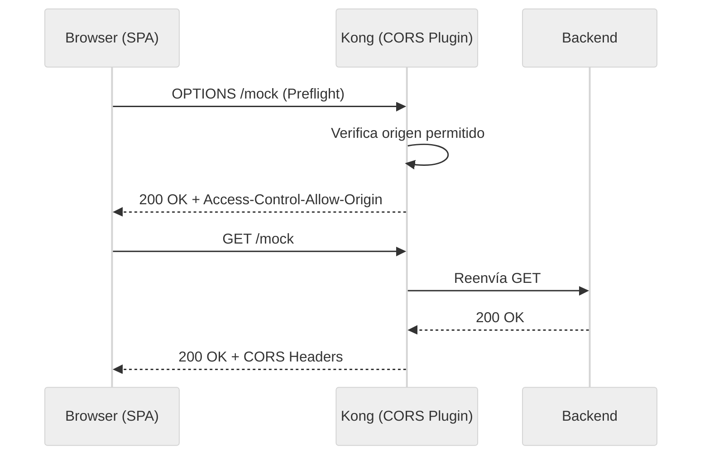

1. Utilizaremos el archivo `archivos-deck/01-demo2-cors.yaml`. Puedes inspeccionar cómo se agregó el plugin `cors` al servicio `mock`:
    ```yaml
    services:
     - name: mock
       plugins:
         - name: cors
           config:
             origins:
               - "https://mock.example.com"
               - "http://localhost:3000"
             methods:
               - GET
               - POST
               - OPTIONS
             headers:
               - Authorization
               - Content-Type
               - apikey
             max_age: 3600
             credentials: true
    ```
2. Sincroniza los cambios:
    
    ```text
    deck gateway sync archivos-deck/01-demo2-cors.yaml \
        --konnect-token \
        "$KONNECT_TOKEN" \
        --konnect-control-plane-name \
        "$KONNECT_CONTROL_PLANE_NAME"
    ```
3. Probar la petición preflight CORS:
    
    ```bash
    curl -k -i  https://localhost:8443/mock \
     Origin:"http://localhost:3000" \
     Access-Control-Request-Method:"GET" \
     Access-Control-Request-Headers:"apikey"
    ```
    **Usando curl (alternativa):**
    ```bash
    curl -k -i -X OPTIONS https://localhost:8443/mock \
     -H "Origin: http://localhost:3000" \
     -H "Access-Control-Request-Method: GET" \
     -H "Access-Control-Request-Headers: apikey"
    ```
    **Resultado esperado:** `200 OK` con headers:

    - `Access-Control-Allow-Origin: http://localhost:3000`
    - `Access-Control-Allow-Methods: GET, POST, OPTIONS`
    - `Access-Control-Allow-Credentials: true`

4. Probar con un origen NO permitido:
    
    ```bash
    curl -k -i  https://localhost:8443/mock \
     Origin:"https://malicious-site.com" \
     Access-Control-Request-Method:"GET"
    ```
    **Usando curl (alternativa):**
    ```bash
    curl -k -i -X OPTIONS https://localhost:8443/mock \
     -H "Origin: https://malicious-site.com" \
     -H "Access-Control-Request-Method: GET"
    ```
    **Resultado esperado:** Recibirás un `HTTP/1.1 200 OK` pero la respuesta **NO** incluirá el header `Access-Control-Allow-Origin`. 
    
    > **💡 ¿Por qué un 200 OK y no un error?** En el estándar CORS, el Gateway responde al `OPTIONS` preflight informando las reglas de acceso (en este caso, omitiendo el header de origen permitido). Es el **navegador web** quien interpreta esta omisión como un rechazo y se encarga de lanzar el error de seguridad y bloquear la petición `GET`/`POST` real.

---

## Demostración 3 Seguridad: autenticación con JWT (15 min)
**Objetivo:** implementar autenticación basada en JSON Web Tokens (JWT) como alternativa moderna a las API Keys, demostrando el contraste entre ambos mecanismos.

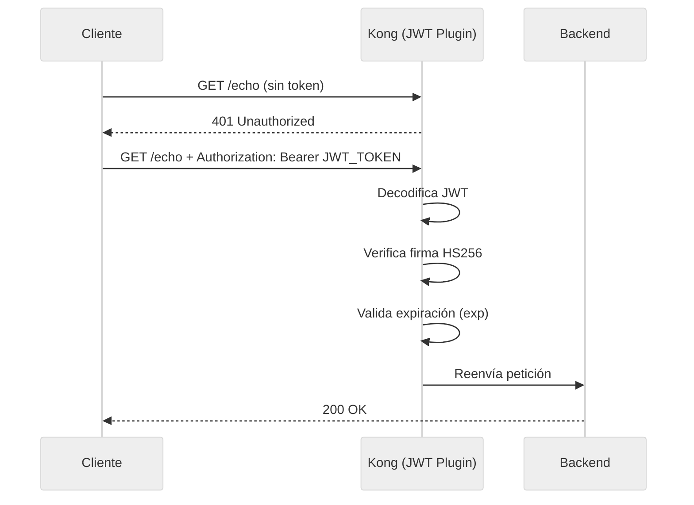

1. Utilizaremos el archivo `archivos-deck/02-demo3-jwt.yaml`. Puedes inspeccionar los cambios principales:
    ```yaml
    # Nuevo servicio de echo con autenticación JWT
    services:
     - name: echo-external
       url: http://httpbin-backend:9081/anything/echo
       plugins:
         - name: jwt
           config:
             claims_to_verify:
               - exp
       routes:
         - name: echo-get-route
           paths: [/echo]
           methods: [GET]
         - name: echo-post-route
           paths: [/echo]
           methods: [POST]

    # Nuevo consumer con credenciales JWT (HS256)
    consumers:
     - username: App-JWT
       jwt_secrets:
         - algorithm: HS256
           key: "mock-jwt-issuer"
           secret: "my-super-secret-key-for-workshop"
    ```
    > **Nota:** Usamos HS256 (clave simétrica) para simplificar la generación de tokens en el taller. En producción, se recomienda RS256 (clave asimétrica) para mayor seguridad.

2. Sincroniza los cambios:
    
    ```text
    deck gateway sync archivos-deck/02-demo3-jwt.yaml \
        --konnect-token \
        "$KONNECT_TOKEN" \
        --konnect-control-plane-name \
        "$KONNECT_CONTROL_PLANE_NAME"
    ```
3. **Generar un token JWT** usando el script provisto:

    ```text
    export JWT_TOKEN=$(./scripts/generate_jwt.sh | grep -A1 "Token:" | tail -1)
    echo $JWT_TOKEN
    ```
    
    > **💡 ¿De dónde sale este token?** En este ejercicio **no** estamos pidiendo el token a ningún proveedor de identidad externo (como Okta o Keycloak). El script `generate_jwt.sh` fabrica el token localmente (offline) usando herramientas básicas como `openssl`. 
    > Simplemente arma un Payload y lo firma usando el secreto `my-super-secret-key-for-workshop` con el algoritmo simétrico HS256. Como Kong tiene configurada esa misma clave exacta en el archivo decK, es capaz de verificar la firma y autorizar la petición. Veremos una integración "real" con un Servidor de Identidad en el Módulo 07 (mTLS + OIDC).
    > *(Opcional)* Si estás usando la consola clásica de Windows (CMD) donde `export` no funciona, deberás copiar el token generado y configurarlo manualmente con `set JWT_TOKEN=<pegar_token_aqui>`. Para Mac, Linux o GitBash, el comando anterior ya lo hizo por ti.

4. Probar sin token y con token:

    Sin token:
    ```bash
    curl -k -i  https://localhost:8443/echo
    ```
    **Usando curl (alternativa):**
    ```bash
    curl -k -i  https://localhost:8443/echo
    ```
    **Resultado esperado:** `HTTP/1.1 401 Unauthorized`

    Con token válido:
    ```bash
    curl -k -i -H "Authorization: Bearer" https://localhost:8443/echo $JWT_TOKEN"
    ```
    **Usando curl (alternativa):**
    ```bash
    curl -k -i -H "Authorization: Bearer $JWT_TOKEN" https://localhost:8443/echo
    ```
    **Resultado esperado:** `HTTP/1.1 200 OK`

5. **Contraste pedagógico:** Observa que ahora tenemos dos mecanismos de autenticación coexistiendo en el mismo gateway:

    - `mock` → protegido con **Key Auth** (API Key estática en header `apikey`)
    - `echo` → protegido con **JWT** (token firmado con expiración en header `Authorization`)
    
    > **💡 Tip de Observabilidad:** Si ingresas a la consola web de **Konnect > Analytics > API Requests**, podrás ver cómo Kong registra estos accesos. Al usar autenticación (ya sea JWT o Key Auth), Kong identifica al "Consumer". En las gráficas podrás agrupar y filtrar el tráfico para ver exactamente cuántas peticiones hizo `App-JWT` frente a `App-External`.

---

## Demostración 4 Protección: límite de tamaño de request (5 min)
**Objetivo:** proteger el backend contra peticiones con payloads excesivamente grandes (prevención de DoS por payload).

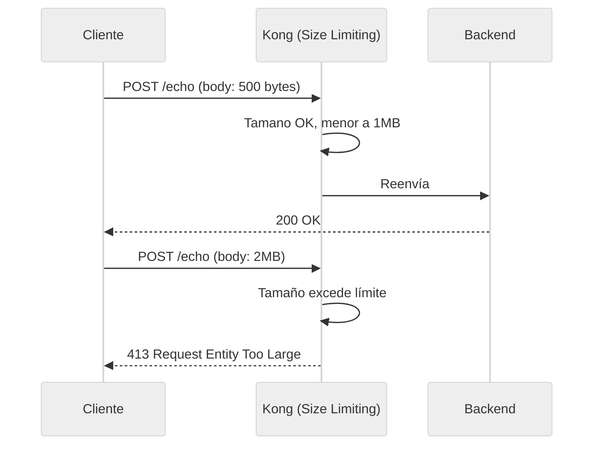

1. Utilizaremos el archivo `archivos-deck/03-demo4-request-size-limiting.yaml`. Puedes inspeccionar cómo se agregó el plugin:
    ```yaml
    services:
     - name: echo-external
       plugins:
         - name: request-size-limiting
           config:
             allowed_payload_size: 1
             size_unit: megabytes
             require_content_length: false
    ```

2. Sincroniza los cambios:
    
    ```text
    deck gateway sync archivos-deck/03-demo4-request-size-limiting.yaml \
        --konnect-token \
        "$KONNECT_TOKEN" \
        --konnect-control-plane-name \
        "$KONNECT_CONTROL_PLANE_NAME"
    ```
3. Probar con un payload dentro del límite y otro excesivo:

    Payload pequeño → 200 OK:

    ```bash
    curl -k -i -X POST https://localhost:8443/echo -H "Authorization: Bearer $JWT_TOKEN" -H "Content-Type: application/json" -d '{"test": "pequeno"}'
    ```

    Payload excesivo (2MB) → 413:

    1. Generar archivo temporal con el payload:
    ```bash
    python3 -c "print('{\"data\":\"' + 'X'*2000000 + '\"}')" > payload.json
    ```
    2. Ejecutar petición leyendo el archivo (nota el @):
    
    ```bash
    curl -k -i  https://localhost:8443/echo \
        Authorization:"Bearer $JWT_TOKEN" \
        @payload.json
    ```
    **Usando curl (alternativa):**
    ```bash
    curl -k -i \
        -X POST \
        -H "Authorization: Bearer $JWT_TOKEN" \
        -H "Content-Type: application/json" \
        -d "@payload.json" \
        https://localhost:8443/echo
    ```
    *(Para generar el payload grande en Windows, usa PowerShell para crear el archivo y luego curl):*
    ```text
    powershell -Command "$body = '{\"data\":\"' + ('X' * 2000000) + '\"}'; Set-Content -Path payload.json -Value $body; curl.exe -i -X POST http://localhost:8000/echo -H 'Authorization: Bearer %JWT_TOKEN%' -H 'Content-Type: application/json' -d '@payload.json'"
    ```
    **Resultado esperado:** `200 OK` para el payload pequeño y `413 Request Entity Too Large` para el excesivo.

---

## Demostración 5 Performance: caché en el Gateway (10 min)
**Objetivo:** reducir la latencia y la carga sobre el backend implementando caché a nivel del API Gateway, sin modificar el backend.

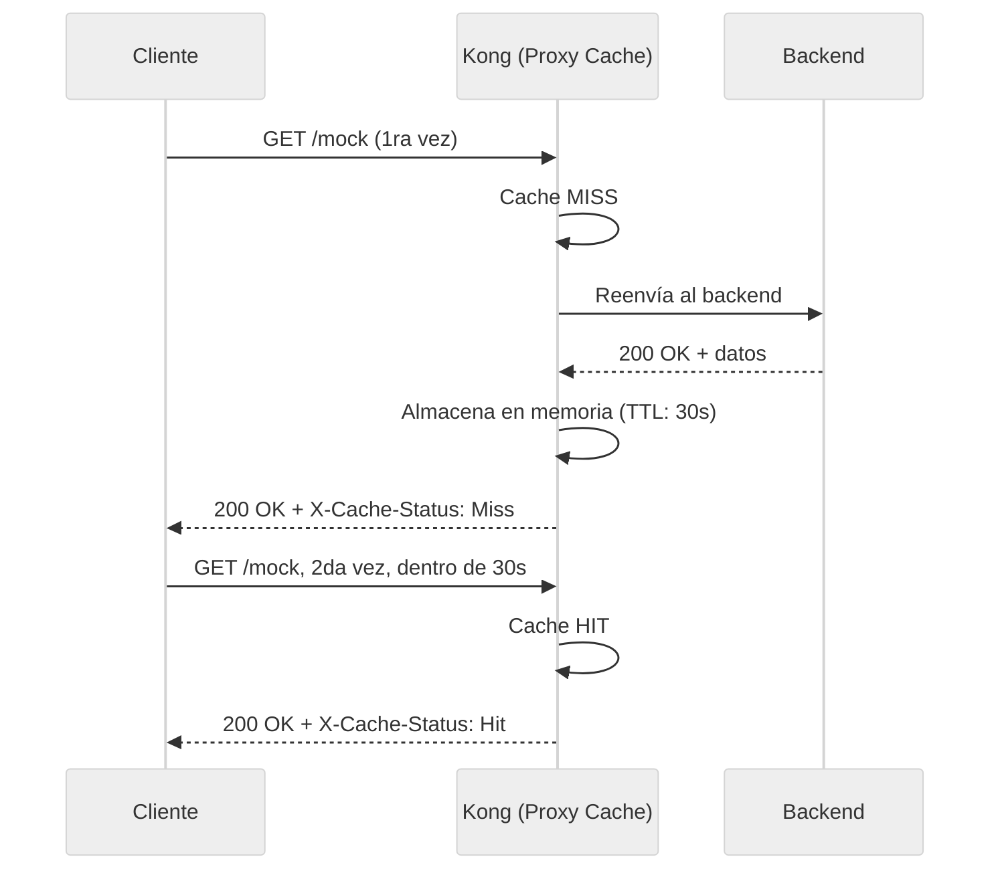

1. Utilizaremos el archivo `archivos-deck/04-demo5-proxy-cache.yaml`. Puedes inspeccionar cómo se agregó el plugin `proxy-cache` a la ruta de mock:
    ```yaml
    routes:
     - name: mock-route
       plugins:
         - name: proxy-cache
           config:
             strategy: memory
             content_type:
               - "application/json"
               - "text/plain; charset=utf-8"
             cache_ttl: 30
             cache_control: false
             response_code:
               - 200
             request_method:
               - GET
    ```

2. Sincroniza los cambios:
    
    ```text
    deck gateway sync archivos-deck/04-demo5-proxy-cache.yaml \
        --konnect-token \
        "$KONNECT_TOKEN" \
        --konnect-control-plane-name \
        "$KONNECT_CONTROL_PLANE_NAME"
    ```
3. Realizar dos peticiones consecutivas y observar los headers de caché:

    Primera petición → MISS:
    ```bash
    curl -k -i -H "apikey: external-secret-123" https://localhost:8443/mock
    
    ```
    **Usando curl (alternativa):**
    ```bash
    curl -k -i -H "apikey: external-secret-123" https://localhost:8443/mock
    ```
    **Resultado esperado:** `HTTP/1.1 200 OK` con el header `X-Cache-Status: Miss` (el gateway fue al backend).

    Segunda petición (dentro de 30s) → HIT:
    ```bash
    curl -k -i -H "apikey: external-secret-123" https://localhost:8443/mock
    ```
    **Usando curl (alternativa):**
    ```bash
    curl -k -i -H "apikey: external-secret-123" https://localhost:8443/mock
    ```
    **Resultado esperado:** `HTTP/1.1 200 OK` con el header `X-Cache-Status: Hit` (el gateway sirvió la respuesta desde la memoria caché, omitiendo al backend).

4. **Observación:** Revisa el file-log para comparar la latencia de una petición `Miss` vs una `Hit`. Observando los tiempos reportados, verás que en un `Hit` el valor disminuye drásticamente porque la petición es cacheada en el gateway sin llegar al backend.

5. Espera 30 segundos y repite la petición. Verás que vuelve a ser `Miss` porque el TTL expiró.

---

## Demostración 6 Gobernanza: validación de schema JSON (15 min)
**Objetivo:** garantizar que las peticiones POST al servicio de echo cumplan con un contrato de datos (schema JSON) antes de llegar al backend.

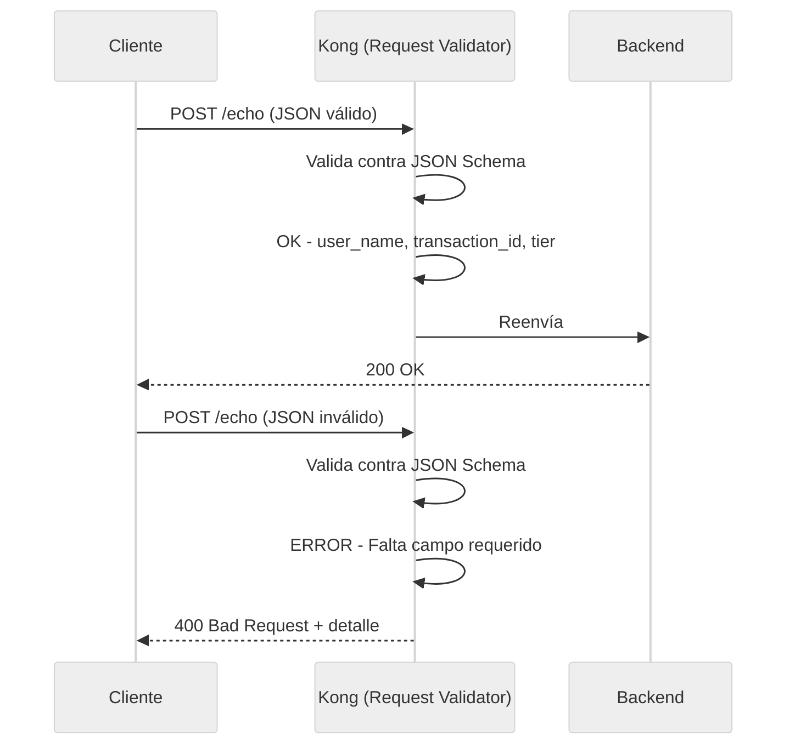

1. Utilizaremos el archivo `archivos-deck/05-demo6-request-validator.yaml`. Puedes inspeccionar el schema de validación configurado en la ruta POST de echo:
    ```yaml
    routes:
     - name: echo-post-route
       paths: [/echo]
       methods: [POST]
       plugins:
         - name: request-validator
           config:
             body_schema: '[{
               "user_name": {"type":"string","required":true},
               "transaction_id":      {"type":"string","required":true},
               "tier":   {"type":"string","required":true,
                                  "one_of":["standard","premium","vip"]},
               "preference":{"type":"string",
                                  "one_of":["window","aisle","middle"]}
             }]'
             verbose_response: true
             allowed_content_types: ["application/json"]
    ```

2. Sincroniza los cambios:
    
    ```text
    deck gateway sync archivos-deck/05-demo6-request-validator.yaml \
        --konnect-token \
        "$KONNECT_TOKEN" \
        --konnect-control-plane-name \
        "$KONNECT_CONTROL_PLANE_NAME"
    ```
3. Probar con un JSON válido:

    ```bash
    curl -k -i  https://localhost:8443/echo \
        Authorization:"Bearer $JWT_TOKEN" \
        user_name="Juan Pérez" \
        transaction_id="TX-101" \
        tier="premium" \
        preference="window"
    ```
    **Usando curl (alternativa):**
    ```bash
    curl -k -i \
        -X POST \
        -H "Authorization: Bearer $JWT_TOKEN" \
        -H "Content-Type: application/json" \
        -d '{"user_name":"Juan Pérez","transaction_id":"TX-101","tier":"premium","preference":"window"}' \
        https://localhost:8443/echo
    ```
    **Resultado esperado:** `200 OK`.

4. Probar con un JSON que tiene un campo requerido faltante:

    ```bash
    curl -k -i  https://localhost:8443/echo \
        Authorization:"Bearer $JWT_TOKEN" \
        user_name="Juan Pérez"
    ```
    **Usando curl (alternativa):**
    ```bash
    curl -k -i \
        -X POST \
        -H "Authorization: Bearer $JWT_TOKEN" \
        -H "Content-Type: application/json" \
        -d '{"user_name":"Juan Pérez"}' \
        https://localhost:8443/echo
    ```
    **Resultado esperado:** `400 Bad Request` con detalle indicando qué campos faltan.

5. Probar con un valor no permitido en el enum:

    ```bash
    curl -k -i  https://localhost:8443/echo \
        Authorization:"Bearer $JWT_TOKEN" \
        user_name="Ana López" \
        transaction_id="KA-202" \
        tier="ultra-mega"
    ```
    **Usando curl (alternativa):**
    ```bash
    curl -k -i \
        -X POST \
        -H "Authorization: Bearer $JWT_TOKEN" \
        -H "Content-Type: application/json" \
        -d '{"user_name":"Ana López","transaction_id":"KA-202","tier":"ultra-mega"}' \
        https://localhost:8443/echo
    ```
    **Resultado esperado:** `400 Bad Request` indicando que `ultra-mega` no es un valor válido para `tier`.

---

## Demostración 7 Operaciones: modo mantenimiento (5 min)
**Objetivo:** poner una API en modo mantenimiento desde el gateway sin tocar ni reiniciar el backend, demostrando el poder de la configuración declarativa.

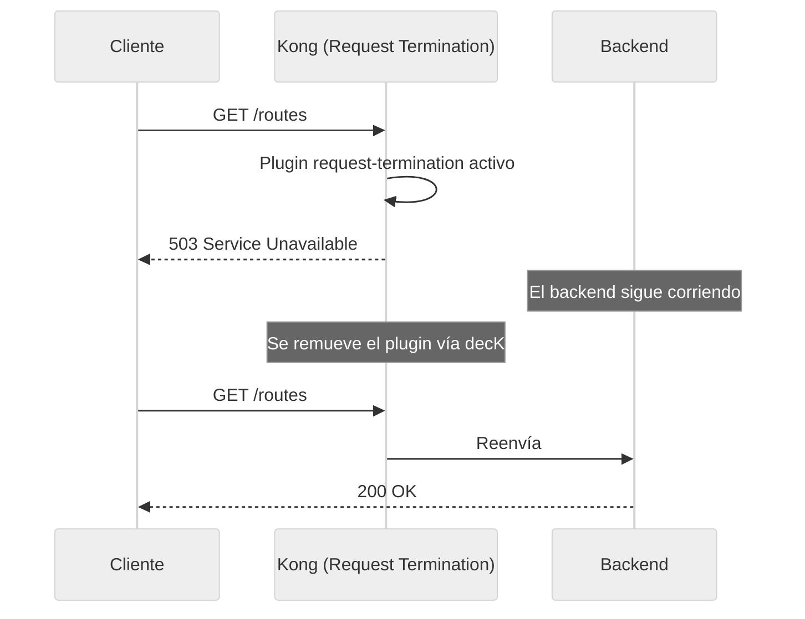

1. Utilizaremos el archivo `archivos-deck/06-demo7-request-termination.yaml`. Puedes inspeccionar cómo se agregó el plugin a la ruta `/routes`:
    ```yaml
    - name: routes
     routes:
       - name: routes-route
         paths: [/routes]
         plugins:
           - name: request-termination
             config:
               status_code: 503
               message: "El servicio de rutas esta en mantenimiento
                         programado. Vuelva a intentar en 30 minutos."
    ```

2. Sincroniza los cambios:
    
    ```text
    deck gateway sync archivos-deck/06-demo7-request-termination.yaml \
        --konnect-token \
        "$KONNECT_TOKEN" \
        --konnect-control-plane-name \
        "$KONNECT_CONTROL_PLANE_NAME"
    ```
3. Probar la API en mantenimiento:

    ```bash
    curl -k -i  https://localhost:8443/routes
    
    ```
    **Usando curl (alternativa):**
    ```bash
    curl -k -i  https://localhost:8443/routes
    
    ```
    **Resultado esperado:** `503 Service Unavailable` con el mensaje de mantenimiento.

4. Mientras tanto, las demás APIs siguen funcionando normalmente:

    ```bash
    curl -k -i -H "apikey: external-secret-123" https://localhost:8443/mock
    
    ```
    **Usando curl (alternativa):**
    ```bash
    curl -k -i -H "apikey: external-secret-123" https://localhost:8443/mock
    
    ```
    **Resultado esperado:** `200 OK`. El servicio de mock no se ve afectado.

> **Nota:** En el siguiente paso (Demostración 8), al sincronizar un archivo que NO incluye el plugin `request-termination`, este se removerá automáticamente y el servicio de rutas volverá a funcionar. Así es el poder de la gestión declarativa: el estado deseado siempre es el que define el archivo.

---

## Demostración 8 Seguridad: detección de bots (5 min)
**Objetivo:** bloquear automáticamente el tráfico de bots conocidos (crawlers) a nivel global del gateway.

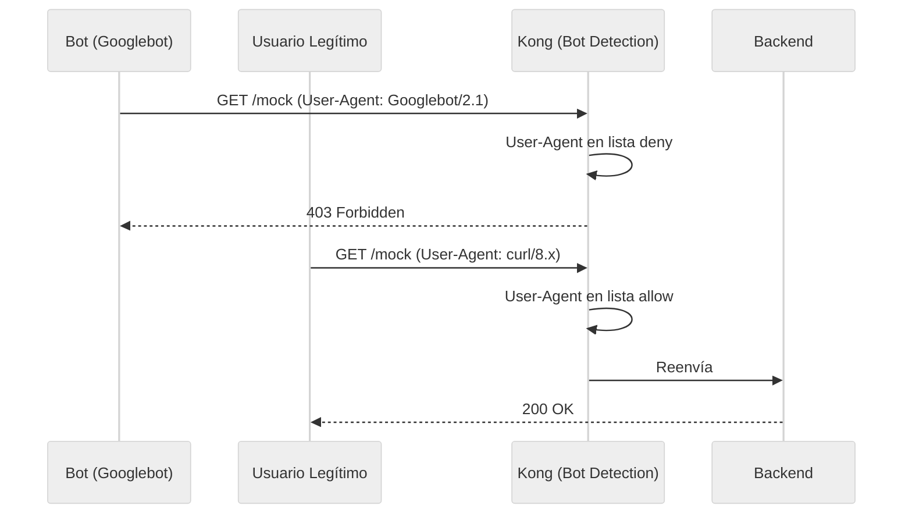

1. Utilizaremos el archivo `archivos-deck/07-demo8-bot-detection.yaml`. Este archivo:

    - **Agrega** el plugin `bot-detection` a nivel global
    - **Remueve** el `request-termination` del paso anterior (el servicio `/routes` vuelve a funcionar)
    ```yaml
    plugins:
     - name: bot-detection
       config:
         deny:
           - "Googlebot"
           - "Bingbot"
           - "Baiduspider"
         allow:
           - "curl"
           - "insomnia"
           - "postman"
    ```

2. Sincroniza los cambios:
    
    ```text
    deck gateway sync archivos-deck/07-demo8-bot-detection.yaml \
        --konnect-token \
        "$KONNECT_TOKEN" \
        --konnect-control-plane-name \
        "$KONNECT_CONTROL_PLANE_NAME"
    ```
3. Probar con un User-Agent de bot vs uno legítimo:

    Simular Googlebot:
    ```bash
    curl -k -i -H "User-Agent: Googlebot/2.1" https://localhost:8443/routes
    ```
    **Usando curl (alternativa):**
    ```bash
    curl -k -i -H "User-Agent: Googlebot/2.1" https://localhost:8443/routes
    ```
    **Resultado esperado:** `HTTP/1.1 403 Forbidden`

    Petición normal (sin user-agent malicioso):
    ```bash
    curl -k -i  https://localhost:8443/routes
    ```
    **Usando curl (alternativa):**
    ```bash
    curl -k -i  https://localhost:8443/routes
    ```
    **Resultado esperado:** `HTTP/1.1 200 OK`

4. Verificar que `/routes` fue restaurado (el `request-termination` fue removido):

    ```text
    curl -s -o /dev/null -w "%{http_code}" http://localhost:8000/routes
    ```
    **Resultado esperado:** `200` (ya no `503`).

---

## Demostración 9 Ruteo inteligente: por valores de Headers (15 min)
**Objetivo:** demostrar cómo Kong puede dirigir el tráfico a distintos backends basándose en el valor de un header HTTP, implementando una estrategia de **ruteo regional**.

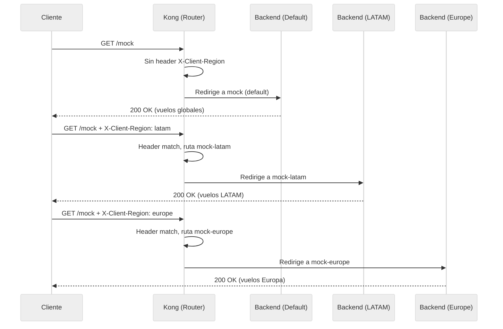

> **Caso de negocio:** MockAPI opera en múltiples regiones. Los clientes envían el header `X-Client-Region` para obtener vuelos de su región específica. Kong dirige cada petición al backend regional correspondiente sin necesidad de lógica adicional en el código.

1. Utilizaremos el archivo `archivos-deck/08-demo9-ruteo-por-header.yaml`. Puedes inspeccionar cómo se agregaron dos nuevos servicios con rutas que filtran por header:
    ```yaml
    # Servicio para LATAM (solo se activa con X-Client-Region: latam)
    - name: mock-latam
      url: http://httpbin-backend:9081/anything/mock-latam
      routes:
        - name: mock-latam-route
          paths: [/mock]
          methods: [GET]
          headers:
            x-client-region:
              - latam

    # Servicio para EUROPE (solo se activa con X-Client-Region: europe)
    - name: mock-europe
      url: http://httpbin-backend:9081/anything/mock-europe
      routes:
        - name: mock-europe-route
          paths: [/mock]
          methods: [GET]
          headers:
            x-client-region:
              - europe

    # Servicio DEFAULT (sin restricción de header = catch-all)
    - name: mock
      url: http://httpbin-backend:9081/anything/mock
      routes:
        - name: mock-route
          paths: [/mock]
          methods: [GET]
    # Sin campo 'headers' → captura todo lo demás
    ```

    > **¿Cómo funciona?** Kong evalúa las rutas de más específica a menos específica. Las rutas con restricción de `headers` son más específicas que las que no tienen. Por lo tanto, si el request incluye `X-Client-Region: latam`, matcheará `mock-latam-route` primero. Si no trae ese header, caerá al `mock-route` default.

2. Sincroniza los cambios:
    
    ```text
    deck gateway sync archivos-deck/08-demo9-ruteo-por-header.yaml \
        --konnect-token \
        "$KONNECT_TOKEN" \
        --konnect-control-plane-name \
        "$KONNECT_CONTROL_PLANE_NAME"
    ```
3. Probar el ruteo regional:

    Ruteo a LATAM:
    ```bash
    curl -k -i  https://localhost:8443/mock \
        X-Client-Region:"latam" \
        apikey:"external-secret-123"
    ```
    **Usando curl (alternativa):**
    ```bash
    curl -k -i \
        -H "X-Client-Region: latam" \
        -H "apikey: external-secret-123" \
        https://localhost:8443/mock
    ```
    **Resultado esperado:** `HTTP/1.1 200 OK` y en el JSON de respuesta, el campo `url` mostrará `"http://httpbin-backend:9081/anything/mock-latam"`.

    Ruteo a EUROPE:
    ```bash
    curl -k -i  https://localhost:8443/mock \
        X-Client-Region:"europe" \
        apikey:"external-secret-123"
    ```
    **Usando curl (alternativa):**
    ```bash
    curl -k -i \
        -H "X-Client-Region: europe" \
        -H "apikey: external-secret-123" \
        https://localhost:8443/mock
    ```
    **Resultado esperado:** `HTTP/1.1 200 OK` y en el JSON de respuesta, el campo `url` mostrará `"http://httpbin-backend:9081/anything/mock-europe"`.

    Ruteo DEFAULT (sin header regional):
    ```bash
    curl -k -i -H "apikey: external-secret-123" https://localhost:8443/mock
    ```
    **Usando curl (alternativa):**
    ```bash
    curl -k -i -H "apikey: external-secret-123" https://localhost:8443/mock
    ```
    **Resultado esperado:** `HTTP/1.1 200 OK` y en el JSON de respuesta, el campo `url` mostrará `"http://httpbin-backend:9081/anything/mock"` (Cayó en el default al no tener header).

4. **Observación:** Revisando **Konnect Analytics > API Requests**, agrupando la vista por **Service**, podrás observar que el tráfico se distribuye en barras distintas para `mock`, `mock-latam` y `mock-europe`, confirmando que Kong ruteó dinámicamente al backend correcto.

---

## Demostración 10 Ruteo inteligente: por contenido del Body (20 min)
**Objetivo:** demostrar cómo Kong puede inspeccionar el contenido del body JSON de una petición y redirigir dinámicamente a distintos backends según los valores encontrados, usando el plugin `pre-function`.

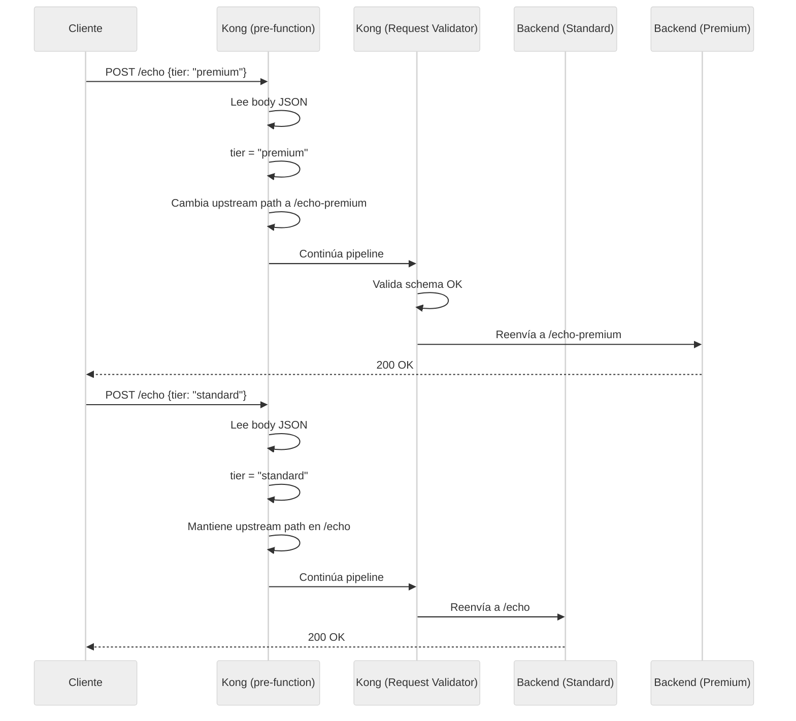

> **Caso de negocio:** Cuando un pasajero crea una reserva, el campo `tier` del JSON determina si se procesa por el flujo estándar o el flujo premium (que podría tener su propio backend con lógica diferenciada de facturación, asientos, etc.).

1. Utilizaremos el archivo `archivos-deck/09-demo10-ruteo-por-body.yaml`. Puedes inspeccionar el plugin `pre-function` agregado a la ruta POST de echo:
    ```yaml
    routes:
     - name: echo-post-route
       paths: [/echo]
       methods: [POST]
       plugins:
         - name: pre-function
           config:
             access:
               - |
                 -- Ruteo dinámico por contenido del body
                 local cjson = require("cjson.safe")
                 local body = kong.request.get_raw_body()
                 if not body then return end

                 local json = cjson.decode(body)
                 if not json or not json.tier then return end

                 if json.tier == "premium"
                    or json.tier == "vip" then
                   -- Redirige al backend premium
                   kong.service.request.set_path(
                     "/anything/echo-premium")
                   kong.service.request.set_header(
                     "X-Routed-By", "body-content")
                   kong.service.request.set_header(
                     "X-Tier", "premium")
                 else
                   kong.service.request.set_header(
                     "X-Routed-By", "body-content")
                   kong.service.request.set_header(
                     "X-Tier", "standard")
                 end
    ```

    > **¿Cómo funciona?** El plugin `pre-function` ejecuta código Lua en la fase `access` (antes de que la petición llegue al upstream). Lee el body JSON, extrae el campo `tier`, y si es `premium` o `vip`, cambia dinámicamente el path del upstream usando `kong.service.request.set_path()`. Esto redirige la petición a `/anything/echo-premium` sin que el cliente lo sepa. Además, inyecta headers de diagnóstico (`X-Routed-By`, `X-Tier`) que el backend recibe.

2. Sincroniza los cambios:
    
    ```text
    deck gateway sync archivos-deck/09-demo10-ruteo-por-body.yaml \
        --konnect-token \
        "$KONNECT_TOKEN" \
        --konnect-control-plane-name \
        "$KONNECT_CONTROL_PLANE_NAME"
    ```
3. Probar reserva **PREMIUM** → backend premium:

    ```bash
    curl -k -i  https://localhost:8443/echo \
        Authorization:"Bearer $JWT_TOKEN" \
        user_name="Juan Pérez" \
        transaction_id="TX-101" \
        tier="premium" \
        preference="window"
    ```
    **Usando curl (alternativa):**
    ```bash
    curl -k -i \
        -X POST \
        -H "Authorization: Bearer $JWT_TOKEN" \
        -H "Content-Type: application/json" \
        -d '{"user_name":"Juan Pérez","transaction_id":"TX-101","tier":"premium","preference":"window"}' \
        https://localhost:8443/echo
    ```
    **Resultado esperado:** En el JSON de respuesta del backend echo:

    - `"url": "http://httpbin-backend:9081/anything/echo-premium"` ← ¡Fue al backend premium!
    - El header `X-Tier: premium` aparecerá en los headers recibidos por el backend.

4. Probar reserva **STANDARD** → backend estándar:

    ```bash
    curl -k -i  https://localhost:8443/echo \
        Authorization:"Bearer $JWT_TOKEN" \
        user_name="María López" \
        transaction_id="KA-202" \
        tier="standard"
    ```
    **Usando curl (alternativa):**
    ```bash
    curl -k -i \
        -X POST \
        -H "Authorization: Bearer $JWT_TOKEN" \
        -H "Content-Type: application/json" \
        -d '{"user_name":"María López","transaction_id":"KA-202","tier":"standard"}' \
        https://localhost:8443/echo
    ```
    **Resultado esperado:**

    - `"url": "http://httpbin-backend:9081/anything/echo"` ← Se mantuvo en el backend estándar.
    - El header `X-Tier: standard` aparecerá en los headers recibidos.

5. Probar reserva **VIP** → también va al backend premium:

    ```bash
    curl -k -i  https://localhost:8443/echo \
        Authorization:"Bearer $JWT_TOKEN" \
        user_name="Carlos Ruiz" \
        transaction_id="KA-303" \
        tier="vip" \
        preference="aisle"
    ```
    **Usando curl (alternativa):**
    ```bash
    curl -k -i \
        -X POST \
        -H "Authorization: Bearer $JWT_TOKEN" \
        -H "Content-Type: application/json" \
        -d '{"user_name":"Carlos Ruiz","transaction_id":"KA-303","tier":"vip","preference":"aisle"}' \
        https://localhost:8443/echo
    ```
    **Resultado esperado:** `"url": "http://httpbin-backend:9081/anything/echo-premium"` ← VIP también se rutea al backend premium.

6. **Resumen de los dos tipos de ruteo:**

    | Método | Criterio de Ruteo | Mecanismo Kong | Ventaja |
    |--------|-------------------|----------------|---------|
    | **Header** (Demostración 9) | Valor del header `X-Client-Region` | Nativo: campo `headers` en la Route | Declarativo, sin código |
    | **Body** (Demostración 10) | Valor del campo `tier` en el JSON | Plugin `pre-function` (Lua) | Flexible, lógica personalizable |

---

## Demostración 11 Personalización: errores corporativos estandarizados (10 min)
**Objetivo:** estandarizar todas las respuestas de error generadas por Kong en un formato JSON corporativo consistente.

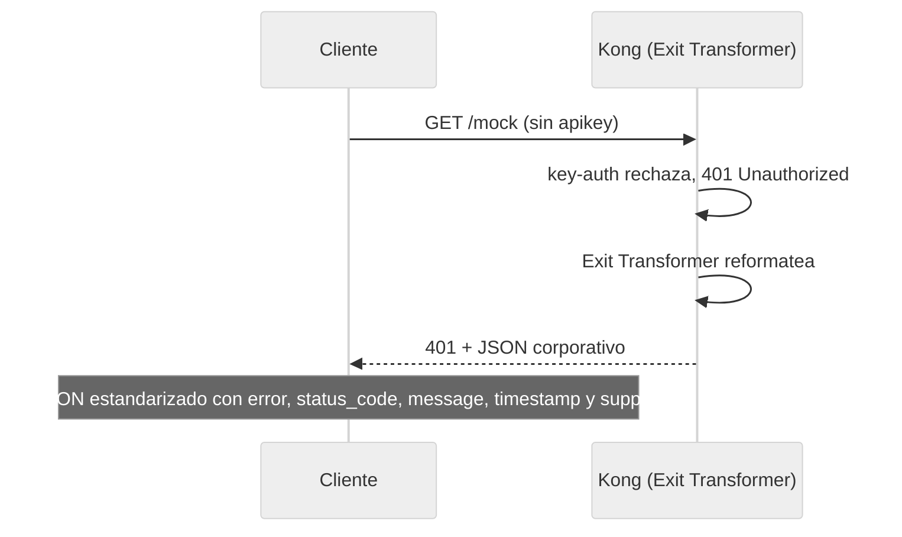

1. Utilizaremos el archivo `archivos-deck/10-demo11-exit-transformer.yaml`. Puedes inspeccionar el plugin `exit-transformer` agregado a nivel global:
    ```yaml
    plugins:
     - name: exit-transformer
       config:
         functions:
           - |
             return function(status, body, headers)
               if status >= 400 then
                 local new_body = {
                   error = true,
                   status_code = status,
                   message = body.message or body.msg
                             or "Error desconocido",
                   service = "MockAPI API Gateway",
                   timestamp = os.date("!%Y-%m-%dT%H:%M:%SZ"),
                   support = "soporte@mock.com"
                 }
                 return status, new_body, headers
               end
               return status, body, headers
             end
    ```

2. Sincroniza los cambios:
    
    ```text
    deck gateway sync archivos-deck/10-demo11-exit-transformer.yaml \
        --konnect-token \
        "$KONNECT_TOKEN" \
        --konnect-control-plane-name \
        "$KONNECT_CONTROL_PLANE_NAME"
    ```
3. Probar diferentes errores y verificar el formato estandarizado:

    **Error 401 (sin autenticación):**
    
    ```bash
    curl -k -i  https://localhost:8443/mock
    ```
    Usando curl (alternativa):
    ```bash
    curl -k -i https://localhost:8443/mock
    ```

    **Error 403 (consumer sin permisos ACL):**
    
    ```bash
    curl -k -i -H "apikey: internal-secret-123" https://localhost:8443/mock
    ```
    Usando curl (alternativa):
    ```bash
    curl -k -i -H "apikey: internal-secret-123" https://localhost:8443/mock
    ```

    **Error 403 (bot detectado):**
    
    ```bash
    curl -k -i -H "User-Agent: Googlebot/2.1" https://localhost:8443/routes
    ```
    Usando curl (alternativa):
    ```bash
    curl -k -i -H "User-Agent: Googlebot/2.1" https://localhost:8443/routes
    ```

    **Resultado esperado:** Todos los errores ejecutados anteriormente (401, 403, 403) ahora devolverán un JSON corporativo estandarizado con esta estructura, en lugar del mensaje plano de Kong:
    
    ```json
    {
     "error": true,
     "status_code": 401,
     "message": "No credentials found for given 'iss'",
     "service": "MockAPI API Gateway",
     "timestamp": "2026-05-29T05:30:00Z",
     "support": "soporte@mock.com"
    }
    ```
    *(El `status_code` y `message` varían según el error, pero los campos son idénticos).*

4. Las respuestas exitosas (`200 OK`) NO son afectadas por el exit-transformer:

    ```bash
    curl -k -i -H "apikey: external-secret-123" https://localhost:8443/mock
    ```
    **Usando curl (alternativa):**
    ```bash
    curl -k -i -H "apikey: external-secret-123" https://localhost:8443/mock
    ```
    **Resultado esperado:** El JSON de respuesta del backend se devuelve sin modificaciones.

---

## Demostración 12: Observabilidad y revisión consolidada en Konnect Analytics (10 min)
**Objetivo:** Visualizar y analizar de forma centralizada todo el tráfico generado y bloqueado durante las demostraciones de este módulo, utilizando las herramientas de observabilidad integradas en Kong Konnect.

A lo largo de este laboratorio, hemos inyectado peticiones válidas e inválidas, activado bloqueos de seguridad y forzado ruteos dinámicos. Kong captura la telemetría de todos estos eventos y la envía al plano de control en la nube.

### Paso a paso en Konnect Analytics Explorer

1. **Acceder al Dashboard de Analytics:**
    - Abre tu navegador y asegúrate de tener sesión iniciada en la consola de **Kong Konnect**.
    - En el menú lateral izquierdo, ve a la sección **Analytics** y haz clic en **Explorer**.

2. **Configurar el rango de tiempo y filtros:**
    - En la esquina superior derecha, ajusta el selector temporal a **Última hora (Last 60 minutes)** o al rango en el que hayas ejecutado el laboratorio.
    - En la barra de filtros principal (botón `+ Add Filter`), selecciona `Control Plane` y elige el nombre de tu entorno (el que hayas asignado a la variable `$KONNECT_CONTROL_PLANE_NAME`).

3. **Analizar la distribución de Códigos de Estado (Status Codes):**
    - En la sección de la gráfica, busca el selector de agrupación ("Group by" o "Dimension") y cámbialo a **Status Code**.
    - Podrás observar visualmente todos los escenarios que provocamos. Haz clic en los distintos colores de las barras para aislar el tráfico. Deberías identificar claramente:

    | Status Code | Originado por (Contexto del Módulo) |
    |-------------|-------------------------------------|
    | `200` | **Tráfico exitoso**: Peticiones válidas a mock, echo, y ruteo regional. |
    | `400` | **Request Validator**: Intentos fallidos de POST a `/echo` por falta de campos obligatorios en el JSON (Demo 6). |
    | `401` | **Key Auth / JWT**: Peticiones rechazadas por carecer de API Key o enviar un Token JWT ausente/caducado (Demos 1 y 3). |
    | `403` | **ACL / Bot Detection**: Consumidores intentando acceder a rutas no permitidas (Demo 1) o User-Agents bloqueados como `Googlebot` (Demo 8). |
    | `413` | **Request Size Limiting**: Intentos de enviar payloads superiores a 1MB (Demo 4). |
    | `503` | **Request Termination**: Peticiones a `/routes` durante la simulación de mantenimiento programado (Demo 7). |

4. **Agrupar por Servicio (Service) y Ruta (Route):**
    - Cambia la dimensión principal ("Group by") de `Status Code` a **Service**.
    - Observa cómo se distribuyó el volumen de peticiones. Deberías notar la presencia de los servicios regulares (`mock`, `echo-external`) junto a los servicios regionales que se invocaron dinámicamente (`mock-latam` y `mock-europe`) configurados en la Demo 9.
    - Cambia la dimensión a **Route** para observar la carga granular que recibió cada ruta en particular.

5. **Analizar la actividad de Consumidores (Consumers):**
    - Cambia la dimensión a **Consumer**.
    - Identifica cuánto tráfico fue originado por `App-External` (autenticado vía API Keys) frente a `App-JWT` (autenticado vía Tokens).
    - Esta vista es vital para auditorías: te permite aislar a un consumidor específico y ver exactamente qué endpoints está consumiendo o si está generando tasas de error elevadas (por ejemplo, múltiples respuestas `401` o `429`).

> **💡 Mejores Prácticas:** En un entorno de producción, Analytics Explorer es tu primera línea de defensa para el *troubleshooting*. Si de repente notas un pico de errores en la plataforma, puedes agrupar el tráfico por "Route" o "Consumer" en segundos para identificar qué cliente o endpoint exacto está sufriendo el incidente, sin necesidad de ingresar por SSH a los servidores ni de parsear logs de acceso manualmente.

---

## Resumen de Plugins del Módulo 002

| Paso | Plugin | Nivel | Función Principal |
|------|--------|-------|-------------------|
| Demo 2 | `cors` | Service | Habilita acceso cross-origin para SPAs |
| Demo 3 | `jwt` | Service | Autenticación con tokens firmados (HS256) |
| Demo 4 | `request-size-limiting` | Service | Protección contra payloads excesivos |
| Demo 5 | `proxy-cache` | Route | Caché en memoria con TTL configurable |
| Demo 6 | `request-validator` | Route | Validación de schema JSON del body |
| Demo 7 | `request-termination` | Route | Modo mantenimiento sin tocar backend |
| Demo 8 | `bot-detection` | Global | Bloqueo de bots por User-Agent |
| Demo 9 | *(nativo)* | Route | Ruteo por header `X-Client-Region` |
| Demo 10 | `pre-function` | Route | Ruteo por campo `tier` del body |
| Demo 11 | `exit-transformer` | Global | Estandarización de errores JSON |

---

¡Felicidades! Has completado el Módulo 002, implementando capacidades avanzadas de seguridad, ruteo inteligente y gobernanza sobre la plataforma construida en el Módulo 001.
