# Módulo 02: Plugins Kong (Edição Avançada)

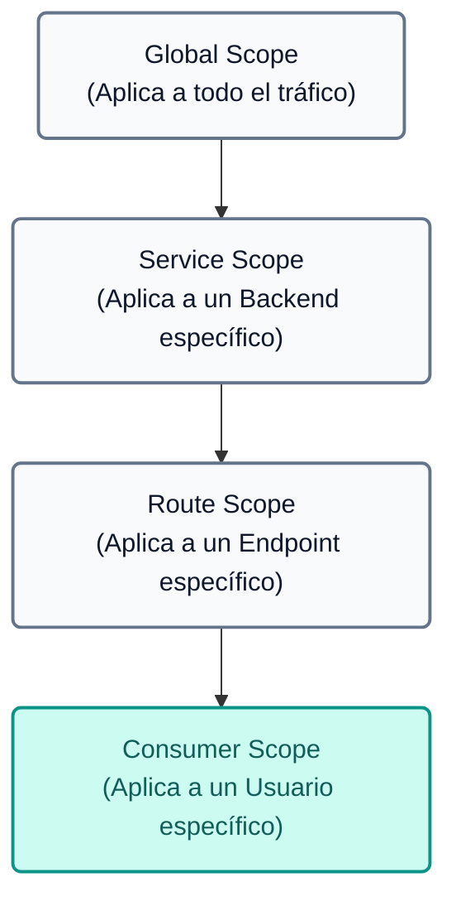
---

## Introdução Teórica: Plugins e Capacidades Avançadas
O Kong API Gateway baseia sua extrema flexibilidade no uso de **Plugins**, que interceptam solicitações no ciclo de vida de solicitação/resposta para aplicar lógica de negócios, segurança, observabilidade e transformação. Ao usar Kong em modo declarativo (com `deck`), os plugins são anexados a diferentes entidades (Serviços, Rotas, Consumidores) ou Globalmente.

Abaixo está uma lista dos principais plugins oficiais disponíveis no ecossistema Kong, classificados por categoria (excluindo os do AI Gateway):

| Plug-ins | Categoria | Descrição |
|---|---|---|
| **Autenticação Básica** | Autenticação | Adiciona autenticação básica HTTP (nome de usuário e senha) a uma API ou serviço. |
| **Autenticação HMAC** | Autenticação | Autenticação utilizando assinatura HMAC para maior segurança na transmissão. |
| **JWT** | Autenticação | Valida JSON Web Tokens (JWT) usando assinaturas simétricas ou assimétricas. |
| **Autenticação de chave** | Autenticação | Proteja rotas ou serviços exigindo uma chave estática nos cabeçalhos ou na cadeia de consulta. |
| **Autenticação LDAP** | Autenticação | Integre o Kong a um servidor LDAP/Active Directory para validar credenciais. |
| **Autenticação OAuth 2.0** | Autenticação | Implementa fluxos de autorização OAuth 2.0 (Código de Autorização, Credenciais do Cliente). |
| **OpenID Connect (OIDC)** (Empresa) | Autenticação | Delega autenticação a provedores de identidade externos (Okta, Auth0, Keycloak). |
| **SAML** (Empresa) | Autenticação | Integração nativa com provedores de identidade baseados em SAML v2.0. |
| **ACME** | Segurança | Automatize a geração e renovação de certificados TLS usando Let's Encrypt. |
| **Detecção de bots** | Segurança | Bloqueie ou restrinja o acesso a bots e rastreadores analisando o User-Agent. |
| **CORS** | Segurança | Permite o compartilhamento de recursos de origem cruzada para aplicativos/SPAs de front-end. |
| **Restrição de IP** | Segurança | Define listas brancas ou negras (lista de permissões/lista de bloqueios) de endereços IP ou blocos CIDR. |
| **TLS a montante** | Segurança | Força o TLS ao se comunicar do Kong com microsserviços de back-end. |
| **Cache de proxy** | Controle de Tráfego | Armazena respostas HTTP bem-sucedidas na memória para acelerar solicitações repetitivas. |
| **Cache de proxy avançado** (empresarial) | Controle de Tráfego | Suporte ao cache Redis e esquemas avançados de invalidação. |
| **Limitação de taxa** | Controle de Tráfego | Limita o número de solicitações permitidas por IP ou Consumidor em um período de tempo. |
| **Limitação de Taxa Avançada** (Empresarial) | Controle de Tráfego | Limite o tráfego distribuído e sincronizado em clusters usando Redis. |
| **Limite de tamanho da solicitação** | Controle de Tráfego | Bloqueia solicitações cuja carga excede um tamanho de byte configurado. |
| **Limitação de taxa GraphQL avançada** (Empresa) | Controle de Tráfego | Aplica limites de taxa analisando a complexidade das consultas GraphQL. |
| **AWS Lambda** | Sem servidor | Invoca funções do AWS Lambda diretamente e faz proxy de suas respostas. |
| **Funções do Azure** | Sem servidor | Invoca funções sem servidor do Microsoft Azure. |
| **Pré-função / Pós-função** | Sem servidor | Executa a lógica Lua personalizada no início ou no final do ciclo de vida da solicitação. |
| **Datadog** | Análise e monitoramento | Envie métricas detalhadas para o Datadog. |
| **Prometeu** | Análise e monitoramento | Expõe as métricas operacionais do Kong a serem eliminadas pelo Prometheus. |
| **Zipkin/OpenTelemetria** | Análise e monitoramento | Integra rastreamento distribuído (rastreamento) para representar graficamente os tempos de latência. |
| **ID de correlação** | Transformações | Injete ou encaminhe um UUID exclusivo por solicitação para correlacionar logs entre microsserviços. |
| **Sair do Transformador** (Empresarial) | Transformações | Modifica e padroniza as mensagens de erro geradas pelo Kong. |
| **Solicitar transformador** | Transformações | Adicione, substitua ou remova cabeçalhos, parâmetros de consulta ou campos de corpo na solicitação. |
| **Transformador de resposta** | Transformações | Adicione, substitua ou remova cabeçalhos ou campos de corpo na resposta. |
| **Route Transformer Adv.** (Empresa) | Transformações | Permite modificar a rota de destino do voo avaliando variáveis. |
| **Log HTTP/Log TCP/Log UDP** | Registro | Envie logs de acesso para servidores remotos via HTTP, TCP ou UDP. |
| **Registro Kafka** | Registro | Envie logs transacionais diretamente para um tópico do Apache Kafka. |
| **Registro de arquivo** | Registro | Grava logs de transações em um arquivo físico no disco do servidor. |
| **Syslog/EstatísticasD** | Registro | Integração com daemons Syslog locais e coleta de métricas StatsD. |

 **[Navegue por todos os plug-ins no Kong Plugin Hub](https://docs.konghq.com/hub/)**

---

## Sequência de Demonstração

Este módulo é a **continuação direta dos Módulos 000 e 001**. Reutiliza toda a infraestrutura já implantada para aplicar as políticas teóricas descritas.

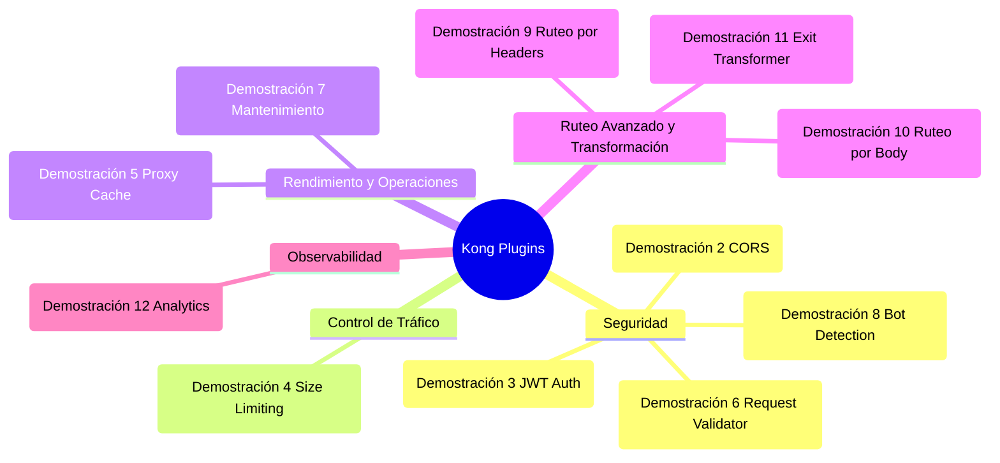
> **Importante:** Todos os plugins usados ​​neste módulo estão incluídos no Kong Gateway Enterprise (disponível através do Konnect). Nenhum componente externo adicional é necessário para instalação ou configuração.

---

## Pré-requisitos

Este módulo requer a conclusão bem-sucedida dos **Módulos 000** (Preparação Ambiental) e **001** (Segurança e Controle de Tráfego). Verifique se você tem:

1. **Plano de Controle** criado no Konnect — Módulo 000.
2. **Plano de Dados** conectado e no estado "In Sync" — Módulo 000.
3. **Simulação de back-end** (MockAPI) em execução em `http://localhost:9081` — Módulo 000.
4. **Variáveis de ambiente** configuradas (`KONNECT_TOKEN`, `KONNECT_CONTROL_PLANE_NAME`, etc.).

---

## Demo 1 Preparação: estado base do Módulo 002 (5 min)
**Objetivo:** Limpar a configuração externa do plano de controle e sincronizar um estado base limpo com as políticas do Módulo 001 como um ponto de partida unificado.

1. Abra seu terminal e navegue até o diretório `module-002`:    

```text
    cd workshop-assets/dia-1/02-kong-plugins
    

```
2. **Limpando o Plano de Controle:** Antes de começar, excluímos toda a configuração existente do Plano de Controle Externo para iniciar a partir de um estado limpo. Isso é especialmente importante se você experimentou plug-ins ou configurações adicionais durante o Módulo 001.    

```text
    deck gateway reset --konnect-token "$KONNECT_TOKEN" --konnect-control-plane-name "$KONNECT_CONTROL_PLANE_NAME" --force
    

```
> **O que `deck gateway reset` faz?** Ele remove **todos** serviços, rotas, plugins e consumidores do Control Plane, deixando-o completamente vazio. O sinalizador `--force` impede a confirmação interativa.

3. Usaremos o arquivo `archivos-deck/00-demo1-estado-base-002.yaml`. Este arquivo contém o estado final do Módulo 001 (serviços, consumidores, plugins de segurança e transformação) como ponto de partida:    

```yaml
    # Extracto conceptual (configuración omitida por brevedad):
    services:
     - name: mock
       url: http://httpbin-backend:9081/anything/mock
       plugins:
         - name: key-auth    # Autenticación
         - name: acl          # Autorización
       routes:
         - name: mock-route
           plugins:
             - name: response-transformer
    consumers:
     - username: App-External   # rate-limiting: 20/min
     - username: App-Internal   # rate-limiting: 3/min
    

```
4. Sincronize o estado base com o Plano de Controle Externo:    

```text
    deck gateway sync archivos-deck/00-demo1-estado-base-002.yaml \
        --konnect-token \
        "$KONNECT_TOKEN" \
        --konnect-control-plane-name \
        "$KONNECT_CONTROL_PLANE_NAME"
    

```
6. **Validação:** Execute uma solicitação para confirmar se tudo funciona. Observe que o arquivo criou o consumidor `App-External` com a chave `external-secret-123`:    

```bash
    curl -k -i -H "apikey: external-secret-123" https://localhost:8443/mock
    
    

```
**Usando curl (alternativa):**    

```bash
    curl -k -i -H "apikey: external-secret-123" https://localhost:8443/mock
    
    

```
**Resultado esperado:** `200 OK` com cabeçalho `x-kong: true`.

---

## Interoperabilidade da demonstração 2: CORS (5 min)
**Objetivo:** permitir o acesso entre origens para que os aplicativos de front-end (SPAs) possam consumir a API de voos.

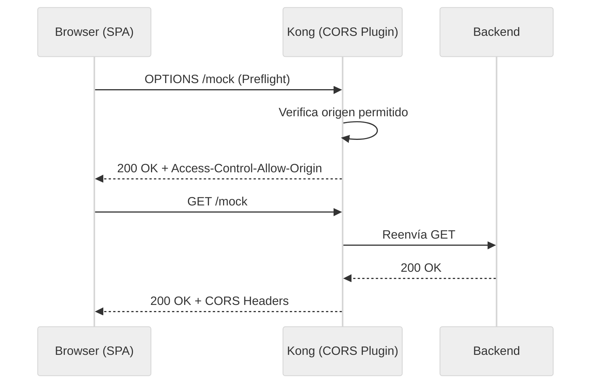
1. Usaremos o arquivo `archivos-deck/01-demo2-cors.yaml`. Você pode inspecionar como o plugin `cors` foi adicionado ao serviço `mock`:    

```yaml
    services:
     - name: mock
       plugins:
         - name: cors
           config:
             origins:
               - "https://mock.example.com"
               - "http://localhost:3000"
             methods:
               - GET
               - POST
               - OPTIONS
             headers:
               - Authorization
               - Content-Type
               - apikey
             max_age: 3600
             credentials: true
    

```
2. Sincronize as alterações:    

```text
    deck gateway sync archivos-deck/01-demo2-cors.yaml \
        --konnect-token \
        "$KONNECT_TOKEN" \
        --konnect-control-plane-name \
        "$KONNECT_CONTROL_PLANE_NAME"
    

```
3. Teste a solicitação de simulação do CORS:    

```bash
    curl -k -i  https://localhost:8443/mock \
     Origin:"http://localhost:3000" \
     Access-Control-Request-Method:"GET" \
     Access-Control-Request-Headers:"apikey"
    

```
**Usando curl (alternativa):**    

```bash
    curl -k -i -X OPTIONS https://localhost:8443/mock \
     -H "Origin: http://localhost:3000" \
     -H "Access-Control-Request-Method: GET" \
     -H "Access-Control-Request-Headers: apikey"
    

```
**Resultado esperado:** `200 OK` com cabeçalhos:

    - `Access-Control-Allow-Origin: http://localhost:3000`
    - `Métodos de controle de acesso-permissão: GET, POST, OPTIONS`
    - `Access-Control-Allow-Credenciais: verdadeiro`

4. Tente com uma origem NÃO permitida:    

```bash
    curl -k -i  https://localhost:8443/mock \
     Origin:"https://malicious-site.com" \
     Access-Control-Request-Method:"GET"
    

```
**Usando curl (alternativa):**    

```bash
    curl -k -i -X OPTIONS https://localhost:8443/mock \
     -H "Origin: https://malicious-site.com" \
     -H "Access-Control-Request-Method: GET"
    

```
**Resultado esperado:** Você receberá um `HTTP/1.1 200 OK`, mas a resposta **NÃO** incluirá o cabeçalho `Access-Control-Allow-Origin`. 
    
    > **💡 Por que 200 OK e não um erro?** No padrão CORS, o Gateway responde ao preflight `OPTIONS` informando as regras de acesso (neste caso, omitindo o cabeçalho de origem permitido). É o **navegador** que interpreta essa omissão como uma rejeição e é responsável por lançar o erro de segurança e bloquear a solicitação `GET`/`POST` real.

---

## Demo 3 Segurança: Autenticação com JWT (15 min)
**Objetivo:** implementar a autenticação baseada em JSON Web Tokens (JWT) como uma alternativa moderna às API Keys, demonstrando o contraste entre os dois mecanismos.

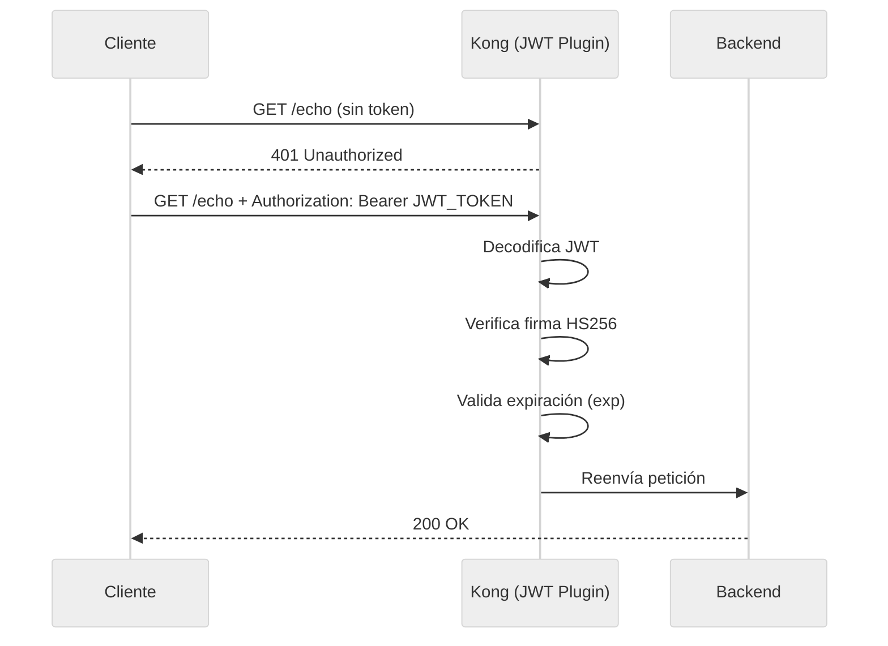
1. Usaremos o arquivo `archivos-deck/02-demo3-jwt.yaml`. Você pode inspecionar as principais mudanças:    

```yaml
    # Nuevo servicio de echo con autenticación JWT
    services:
     - name: echo-external
       url: http://httpbin-backend:9081/anything/echo
       plugins:
         - name: jwt
           config:
             claims_to_verify:
               - exp
       routes:
         - name: echo-get-route
           paths: [/echo]
           methods: [GET]
         - name: echo-post-route
           paths: [/echo]
           methods: [POST]

    # Nuevo consumer con credenciales JWT (HS256)
    consumers:
     - username: App-JWT
       jwt_secrets:
         - algorithm: HS256
           key: "mock-jwt-issuer"
           secret: "my-super-secret-key-for-workshop"
    

```
> **Nota:** Usamos HS256 (chave simétrica) para simplificar a geração de tokens no workshop. Na produção, o RS256 (chave assimétrica) é recomendado para maior segurança.

2. Sincronize as alterações:    

```text
    deck gateway sync archivos-deck/02-demo3-jwt.yaml \
        --konnect-token \
        "$KONNECT_TOKEN" \
        --konnect-control-plane-name \
        "$KONNECT_CONTROL_PLANE_NAME"
    

```
3. **Gere um token JWT** usando o script fornecido:    

```text
    export JWT_TOKEN=$(./scripts/generate_jwt.sh | grep -A1 "Token:" | tail -1)
    echo $JWT_TOKEN
    

```
> **💡 De onde vem esse token?** Neste exercício, **não** solicitamos o token a nenhum provedor de identidade externo (como Okta ou Keycloak). O script `generate_jwt.sh` cria o token localmente (offline) usando ferramentas básicas como `openssl`. 
    > Basta construir um Payload e assiná-lo usando o segredo `my-super-secret-key-for-workshop` com o algoritmo simétrico HS256. Como o Kong possui exatamente a mesma chave configurada no arquivo do deck, ele é capaz de verificar a assinatura e autorizar a solicitação. Veremos uma integração “real” com um Identity Server no Módulo 07 (mTLS + OIDC).
    > *(Opcional)* Se você estiver usando o console clássico do Windows (CMD) onde `export` não funciona, você precisará copiar o token gerado e configurá-lo manualmente com `set JWT_TOKEN=<paste_token_here>`. Para Mac, Linux ou GitBash, o comando acima já fez isso por você.

4. Teste sem token e com token:

    Sem token:    

```bash
    curl -k -i  https://localhost:8443/echo
    

```
**Usando curl (alternativa):**    

```bash
    curl -k -i  https://localhost:8443/echo
    

```
**Resultado esperado:** `HTTP/1.1 401 Não autorizado`

    Com token válido:    

```bash
    curl -k -i -H "Authorization: Bearer" https://localhost:8443/echo $JWT_TOKEN"
    

```
**Usando curl (alternativa):**    

```bash
    curl -k -i -H "Authorization: Bearer $JWT_TOKEN" https://localhost:8443/echo
    

```
**Resultado esperado:** `HTTP/1.1 200 OK`

5. **Contraste pedagógico:** Observe que agora temos dois mecanismos de autenticação coexistindo no mesmo gateway:

    - `mock` → protegido com **Key Auth** (chave de API estática no cabeçalho `apikey`)
    - `echo` → protegido com **JWT** (token assinado com expiração no cabeçalho `Authorization`)
    
    > **💡 Dica de observabilidade:** Se você entrar no **console web Konnect > Analytics > Solicitações de API**, você poderá ver como o Kong registra esses acessos. Usando autenticação (JWT ou Key Auth), Kong identifica o "Consumidor". Nos gráficos você pode agrupar e filtrar o tráfego para ver exatamente quantas solicitações `App-JWT` foram feitas versus `App-External`.

---

## Demo 4 Protection: Limite de tamanho da solicitação (5 min)
**Objetivo:** proteger o back-end contra solicitações com cargas excessivamente grandes (prevenção DoS de carga útil).

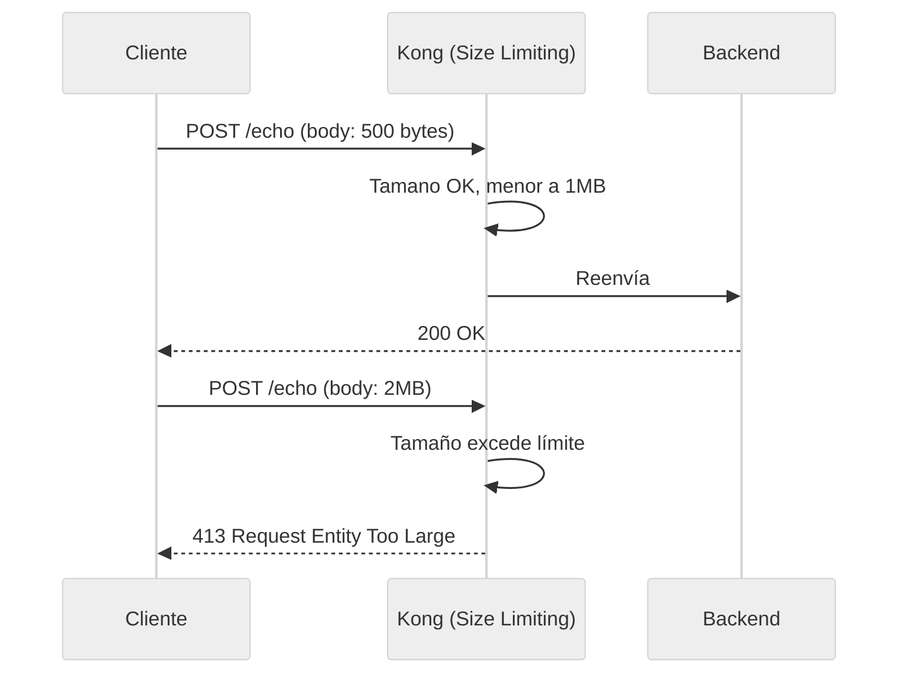
1. Usaremos o arquivo `files-deck/03-demo4-request-size-limiting.yaml`. Você pode inspecionar como o plugin foi adicionado:    

```yaml
    services:
     - name: echo-external
       plugins:
         - name: request-size-limiting
           config:
             allowed_payload_size: 1
             size_unit: megabytes
             require_content_length: false
    

```
2. Sincronize as alterações:    

```text
    deck gateway sync archivos-deck/03-demo4-request-size-limiting.yaml \
        --konnect-token \
        "$KONNECT_TOKEN" \
        --konnect-control-plane-name \
        "$KONNECT_CONTROL_PLANE_NAME"
    

```
3. Teste com um payload dentro do limite e outro excessivo:

    Carga útil pequena → 200 OK:    

```bash
    curl -k -i -X POST https://localhost:8443/echo -H "Authorization: Bearer $JWT_TOKEN" -H "Content-Type: application/json" -d '{"test": "pequeno"}'
    

```
Carga útil excessiva (2 MB) → 413:

    1. Gere arquivo temporário com a carga útil:    

```bash
    python3 -c "print('{\"data\":\"' + 'X'*2000000 + '\"}')" > payload.json
    

```
2. Execute a solicitação de leitura do arquivo (observe o @):    

```bash
    curl -k -i  https://localhost:8443/echo \
        Authorization:"Bearer $JWT_TOKEN" \
        @payload.json
    

```
**Usando curl (alternativa):**    

```bash
    curl -k -i \
        -X POST \
        -H "Authorization: Bearer $JWT_TOKEN" \
        -H "Content-Type: application/json" \
        -d "@payload.json" \
        https://localhost:8443/echo
    

```
*(Para gerar a grande carga no Windows, use o PowerShell para criar o arquivo e depois curl):*    

```text
    powershell -Command "$body = '{\"data\":\"' + ('X' * 2000000) + '\"}'; Set-Content -Path payload.json -Value $body; curl.exe -i -X POST http://localhost:8000/echo -H 'Authorization: Bearer %JWT_TOKEN%' -H 'Content-Type: application/json' -d '@payload.json'"
    

```
**Resultado esperado:** `200 OK` para o payload pequeno e `413 Request Entity Too Large` para o excessivo.

---

## Desempenho da Demonstração 5: Cache no Gateway (10 min)
**Objetivo:** reduzir a latência e a carga no back-end implementando o armazenamento em cache no nível do API Gateway, sem modificar o back-end.

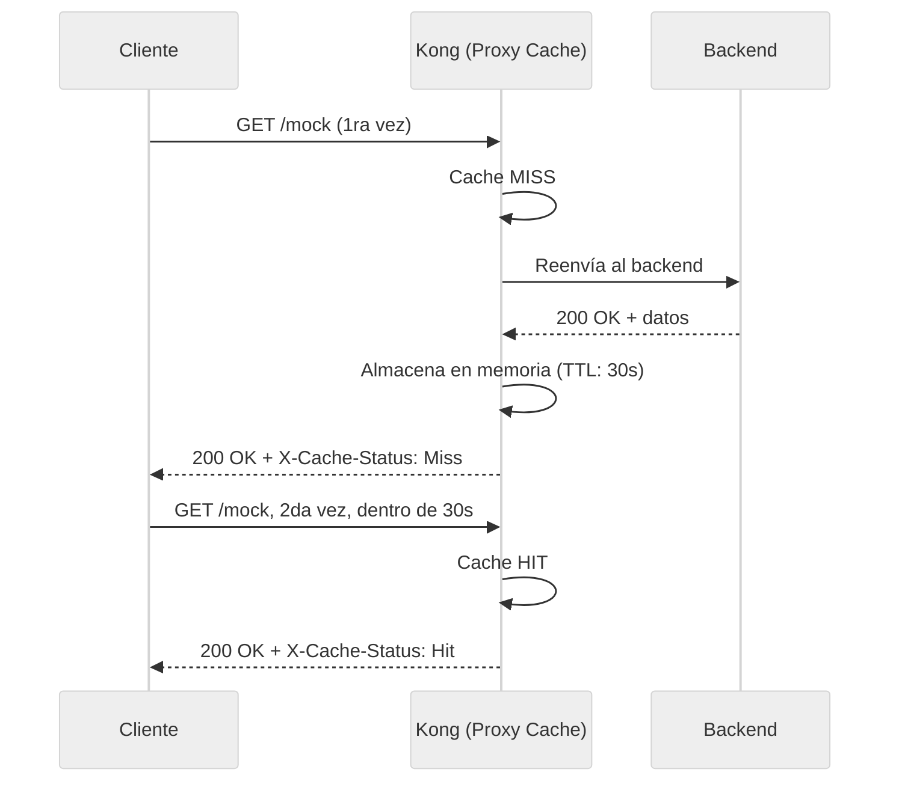
1. Usaremos o arquivo `files-deck/04-demo5-proxy-cache.yaml`. Você pode inspecionar como o plugin `proxy-cache` foi adicionado ao caminho simulado:    

```yaml
    routes:
     - name: mock-route
       plugins:
         - name: proxy-cache
           config:
             strategy: memory
             content_type:
               - "application/json"
               - "text/plain; charset=utf-8"
             cache_ttl: 30
             cache_control: false
             response_code:
               - 200
             request_method:
               - GET
    

```
2. Sincronize as alterações:    

```text
    deck gateway sync archivos-deck/04-demo5-proxy-cache.yaml \
        --konnect-token \
        "$KONNECT_TOKEN" \
        --konnect-control-plane-name \
        "$KONNECT_CONTROL_PLANE_NAME"
    

```
3. Faça duas solicitações consecutivas e observe os cabeçalhos do cache:

    Primeiro pedido → SENHORITA:    

```bash
    curl -k -i -H "apikey: external-secret-123" https://localhost:8443/mock
    
    

```
**Usando curl (alternativa):**    

```bash
    curl -k -i -H "apikey: external-secret-123" https://localhost:8443/mock
    

```
**Resultado esperado:** `HTTP/1.1 200 OK` com o cabeçalho `X-Cache-Status: Miss` (o gateway foi para o backend).

    Segunda solicitação (dentro de 30s) → HIT:    

```bash
    curl -k -i -H "apikey: external-secret-123" https://localhost:8443/mock
    

```
**Usando curl (alternativa):**    

```bash
    curl -k -i -H "apikey: external-secret-123" https://localhost:8443/mock
    

```
**Resultado esperado:** `HTTP/1.1 200 OK` com o cabeçalho `X-Cache-Status: Hit` (o gateway atendeu a resposta do cache, ignorando o backend).

4. **Observação:** Verifique o arquivo de log para comparar a latência de uma solicitação `Miss` versus uma solicitação `Hit`. Observando os tempos relatados, você verá que em um `Hit` o valor diminui drasticamente porque a solicitação é armazenada em cache no gateway sem chegar ao backend.

5. Aguarde 30 segundos e repita a solicitação. Você verá que ele retorna para `Miss` porque o TTL expirou.

---

## Demo 6 Governança: validação do esquema JSON (15 min)
**Objetivo:** garantir que as solicitações POST para o serviço de eco estejam em conformidade com um contrato de dados (esquema JSON) antes de chegar ao back-end.

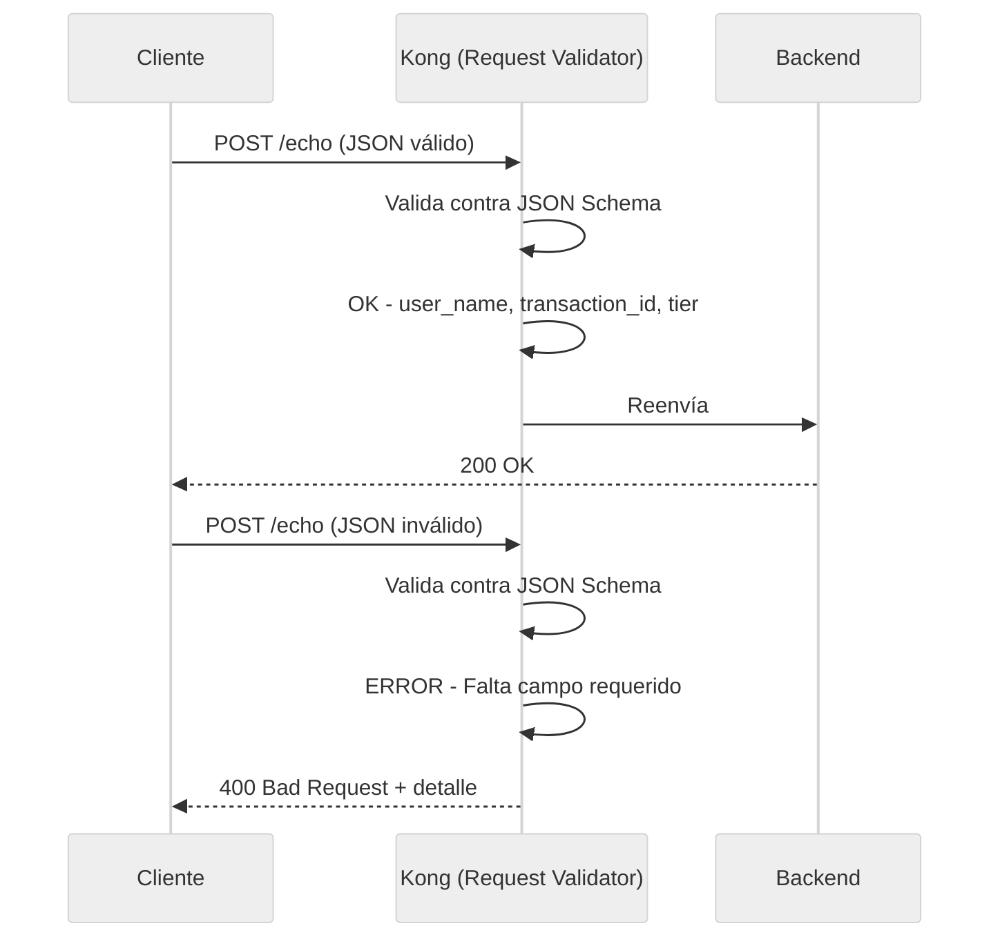
1. Usaremos o arquivo `files-deck/05-demo6-request-validator.yaml`. Você pode inspecionar o esquema de validação configurado na rota POST do echo:    

```yaml
    routes:
     - name: echo-post-route
       paths: [/echo]
       methods: [POST]
       plugins:
         - name: request-validator
           config:
             body_schema: '[{
               "user_name": {"type":"string","required":true},
               "transaction_id":      {"type":"string","required":true},
               "tier":   {"type":"string","required":true,
                                  "one_of":["standard","premium","vip"]},
               "preference":{"type":"string",
                                  "one_of":["window","aisle","middle"]}
             }]'
             verbose_response: true
             allowed_content_types: ["application/json"]
    

```
2. Sincronize as alterações:    

```text
    deck gateway sync archivos-deck/05-demo6-request-validator.yaml \
        --konnect-token \
        "$KONNECT_TOKEN" \
        --konnect-control-plane-name \
        "$KONNECT_CONTROL_PLANE_NAME"
    

```
3. Teste com um JSON válido:    

```bash
    curl -k -i  https://localhost:8443/echo \
        Authorization:"Bearer $JWT_TOKEN" \
        user_name="Juan Pérez" \
        transaction_id="TX-101" \
        tier="premium" \
        preference="window"
    

```
**Usando curl (alternativa):**    

```bash
    curl -k -i \
        -X POST \
        -H "Authorization: Bearer $JWT_TOKEN" \
        -H "Content-Type: application/json" \
        -d '{"user_name":"Juan Pérez","transaction_id":"TX-101","tier":"premium","preference":"window"}' \
        https://localhost:8443/echo
    

```
**Resultado esperado:** `200 OK`.

4. Teste com um JSON que possui um campo obrigatório ausente:    

```bash
    curl -k -i  https://localhost:8443/echo \
        Authorization:"Bearer $JWT_TOKEN" \
        user_name="Juan Pérez"
    

```
**Usando curl (alternativa):**    

```bash
    curl -k -i \
        -X POST \
        -H "Authorization: Bearer $JWT_TOKEN" \
        -H "Content-Type: application/json" \
        -d '{"user_name":"Juan Pérez"}' \
        https://localhost:8443/echo
    

```
**Resultado esperado:** `400 Bad Request` com detalhes indicando quais campos estão faltando.

5. Experimente com um valor que não é permitido no enum:    

```bash
    curl -k -i  https://localhost:8443/echo \
        Authorization:"Bearer $JWT_TOKEN" \
        user_name="Ana López" \
        transaction_id="KA-202" \
        tier="ultra-mega"
    

```
**Usando curl (alternativa):**    

```bash
    curl -k -i \
        -X POST \
        -H "Authorization: Bearer $JWT_TOKEN" \
        -H "Content-Type: application/json" \
        -d '{"user_name":"Ana López","transaction_id":"KA-202","tier":"ultra-mega"}' \
        https://localhost:8443/echo
    

```
**Resultado esperado:** `400 Bad Request` indicando que `ultra-mega` não é um valor válido para `tier`.

---

## Demo 7 Operações: modo de manutenção (5 min)
**Objetivo:** colocar uma API em modo de manutenção a partir do gateway sem tocar ou reiniciar o back-end, demonstrando o poder da configuração declarativa.

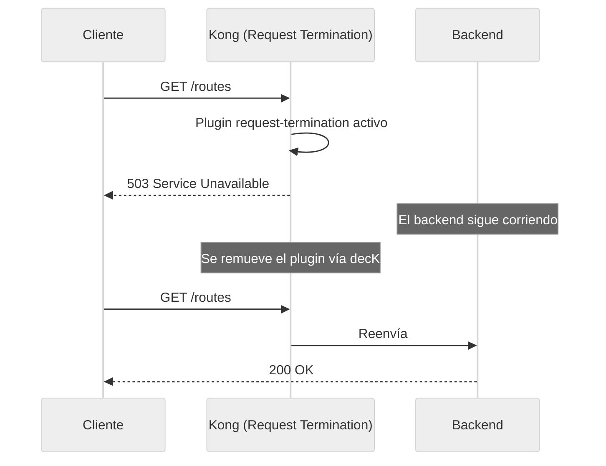
1. Usaremos o arquivo `files-deck/06-demo7-request-termination.yaml`. Você pode inspecionar como o plugin foi adicionado à rota `/routes`:    

```yaml
    - name: routes
     routes:
       - name: routes-route
         paths: [/routes]
         plugins:
           - name: request-termination
             config:
               status_code: 503
               message: "El servicio de rutas esta en mantenimiento
                         programado. Vuelva a intentar en 30 minutos."
    

```
2. Sincronize as alterações:    

```text
    deck gateway sync archivos-deck/06-demo7-request-termination.yaml \
        --konnect-token \
        "$KONNECT_TOKEN" \
        --konnect-control-plane-name \
        "$KONNECT_CONTROL_PLANE_NAME"
    

```
3. Teste a API em manutenção:    

```bash
    curl -k -i  https://localhost:8443/routes
    
    

```
**Usando curl (alternativa):**    

```bash
    curl -k -i  https://localhost:8443/routes
    
    

```
**Resultado esperado:** `503 Serviço Indisponível` com a mensagem de manutenção.

4. Enquanto isso, as demais APIs continuam funcionando normalmente:    

```bash
    curl -k -i -H "apikey: external-secret-123" https://localhost:8443/mock
    
    

```
**Usando curl (alternativa):**    

```bash
    curl -k -i -H "apikey: external-secret-123" https://localhost:8443/mock
    
    

```
**Resultado esperado:** `200 OK`. O serviço simulado não é afetado.

> **Nota:** No próximo passo (Demo 8), ao sincronizar um arquivo que NÃO inclui o plugin `request-termination`, ele será removido automaticamente e o serviço de rotas funcionará novamente. Este é o poder do gerenciamento declarativo: o estado desejado é sempre aquele que define o arquivo.

---

## Demonstração 8 Segurança: Detecção de Bot (5 min)
**Objetivo:** bloquear automaticamente o tráfego de bots (rastreadores) conhecidos no nível global do gateway.

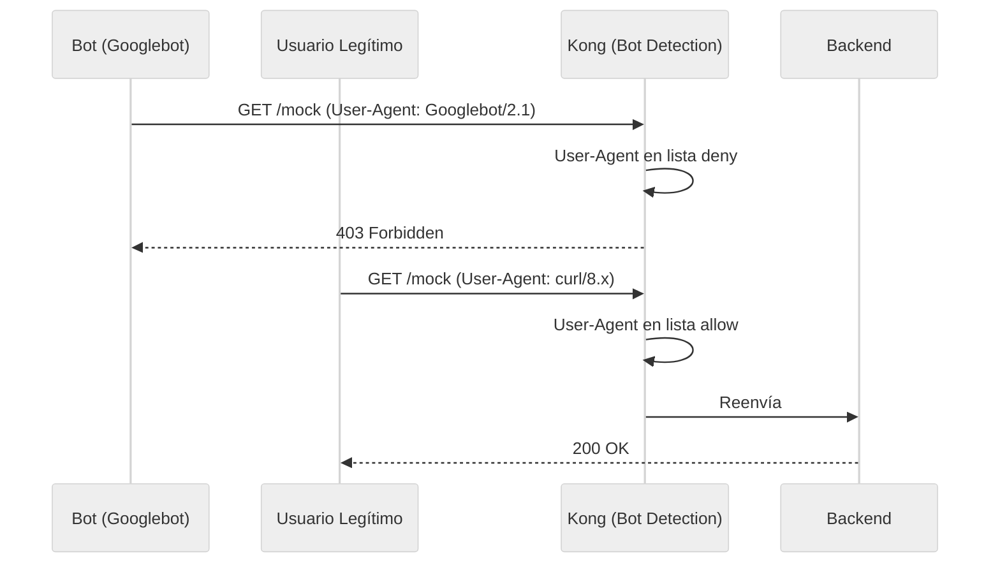
1. Usaremos o arquivo `files-deck/07-demo8-bot-detection.yaml`. Este arquivo:

    - **Adiciona** o plugin `bot-detection` globalmente
    - **Remova** o `request-termination` do passo anterior (o serviço `/routes` funciona novamente)    

```yaml
    plugins:
     - name: bot-detection
       config:
         deny:
           - "Googlebot"
           - "Bingbot"
           - "Baiduspider"
         allow:
           - "curl"
           - "insomnia"
           - "postman"
    

```
2. Sincronize as alterações:    

```text
    deck gateway sync archivos-deck/07-demo8-bot-detection.yaml \
        --konnect-token \
        "$KONNECT_TOKEN" \
        --konnect-control-plane-name \
        "$KONNECT_CONTROL_PLANE_NAME"
    

```
3. Experimente um User-Agent bot versus um legítimo:

    Simule o Googlebot:    

```bash
    curl -k -i -H "User-Agent: Googlebot/2.1" https://localhost:8443/routes
    

```
**Usando curl (alternativa):**    

```bash
    curl -k -i -H "User-Agent: Googlebot/2.1" https://localhost:8443/routes
    

```
**Resultado esperado:** `HTTP/1.1 403 Proibido`

    Solicitação normal (sem user-agent malicioso):    

```bash
    curl -k -i  https://localhost:8443/routes
    

```
**Usando curl (alternativa):**    

```bash
    curl -k -i  https://localhost:8443/routes
    

```
**Resultado esperado:** `HTTP/1.1 200 OK`

4. Verifique se `/routes` foi restaurado (o `request-termination` foi removido):    

```text
    curl -s -o /dev/null -w "%{http_code}" http://localhost:8000/routes
    

```
**Resultado esperado:** `200` (não mais `503`).

---

## Demo 9 Roteamento inteligente: por valores de cabeçalhos (15 min)
**Objetivo:** demonstrar como o Kong pode direcionar o tráfego para diferentes back-ends com base no valor de um cabeçalho HTTP, implementando uma estratégia de **roteamento regional**.

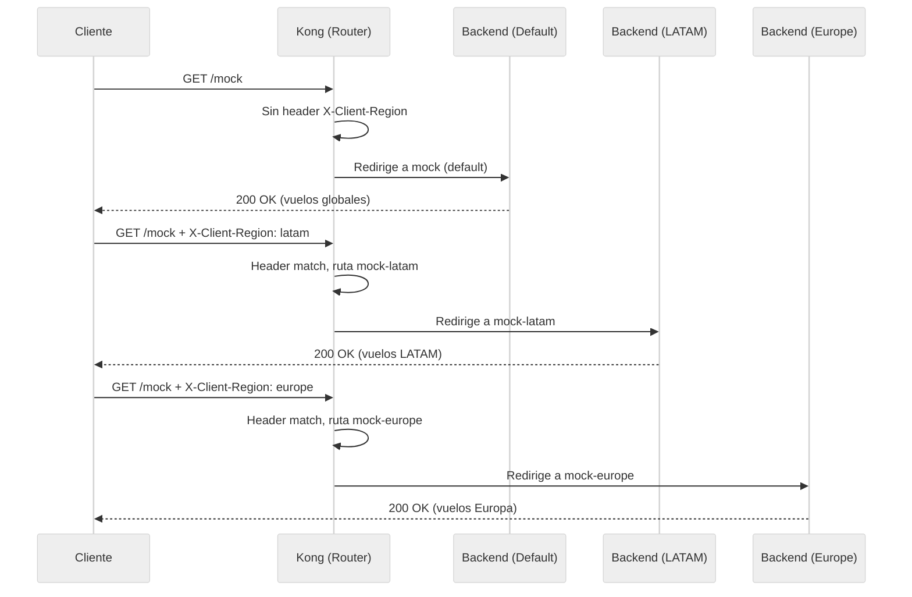
> **Caso de negócios:** MockAPI opera em diversas regiões. Os clientes enviam o cabeçalho `X-Client-Region` para obter voos de sua região específica. Kong direciona cada solicitação para o back-end regional correspondente sem exigir lógica adicional no código.

1. Usaremos o arquivo `deck-files/08-demo9-routing-by-header.yaml`. Você pode inspecionar como dois novos serviços foram adicionados com rotas que filtram por cabeçalho:    

```yaml
    # Servicio para LATAM (solo se activa con X-Client-Region: latam)
    - name: mock-latam
      url: http://httpbin-backend:9081/anything/mock-latam
      routes:
        - name: mock-latam-route
          paths: [/mock]
          methods: [GET]
          headers:
            x-client-region:
              - latam

    # Servicio para EUROPE (solo se activa con X-Client-Region: europe)
    - name: mock-europe
      url: http://httpbin-backend:9081/anything/mock-europe
      routes:
        - name: mock-europe-route
          paths: [/mock]
          methods: [GET]
          headers:
            x-client-region:
              - europe

    # Servicio DEFAULT (sin restricción de header = catch-all)
    - name: mock
      url: http://httpbin-backend:9081/anything/mock
      routes:
        - name: mock-route
          paths: [/mock]
          methods: [GET]
    # Sin campo 'headers' → captura todo lo demás
    

```
> **Como funciona?** Kong avalia rotas da mais específica para a menos específica. Rotas com restrições de cabeçalho são mais específicas do que aquelas sem restrições. Portanto, se a solicitação incluir `X-Client-Region: latam`, ela corresponderá primeiro a `mock-latam-route`. Se não incluir esse cabeçalho, ele cairá para o padrão `mock-route`.

2. Sincronize as alterações:    

```text
    deck gateway sync archivos-deck/08-demo9-ruteo-por-header.yaml \
        --konnect-token \
        "$KONNECT_TOKEN" \
        --konnect-control-plane-name \
        "$KONNECT_CONTROL_PLANE_NAME"
    

```
3. Teste o roteamento regional:

    Roteamento para LATAM:    

```bash
    curl -k -i  https://localhost:8443/mock \
        X-Client-Region:"latam" \
        apikey:"external-secret-123"
    

```
**Usando curl (alternativa):**    

```bash
    curl -k -i \
        -H "X-Client-Region: latam" \
        -H "apikey: external-secret-123" \
        https://localhost:8443/mock
    

```
**Resultado esperado:** `HTTP/1.1 200 OK` e no JSON de resposta, o campo `url` mostrará `"http://httpbin-backend:9081/anything/mock-latam"`.

    Roteamento para a EUROPA:    

```bash
    curl -k -i  https://localhost:8443/mock \
        X-Client-Region:"europe" \
        apikey:"external-secret-123"
    

```
**Usando curl (alternativa):**    

```bash
    curl -k -i \
        -H "X-Client-Region: europe" \
        -H "apikey: external-secret-123" \
        https://localhost:8443/mock
    

```
**Resultado esperado:** `HTTP/1.1 200 OK` e na resposta JSON, o campo `url` mostrará `"http://httpbin-backend:9081/anything/mock-europe"`.

    Roteamento PADRÃO (sem cabeçalho regional):    

```bash
    curl -k -i -H "apikey: external-secret-123" https://localhost:8443/mock
    

```
**Usando curl (alternativa):**    

```bash
    curl -k -i -H "apikey: external-secret-123" https://localhost:8443/mock
    

```
**Resultado esperado:** `HTTP/1.1 200 OK` e no JSON de resposta, o campo `url` mostrará `"http://httpbin-backend:9081/anything/mock"` (caiu no padrão por não ter cabeçalho).

4. **Observação:** Revendo **Konnect Analytics > Solicitações de API**, agrupando a visualização por **Serviço**, você pode ver que o tráfego é distribuído em barras diferentes para `mock`, `mock-latam` e `mock-europe`, confirmando que o Kong foi roteado dinamicamente para o backend correto.

---

## Demo 10 Roteamento inteligente: por conteúdo do corpo (20 min)
**Objetivo:** demonstrar como Kong pode inspecionar o conteúdo do corpo JSON de uma solicitação e redirecionar dinamicamente para diferentes back-ends com base nos valores encontrados, usando o plugin `pre-function`.

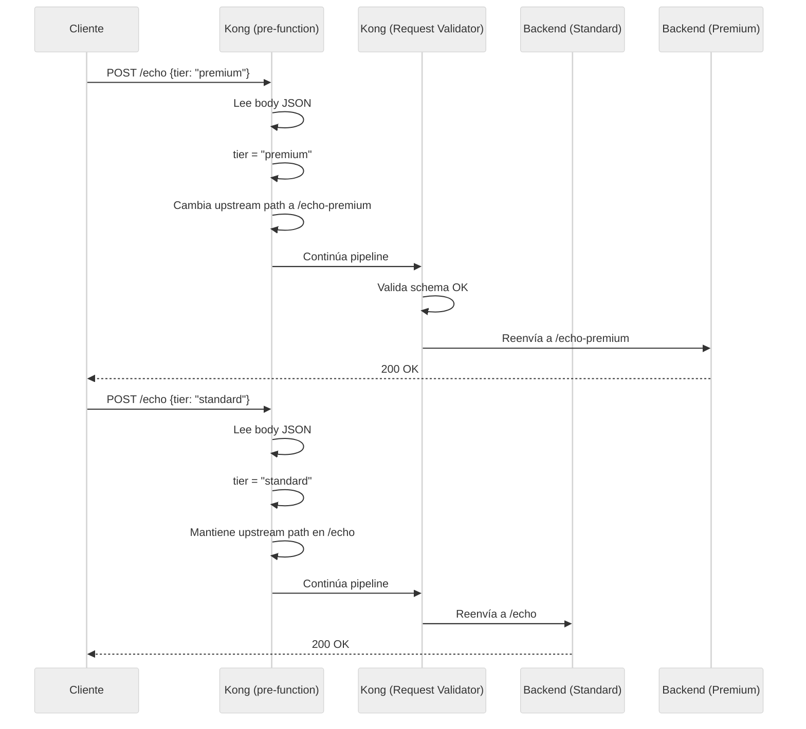
> **Caso de negócio:** Quando um passageiro cria uma reserva, o campo `tier` do JSON determina se ela será processada pelo fluxo padrão ou pelo fluxo premium (que pode ter backend próprio com lógica diferenciada para faturamento, assentos, etc.).

1. Usaremos o arquivo `deck-files/09-demo10-routing-by-body.yaml`. Você pode inspecionar o plugin `pre-function` adicionado ao caminho POST do echo:    

```yaml
    routes:
     - name: echo-post-route
       paths: [/echo]
       methods: [POST]
       plugins:
         - name: pre-function
           config:
             access:
               - |
                 -- Ruteo dinámico por contenido del body
                 local cjson = require("cjson.safe")
                 local body = kong.request.get_raw_body()
                 if not body then return end

                 local json = cjson.decode(body)
                 if not json or not json.tier then return end

                 if json.tier == "premium"
                    or json.tier == "vip" then
                   -- Redirige al backend premium
                   kong.service.request.set_path(
                     "/anything/echo-premium")
                   kong.service.request.set_header(
                     "X-Routed-By", "body-content")
                   kong.service.request.set_header(
                     "X-Tier", "premium")
                 else
                   kong.service.request.set_header(
                     "X-Routed-By", "body-content")
                   kong.service.request.set_header(
                     "X-Tier", "standard")
                 end
    

```
> **Como funciona?** O plugin `pré-função` executa o código Lua na fase de `acesso` (antes da solicitação chegar ao upstream). Leia o corpo JSON, extraia o campo `tier` e, se for `premium` ou `vip`, altere dinamicamente o caminho upstream usando `kong.service.request.set_path()`. Isso redireciona a solicitação para `/anything/echo-premium` sem que o cliente saiba. Além disso, ele injeta cabeçalhos de diagnóstico (`X-Routed-By`, `X-Tier`) que o backend recebe.

2. Sincronize as alterações:    

```text
    deck gateway sync archivos-deck/09-demo10-ruteo-por-body.yaml \
        --konnect-token \
        "$KONNECT_TOKEN" \
        --konnect-control-plane-name \
        "$KONNECT_CONTROL_PLANE_NAME"
    

```
3. Reserva de teste **PREMIUM** → back-end premium:    

```bash
    curl -k -i  https://localhost:8443/echo \
        Authorization:"Bearer $JWT_TOKEN" \
        user_name="Juan Pérez" \
        transaction_id="TX-101" \
        tier="premium" \
        preference="window"
    

```
**Usando curl (alternativa):**    

```bash
    curl -k -i \
        -X POST \
        -H "Authorization: Bearer $JWT_TOKEN" \
        -H "Content-Type: application/json" \
        -d '{"user_name":"Juan Pérez","transaction_id":"TX-101","tier":"premium","preference":"window"}' \
        https://localhost:8443/echo
    

```
**Resultado esperado:** No JSON de resposta de backend de eco:

    - `"url": "http://httpbin-backend:9081/anything/echo-premium"` ← Fui para o backend premium!
    - O cabeçalho `X-Tier: premium` aparecerá nos cabeçalhos recebidos pelo backend.

4. Reserva de teste **PADRÃO** → back-end padrão:    

```bash
    curl -k -i  https://localhost:8443/echo \
        Authorization:"Bearer $JWT_TOKEN" \
        user_name="María López" \
        transaction_id="KA-202" \
        tier="standard"
    

```
**Usando curl (alternativa):**    

```bash
    curl -k -i \
        -X POST \
        -H "Authorization: Bearer $JWT_TOKEN" \
        -H "Content-Type: application/json" \
        -d '{"user_name":"María López","transaction_id":"KA-202","tier":"standard"}' \
        https://localhost:8443/echo
    

```
**Resultado esperado:**

    - `"url": "http://httpbin-backend:9081/anything/echo"` ← Mantido no backend padrão.
    - O cabeçalho `X-Tier: standard` aparecerá nos cabeçalhos recebidos.

5. Experimente a reserva **VIP** → também vai para o backend premium:    

```bash
    curl -k -i  https://localhost:8443/echo \
        Authorization:"Bearer $JWT_TOKEN" \
        user_name="Carlos Ruiz" \
        transaction_id="KA-303" \
        tier="vip" \
        preference="aisle"
    

```
**Usando curl (alternativa):**    

```bash
    curl -k -i \
        -X POST \
        -H "Authorization: Bearer $JWT_TOKEN" \
        -H "Content-Type: application/json" \
        -d '{"user_name":"Carlos Ruiz","transaction_id":"KA-303","tier":"vip","preference":"aisle"}' \
        https://localhost:8443/echo
    

```
**Resultado esperado:** `"url": "http://httpbin-backend:9081/anything/echo-premium"` ← VIP também é roteado para o backend premium.

6. **Resumo dos dois tipos de roteamento:**

    | Método | Critérios de roteamento | Mecanismo Kong | Vantagem |
    |--------|-----|----------------|--------|
    | **Cabeçalho** (Demonstração 9) | Valor do cabeçalho `X-Client-Region` | Nativo: campo `headers` na rota | Declarativo, sem código |
    | **Corpo** (Demonstração 10) | Valor do campo `tier` no JSON | Plugin `pré-função` (Lua) | Lógica flexível e personalizável |

---

## Demo 11 Personalização: Erros Corporativos Padronizados (10 min)
**Objetivo:** Padronizar todas as respostas de erro geradas pelo Kong em um formato JSON corporativo consistente.

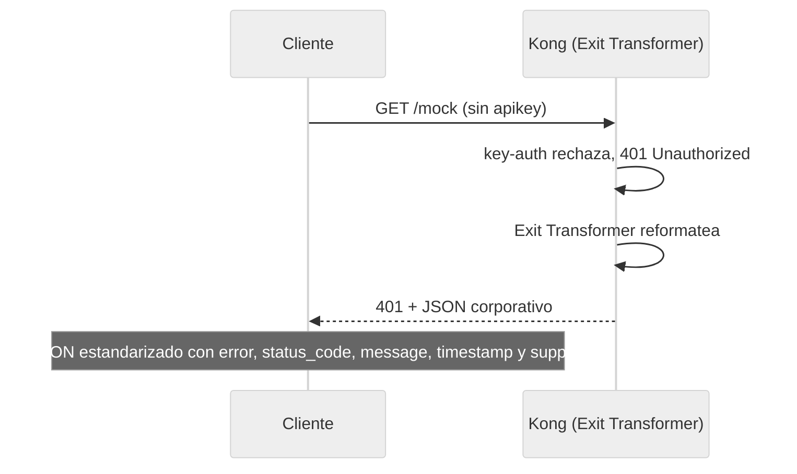
1. Usaremos o arquivo `files-deck/10-demo11-exit-transformer.yaml`. Você pode inspecionar o plugin `exit-transformer` adicionado em nível global:    

```yaml
    plugins:
     - name: exit-transformer
       config:
         functions:
           - |
             return function(status, body, headers)
               if status >= 400 then
                 local new_body = {
                   error = true,
                   status_code = status,
                   message = body.message or body.msg
                             or "Error desconocido",
                   service = "MockAPI API Gateway",
                   timestamp = os.date("!%Y-%m-%dT%H:%M:%SZ"),
                   support = "soporte@mock.com"
                 }
                 return status, new_body, headers
               end
               return status, body, headers
             end
    

```
2. Sincronize as alterações:    

```text
    deck gateway sync archivos-deck/10-demo11-exit-transformer.yaml \
        --konnect-token \
        "$KONNECT_TOKEN" \
        --konnect-control-plane-name \
        "$KONNECT_CONTROL_PLANE_NAME"
    

```
3. Teste diferentes erros e verifique o formato padronizado:

    **Erro 401 (sem autenticação):**    

```bash
    curl -k -i  https://localhost:8443/mock
    

```
Usando curl (alternativa):    

```bash
    curl -k -i https://localhost:8443/mock
    

```
**Erro 403 (consumidor sem permissões ACL):**    

```bash
    curl -k -i -H "apikey: internal-secret-123" https://localhost:8443/mock
    

```
Usando curl (alternativa):    

```bash
    curl -k -i -H "apikey: internal-secret-123" https://localhost:8443/mock
    

```
**Erro 403 (bot detectado):**    

```bash
    curl -k -i -H "User-Agent: Googlebot/2.1" https://localhost:8443/routes
    

```
Usando curl (alternativa):    

```bash
    curl -k -i -H "User-Agent: Googlebot/2.1" https://localhost:8443/routes
    

```
**Resultado esperado:** Todos os erros executados anteriormente (401, 403, 403) agora retornarão um JSON corporativo padronizado com esta estrutura, em vez da mensagem simples do Kong:    

```json
    {
     "error": true,
     "status_code": 401,
     "message": "No credentials found for given 'iss'",
     "service": "MockAPI API Gateway",
     "timestamp": "2026-05-29T05:30:00Z",
     "support": "soporte@mock.com"
    }
    

```
*(O `status_code` e `message` variam dependendo do erro, mas os campos são idênticos.)*

4. Respostas bem-sucedidas (`200 OK`) NÃO são afetadas pelo transformador de saída:    

```bash
    curl -k -i -H "apikey: external-secret-123" https://localhost:8443/mock
    

```
**Usando curl (alternativa):**    

```bash
    curl -k -i -H "apikey: external-secret-123" https://localhost:8443/mock
    

```
**Resultado esperado:** O JSON da resposta de back-end é retornado inalterado.

---

## Demonstração 12: Observabilidade e revisão consolidadas no Konnect Analytics (10 min)
**Objetivo:** Visualizar e analisar centralmente todo o tráfego gerado e bloqueado durante as demonstrações deste módulo, utilizando as ferramentas de observabilidade integradas ao Kong Konnect.

Ao longo deste laboratório, injetamos solicitações válidas e inválidas, ativamos bloqueios de segurança e forçamos o roteamento dinâmico. Kong captura a telemetria de todos esses eventos e a envia para o plano de controle na nuvem.

## # Passo a passo no Konnect Analytics Explorer

1. **Acesse o Painel de Análise:**
    - Abra seu navegador e verifique se você está conectado ao console do **Kong Konnect**.
    - No menu lateral esquerdo, vá até a seção **Analytics** e clique em **Explorador**.

2. **Configure intervalo de tempo e filtros:**
    - No canto superior direito, defina o seletor de tempo para **Últimos 60 minutos** ou o intervalo em que você executou o laboratório.
    - Na barra de filtros principal (botão `+ Adicionar Filtro`), selecione `Control Plane` e escolha o nome do seu ambiente (aquele que você atribuiu à variável `$KONNECT_CONTROL_PLANE_NAME`).

3. **Analise a distribuição dos códigos de status:**
    - Na seção do gráfico, procure o seletor de agrupamento (“Agrupar por” ou “Dimensão”) e altere para **Código de Status**.
    - Você poderá observar visualmente todos os cenários que provocamos. Clique nas diferentes cores das barras para isolar o tráfego. Você deve identificar claramente:

    | Código de status | Originado por (Contexto do Módulo) |
    |-------------|-------------------------------------|
    | `200` | **Tráfego bem-sucedido**: solicitações válidas para simulação, eco e roteamento regional. |
    | `400` | **Validador de solicitação**: Falha nas tentativas do POST de `/echo` devido à falta de campos obrigatórios no JSON (Demonstração 6). |
    | `401` | **Key Auth / JWT**: Solicitações rejeitadas por falta de chave de API ou envio de token JWT ausente/expirado (Demos 1 e 3). |
    | `403` | **ACL / Detecção de Bot**: Consumidores tentando acessar rotas não autorizadas (Demonstração 1) ou User-Agents bloqueados como `Googlebot` (Demonstração 8). |
    | `413` | **Limite de tamanho de solicitação**: tentativas de enviar cargas maiores que 1 MB (Demonstração 4). |
    | `503` | **Rescisão de Solicitação**: Solicitações para `/rotas` durante simulação de manutenção programada (Demo 7). |

4. **Agrupar por Serviço (Serviço) e Rota (Rota):**
    - Altere a dimensão principal ("Agrupar por") de `Código de Status` para **Serviço**.
    - Observe como foi distribuído o volume de solicitações. Você deve notar a presença dos serviços regulares (`mock`, `echo-external`) junto com os serviços regionais invocados dinamicamente (`mock-latam` e `mock-europe`) configurados na Demo 9.
    - Altere a dimensão para **Route** para observar a carga granular que cada rota específica recebeu.

5. **Analisar a atividade dos Consumidores:**
    - Altere a dimensão para **Consumidor**.
    - Identifica quanto tráfego foi originado por `App-External` (autenticado via API Keys) vs `App-JWT` (autenticado via Tokens).
    - Esta visão é vital para auditorias: permite isolar um consumidor específico e ver exatamente quais endpoints ele está consumindo ou se está gerando altas taxas de erro (por exemplo, múltiplas respostas `401` ou `429`).

> **💡 Práticas recomendadas:** Em um ambiente de produção, o Analytics Explorer é sua primeira linha de defesa para *solução de problemas*. Se você notar repentinamente um aumento nos erros na plataforma, poderá agrupar o tráfego por "Rota" ou "Consumidor" em segundos para identificar qual cliente ou endpoint exato está enfrentando o incidente, sem a necessidade de SSH nos servidores ou analisar manualmente os logs de acesso.

---

## Resumo dos plug-ins do módulo 002

| Etapa | Plug-ins | Nível | Função principal |
|------|--------|-------|-------------------|
| Demonstração 2 | `cors` | Serviço | Habilitar acesso de origem cruzada para SPAs |
| Demonstração 3 | `jwt` | Serviço | Autenticação com tokens assinados (HS256) |
| Demonstração 4 | `limitação do tamanho da solicitação` | Serviço | Proteção contra cargas excessivas |
| Demonstração 5 | `proxy-cache` | Rota | Cache na memória com TTL configurável |
| Demonstração 6 | `request-validador` | Rota | Validação do esquema JSON do corpo |
| Demonstração 7 | `rescisão de solicitação` | Rota | Modo de manutenção sem tocar no backend |
| Demonstração 8 | `detecção de bot` | Globais | Bloqueio de bots por User-Agent |
| Demonstração 9 | *(nativo)* | Rota | Roteamento por cabeçalho `X-Client-Region` |
| Demonstração 10 | `pré-função` | Rota | Roteamento por corpo do campo `tier` |
| Demonstração 11 | `transformador de saída` | Globais | Padronização de erros JSON |

---

Parabéns! Você concluiu o Módulo 002, implementando recursos avançados de segurança, roteamento inteligente e governança na plataforma integrada no Módulo 001.
