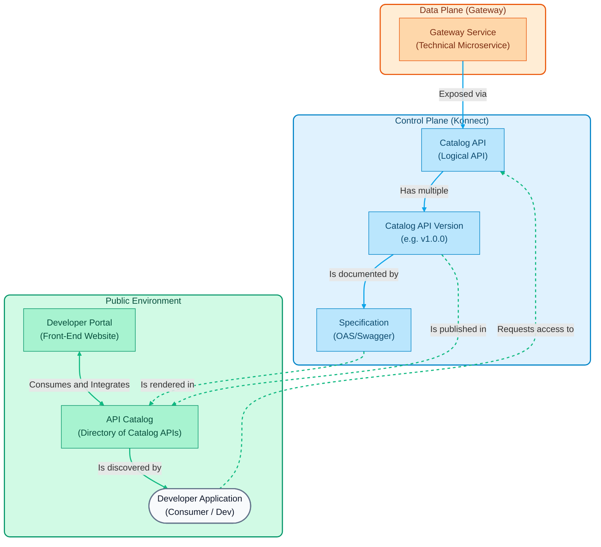

# Module 03: Kong Developer Portal

This module focuses on how to expose our APIs to developers (internal or external) using Kong Konnect's **Developer Portal**.

## Module Objectives

> **General Note:** All `curl` commands detailed in this module's demonstrations can be replaced by direct executions from your **Insomnia** client, using the `insomnia_collection.json` collection provided in the repository.

1. **Enable the Developer Portal**: Configure the portal in Kong Konnect.
2. **Publish Specifications (OAS)**: Upload a Swagger / OpenAPI file to document our API.
3. **API Catalog**: Configure how developers discover and interactively test endpoints.
4. **Developer Onboarding**: Configure and test the Consumer lifecycle (portal registration, application creation, and access request).
5. **Access Approval**: Demonstrate "Auto-Approve" (automatic) and "Manual Approval" (administrator approval) flows.

---

## Fundamental Developer Portal Concepts

According to the [Official Dev Portal Documentation](https://developer.konghq.com/dev-portal/), the Developer Portal is the "face" of your API program. It is a tool designed to **simplify API publishing, enable self-service for developers, and centralize documentation**.

Before configuring our public portal, it's important to understand the abstractions Kong Konnect uses to separate **technical** infrastructure from **business** logic.

### 1. Catalog APIs
* [Official Doc: API Catalog](https://docs.konghq.com/konnect/api-management/api-catalog/)*

To understand the Developer Portal, we must first differentiate between two key concepts in Kong: the technical part and the business part.

- **The Technical Part (Gateway Service)**: This is the internal configuration. It includes IPs, ports, protocols, and physical routes. It's what Kong uses internally to know how to reach your backend server.
- **The Business Part (Catalog API)**: This is the "showcase" or storefront for your service. It's the logical entity that you group, decorate, and expose to your consumers (developers).

A **Catalog API** functions as the centralized registry for your interface. It is this API that developers will subscribe to and explore.

For this "showcase" to be complete and useful for an external developer, it is composed of several key pieces (visible when you configure an API in Konnect):

*   **Overview & Metadata**
    Here, the API's identity (name, description) is defined. Additionally, you can assign **labels** and **custom attributes** that help developers filter and search for APIs in very large portals.

*   **API Specification (OAS)**
    It is the heart of the technical documentation. It is a standard file (OpenAPI/Swagger) that teaches the portal how to render an interactive console ("Try it out"). Thanks to this, the developer can see which endpoints exist, what parameters they need, and send test requests from their own browser.

*   **Documentation**
    Unlike the technical specification (OAS), here you can add step-by-step guides, tutorials, or usage policies written in Markdown format. It is ideal for providing human context (e.g., "How to get your first token").

*   **Gateway**
    It is the "bridge" that connects this business entity with the technical reality. Here you link your Catalog API with the actual **Gateway Services** that will process traffic.

*   **Portals**
    The same API can be published on multiple Portals simultaneously (for example, an internal portal for employees and an external portal for partners). From here, you control which showcases it appears in.

*   **Applications**
    Shows which developers and client applications have registered, subscribed, and obtained credentials (API Keys) to specifically consume this API.

### 2. Versions
* [Official Doc: API Versions](https://docs.konghq.com/konnect/api-management/api-catalog/)*

APIs evolve over time. Kong allows managing multiple versions of the same Catalog API (e.g., `v1`, `v2`, `beta`). Each version functions as a sub-entity that can have its own specification linked, be tied to a different Gateway Service, and be published independently in the Developer Portal.

### 3. Specifications (OAS)
* [Official Doc: OpenAPI Specifications](https://docs.konghq.com/konnect/api-management/api-products/versions/specifications/)*

For a developer to use your API, they need documentation. Kong allows uploading files in the **OpenAPI Specification (OAS)** standard —formerly known as Swagger— in JSON or YAML format. This specification is rendered interactively in the portal.

### 4. Developer Portal & API Catalog
* [Official Doc: Developer Portal](https://docs.konghq.com/konnect/api-management/dev-portal/)* | * [Official Doc: Service Catalog](https://developer.konghq.com/catalog/apis/)*

It is vital to understand the difference and intimate relationship between the **Developer Portal** and the **API Catalog**:

-   **API Catalog**: This is the centralized repository or "showcase" that indexes all *Catalog APIs* (and their specifications) that your organization has decided to expose. It functions as the single source of truth for available services.
-   **Developer Portal**: This is the interactive public (or internal) web interface. The Portal *consumes* information from the API Catalog to present it to developers in a navigable way. While the Catalog is the data structure that categorizes your APIs, the Portal is the customizable website (with branding, colors, and URLs) where users log in.

Through the Portal and the integrated Catalog, **Application Registration (Self-Service)** is enabled: Developers register on the portal, browse the catalog, discover an API, and create logical "Applications." By doing so, the system automatically provisions secure credentials (such as API Keys) in the underlying Gateway without administrators having to intervene.

-   **Interactive Documentation**: Within the portal, the OAS schemas from the catalog are rendered, providing an interactive console ("Try it out") that generates ready-to-use code snippets and allows launching test requests directly from the browser.

---

## Demonstration Sequence

In this section, we will demonstrate how to create a "Catalog API" that groups our services and how to document them so that external developers can interact with them through the Developer Portal.

> **Note for the instructor**: We will use the OpenAPI specification file already included in the repository so we don't have to write it from scratch. The file is located at the path: `workshop-assets/dia-1/03-developer-portal/openapi_mock.yaml`.

### Demonstration 1: Creating an API in the Catalog

An API in the Catalog is the logical entity that groups one or more Gateway Services to be presented to the end consumer.

1.  **Create the API**

    -   In the main left menu of Konnect, navigate to the **Catalog** section.
    -   Make sure you are on the **APIs** tab.
    -   In the upper right corner, click the **New** button and select **API**.
    -   **Name**: `MockAPI Gateway`
    -   **Description**: `API for querying dynamic responses generated by MockAPI.`
    -   Click **Save**.

2.  **Link the Gateway Service**

    -   Within the configuration of your new API (`MockAPI Gateway`), go to the **Gateway Services** section.
    -   Click **Add Gateway Service**.
    -   Select the service created in the previous module (`mock-service`) and confirm.

### Demonstration 2: Publishing Documentation (OAS)

For developers to understand how to consume our API, we will upload an OpenAPI (Swagger) specification.

1.  **Upload the YAML file**

    -   Within the `MockAPI Gateway` API, go to the **Versions** tab.
    -   A default version should exist (e.g., `v1` or `1.0.0`). Enter it.
    -   In the **Specifications** section, click **Add Specification**.
    -   Browse your local file explorer and select the file located exactly at:
        `workshop-assets/dia-1/03-developer-portal/openapi_mock.yaml` (within this project's folder).

    -   Click **Save**.

2.  **Publish to the Portal**

    -   Once uploaded, the specification will appear in the list but may be in an *Unpublished* state.
    -   Click the options button (three dots) next to the specification and select **Publish**.
    -   Now, also publish the API version by enabling the "Publish to Portal" switch in the upper right corner.

### Demonstration 2.5: Uploading Supplementary Documentation (Markdown)

In addition to the technical specification, an API Product is often accompanied by guides and policies.

1.  **Upload Markdown Documents**

    -   On your API's detail page, navigate to the **Documents** tab.
    -   Click **Add Document**.
    -   Browse and select the file: `workshop-assets/dia-1/03-developer-portal/manual_usuario.md`.
    -   Assign the title "User Manual" and save/publish it.
    -   Repeat the process for `condiciones_legales.md`, titling it "Terms and Conditions".

### Demonstration 3: Enabling and Exploring the Developer Portal

Now we will enable the public face for developers and test our interactive documentation.

1.  **Enable the Public Portal**

    -   In the left menu, navigate to **Developer Portal** (or **Portals**).
    -   Select the default portal (Default Portal).
    -   Click **Settings** and ensure the portal is enabled (**Enable Portal** button).
    -   *(Optional)* Show the audience how to change brand colors in the **Appearance** section.

2.  **Access as an External Developer**

    -   Copy the public URL of the portal (found in the main Portal view, e.g., `https://<your-org>.developer.konnect.konghq.com`).
    -   Open a new incognito tab (or browser window) and paste the URL.
    -   Access the **API Catalog** tab.
    -   Click on the `MockAPI Gateway` card.

3.  **Interactive Test (Try it out)**

    -   In the displayed interactive documentation, expand the `GET /mock` endpoint.
    -   You will be able to observe the response schemas predefined in our YAML file (success status and list of mocked data returned by the backend).
    -   The interface provides auto-generated code snippets in multiple languages (curl, python, node, etc.) ready to be copied by developers who will consume the service.

---

### Demonstration 4: Enabling Authentication and Application Registration

For developers to be able to request access to our APIs, we must first secure the Portal and enable application registration.

1.  **Enable Authentication on the Portal**
    -   In the main menu, go to **Portals** and click on your **Default Portal**.
    -   Go to **Settings** -> **Authentication**.
    -   Enable authentication by selecting **Konnect Identity** (this allows users to register with email and password directly in the Konnect database).

2.  **Enable "Application Registration" on the Portal**
    -   Within the same **Default Portal**, go to **Settings** -> **Application Registration**.
    -   Click **Enable Application Registration**.
    -   Save changes. This will activate the functionality in the public portal UI for developers to create their own applications.

3.  **Configure the Auth Strategy in the Catalog API**
    -   Go back to the main **Catalog** section and enter `MockAPI Gateway`.
    -   Navigate to **Auth Requirements** in the left menu.
    -   Click **New Auth Strategy**.
    -   Select **Key Auth** (this defines that applications requesting access will receive a static token or API Key generated by Kong).
    -   Click **Save**.

### Demonstration 5: Developer Flow (Self-Service Onboarding)

Now we will simulate being an external developer who wants to consume the MockAPI.

1.  **Registration (Sign Up)**
    -   Open the incognito tab where you have the Developer Portal.
    -   Refresh the page. You will notice a new **Log In / Sign Up** button in the upper right corner.
    -   Click **Sign up**, fill in a fictitious email (e.g., `dev@external.com`) and a password.
    -   Konnect will automatically generate your account and give you access to your developer dashboard.

2.  **Create an Application**
    -   Once logged into the portal, go to **My Apps**.
    -   Click **New App**.
    -   Name it `Mobile Travel App` and add a brief description. Click **Create**.

3.  **Request API Access**
    -   Go to the **API Catalog** tab and click on `MockAPI Gateway`.
    -   Since you are logged in and created an application, you will now see a **Request Access** button in the upper right corner.
    -   Click on it. It will ask you to select which application you want access for (choose `Mobile Travel App`).
    -   Choose the authentication method (**Key Auth**) and click **Request Access**.

### Demonstration 6: Access Approval (Auto-Approve vs Manual)

Depending on company policies, access can be granted instantly or require human intervention.

1.  **Auto-Approve (Default Behavior)**
    -   Immediately after the previous step, the developer portal will show you a success message.
    -   It will display your newly generated **API Key** on screen (e.g., `kpat_XXXX`).
    -   *(Instructor)*: At this moment, Konnect communicated with the Data Plane and silently created the Key Auth credential without any administrator intervention. It's the magic of Self-Service!

2.  **Change to Manual Approval**
    -   Return to the Konnect administrative console (instructor's view).
    -   Go to **Catalog** -> `MockAPI Gateway` -> **Versions** -> select the version (`v1`).
    -   Click the edit button and change the **Access Request Approval** option from `Auto Approve` to `Require Manual Approval`.
    -   Save changes.

3.  **Manual Approval Test**
    -   In the developer window, create a new application called `B2B Partner App` and request access to the same API.
    -   This time, the screen will say **"Access Request Pending"** and will not provide the credential.
    -   Return to the Konnect console as an instructor and go to **App Requests** in the left menu.
    -   You will see the incoming request (Pending). Select it and click **Approve**.
    -   *(Optional)*: If the developer refreshes their portal at this moment, they will see their request approved and can obtain their API Key.

### Demonstration 7: Portal Customization (Pages, Appearance, and Snippets)

To adapt the portal to our organization's "look and feel" and provide useful content, Konnect provides advanced customization tools based on Markdown and YAML Frontmatter.

1.  **Global Appearance**
    -   In the portal menu (**Portals** -> **Default Portal**), go to **Appearance**.
    -   Show how to change the main colors (Brand Color) and fonts.
    -   Upload a custom logo if desired. These changes will be reflected immediately throughout the portal.

2.  **Page Editing (Markdown + Frontmatter)**
    -   Go to the **Content** section within your portal.
    -   Select the **home** page to open the Content Editor.
    -   Explain the page structure:
        -   The **Frontmatter** (between `---`) where metadata such as the `title` is defined.
        -   Kong's **UI Components** injected via special syntax, for example, `::page-hero` or `::page-section`. These allow creating responsive sections by injecting CSS directly, such as `title-font-size` or `color`.
    -   Modify the welcome text on the page (e.g., change "Kong API Dev Portal" to "MockAPI Developer Hub") and click **Save** -> **Publish**.

3.  **Using Snippets (Reusable Content)**
    -   Snippets allow creating content blocks that can be repeated across multiple pages (like a footer or a notice banner).
    -   In the **Content** editor, switch to the **Snippets** tab in the left sidebar.
    -   Click **+ New snippet**.
    -   Name it `banner-support` and write a Markdown text: `> **Support:** For API help, contact dev-support@mock.com`.
    -   Save the snippet. Return to the **home** page, and inject the snippet at the end of the document using the syntax: `<%- include('banner-support') %>`. Publish the changes and verify in the incognito tab.

4.  **Navigation**
    -   Finally, go to **Navigation** in the portal menu.
    -   This controls the top menu and the *footer* of the public page.
    -   Click **+ New Link**, name the link "Technical Support" and point the URL to `https://support.mock.com` (or the path you prefer).
    -   Save and verify how the Developer Portal menu now contains this new shortcut.

---

## Summary

You have successfully grouped technical services into a business **Catalog API** and exposed it interactively. Furthermore, you demonstrated the immense value of Kong Konnect as a self-service platform: allowing developers to onboard themselves, register applications, and obtain credentials automatically or governed by administrators.