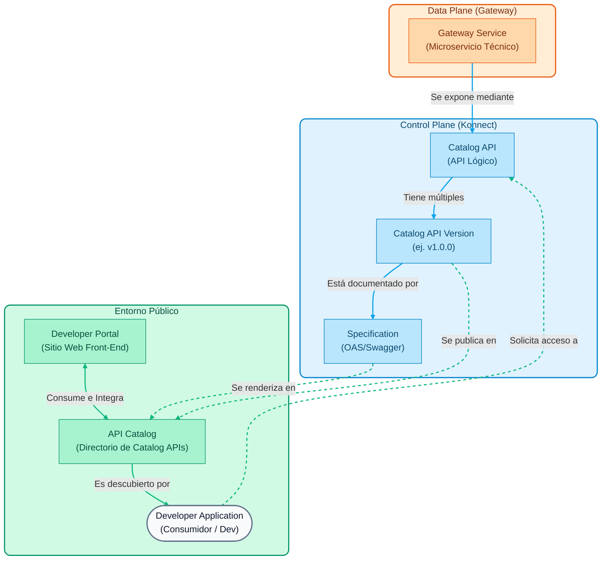

# Módulo 03: Kong Developer Portal

Este módulo está enfocado en cómo exponer nuestras APIs hacia los desarrolladores (internos o externos) utilizando el **Developer Portal** de Kong Konnect.

## Objetivos del Módulo

> **Nota General:** Todos los comandos `curl` detallados en las demostraciones de este módulo pueden ser reemplazados por ejecuciones directas desde tu cliente **Insomnia**, haciendo uso de la colección `insomnia_collection.json` provista en el repositorio.

1. **Habilitar el Developer Portal**: Configurar el portal en Kong Konnect.
2. **Publicar Especificaciones (OAS)**: Subir un archivo Swagger / OpenAPI para documentar nuestra API.
3. **Catálogo de APIs**: Configurar cómo los desarrolladores descubren y prueban los endpoints interactivamente.
4. **Onboarding de Desarrolladores**: Configurar y probar el ciclo de vida del Consumidor (registro en el portal, creación de aplicaciones y solicitud de acceso).
5. **Aprobación de Accesos**: Demostrar los flujos de "Auto-Aprove" (automático) y "Manual Approval" (aprobación del administrador).

---

## Conceptos Fundamentales del Developer Portal

Según la [Documentación Oficial del Dev Portal](https://developer.konghq.com/dev-portal/), el Developer Portal es la "cara" de tu programa de APIs. Es una herramienta diseñada para **simplificar la publicación de APIs, habilitar el autoservicio para los desarrolladores y centralizar la documentación**.

Antes de configurar nuestro portal público, es importante entender las abstracciones que utiliza Kong Konnect para separar la infraestructura **técnica** de la lógica de **negocio**.

### 1. Catalog APIs
* [Doc Oficial: API Catalog](https://docs.konghq.com/konnect/api-management/api-catalog/)*

Para comprender el Developer Portal, primero debemos diferenciar entre dos conceptos clave en Kong: la parte técnica y la parte de negocio.

- **La Parte Técnica (Gateway Service)**: Es la configuración interna. Incluye IPs, puertos, protocolos y rutas físicas. Es lo que Kong usa internamente para saber cómo llegar a tu servidor backend.
- **La Parte de Negocio (Catalog API)**: Es la "vitrina" o escaparate de tu servicio. Es la entidad lógica que agrupas, decoras y expones a tus consumidores (los desarrolladores).

Una **API del Catalog** funciona como el registro centralizado de tu interfaz. Es a esta API a la que los desarrolladores se suscribirán y explorarán. 

Para que esta "vitrina" sea completa y útil para un desarrollador externo, se compone de varias piezas clave (visibles cuando entras a configurar un API en Konnect):

* **Overview & Metadata**
  Aquí se define la identidad del API (nombre, descripción). Además, puedes asignar **etiquetas (labels)** y **atributos personalizados** que ayudan a los desarrolladores a filtrar y buscar APIs en portales muy grandes.

* **API Specification (OAS)**
  Es el corazón de la documentación técnica. Es un archivo estándar (OpenAPI/Swagger) que le enseña al portal cómo renderizar una consola interactiva ("Try it out"). Gracias a esto, el desarrollador puede ver qué endpoints existen, qué parámetros necesitan y enviar peticiones de prueba desde su propio navegador.

* **Documentation**
  A diferencia de la especificación técnica (OAS), aquí puedes agregar guías paso a paso, tutoriales o políticas de uso escritas en formato Markdown. Es ideal para dar contexto humano (ej. "Cómo obtener tu primer token").

* **Gateway**
  Es el "puente" que conecta esta entidad de negocio con la realidad técnica. Aquí vinculas tu Catalog API con el o los **Gateway Services** reales que procesarán el tráfico.

* **Portals**
  Una misma API puede estar publicada en múltiples Portales a la vez (por ejemplo, un portal interno para empleados y un portal externo para partners). Desde aquí controlas en qué vitrinas aparece.

* **Applications**
  Muestra qué desarrolladores y qué aplicaciones cliente se han registrado, suscrito y obtenido credenciales (API Keys) para consumir específicamente esta API.

### 2. Control de Versiones (Versions)
* [Doc Oficial: API Versions](https://docs.konghq.com/konnect/api-management/api-catalog/)*

Las APIs evolucionan con el tiempo. Kong permite gestionar múltiples versiones de una misma Catalog API (ej. `v1`, `v2`, `beta`). Cada versión funciona como una sub-entidad que puede tener vinculada su propia especificación, estar amarrada a un Gateway Service distinto y publicarse de forma independiente en el Developer Portal.

### 3. Specifications (OAS)
* [Doc Oficial: OpenAPI Specifications](https://docs.konghq.com/konnect/api-management/api-products/versions/specifications/)*

Para que un desarrollador pueda usar tu API, necesita documentación. Kong permite subir archivos en estándar **OpenAPI Specification (OAS)** —antes conocido como Swagger— en formato JSON o YAML. Esta especificación se renderiza de forma interactiva en el portal.

### 4. Developer Portal & API Catalog
* [Doc Oficial: Developer Portal](https://docs.konghq.com/konnect/api-management/dev-portal/)* | * [Doc Oficial: Service Catalog](https://developer.konghq.com/catalog/apis/)*

Es vital entender la diferencia y relación íntima entre el **Developer Portal** y el **API Catalog**:

- **API Catalog**: Es el repositorio centralizado o "escaparate" que indexa todos los *Catalog APIs* (y sus especificaciones) que tu organización ha decidido exponer. Funciona como la fuente única de la verdad de los servicios disponibles.
- **Developer Portal**: Es la interfaz web pública (o interna) interactiva. El Portal *consume* la información del API Catalog para presentarla a los desarrolladores de forma navegable. Mientras que el Catalog es la estructura de datos que categoriza tus APIs, el Portal es el sitio web personalizable (con marca, colores y URLs) donde los usuarios inician sesión.

A través del Portal y el Catalog integrado, se habilita el **Application Registration (Self-Service)**: Los desarrolladores se registran en el portal, navegan el catálogo, descubren un API, y crean "Aplicaciones" lógicas. Al hacerlo, el sistema aprovisiona automáticamente credenciales seguras (como API Keys) en el Gateway subyacente sin que los administradores tengan que intervenir.

- **Interactive Documentation**: Dentro del portal, los esquemas OAS del catálogo se renderizan proporcionando una consola interactiva ("Try it out") que genera fragmentos de código listos para usarse y permite lanzar peticiones de prueba directamente desde el navegador.

---

## Secuencia de Demostraciones

En esta sección, demostraremos cómo crear un "Catalog API" que agrupe nuestros servicios y cómo documentarlos para que los desarrolladores externos puedan interactuar con ellos mediante el Developer Portal.

> **Nota para el instructor**: Utilizaremos el archivo de especificación OpenAPI que ya está incluido en el repositorio para no tener que escribirlo desde cero. El archivo se encuentra en la ruta: `workshop-assets/dia-1/03-developer-portal/openapi_mock.yaml`.

### Demostración 1: Creación de un API en el Catalog

Una API en el Catalog es la entidad lógica que agrupa uno o más Gateway Services para ser presentados al consumidor final.

1. **Crear el API**

    - En el menú principal izquierdo de Konnect, navega a la sección **Catalog**.
    - Asegúrate de estar en la pestaña **APIs**.
    - En la esquina superior derecha, haz clic en el botón **New** y selecciona **API**.
    - **Name**: `MockAPI Gateway`
    - **Description**: `API para consulta de respuestas dinámicas generadas por MockAPI.`
    - Haz clic en **Save**.

2. **Vincular el Gateway Service**

    - Dentro de la configuración de tu nueva API (`MockAPI Gateway`), ve a la sección **Gateway Services**.
    - Haz clic en **Add Gateway Service**.
    - Selecciona el servicio creado en el módulo anterior (`mock-service`) y confirma.

### Demostración 2: Publicar la Documentación (OAS)

Para que los desarrolladores entiendan cómo consumir nuestra API, subiremos una especificación OpenAPI (Swagger).

1. **Subir el archivo YAML**

    - Dentro del API `MockAPI Gateway`, ve a la pestaña **Versions**.
    - Debería existir una versión por defecto (ej. `v1` o `1.0.0`). Entra en ella.
    - En la sección **Specifications**, haz clic en **Add Specification**.
    - Busca en tu explorador de archivos local y selecciona el archivo ubicado exactamente en: 
     `workshop-assets/dia-1/03-developer-portal/openapi_mock.yaml` (dentro de la carpeta de este proyecto).

    - Haz clic en **Save**.

2. **Publicar en el Portal**

    - Una vez subida, la especificación aparecerá en la lista pero puede estar en estado *Unpublished*.
    - Haz clic en el botón de opciones (tres puntos) junto a la especificación y selecciona **Publish**.
    - Ahora, publica también la versión del API habilitando el switch que indica "Publish to Portal" en la parte superior derecha.

### Demostración 2.5: Subir Documentación Complementaria (Markdown)

Además de la especificación técnica, un API Product suele acompañarse de guías y políticas.

1. **Subir Documentos Markdown**

    - En la página de detalles de tu API, navega a la pestaña **Documents**.
    - Haz clic en **Add Document**.
    - Busca y selecciona el archivo: `workshop-assets/dia-1/03-developer-portal/manual_usuario.md`.
    - Asigna el título "Manual de Usuario" y guárdalo/publícalo.
    - Repite el proceso para `condiciones_legales.md`, titulándolo "Términos y Condiciones".

### Demostración 3: Habilitar y Explorar el Developer Portal

Ahora vamos a habilitar la cara pública para los desarrolladores y probar nuestra documentación interactiva.

1. **Habilitar el Portal Público**

    - En el menú izquierdo, navega a **Developer Portal** (o **Portals**).
    - Selecciona el portal por defecto (Default Portal).
    - Haz clic en **Settings** y asegúrate de que el portal esté habilitado (botón **Enable Portal**).
    - *(Opcional)* Muestra a la audiencia cómo cambiar los colores de la marca en la sección **Appearance**.

2. **Acceder como Desarrollador Externo**

    - Copia la URL pública del portal (se encuentra en la vista principal del Portal, ej. `https://<tu-org>.developer.konnect.konghq.com`).
    - Abre una nueva pestaña de incógnito (o una ventana del navegador) y pega la URL.
    - Accede a la pestaña **API Catalog**.
    - Haz clic en la tarjeta `MockAPI Gateway`.

3. **Prueba Interactiva (Try it out)**

    - En la documentación interactiva desplegada, expande el endpoint `GET /mock`.
    - Podrás observar los esquemas de respuesta predefinidos en nuestro archivo YAML (estado de éxito y lista de datos mockeados devueltos por el backend).
    - La interfaz provee fragmentos de código autogenerados en múltiples lenguajes (curl, python, node, etc.) listos para ser copiados por los desarrolladores que consumirán el servicio.

---

### Demostración 4: Habilitar Autenticación y Application Registration

Para que los desarrolladores puedan solicitar acceso a nuestras APIs, primero debemos proteger el Portal y habilitar el registro de aplicaciones.

1. **Habilitar Autenticación en el Portal**
    - En el menú principal, dirígete a **Portals** y haz clic en tu **Default Portal**.
    - Ve a **Settings** -> **Authentication**.
    - Habilita la autenticación seleccionando **Konnect Identity** (esto permite a los usuarios registrarse con correo y contraseña directamente en la base de datos de Konnect).

2. **Habilitar "Application Registration" en el Portal**
    - Dentro del mismo **Default Portal**, ve a **Settings** -> **Application Registration**.
    - Haz clic en **Enable Application Registration**.
    - Guarda los cambios. Esto activará la funcionalidad en la UI del portal público para que los desarrolladores creen sus propias aplicaciones.

3. **Configurar el Auth Strategy en la API del Catalog**
    - Vuelve a la sección principal de **Catalog** y entra a `MockAPI Gateway`.
    - Navega a **Auth Requirements** en el menú izquierdo.
    - Haz clic en **New Auth Strategy**.
    - Selecciona **Key Auth** (esto define que las aplicaciones que soliciten acceso recibirán un token estático o API Key generado por Kong).
    - Haz clic en **Save**.

### Demostración 5: Flujo del Desarrollador (Self-Service Onboarding)

Ahora simularemos ser un desarrollador externo que desea consumir la API de MockAPI.

1. **Registro (Sign Up)**
    - Abre la pestaña de incógnito donde tienes el Developer Portal.
    - Refresca la página. Notarás un nuevo botón de **Log In / Sign Up** en la esquina superior derecha.
    - Haz clic en **Sign up**, llena un correo ficticio (ej. `dev@externo.com`) y una contraseña.
    - Konnect generará tu cuenta automáticamente y te dará acceso a tu dashboard de desarrollador.

2. **Crear una Aplicación**
    - Una vez logueado en el portal, ve a **My Apps** (Mis Aplicaciones).
    - Haz clic en **New App**.
    - Nombrala `Mobile Travel App` y añade una descripción breve. Haz clic en **Create**.

3. **Solicitar Acceso a la API (Request Access)**
    - Ve a la pestaña **API Catalog** y haz clic en `MockAPI Gateway`.
    - Como estás logueado y creaste una aplicación, ahora verás un botón **Request Access** en la esquina superior derecha.
    - Haz clic en él. Te pedirá seleccionar para qué aplicación quieres el acceso (elige `Mobile Travel App`).
    - Elige el método de autenticación (**Key Auth**) y haz clic en **Request Access**.

### Demostración 6: Aprobación de Accesos (Auto-Approve vs Manual)

Dependiendo de las políticas de la compañía, el acceso puede otorgarse instantáneamente o requerir intervención humana.

1. **Auto-Aprove (Comportamiento por Defecto)**
    - Inmediatamente después del paso anterior, el portal del desarrollador te mostrará un mensaje de éxito.
    - Te entregará en pantalla tu **API Key** recién generada (ej. `kpat_XXXX`).
    - *(Instructor)*: En este momento, Konnect se comunicó con el Data Plane y creó silenciosamente la credencial de Key Auth sin ninguna intervención del administrador. ¡Es la magia del Self-Service!

2. **Cambiar a Manual Approval**
    - Regresa a la consola administrativa de Konnect (vista del instructor).
    - Entra a **Catalog** -> `MockAPI Gateway` -> **Versions** -> selecciona la versión (`v1`).
    - Haz clic en el botón de edición y cambia la opción **Access Request Approval** de `Auto Approve` a `Require Manual Approval`.
    - Guarda los cambios.

3. **Prueba de Manual Approval**
    - En la ventana del desarrollador, crea una nueva aplicación llamada `B2B Partner App` y solicita acceso a la misma API.
    - Esta vez, la pantalla dirá **"Access Request Pending"** y no entregará la credencial.
    - Vuelve a la consola de Konnect como instructor y dirígete a **App Requests** en el menú izquierdo.
    - Verás la solicitud entrante (Pending). Selecciónala y haz clic en **Approve**.
    - *(Opcional)*: Si el desarrollador refresca su portal en este momento, verá su solicitud aprobada y podrá obtener su API Key.

### Demostración 7: Customización del Portal (Páginas, Apariencia y Snippets)

Para adaptar el portal al "look and feel" de nuestra organización y proveer contenido útil, Konnect provee herramientas avanzadas de personalización basadas en Markdown y YAML Frontmatter.

1. **Apariencia Global (Appearance)**
    - En el menú del portal (**Portals** -> **Default Portal**), ve a **Appearance**.
    - Muestra cómo cambiar los colores principales (Brand Color) y las fuentes.
    - Sube un logo personalizado si lo deseas. Estos cambios se reflejarán inmediatamente en todo el portal.

2. **Edición de Páginas (Markdown + Frontmatter)**
    - Ve a la sección **Content** dentro de tu portal.
    - Selecciona la página **home** para abrir el Editor de Contenido.
    - Explica la estructura de la página: 
     - El **Frontmatter** (entre `---`) donde se definen metadatos como el `title`.
     - Los **Componentes UI** de Kong inyectados vía sintaxis especial, por ejemplo, `::page-hero` o `::page-section`. Estos permiten crear secciones responsivas inyectando CSS directamente, como `title-font-size` o `color`.
    - Modifica el texto de bienvenida en la página (ej. cambia "Kong API Dev Portal" a "MockAPI Developer Hub") y haz clic en **Save** -> **Publish**.

3. **Uso de Snippets (Contenido Reutilizable)**
    - Los Snippets permiten crear bloques de contenido que se pueden repetir en varias páginas (como un footer o un banner de aviso).
    - En el editor de **Content**, cambia a la pestaña **Snippets** en la barra lateral izquierda.
    - Haz clic en **+ New snippet**.
    - Nómbralo `banner-soporte` y escribe un texto en Markdown: `> **Soporte:** Para ayuda con APIs, contacta a dev-support@mock.com`.
    - Guarda el snippet. Regresa a la página **home**, e inyecta el snippet al final del documento usando la sintaxis: `<%- include('banner-soporte') %>`. Publica los cambios y verifica en la pestaña de incógnito.

4. **Navegación (Navigation)**
    - Finalmente, ve a **Navigation** en el menú del portal.
    - Esto controla el menú superior y el *footer* de la página pública.
    - Haz clic en **+ New Link**, nombra el enlace "Soporte Técnico" y apunta la URL a `https://support.mock.com` (o la ruta que prefieras).
    - Guarda y verifica cómo el menú del Developer Portal ahora contiene este nuevo acceso directo.

---

## Resumen

Has logrado agrupar servicios técnicos en una **Catalog API** de negocio y exponerlo exitosamente de forma interactiva. Además, demostraste el valor inmenso de Kong Konnect como plataforma de autoservicio: permitiendo a los desarrolladores hacer su propio onboarding, registrar aplicaciones y obtener credenciales de forma automatizada o gobernada por administradores.
