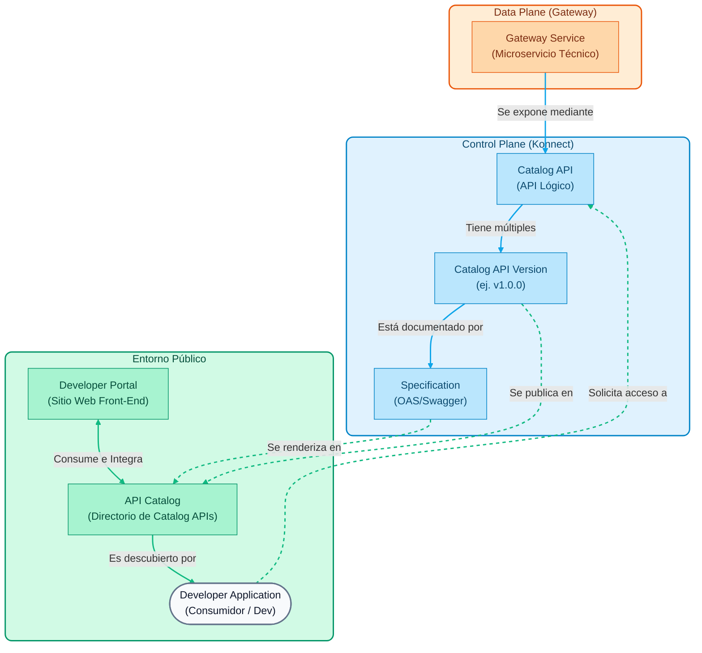

# Módulo 03: Kong Developer Portal

Este módulo está enfocado en cómo exponer nuestras APIs hacia los desarrolladores (internos o externos) utilizando el **Developer Portal** de Kong Konnect.

## Objetivos do Módulo

> **Nota Geral:** Todos os comandos `curl` detalhados nas demos deste módulo podem ser substituídos por execuções diretas do seu cliente **Insomnia**, fazendo uso da coleção `insomnia_collection.json` fornecida no repositório.

1. **Habilitar o Portal do Desenvolvedor**: Configure o portal no Kong Konnect.
2. **Especificações de publicação (OAS)**: Faça upload de um arquivo Swagger/OpenAPI para documentar nossa API.
3. **Catálogo de APIs**: configure como os desenvolvedores descobrem e testam endpoints de forma interativa.
4. **Developer Onboarding**: Configurar e testar o ciclo de vida do Consumidor (cadastro no portal, criação de aplicações e solicitação de acesso).
5. **Aprovação de acesso**: Demonstra os fluxos de "Aprovação automática" (automática) e "Aprovação manual" (aprovação do administrador).

---

## Conceitos Fundamentais do Portal do Desenvolvedor

De acordo com a [documentação oficial do Dev Portal](https://developer.konghq.com/dev-portal/), o Developer Portal é a "cara" do seu programa API. É uma ferramenta projetada para **simplificar a publicação de APIs, permitir o autoatendimento para desenvolvedores e centralizar a documentação**.

Antes de configurar nosso portal público, é importante entender as abstrações que Kong Konnect usa para separar a infraestrutura **técnica** da lógica **de negócios**.

## # 1. APIs de catálogo
* [Documento oficial: Catálogo de API](https://docs.konghq.com/konnect/api-management/api-catalog/)*

Para entender o Portal do Desenvolvedor, devemos primeiro diferenciar dois conceitos-chave do Kong: a parte técnica e a parte comercial.

- **A Parte Técnica (Gateway Service)**: É a configuração interna. Inclui IPs, portas, protocolos e rotas físicas. É o que Kong usa internamente para saber como acessar seu servidor backend.
- **A Parte Negócio (API de Catálogo)**: É a “vitrine” ou vitrine do seu serviço. É a entidade lógica que você agrupa, decora e expõe aos seus consumidores (os desenvolvedores).

Uma **API de catálogo** funciona como o registro centralizado da sua interface. É esta API que os desenvolvedores irão assinar e explorar. 

Para que esta “vitrine” seja completa e útil para um desenvolvedor externo, ela é composta por várias peças-chave (visíveis quando você vai configurar uma API no Konnect):

* **Visão geral e metadados**
  Aqui é definida a identidade da API (nome, descrição). Além disso, você pode atribuir **rótulos** e **atributos personalizados** que ajudam os desenvolvedores a filtrar e pesquisar APIs em portais muito grandes.

* **Especificação de API (OEA)**
  É o coração da documentação técnica. É um arquivo padrão (OpenAPI/Swagger) que ensina ao portal como renderizar um console interativo ("Experimente"). Graças a isso, o desenvolvedor pode ver quais endpoints existem, quais parâmetros eles precisam e enviar solicitações de teste de seu próprio navegador.

* **Documentação**
  Ao contrário da especificação técnica (OEA), aqui você pode adicionar guias passo a passo, tutoriais ou políticas de uso escritas em formato Markdown. É ótimo para fornecer contexto humano (por exemplo, "Como obter seu primeiro token").

* **Portal**
  É a “ponte” que liga esta entidade empresarial à realidade técnica. Aqui você vincula sua API de catálogo aos **Serviços de gateway** reais que processarão o tráfego.

* **Portais**
  A mesma API pode ser publicada em vários Portais ao mesmo tempo (por exemplo, um portal interno para funcionários e um portal externo para parceiros). A partir daqui você controla em quais vitrines ele aparece.

* **Aplicativos**
  Mostra quais desenvolvedores e aplicativos clientes registraram, assinaram e obtiveram credenciais (chaves de API) para consumir especificamente esta API.

## # 2. Controle de Versão (Versões)
* [Documento oficial: versões da API](https://docs.konghq.com/konnect/api-management/api-catalog/)*

As APIs evoluem com o tempo. Kong permite que você gerencie várias versões da mesma API de catálogo (por exemplo, `v1`, `v2`, `beta`). Cada versão funciona como uma subentidade que pode ter sua própria especificação vinculada, ser vinculada a um Gateway Service diferente e ser publicada de forma independente no Portal do Desenvolvedor.

## # 3. Especificações (OEA)
* [Documento oficial: Especificações OpenAPI](https://docs.konghq.com/konnect/api-management/api-products/versions/specifications/)*

Para que um desenvolvedor use sua API, ele precisa de documentação. Kong permite fazer upload de arquivos no padrão **OpenAPI Specification (OAS)** —anteriormente conhecido como Swagger— no formato JSON ou YAML. Esta especificação é renderizada interativamente no portal.

## # 4. Portal do desenvolvedor e catálogo de API
* [Documento oficial: Portal do desenvolvedor](https://docs.konghq.com/konnect/api-management/dev-portal/)* | * [Documento oficial: Catálogo de serviços](https://developer.konghq.com/catalog/apis/)*

É vital compreender a diferença e a relação íntima entre o **Portal do Desenvolvedor** e a **API de Catálogo**:

- **Catálogo de APIs**: É o repositório centralizado ou “vitrine” que indexa todas as *APIs de Catálogo* (e suas especificações) que sua organização decidiu expor. Ele serve como a única fonte de verdade para os serviços disponíveis.
- **Portal do Desenvolvedor**: É a interface web interativa pública (ou interna). O Portal *consome* as informações do Catálogo de APIs para apresentá-las aos desenvolvedores de forma navegável. Enquanto o Catálogo é a estrutura de dados que categoriza suas APIs, o Portal é o site personalizável (com marca, cores e URLs) onde os usuários fazem login.
Através do Portal e do Catálogo integrado, o **Cadastro de Aplicativos (Autoatendimento)** é habilitado: Desenvolvedores se cadastram no portal, navegam no catálogo, descobrem uma API e criam "Aplicativos" lógicos. Ao fazer isso, o sistema provisiona automaticamente credenciais seguras (como chaves de API) para o gateway subjacente sem exigir a intervenção dos administradores.

- **Documentação interativa**: Dentro do portal, os esquemas OAS do catálogo são renderizados fornecendo um console interativo ("Experimente") que gera fragmentos de código prontos para uso e permite iniciar solicitações de teste diretamente do navegador.

---

## Sequência de Demonstração

Nesta seção, demonstraremos como criar um “Catálogo de APIs” que agrupe nossos serviços e como documentá-los para que desenvolvedores terceiros possam interagir com eles por meio do Portal do Desenvolvedor.

> **Nota para o instrutor**: Usaremos o arquivo de especificação OpenAPI que já está incluído no repositório para não precisarmos escrevê-lo do zero. O arquivo está localizado no caminho: `workshop-assets/dia-1/03-developer-portal/openapi_mock.yaml`.

## # Demonstração 1: Criando uma API no Catálogo

Uma API no Catálogo é a entidade lógica que agrupa um ou mais Gateway Services para serem apresentados ao consumidor final.

1. **Crie a API**

    - No menu principal esquerdo do Konnect, navegue até a seção **Catálogo**.
    - Verifique se você está na guia **APIs**.
    - No canto superior direito, clique no botão **Novo** e selecione **API**.
    - **Nome**: `Gateway MockAPI`
    - **Descrição**: `API para consultar respostas dinâmicas geradas por MockAPI.`
    - Clique em **Salvar**.

2. **Vincular o serviço de gateway**

    - Dentro da configuração da sua nova API (`MockAPI Gateway`), acesse a seção **Gateway Services**.
    - Clique em **Adicionar serviço de gateway**.
- Selecione o serviço criado no módulo anterior (`mock-service`) e confirme.

## # Demonstração 2: Publicação de Documentação (OEA)

Para ajudar os desenvolvedores a entender como consumir nossa API, faremos upload de uma especificação OpenAPI (Swagger).

1. **Carregar arquivo YAML**

    - Dentro da API `MockAPI Gateway`, acesse a aba **Versões**.
    - Deve haver uma versão padrão (por exemplo, `v1` ou `1.0.0`). Digite-o.
    - Na seção **Especificações**, clique em **Adicionar Especificação**.
    - Pesquise no seu explorador de arquivos local e selecione o arquivo localizado exatamente em: 
     `workshop-assets/dia-1/03-developer-portal/openapi_mock.yaml` (dentro desta pasta do projeto).

    - Clique em **Salvar**.

2. **Publicar no Portal**

    - Depois de carregada, a especificação aparecerá na lista, mas poderá estar no status *Não publicada*.
    - Clique no botão de opções (três pontos) ao lado da especificação e selecione **Publicar**.
    - Agora, publique também a versão da API habilitando o switch que indica “Publicar no Portal” no canto superior direito.

## # Demo 2.5: Upload de Documentação Complementar (Markdown)

Além da especificação técnica, um Produto API geralmente vem acompanhado de guias e políticas.

1. **Carregar documentos de descontos**

    - Na página de detalhes da API, navegue até a guia **Documentos**.
    - Clique em **Adicionar Documento**.
    - Pesquise e selecione o arquivo: `workshop-assets/dia-1/03-developer-portal/manual_usuario.md`.
    - Atribua o título "Manual do Usuário" e salve/publique-o.
    - Repita o processo para `legal_conditions.md`, intitulando-o "Termos e Condições".

## # Demonstração 3: habilite e explore o portal do desenvolvedor

Agora vamos habilitar a face pública para desenvolvedores e testar nossa documentação interativa.

1. **Ative o Portal Público**

    - No menu esquerdo, navegue até **Portal do Desenvolvedor** (ou **Portais**).
- Selecione o portal padrão (Portal Padrão).
    - Clique em **Configurações** e certifique-se de que o portal esteja habilitado (botão **Ativar Portal**).
    - *(Opcional)* Mostre ao público como alterar as cores da marca na seção **Aparência**.

2. **Acesso como desenvolvedor externo**

    - Copie a URL pública do portal (encontrada na visualização principal do Portal, por exemplo, `https://<sua-org>.developer.konnect.konghq.com`).
    - Abra uma nova guia anônima (ou janela do navegador) e cole o URL.
    - Acesse a aba **Catálogo de APIs**.
    - Clique no cartão `MockAPI Gateway`.

3. **Teste interativo (experimente)**

    - Na documentação interativa implantada, expanda o endpoint `GET /mock`.
    - Você poderá ver os esquemas de resposta predefinidos em nosso arquivo YAML (status de sucesso e lista de dados simulados retornados pelo backend).
    - A interface fornece fragmentos de código gerados automaticamente em múltiplas linguagens (curl, python, node, etc.) prontos para serem copiados pelos desenvolvedores que irão consumir o serviço.

---

## # Demonstração 4: Habilitar autenticação e registro de aplicativos

Para que os desenvolvedores solicitem acesso às nossas APIs, devemos primeiro proteger o Portal e ativar o registro do aplicativo.

1. **Habilitar Autenticação no Portal**
    - No menu principal, acesse **Portais** e clique em seu **Portal Padrão**.
    - Vá para **Configurações** -> **Autenticação**.
    - Habilite a autenticação selecionando **Konnect Identity** (isso permite que os usuários se registrem com e-mail e senha diretamente no banco de dados Konnect).

2. **Ative o "Registro de Aplicativo" no Portal**
    - Dentro do mesmo **Portal Padrão**, acesse **Configurações** -> **Cadastro do Aplicativo**.
    - Clique em **Ativar registro de aplicativo**.
- Salve as alterações. Isso permitirá a funcionalidade na interface do portal público para que os desenvolvedores criem seus próprios aplicativos.

3. **Configure a estratégia de autenticação na API de catálogo**
    - Volte para a seção principal **Catálogo** e digite `MockAPI Gateway`.
    - Navegue até **Requisitos de autenticação** no menu esquerdo.
    - Clique em **Nova estratégia de autenticação**.
    - Selecione **Key Auth** (isso define que os aplicativos que solicitarem acesso receberão um token estático ou chave de API gerada pelo Kong).
    - Clique em **Salvar**.

## # Demonstração 5: Fluxo do desenvolvedor (integração de autoatendimento)

Agora fingiremos ser um desenvolvedor terceirizado que deseja consumir a API MockAPI.

1. **Inscrição (Inscreva-se)**
    - Abra a guia anônima onde você tem o Portal do Desenvolvedor.
    - Atualize a página. Você notará um novo botão **Log In / Sign Up** no canto superior direito.
    - Clique em **Cadastre-se**, preencha um e-mail fictício (por exemplo, `dev@externo.com`) e uma senha.
    - O Konnect gerará automaticamente sua conta e lhe dará acesso ao painel do desenvolvedor.

2. **Crie um aplicativo**
    - Uma vez logado no portal, vá para **Meus Aplicativos**.
    - Clique em **Novo aplicativo**.
    - Nomeie-o como `Mobile Travel App` e adicione uma breve descrição. Clique em **Criar**.

3. **Solicitar acesso à API (Solicitar acesso)**
    - Vá para a aba **Catálogo de APIs** e clique em `MockAPI Gateway`.
    - Como você fez login e criou um aplicativo, agora você verá um botão **Solicitar acesso** no canto superior direito.
    - Clique nele. Ele solicitará que você selecione qual aplicativo deseja acessar (escolha `Mobile Travel App`).
    - Escolha o método de autenticação (**Key Auth**) e clique em **Solicitar Acesso**.

## # Demonstração 6: Aprovação de acesso (aprovação automática vs manual)

Dependendo das políticas da empresa, o acesso pode ser concedido instantaneamente ou exigir intervenção humana.
1. **Aprovação automática (comportamento padrão)**
    - Imediatamente após a etapa anterior, o portal do desenvolvedor mostrará uma mensagem de sucesso.
    - Ele fornecerá sua **chave de API** recém-gerada na tela (por exemplo, `kpat_XXXX`).
    - *(Instrutor)*: Neste momento, Konnect contatou o Data Plane e criou silenciosamente a credencial Key Auth sem qualquer intervenção do administrador. É a magia do Autoatendimento!

2. **Mudar para aprovação manual**
    - Retorne ao console administrativo do Konnect (visualização do instrutor).
    - Vá para **Catálogo** -> `MockAPI Gateway` -> **Versões** -> selecione a versão (`v1`).
    - Clique no botão editar e altere a opção **Aprovação de solicitação de acesso** de `Aprovação automática` para `Exigir aprovação manual`.
    - Salve as alterações.

3. **Teste de aprovação manual**
    - Na janela do desenvolvedor, crie um novo aplicativo chamado `B2B Partner App` e solicite acesso à mesma API.
    - Desta vez, a tela dirá **"Solicitação de Acesso Pendente"** e não entregará a credencial.
    - Retorne ao console Konnect como instrutor e vá para **Solicitações de aplicativos** no menu esquerdo.
    - Você verá a solicitação recebida (Pendente). Selecione-o e clique em **Aprovar**.
    - *(Opcional)*: Se o desenvolvedor atualizar seu portal neste momento, ele verá sua solicitação aprovada e poderá obter sua chave de API.

## # Demonstração 7: Personalização do Portal (Páginas, Aparência e Snippets)

Para adaptar o portal à "aparência" da nossa organização e fornecer conteúdo útil, Konnect fornece ferramentas avançadas de personalização baseadas em Markdown e YAML Frontmatter.

1. **Aparência Global**
    - No menu do portal (**Portais** -> **Portal Padrão**), vá em **Aparência**.
    - Mostra como alterar as cores principais (Brand Color) e fontes.
    - Faça upload de um logotipo personalizado, se desejar. Estas alterações serão refletidas imediatamente em todo o portal.
2. **Edição de página (Markdown + Frontmatter)**
    - Vá para a seção **Conteúdo** do seu portal.
    - Selecione a **página inicial** para abrir o Editor de Conteúdo.
    - Explique a estrutura da página: 
     - O **Frontmatter** (entre `---`) onde metadados como o `title` são definidos.
     - Kong **UI Components** injetados por meio de sintaxe especial, por ex. `::page-hero` ou `::page-section`. Eles permitem que você crie seções responsivas injetando CSS diretamente, como `title-font-size` ou `color`.
    - Modifique o texto de boas-vindas na página (por exemplo, altere "Kong API Dev Portal" para "MockAPI Developer Hub") e clique em **Salvar** -> **Publicar**.

3. **Uso de Snippets (Conteúdo Reutilizável)**
    - Os snippets permitem criar blocos de conteúdo que podem ser repetidos em diversas páginas (como um rodapé ou um banner de aviso).
    - No editor de **Conteúdo**, alterne para a guia **Snippets** na barra lateral esquerda.
    - Clique em **+ Novo trecho**.
    - Nomeie-o como `banner-support` e escreva algum texto em Markdown: `> **Support:** Para ajuda com APIs, entre em contato com dev-support@mock.com`.
    - Salve o trecho. Retorne à página **home** e injete o snippet no final do documento usando a sintaxe: `<%- include('banner-support') %>`. Publique as alterações e verifique na guia anônima.

4. **Navegação**
    - Por fim, vá para **Navegação** no menu do portal.
    - Isto controla o menu superior e o *rodapé* da página pública.
    - Clique em **+ Novo Link**, nomeie o link como "Suporte Técnico" e aponte a URL para `https://support.mock.com` (ou qualquer caminho que você preferir).
    - Salve e verifique como o menu do Portal do Desenvolvedor agora contém esse novo atalho.

---

## Resumo
Você conseguiu agrupar serviços técnicos em uma **API de catálogo** comercial e expô-los de forma interativa. Além disso, você demonstrou o imenso valor do Kong Konnect como plataforma de autoatendimento: permitindo que os desenvolvedores façam sua própria integração, registrem aplicativos e obtenham credenciais de forma automatizada ou controlada por administrador.
