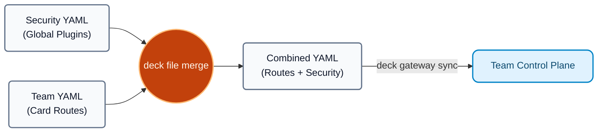
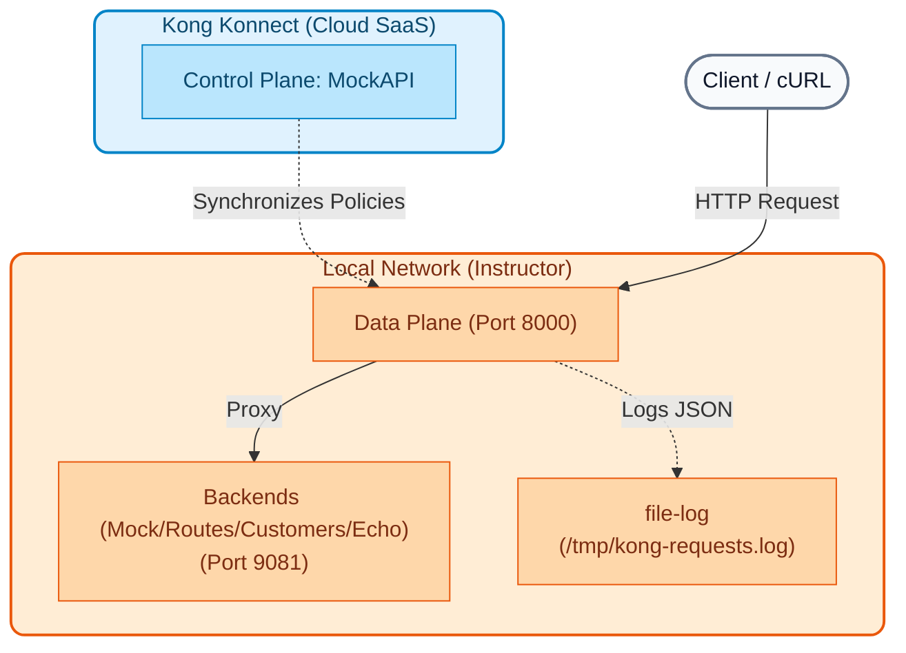

# Module 04: Gateway Operations (IaC)

This module introduces operations and security teams to best practices for managing Kong Konnect at an enterprise scale, using modern automation tools and declarative approaches.

---

## Module Objectives
1. Understand the difference between managing Kong using graphical interfaces (UI) and automated flows (GitOps).
2. Comprehend how to use **Terraform** to provision base infrastructure (Control Planes, Teams).
3. Master **decK**, Kong's official declarative configuration tool.
4. Design segregated architectures using multiple Control Planes.
5. Promote global security and observability standards without duplicating configuration.

---

## Theoretical Concepts

Before interacting with the tools, it is essential to establish the architectural and operational patterns that ensure resilience and security in complex environments.

### Infrastructure as Code (IaC) and GitOps
Managing Kong through the Konnect UI is excellent for development environments and for visualizing traffic, but it does not scale in production. Human errors, lack of version control, and unaudited changes ("drift") can lead to massive outages.
Through **GitOps**, the desired state of all APIs and security policies lives in Git repositories as text files (YAML, HCL). Tools like Terraform and decK read these files and automatically synchronize them to Kong Konnect via CI/CD pipelines.

### decK: Declarative Configuration
**decK (declarative Kong)** is an official CLI tool that allows managing the state of Control Planes.
Instead of making 10 REST API calls to create a service, 5 routes, and 4 plugins, decK takes a YAML file with the entire desired state and internally calculates the difference ("diff") with what currently exists in Konnect, executing only the necessary updates.

Key commands:

- `deck gateway ping` → Verifies authentication with Konnect.
- `deck gateway dump` → Exports the current Gateway configuration to a YAML file (backup).
- `deck gateway diff` → Shows what would change, without modifying anything (preview, ideal for Pull Requests).
- `deck gateway apply` → Adds/modifies what is declared **without deleting** what already exists (safe merge).
- `deck gateway sync` → Makes the CP state **exactly** what the file says (deletes anything not declared, ensuring no "ghost" entities).

### Multiple Control Planes and Separation of Responsibilities

In medium and large organizations, a single Control Plane can become an organizational bottleneck and a single point of failure (Blast Radius). Kong Konnect allows creating **multiple logical Control Planes** instantly, acting as completely isolated partitions.

**Why divide them and what are the most common use cases?**

1. **By Network Topology (Internal vs. External Traffic):**
   In an Enterprise environment, you never mix public and private traffic. You can have a Control Plane called `External-CP` (exposed to the Internet, with strict WAF and Rate Limiting rules) and another `Internal-CP` (only accessible by the Intranet, without heavy encryption to optimize latency).
   
2. **By Software Development Life Cycle (SDLC) Environments:**
   To isolate testing from production. It is standard to have `Dev-CP`, `QA-CP`, and `Prod-CP`. If a developer breaks a route while testing a plugin in `Dev-CP`, the Production Data Planes are unaffected.

3. **By Business Domains (Mesh Architecture / Micro-Gateways):**
   The "Payments" team manages its own `Payments-CP` and the "Shipping" team manages its `Logistics-CP`. Each team has total autonomy over their routes and plugins without the risk of overwriting each other's configuration (reducing the *Blast Radius* or impact radius in case of errors).

### Infrastructure as Code (IaC) and GitOps
Kong promotes platform teams adopting IaC to manage these multiple environments. Instead of clicking through an interface, administrators define the desired state in Git repositories, and tools like Terraform or decK apply those changes. This allows for auditing, fast *rollbacks*, and the elimination of "handcrafted" configurations.

### decK: Declarative Gateway Configuration
Kong provides **decK** (Declarative Configuration for Kong), a CLI tool written in Go focused on the *Gateway* (Data Plane). It allows exporting and importing the configuration of routes, services, and plugins in YAML format (known as *Kong Declarative Configuration*). decK compares the state of the YAML with the current state of the Gateway and applies only the difference (diff) idempotently.

### kongctl: Declarative Platform Configuration (Konnect)
While `decK` handles routes and plugins (Gateway level), **kongctl** is Kong's new CLI tool specifically designed to manage the **Kong Konnect** platform at a higher level.

With `kongctl` you can manage Konnect's "native" cloud resources using YAML, such as:
- Creation and management of **Control Planes**.
- Management of **API Catalog** entities and Developer Portals.
- User and team (RBAC) administration.

In modern Konnect architectures, `kongctl` and `decK` work together: you use `kongctl` to provision the base infrastructure (the Control Plane and the Portal) and you use `decK` to populate that Control Plane with your APIs' routing and security rules.

### Promotion Between Environments (CI/CD) and Specific Variables

When working with multiple environments (e.g., `Dev-CP` ➔ `QA-CP` ➔ `Prod-CP`), it is essential to understand that there are **two parallel but distinct information flows** when promoting configurations:

| Configuration Type | Is it promoted? | Examples |
| :--- | :---: | :--- |
| **Logical Configuration** | ✅ Yes | Business rules, plugins (Rate Limiting), routes (`/api/v1/payments`). This YAML file travels intact from Development to Production to ensure consistency. |
| **Environment-Specific** | ❌ No | Backend IPs (`10.0.0.5` vs `192.168.1.100`), SSL certificates, secrets. This information **belongs to the environment** and never travels with the code. |

!!! info "How does decK handle this?"
    decK solves this by using **Environment Variables**. In your YAML file, instead of putting a fixed production IP, you place a variable:
    ```yaml
    url: ${{ env "BACKEND_PAYMENTS_URL" }}
    ```
    When executing `deck gateway sync` in your pipeline (CI/CD), decK injects the specific values for that environment on the fly. This way, the **same YAML file** serves all environments.
### The "Global Control Plane" Pattern

Imagine you work at a large bank with 50 different development teams (Cards, Loans, Investments, etc.). To avoid bottlenecks, you give each team **its own Control Plane** in Kong Konnect so they can manage their routes with total autonomy.

!!! warning "The Security Challenge"
    One day, the **CISO (Security Department)** issues an non-negotiable directive: *"Absolutely all HTTP traffic in the company must be logged in a central system (Log) and a Correlation Header must be injected for traceability"*.
    
    How do you apply this mandatory rule without having to manually configure the plugins in all 50 Control Planes one by one (and praying that no developer deletes them by mistake)?

This is where decK's declarative power shines using the **Global Control Plane** pattern:

1. **Global Definition:** The Platform/Security team creates a "master" YAML file that contains *only* the mandatory plugins (e.g., `file-log`, `correlation-id`).
2. **Automatic Merge:** In the deployment pipelines (CI/CD) of the 50 teams, just before applying changes, the pipeline automatically executes the `deck file merge` command. This command takes the Cards team's YAML (which only knows about its own routes) and **merges** it with the Global Security YAML.
3. **Transparent Inheritance:** When the final configuration is synchronized, the Cards team's services automatically inherit the corporate security policies, without developers having had to touch them.



---

## Reference Architecture

In the following demonstrations, the instructor will build the following automated architecture step-by-step:



> **Summary of final state:**
> We will have 1 logical Control Plane in the cloud (MockAPI) and 1 local physical Gateway managing traffic for multiple simulated microservices.

---

## Demonstration Sequence

Before starting the Day 2 demonstrations, you must **destroy and clean up** the environment that was automatically set up in the Day 1 Setup module. If you don't, Terraform will tell you "no changes to apply" and you won't be able to show how the infrastructure is created live.

Run the following from the project root to clean everything:

```bash
# 1. Clean up local Gateway containers and residual state
./docs/00-setup-entorno/scripts/reset_all.sh

# 2. Destroy the Control Plane in Konnect using Terraform
cd docs/00-setup-entorno/terraform
terraform destroy -var="konnect_token=$KONNECT_TOKEN" -var="demo_prefix=$DEMO_PREFIX" -auto-approve
```

### Demonstration 1: Infrastructure Governance (Terraform)
Terraform will be used to automatically provision the base "MockAPI" Control Plane and RBAC Teams in Konnect.

1. **Initialize and validate Terraform:**
    ```bash
    cd docs/00-setup-entorno/terraform
    terraform init
    terraform validate
    ```
2. **Apply the changes:** (this will create 1 Control Plane named MockAPI and the API Developers team).
    ```bash
    terraform apply -var="konnect_token=$KONNECT_TOKEN" -var="demo_prefix=$DEMO_PREFIX"
    ```
3. The instructor will visually show in Konnect (**Gateway Manager** and **Teams**) that the Control Plane and Group were successfully created in seconds, eliminating manual processes.

### Demonstration 2: Data Plane Deployment
To materialize traffic, we will bring up the engine (Data Plane) that will securely consume Konnect's configuration (mTLS).

1. The instructor will generate the necessary secure certificates to connect the Data Plane to the MockAPI Control Plane:
    ```bash
    cd ../scripts
    python3 generate_certs.py
    ```
    > **Note:** `generate_certs.py` (requires `KONNECT_TOKEN` and `DEMO_PREFIX`, set by `kong-env`) generates `certs/mock/tls.key`, `certs/mock/tls.crt` and `endpoints.env` locally. These files are **not versioned** in the repository (private keys and organization endpoints): each participant generates them with this step. See `endpoints.env.example` for the format.

2. The Docker instance will be started (Data Plane on port 8000):
    ```bash
    ./start_dps.sh
    ```
3. The instructor will show in Konnect how the MockAPI Control Plane reports `1 Data Plane In Sync`, demonstrating that the local Edge node is ready to receive policies.

### Demonstration 3: Permission Isolation (RBAC and Teams)
To test the organizational security implemented with Terraform:

1. The instructor will show the **Teams** section in Konnect.
2. They will validate that the created group (`API Developers`) has an **Admin** role only for the `MockAPI` Control Plane, allowing developers to operate securely and within defined limits.

### Demonstration 4: Declarative Synchronization with decK (Routes and Global Policies)
Next, we will use `decK` to immutably load the routes of our 4 simulated microservices (`/mock`, `/routes`, `/customers`, `/echo`) along with global Log policies (`file-log`) and traceability (`correlation-id`).

1. The instructor will review the `archivos-deck/estado-base.yaml` file, showing how routes and global plugins are declared in a combined manner.
2. They will perform a `diff` and then a `sync` to inject this state into the `MockAPI` Control Plane:
    ```bash
    cd ../dia-1-teoria-y-demos/04-gateway-operations
    deck gateway diff archivos-deck/estado-base.yaml --konnect-token "$KONNECT_TOKEN" --konnect-control-plane-name "${DEMO_PREFIX}_MockAPI"
    deck gateway sync archivos-deck/estado-base.yaml \
        --konnect-token \
        "$KONNECT_TOKEN" \
        --konnect-control-plane-name \
        "${DEMO_PREFIX}_MockAPI"
    ```
3. The instructor will generate bursts of traffic through the local Data Plane (port 8000) to validate that the routes and policies operate successfully:
    ```bash
    curl -i http://localhost:8000/mock
    for i in {1..100}; do curl -s -o /dev/null http://localhost:8000/mock; done
    ```
4. Finally, they will extract the audits written in real-time by the `file-log` plugin (globally declared in the YAML) to validate its application:
    ```bash
    docker exec kong-dp wc -l /tmp/kong-requests.log
    ```

With the automated infrastructure ready (Control Plane and Data Plane) and the base traffic declaratively established using decK, the environment is prepared to begin the Monitoring and Observability Module (Day 2).

---

## Cleanup: Total Reset (Instructor Only)

If it is necessary to repeat the workshop or clean the environment, this script removes Docker containers and Konnect CPs:

```bash
cd workshop-assets/dia-1/04-gateway-operations
./scripts/reset_all.sh
```