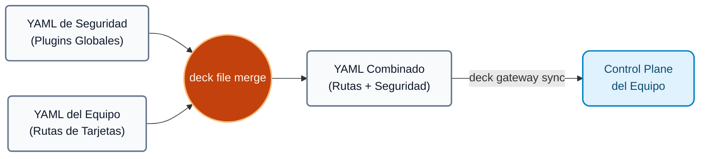
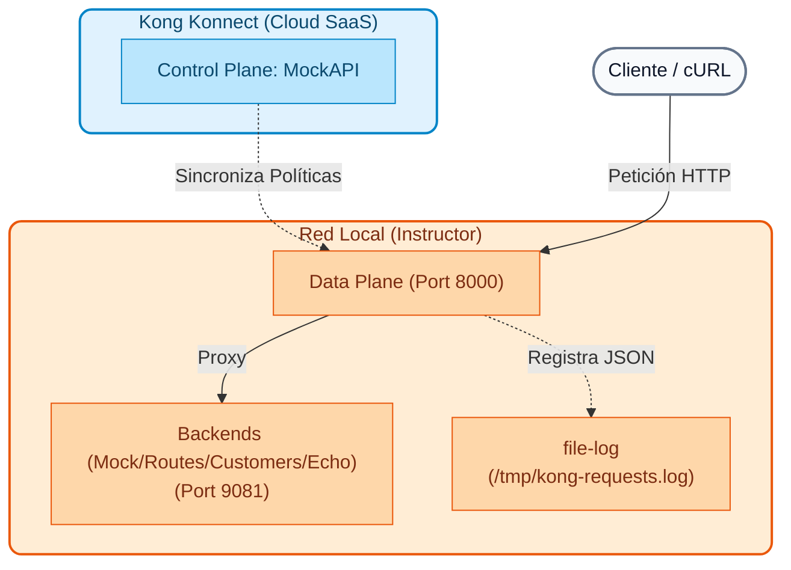

# Módulo 04: Gateway Operations (IaC)

Este módulo introduce a los equipos de operaciones y seguridad a las mejores prácticas de administración de Kong Konnect a escala empresarial, utilizando herramientas modernas de automatización y enfoques declarativos.

---

## Objetivos del Módulo
1. Entender la diferencia entre la administración de Kong mediante interfaces gráficas (UI) y flujos automatizados (GitOps).
2. Comprender cómo utilizar **Terraform** para aprovisionar infraestructura base (Control Planes, Equipos).
3. Dominar **decK**, la herramienta oficial de configuración declarativa de Kong.
4. Diseñar arquitecturas segregadas mediante múltiples Control Planes.
5. Promover estándares globales de seguridad y observabilidad sin duplicar configuración.

---

## Conceptos Teóricos

Antes de interactuar con las herramientas, es fundamental asentar los patrones arquitectónicos y operativos que garantizan la resiliencia y seguridad en entornos complejos.

### Infraestructura como Código (IaC) y GitOps
Administrar Kong a través de la UI de Konnect es excelente para entornos de desarrollo y para visualizar el tráfico, pero no escala en producción. Los errores humanos, la falta de control de versiones y los cambios sin auditoría ("drift") pueden provocar caídas masivas (outages).
Mediante **GitOps**, el estado deseado de todas las APIs y políticas de seguridad vive en repositorios Git como archivos de texto (YAML, HCL). Herramientas como Terraform y decK leen estos archivos y los sincronizan automáticamente a Kong Konnect a través de pipelines de CI/CD.

### decK: Configuración Declarativa
**decK (declarative Kong)** es una herramienta CLI oficial que permite gestionar el estado de los Control Planes. 
En lugar de hacer 10 llamadas REST API para crear un servicio, 5 rutas y 4 plugins, decK toma un archivo YAML con todo el estado deseado y calcula internamente la diferencia ("diff") con lo que existe actualmente en Konnect, ejecutando solo las actualizaciones necesarias.

Comandos clave:

- `deck gateway ping` → Verifica la autenticación con Konnect.
- `deck gateway dump` → Exporta la configuración actual del Gateway a un archivo YAML (backup).
- `deck gateway diff` → Muestra qué cambiaría, sin modificar nada (previsualización, ideal para Pull Requests).
- `deck gateway apply` → Agrega/modifica lo declarado **sin borrar** lo que ya existe (merge seguro).
- `deck gateway sync` → Hace que el estado del CP sea **exactamente** lo que dice el archivo (borra lo que no esté declarado, asegurando que no haya entidades "fantasma").

### Múltiples Control Planes y Separación de Responsabilidades

En organizaciones medianas y grandes, un solo Control Plane puede convertirse en un cuello de botella organizativo y un único punto de fallo (Blast Radius). Kong Konnect permite crear **múltiples Control Planes lógicos** de forma instantánea, actuando como particiones completamente aisladas.

**¿Por qué dividirlos y cuáles son los casos de uso más comunes?**

1. **Por Topología de Red (Tráfico Interno vs Externo):**
   En un entorno Enterprise, nunca mezclas el tráfico público con el privado. Puedes tener un Control Plane llamado `External-CP` (expuesto a Internet, con reglas WAF y Rate Limiting estrictas) y otro `Internal-CP` (solo accesible por la Intranet, sin cifrado pesado para optimizar latencia).
   
2. **Por Entornos de Ciclo de Vida (SDLC):**
   Para aislar las pruebas de la producción. Es estándar tener `Dev-CP`, `QA-CP` y `Prod-CP`. Si un desarrollador rompe una ruta probando un plugin en `Dev-CP`, los Data Planes de Producción no se enteran.

3. **Por Dominios de Negocio (Arquitectura Mesh / Micro-Gateways):**
   El equipo de "Pagos" administra su propio `Payments-CP` y el equipo de "Envíos" administra su `Logistics-CP`. Cada equipo tiene autonomía total sobre sus rutas y plugins sin riesgo de pisarse la configuración (reduciendo el *Blast Radius* o radio de impacto ante errores).

### Infraestructura como Código (IaC) y GitOps
Kong promueve que los equipos de plataforma adopten IaC para gestionar estos múltiples entornos. En lugar de hacer clics en una interfaz, los administradores definen el estado deseado en repositorios Git y herramientas como Terraform o decK aplican esos cambios. Esto permite auditoría, *rollbacks* rápidos y eliminación de configuraciones "artesanales".

### decK: Configuración Declarativa del Gateway
Kong proporciona **decK** (Declarative Configuration for Kong), una herramienta CLI escrita en Go enfocada en el *Gateway* (Data Plane). Permite exportar e importar la configuración de rutas, servicios y plugins en formato YAML (conocido como *Kong Declarative Configuration*). decK compara el estado del YAML con el estado actual del Gateway y aplica solo la diferencia (diff) de forma idempotente.

### kongctl: Configuración Declarativa de la Plataforma (Konnect)
Mientras que `decK` se encarga de las rutas y plugins (nivel Gateway), **kongctl** es la nueva herramienta CLI de Kong diseñada específicamente para gestionar la plataforma **Kong Konnect** a un nivel más alto. 

Con `kongctl` puedes gestionar los recursos "nativos" de la nube de Konnect usando YAML, tales como:
- Creación y administración de **Control Planes**.
- Gestión de entidades del **API Catalog** y Developer Portals.
- Administración de usuarios y equipos (RBAC).

En arquitecturas modernas de Konnect, `kongctl` y `decK` trabajan en conjunto: usas `kongctl` para provisionar la infraestructura base (el Control Plane y el Portal) y usas `decK` para poblar ese Control Plane con las reglas de ruteo y seguridad de tus APIs.

### Promoción entre Entornos (CI/CD) y Variables Específicas

Cuando trabajamos con múltiples entornos (ej. `Dev-CP` ➔ `QA-CP` ➔ `Prod-CP`), es fundamental entender que existen **dos flujos de información paralelos pero distintos** al promover configuraciones:

| Tipo de Configuración | ¿Se promueve? | Ejemplos |
| :--- | :---: | :--- |
| **Configuración Lógica** | ✅ Sí | Reglas de negocio, plugins (Rate Limiting), rutas (`/api/v1/pagos`). Este archivo YAML viaja intacto desde Desarrollo hasta Producción para garantizar consistencia. |
| **Específica del Entorno** | ❌ No | IPs de backends (`10.0.0.5` vs `192.168.1.100`), certificados SSL, secretos. Esta información **pertenece al entorno** y nunca viaja con el código. |

!!! info "¿Cómo maneja esto decK?"
    decK soluciona esto utilizando **Variables de Entorno**. En tu archivo YAML, en lugar de poner una IP fija de producción, colocas una variable:
    ```yaml
    url: ${{ env "BACKEND_PAYMENTS_URL" }}
    ```
    Al momento de ejecutar `deck gateway sync` en tu pipeline (CI/CD), decK inyecta los valores específicos de ese entorno al vuelo. Así, el **mismo archivo YAML** te sirve para todos los entornos.
### El Patrón de "Control Plane Global"

Imagina que trabajas en un Banco Grande con 50 equipos de desarrollo distintos (Tarjetas, Préstamos, Inversiones, etc.). Para evitar cuellos de botella, le das a cada equipo **su propio Control Plane** en Kong Konnect para que administren sus rutas con total autonomía.

!!! warning "El Desafío de Seguridad"
    Un día, el **CISO (Departamento de Seguridad)** emite una normativa innegociable: *"Absolutamente todo el tráfico HTTP de la empresa debe registrarse en un sistema central (Log) y debe inyectarse un Header de Correlación para trazabilidad"*.
    
    ¿Cómo aplicas esta regla obligatoria sin tener que configurar los plugins manualmente en los 50 Control Planes uno por uno (y rezar para que ningún desarrollador los borre por error)?

Aquí es donde brilla el poder declarativo de decK usando el patrón del **Control Plane Global**:

1. **Definición Global:** El equipo de Plataforma/Seguridad crea un archivo YAML "maestro" que contiene *únicamente* los plugins obligatorios (ej. `file-log`, `correlation-id`).
2. **Fusión Automática (Merge):** En las pipelines de despliegue (CI/CD) de los 50 equipos, justo antes de aplicar cambios, la pipeline ejecuta automáticamente el comando `deck file merge`. Este comando toma el YAML del equipo de Tarjetas (que solo sabe de sus propias rutas) y lo **fusiona** con el YAML Global de Seguridad.
3. **Herencia Transparente:** Cuando la configuración final se sincroniza, los servicios del equipo de Tarjetas heredan automáticamente las políticas de seguridad corporativas, sin que los desarrolladores hayan tenido que tocarlas.



---

## Arquitectura de Referencia

En las demostraciones siguientes, el instructor construirá paso a paso la siguiente arquitectura automatizada:



> **Resumen del estado final:**
> Tendremos 1 Control Plane lógico en la nube (MockAPI) y 1 Gateway físico local gestionando el tráfico de múltiples microservicios simulados.

---

## Secuencia de Demostraciones

Antes de iniciar las demostraciones del Día 2, debes **destruir y limpiar** el entorno que se levantó automáticamente en el módulo de Setup del Día 1. Si no lo haces, Terraform te dirá que "no hay cambios para aplicar" y no podrás mostrar cómo se crea la infraestructura en vivo.

Ejecuta lo siguiente desde la raíz del proyecto para limpiar todo:

```bash
# 1. Limpiar los contenedores del Gateway local y estado residual
./docs/00-setup-entorno/scripts/reset_all.sh

# 2. Destruir el Control Plane en Konnect usando Terraform
cd docs/00-setup-entorno/terraform
terraform destroy -var="konnect_token=$KONNECT_TOKEN" -var="demo_prefix=$DEMO_PREFIX" -auto-approve
```

### Demostración 1: Gobierno de Infraestructura (Terraform)
Se utilizará Terraform para aprovisionar automáticamente el Control Plane "MockAPI" base y los Equipos de RBAC en Konnect.

1. **Inicializar y validar Terraform:**
    ```bash
    cd docs/00-setup-entorno/terraform
    terraform init
    terraform validate
    ```
2. **Aplicar los cambios:** (creará 1 Control Plane llamado MockAPI y el equipo API Developers).
    ```bash
    terraform apply -var="konnect_token=$KONNECT_TOKEN" -var="demo_prefix=$DEMO_PREFIX"
    ```
3. El instructor mostrará visualmente en Konnect (**Gateway Manager** y **Teams**) que el Control Plane y el Grupo fueron creados exitosamente en segundos, eliminando procesos manuales.

### Demostración 2: Despliegue del Data Plane
Para materializar el tráfico, levantaremos el motor (Data Plane) que consumirá la configuración de Konnect de manera segura (mTLS).

1. El instructor generará los certificados seguros necesarios para conectar el Data Plane al Control Plane MockAPI:
    ```bash
    cd ../scripts
    python3 generate_certs.py
    ```
    > **Nota:** `generate_certs.py` (requiere `KONNECT_TOKEN` y `DEMO_PREFIX`, definidos por `kong-env`) genera localmente `certs/mock/tls.key`, `certs/mock/tls.crt` y `endpoints.env`. Estos archivos **no se versionan** en el repositorio (claves privadas y endpoints de la organización): cada participante los genera con este paso. Ver `endpoints.env.example` para el formato.

2. Se iniciará la instancia Docker (Data Plane en el puerto 8000):
    ```bash
    ./start_dps.sh
    ```
3. El instructor mostrará en Konnect cómo el Control Plane MockAPI reporta `1 Data Plane In Sync`, demostrando que el nodo Edge local está listo para recibir políticas.

### Demostración 3: Aislamiento de Permisos (RBAC y Teams)
Para probar la seguridad organizacional implementada con Terraform:

1. El instructor mostrará la sección **Teams** en Konnect.
2. Validará que el grupo creado (`API Developers`) tiene rol de **Admin** únicamente para el Control Plane de `MockAPI`, permitiendo a los desarrolladores operar de forma segura y delimitada.

### Demostración 4: Sincronización Declarativa con decK (Rutas y Políticas Globales)
A continuación, utilizaremos `decK` para cargar de manera inmutable las rutas de nuestros 4 microservicios simulados (`/mock`, `/routes`, `/customers`, `/echo`) junto con políticas globales de Logs (`file-log`) y trazabilidad (`correlation-id`).

1. El instructor repasará el archivo `archivos-deck/estado-base.yaml`, mostrando cómo se declaran de manera combinada las rutas y los plugins globales.
2. Realizará un `diff` y luego un `sync` para inyectar este estado en el Control Plane `MockAPI`:
    ```bash
    cd ../dia-1-teoria-y-demos/04-gateway-operations
    deck gateway diff archivos-deck/estado-base.yaml --konnect-token "$KONNECT_TOKEN" --konnect-control-plane-name "${DEMO_PREFIX}_MockAPI"
    deck gateway sync archivos-deck/estado-base.yaml \
        --konnect-token \
        "$KONNECT_TOKEN" \
        --konnect-control-plane-name \
        "${DEMO_PREFIX}_MockAPI"
    ```
3. El instructor generará ráfagas de tráfico a través del Data Plane local (puerto 8000) para validar que las rutas y las políticas operan exitosamente:
    ```bash
    curl -i http://localhost:8000/mock
    for i in {1..100}; do curl -s -o /dev/null http://localhost:8000/mock; done
    ```
4. Finalmente, extraerá las auditorías escritas en tiempo real por el plugin `file-log` (declarado globalmente en el YAML) para validar su aplicación:
    ```bash
    docker exec kong-dp wc -l /tmp/kong-requests.log
    ```

Con la infraestructura automatizada lista (Control Plane y Data Plane) y el tráfico base establecido declarativamente mediante decK, el entorno está preparado para comenzar el Módulo de Monitoreo y Observabilidad (Día 2).

---

## Limpieza: Reset Total (Solo Instructor)

Si es necesario repetir el workshop o limpiar el entorno, este script elimina contenedores Docker y CPs de Konnect:

```bash
cd workshop-assets/dia-1/04-gateway-operations
./scripts/reset_all.sh
```
