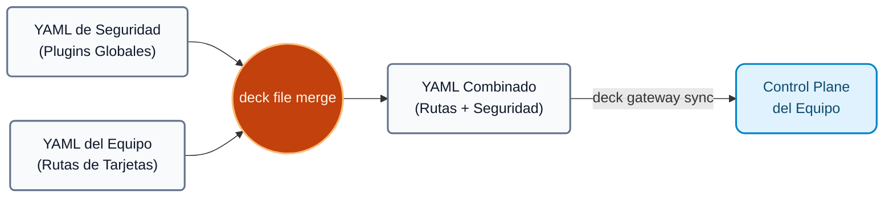
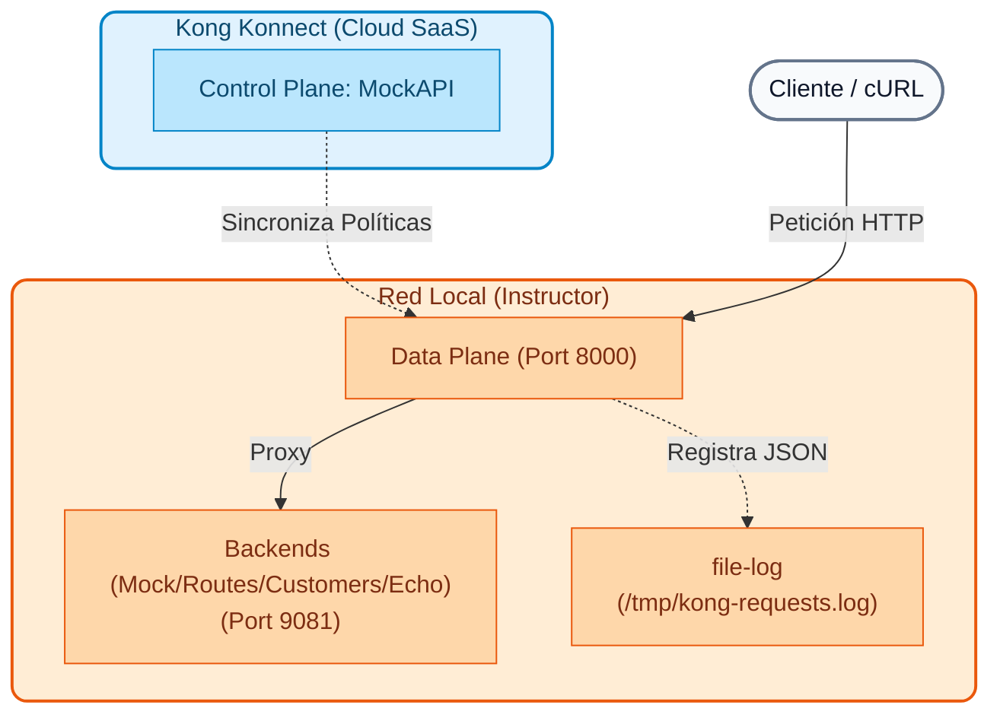

# Módulo 04: Operações de Gateway (IaC)

Este módulo apresenta às equipes de operações e segurança as melhores práticas de gerenciamento do Kong Konnect em escala empresarial, usando ferramentas modernas de automação e abordagens declarativas.

---

## Objetivos do Módulo
1. Compreender a diferença entre gerir Kong através de interfaces gráficas (UI) e fluxos automatizados (GitOps).
2. Entenda como usar o **Terraform** para provisionar infraestrutura básica (planos de controle, equipamentos).
3. Master **decK**, a ferramenta oficial de configuração declarativa do Kong.
4. Projetar arquiteturas segregadas por meio de múltiplos Planos de Controle.
5. Promova padrões globais de segurança e observabilidade sem duplicar a configuração.

---

## Conceitos Teóricos

Antes de interagir com as ferramentas, é fundamental estabelecer os padrões arquiteturais e operacionais que garantam resiliência e segurança em ambientes complexos.

### Infraestrutura como código (IaC) e GitOps
Gerenciar o Kong por meio da UI Konnect é ótimo para ambientes de desenvolvimento e para visualizar o tráfego, mas não é escalonável na produção. Erros humanos, falta de controle de versão e alterações não auditadas (“desvio”) podem causar interrupções massivas.
Usando o **GitOps**, o estado desejado de todas as APIs e políticas de segurança reside nos repositórios Git como arquivos de texto (YAML, HCL). Ferramentas como Terraform e deck leem esses arquivos e os sincronizam automaticamente com o Kong Konnect por meio de pipelines de CI/CD.

### deck: Configuração declarativa
**decK (Kong declarativo)** é uma ferramenta CLI oficial que permite gerenciar o status dos Planos de Controle. 
Ao invés de fazer 10 chamadas REST API para criar um serviço, 5 rotas e 4 plugins, o decK pega um arquivo YAML com todo o estado desejado e calcula internamente a diferença ("diff") com o que existe atualmente no Konnect, executando apenas as atualizações necessárias.
Comandos principais:

- `deck gateway ping` → Verifique a autenticação com Konnect.
- `deck gateway dump` → Exporta a configuração atual do Gateway para um arquivo YAML (backup).
- `deck gateway diff` → Mostra o que você mudaria, sem modificar nada (preview, ideal para Pull Requests).
- `deck gateway apply` → Adiciona/modifica o que é declarado **sem excluir** o que já existe (fusão segura).
- `deck gateway sync` → Faz com que o estado do CP **exatamente** seja o que o arquivo diz (limpa tudo o que não está declarado, garantindo que não haja entidades "fantasmas").

### Múltiplos Planos de Controle e Separação de Responsabilidades

Em organizações de médio e grande porte, um único Plano de Controle pode se tornar um gargalo organizacional e um ponto único de falha (Blast Radius). Kong Konnect permite criar **múltiplos Planos de Controle lógicos** instantaneamente, agindo como partições completamente isoladas.

**Por que dividi-los e quais são os casos de uso mais comuns?**

1. **Por topologia de rede (tráfego interno vs. externo):**
   Em um ambiente empresarial, você nunca mistura tráfego público com tráfego privado. Você pode ter um Plano de Controle chamado `External-CP` (exposto à Internet, com regras rígidas de WAF e Rate Limiting) e outro `Internal-CP` (acessível apenas pela Intranet, sem criptografia pesada para otimizar a latência).
   
2. **Por ambientes de ciclo de vida (SDLC):**
   Para isolar os testes da produção. É padrão ter `Dev-CP`, `QA-CP` e `Prod-CP`. Se um desenvolvedor quebrar uma rota testando um plugin no `Dev-CP`, os Planos de Dados de Produção não saberão disso.

3. **Por Domínios de Negócios (Arquitetura Mesh/Micro-Gateways):**
   A equipa de "Pagamentos" gere o seu próprio `CP-Pagamentos` e a equipa de "Envios" gere o seu `CP-Logística`. Cada equipe tem total autonomia sobre suas rotas e plugins sem o risco de anular a configuração (reduzindo o *Blast Radius* ou raio de impacto em caso de erros).

### Infraestrutura como código (IaC) e GitOps
Kong incentiva as equipes de plataforma a adotarem IaC para gerenciar esses múltiplos ambientes. Em vez de clicar em uma interface, os administradores definem o estado desejado nos repositórios Git e ferramentas como Terraform ou deck aplicam essas alterações. Isso permite auditoria, *reversões* rápidas e remoção de configurações "feitas à mão".

### deck: Configuração declarativa do gateway
Kong fornece **decK** (Configuração Declarativa para Kong), uma ferramenta CLI escrita em Go focada no *Gateway* (Data Plane). Permite exportar e importar a configuração de rotas, serviços e plugins em formato YAML (conhecido como *Kong Declarative Configuration*). deckK compara o estado do YAML com o estado atual do Gateway e aplica apenas a diferença (diff) de forma idempotente.

### kongctl: Configuração declarativa da plataforma (Konnect)
Enquanto `decK` cuida de rotas e plugins (nível Gateway), **kongctl** é a nova ferramenta Kong CLI projetada especificamente para gerenciar a plataforma **Kong Konnect** em um nível superior. 

Com `kongctl` você pode gerenciar recursos de nuvem "nativos" do Konnect usando YAML, como:
- Criação e administração de **Planos de Controle**.
- Gestão de entidades de **Catálogo de APIs** e Portais de Desenvolvedores.
- Administração de usuários e equipamentos (RBAC).

Nas arquiteturas Konnect modernas, `kongctl` e `decK` trabalham juntos: você usa `kongctl` para provisionar a infraestrutura base (o Plano de Controle e o Portal) e usa `decK` para preencher esse Plano de Controle com as regras de roteamento e segurança de suas APIs.

### Promoção entre Ambientes (CI/CD) e Variáveis Específicas

Ao trabalhar com vários ambientes (por exemplo, `Dev-CP` ➔ `QA-CP` ➔ `Prod-CP`), é essencial entender que existem **dois fluxos de informações paralelos, mas distintos** ao promover configurações:

| Tipo de configuração | É promovido? | Exemplos |
| :--- | :---: | :--- |
| **Configuração Lógica** | ✅ Sim | Regras de negócio, plugins (Rate Limiting), rotas (`/api/v1/pagos`). Este arquivo YAML viaja intacto do desenvolvimento à produção para garantir consistência. |
| **Específico do ambiente** | ❌ Não | IPs de back-end (`10.0.0.5` vs `192.168.1.100`), certificados SSL, segredos. Esta informação **pertence ao ambiente** e nunca acompanha o código. |

!!! info "Como o deck lida com isso?"
    O deck resolve isso usando **Variáveis ​​de Ambiente**. No seu arquivo YAML, ao invés de colocar um IP de produção fixo, você coloca uma variável:    

```yaml
    url: ${{ env "BACKEND_PAYMENTS_URL" }}
    

```
Quando você executa `deck gateway sync` em seu pipeline (CI/CD), o deck injeta os valores específicos desse ambiente instantaneamente. Assim, o **mesmo arquivo YAML** funciona para todos os ambientes.
### O padrão "Plano de controle global"

Imagine que você trabalha em um Grande Banco com 50 equipes de desenvolvimento diferentes (Cartões, Empréstimos, Investimentos, etc.). Para evitar gargalos, você dá a cada equipe **seu próprio Plano de Controle** no Kong Konnect para que possam gerenciar suas rotas com total autonomia.

!!! aviso "O desafio da segurança"
    Um dia, o **CISO (Departamento de Segurança)** emite um regulamento inegociável: *"Absolutamente todo o tráfego HTTP da empresa deve ser registrado em um sistema central (Log) e um Correlation Header deve ser injetado para rastreabilidade"*.
    
    Como você aplica esta regra obrigatória sem ter que configurar manualmente os plugins em todos os 50 Planos de Controle, um por um (e rezar para que nenhum desenvolvedor os exclua por engano)?

É aqui que o poder declarativo do deck brilha usando o padrão **Control Plane Global**:

1. **Definição Global:** A equipe de Plataforma/Segurança cria um arquivo YAML "mestre" que contém *apenas* os plug-ins necessários (por exemplo, `file-log`, `correlation-id`).
2. **Mesclagem automática:** Nos pipelines de implantação (CI/CD) das 50 equipes, pouco antes de aplicar as alterações, o pipeline executa automaticamente o comando `deck file merge`. Este comando pega o YAML da equipe Cards (que conhece apenas suas próprias rotas) e o **mescla** com o YAML Global de Segurança.
3. **Herança Transparente:** Quando a configuração final é sincronizada, os serviços da equipe de Cartões herdam automaticamente as políticas de segurança corporativa, sem que os desenvolvedores precisem mexer nelas.


---

## Arquitetura de Referência

Nas demonstrações a seguir, o instrutor construirá a seguinte arquitetura automatizada passo a passo:


> **Resumo do status final:**
> Teremos 1 Plano de Controle lógico na nuvem (MockAPI) e 1 Gateway físico local gerenciando o tráfego de múltiplos microsserviços simulados.

---

## Sequência de Demonstração

Antes de iniciar as demonstrações do Dia 2, você deve **destruir e limpar** o ambiente que foi criado automaticamente no módulo Configuração do Dia 1. Caso contrário, o Terraform lhe dirá que “não há alterações a serem aplicadas” e você não poderá mostrar como a infraestrutura ativa é criada.

Execute o seguinte na raiz do projeto para limpar tudo:

```bash
# 1. Limpiar los contenedores del Gateway local y estado residual
./docs/00-setup-entorno/scripts/reset_all.sh

# 2. Destruir el Control Plane en Konnect usando Terraform
cd docs/00-setup-entorno/terraform
terraform destroy -var="konnect_token=$KONNECT_TOKEN" -var="demo_prefix=$DEMO_PREFIX" -auto-approve
```
### Demonstração 1: Governança de infraestrutura (Terraform)
O Terraform será usado para provisionar automaticamente o plano de controle "MockAPI" base e as equipes RBAC no Konnect.

1. **Inicializar e validar o Terraform:**    

```bash
    cd docs/00-setup-entorno/terraform
    terraform init
    terraform validate
    

```
2. **Aplique as alterações:** (criará 1 plano de controle chamado MockAPI e a equipe de desenvolvedores de API).    

```bash
    terraform apply -var="konnect_token=$KONNECT_TOKEN" -var="demo_prefix=$DEMO_PREFIX"
    

```
3. O instrutor mostrará visualmente no Konnect (**Gateway Manager** e **Teams**) que o Plano de Controle e o Grupo foram criados com sucesso em segundos, eliminando processos manuais.

### Demonstração 2: implantação do plano de dados
Para materializar o tráfego, levantaremos o motor (Data Plane) que consumirá a configuração do Konnect de forma segura (mTLS).

1. O instrutor irá gerar os certificados seguros necessários para conectar o Data Plane ao Control Plane MockAPI:    

```bash
    cd ../scripts
    python3 generate_certs.py
    

```
    > **Nota:** `generate_certs.py` (requer `KONNECT_TOKEN` e `DEMO_PREFIX`, definidos pelo `kong-env`) gera localmente `certs/mock/tls.key`, `certs/mock/tls.crt` e `endpoints.env`. Esses arquivos **não são versionados** no repositório (chaves privadas e endpoints da organização): cada participante os gera com este passo. Veja `endpoints.env.example` para o formato.

2. A instância do Docker será iniciada (Data Plane na porta 8000):    

```bash
    ./start_dps.sh
    

```
3. O instrutor mostrará no Konnect como o Control Plane MockAPI reporta `1 Data Plane In Sync`, demonstrando que o nó Edge local está pronto para receber políticas.

### Demonstração 3: Isolamento de permissão (RBAC e equipes)
Para testar a segurança organizacional implementada com Terraform:

1. O instrutor exibirá a seção **Equipes** no Konnect.
2. Validará que o grupo criado (`API Developers`) possui função **Admin** apenas para o Plano de Controle `MockAPI`, permitindo que os desenvolvedores operem de forma segura e delimitada.

### Demonstração 4: Sincronização declarativa com deck (rotas e políticas globais)
A seguir, usaremos `decK` para carregar imutavelmente as rotas de nossos 4 microsserviços simulados (`/mock`, `/routes`, `/customers`, `/echo`) junto com logs globais (`file-log`) e políticas de rastreabilidade (`correlation-id`).

1. O instrutor revisará o arquivo `deck-files/base-state.yaml`, mostrando como rotas e plugins globais são declarados em combinação.
2. Você fará um `diff` e depois um `sync` para injetar este estado no plano de controle `MockAPI`:    

```bash
    cd ../dia-1-teoria-y-demos/04-gateway-operations
    deck gateway diff archivos-deck/estado-base.yaml --konnect-token "$KONNECT_TOKEN" --konnect-control-plane-name "${DEMO_PREFIX}_MockAPI"
    deck gateway sync archivos-deck/estado-base.yaml \
        --konnect-token \
        "$KONNECT_TOKEN" \
        --konnect-control-plane-name \
        "${DEMO_PREFIX}_MockAPI"
    

```
3. O instrutor gerará picos de tráfego através do plano de dados local (porta 8000) para validar se as rotas e políticas estão operando com êxito:    

```bash
    curl -i http://localhost:8000/mock
    for i in {1..100}; do curl -s -o /dev/null http://localhost:8000/mock; done
    

```
4. Por fim, você extrairá as auditorias escritas em tempo real pelo plugin `file-log` (declarado globalmente no YAML) para validar sua aplicação:    

```bash
    docker exec kong-dp wc -l /tmp/kong-requests.log
    

```
Com a infraestrutura automatizada pronta (Plano de Controle e Plano de Dados) e o tráfego base estabelecido declarativamente usando deckK, o ambiente está pronto para iniciar o Módulo de Monitoramento e Observabilidade (Dia 2).

---

## Limpeza: Redefinição total (somente instrutor)

Caso seja necessário repetir o workshop ou limpar o ambiente, este script remove containers Docker e CPs Konnect:

```bash
cd workshop-assets/dia-1/04-gateway-operations
./scripts/reset_all.sh
```
