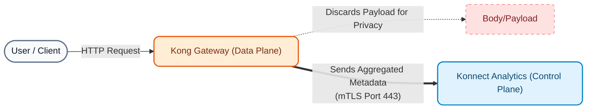

# Module 05: API Observability (Konnect Analytics)

In distributed architectures based on microservices or Cloud-Native architectures, losing visibility of traffic is one of the biggest operational risks. This module is designed to demonstrate how **Kong Konnect** provides telemetry, metrics, and traceability *out-of-the-box*, without the need to configure and maintain complex external stacks (like ELK or Datadog) from day one.

---

## 1. Theoretical Concepts: Observability in Konnect

**API Observability** in Konnect is not limited to knowing if a service is "up or down," but rather understanding *why* and *how* traffic flows through the ecosystem. Konnect automatically collects metrics from Data Planes and presents them in the cloud through its analytics suite.

Konnect's native capabilities are divided into:

1.  **Summary & Dashboards:** Real-time monitoring of latencies, error rates (4xx, 5xx), and usage volume (including token consumption for AI).
2.  **Explorer:** Multidimensional analysis (Cross-runtime observability). Allows isolating problems by crossing metrics by Service, Route, Consumer, or Data Plane.
3.  **Requests:** Deep inspection of Gateway logs (unified Access Logs).
4.  **Reports:** Generation of scheduled and custom reports for different stakeholders (e.g., usage reports for billing).
5.  **Debugger (Active Tracing):** Contextual traceability to diagnose performance issues directly in the Gateway's plugin chain.

> [!NOTE]
> Kong Konnect allows, if the organization requires it, to transparently export all these metrics to third-party platforms (Dynatrace, Datadog, Prometheus, Splunk, Kafka) via plugins, ensuring total flexibility for the future.

### Telemetry Architecture: How do the data flow?

It is vital to understand what happens beneath the Konnect interface when we monitor our APIs.



!!! info "Where is it generated from?"
    Telemetry is always collected by the local **Data Planes**, as they process the traffic. The Control Plane in the cloud never touches actual user traffic.

!!! success "What kind of information travels to the cloud?"
    Only **aggregated metadata** is sent. This includes:
    
    *   Counters (Requests, Status Codes).
    *   Histograms (Kong and Upstream Latencies).
    *   Route and service identifiers.
    *   Access Log metadata (Client IP, User Agent, payload size).
    
    **The request or response *body* is never sent**, ensuring compliance with privacy regulations (GDPR, PCI).

!!! note "How is it sent and for how long is it retained?"
    *   **Sending:** Asynchronously (to avoid impacting latency) to Konnect's Telemetry endpoint, via a secure **mTLS** connection.
    *   **Retention:** By default, granular data (such as Access Logs) is retained for **30 days** in Konnect's analytical database. If you require long-term retention for auditing, you can forward logs to cold storage (S3, Splunk, etc.).

---

## 2. Preparation: Telemetry Generation (Instructor)

For Konnect's analytical panels to display relevant data (and not be empty or completely "green"), the instructor will inject a mixed volume of requests (successes, 401 errors, and 404 errors).

1.  Open your terminal and run the traffic generator script:
    ```bash
    cd workshop-assets/dia-1/05-monitoring-logging
    ./scripts/generate_traffic.sh
    ```
2.  Wait a few seconds for the script to finish. Metrics will be sent asynchronously from your local Data Planes to Konnect.

---

## 3. Guided Practical Demonstrations in Konnect UI

The instructor will conduct a guided tour of the **Konnect -> Observability** console.

### Demonstration 1: Summary (Executive Overview)
**Objective:** Show a high-level overview of system health.

1.  In Konnect, navigate to **Observability -> Summary**.
2.  Change the time selector (top right) to "Last 15 minutes" to narrow the data to the recently injected traffic.

3.  **Detailed UI Analysis (What to observe):**
    -   **Top KPIs (Cards):**
        -   **Requests:** Total volume of traffic processed.
        -   **Error rate:** Percentage of failed transactions (it's normal to see a high percentage in our demo because we intentionally injected failures via Auth and Rate Limiting to populate the log).
        -   **P99 Latency:** Shows the maximum time 99% of users waited. It is the most realistic indicator for measuring SLAs, better than the average.
    -   **Total traffic over time (Center-Left):** Historical graph that allows quickly detecting anomalous spikes or abrupt service drops (DDoS or outages).
    -   **Kong vs upstream latency over time (Bottom):** Vital graph. Separates Kong's latency vs. the backend's latency into different timelines. If the `Upstream` line has spikes, the microservices degraded. If the `Kong` line has spikes, there is an overload in plugin evaluation.

### Demonstration 2: Dashboards (Detailed Metrics)
**Objective:** Delve into specific metrics.

1.  Navigate to **Observability -> Dashboards**.
2.  **Dashboard Overview:** Show the pie charts with the HTTP Status Codes generated by our script (you will see 2xx successes, along with 401s and 404s).
3.  **Dashboard Latency:** Analyze how response times vary over time.
4.  **Dashboard AI Analytics:** Mention that Konnect has dedicated graphs for AI Gateway (LLM token consumption, providers used), ready for when we enable AI plugins.

### Demonstration 3: Explorer (Multidimensional Analysis)
**Objective:** Perform complex interactive queries.

1.  Navigate to **Observability -> Explorer**.
2.  **Filtering use case:** Imagine the *Summary* showed an increase in 4xx errors.
3.  In the **Group By** panel, select `Status Code`.
4.  In the filter bar above, apply the filter `Status Code IS 401`.
5.  Change the **Group By** to `Service`.
6.  The tool will reveal exactly which service is rejecting traffic! (In this case, it should point to `/customers` in the Internal DP).

### Demonstration 4: Reports (Custom Reports)
**Objective:** Create a personalized operational report.

1.  Navigate to **Observability -> Reports**.
2.  Click on **Create Report** (top right).
3.  **Report Configuration:**
    -   **Name:** Type "Service Consumption Report".
    -   **Metric:** Select `Request Count`.
    -   **Group by:** Select `Service`.
    -   **Time Range:** Choose the last 15 minutes (to see the injected data).
4.  Click on **Save**.
5.  **Business Value:** Show the generated graph to the group and explain that these reports (which can be downloaded as CSV) are the essential tool for Finance and Product teams to audit quotas, charge third parties (monetization), and measure the adoption of each API.

### Demonstration 5: Requests (Gateway Log Inspection)
**Objective:** View individual transaction details without having to SSH into the server.

1.  Navigate to **Observability -> Requests**.
2.  Use the **Search Filters** (top bar) to look for anomalies. Type `status_code >= 400` and press Enter, or select a successful code.
3.  Click on one of the requests to open the **detail panel**.

4.  **Inspection of the General tab:**
    -   **Latency Bar (Top):** Critical breakdown. Shows the total time, divided into **Kong internal** (time evaluating plugins) and **Upstream** (time in the backend processing logic). It is the definitive tool for resolving the classic dispute of *"Is the Network or the Server slow?"*.
    -   **Client IP:** The source IP of the transaction. Indispensable for auditing attackers or configuring blacklists in the IP Restriction plugin.
    -   **Data plane node / Gateway service:** Allows exact identification of which physical Kong node or specific pod processed this request and to which service it routed it.

5.  **Inspection of the Request tab:**
    -   **User agent:** Reveals which tool or browser originated the call.
    -   **HTTP method & Request URI:** The exact endpoint the attacker (or user) tried to access.
    -   **Request size:** Shows the weight of the incoming request. Very useful for detecting anomalies where immense payloads are sent to saturate the API.

### Demonstration 6: Debugger (Active Tracing)
**Objective:** Demonstrate the power of diagnosing complex internal problems in real time.

1.  Navigate to **Observability -> Debugger**.
2.  **Theory:** When a request fails or is slow, sometimes it's not enough to just see the log. We need to know **which specific plugin** (e.g., transformation, rate limiting, authentication) introduced the latency or rejected the call. The Debugger allows starting a temporary "Active Tracing" session.
3.  *(Optional)* If the instructor wishes, they can start a Debugger session pointing to the Data Plane's IP and trigger a manual request via the console to see the plugin execution cascade.

---

## 4. Next Steps

With native telemetry working and analytical tools demonstrated, we have a solid monitoring foundation. However, for distributed environments and code-level diagnostics, we need to go a step further. In the next module **(Advanced Observability)**, we will configure OpenTelemetry to enable Distributed Tracing with an OpenTelemetry Collector, OpenObserve, and Arize Phoenix.