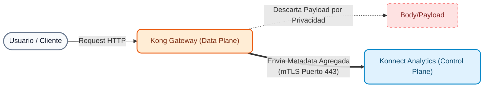

# Módulo 05: API Observability (Konnect Analytics)

En arquitecturas distribuidas basadas en microservicios o arquitecturas Cloud-Native, perder la visibilidad del tráfico es uno de los mayores riesgos operativos. Este módulo está diseñado para demostrar cómo **Kong Konnect** proporciona telemetría, métricas y trazabilidad *out-of-the-box*, sin necesidad de configurar y mantener complejos stacks externos (como ELK o Datadog) desde el primer día.

---

## 1. Conceptos Teóricos: Observabilidad en Konnect

La **Observabilidad de APIs** en Konnect no se limita a saber si un servicio está "arriba o abajo", sino a entender *por qué* y *cómo* el tráfico fluye a través del ecosistema. Konnect recopila automáticamente métricas de los Data Planes y las presenta en la nube a través de su suite analítica.

Las capacidades nativas de Konnect se dividen en:

1. **Summary & Dashboards:** Monitoreo en tiempo real de latencias, tasas de error (4xx, 5xx) y volumen de uso (incluyendo consumo de tokens para IA).
2. **Explorer:** Análisis multidimensional (Cross-runtime observability). Permite aislar problemas cruzando métricas por Servicio, Ruta, Consumidor o Data Plane.
3. **Requests:** Inspección profunda de los Gateway logs (Access Logs unificados).
4. **Reports:** Generación de informes programados y a medida para distintos stakeholders (ej. Reportes de uso para facturación).
5. **Debugger (Active Tracing):** Trazabilidad contextual para diagnosticar problemas de rendimiento directamente en la cadena de plugins del Gateway.

> [!NOTE]
> Kong Konnect permite, si la organización lo requiere, exportar todas estas métricas de forma transparente hacia plataformas de terceros (Dynatrace, Datadog, Prometheus, Splunk, Kafka) mediante plugins, garantizando flexibilidad total a futuro.

### Arquitectura de Telemetría: ¿Cómo fluyen los datos?

Es vital entender qué ocurre por debajo de la interfaz de Konnect cuando monitoreamos nuestras APIs. 



!!! info "¿Desde dónde se genera?"
    La telemetría siempre es recolectada por los **Data Planes** locales, ya que ellos procesan el tráfico. El Control Plane en la nube nunca toca el tráfico real de los usuarios.

!!! success "¿Qué tipo de información viaja a la nube?"
    Se envía exclusivamente **metadata agregada**. Esto incluye:
    
    * Contadores (Requests, Status Codes).
    * Histogramas (Latencias de Kong y del Upstream).
    * Identificadores de rutas y servicios.
    * Metadatos del Access Log (IP del cliente, User Agent, tamaño del payload).
    
    **Nunca se envía el *body* de la petición o respuesta**, asegurando el cumplimiento de normas de privacidad (GDPR, PCI).

!!! note "¿Cómo se envía y por cuánto tiempo se retiene?"
    * **Envío:** De forma asíncrona (para no impactar la latencia) hacia el endpoint de Telemetría de Konnect, a través de una conexión segura **mTLS**.
    * **Retención:** Por defecto, los datos granulares (como los Access Logs) se retienen por **30 días** en la base de datos analítica de Konnect. Si requieres retención a largo plazo por auditoría, puedes derivar los logs a almacenamiento en frío (S3, Splunk, etc.).

---

## 2. Preparación: Generación de Telemetría (Instructor)

Para que los paneles analíticos de Konnect muestren datos relevantes (y no estén vacíos o completamente "verdes"), el instructor inyectará un volumen mixto de peticiones (éxitos, errores 401 y errores 404).

1. Abre tu terminal y ejecuta el script generador de tráfico:
    ```bash
    cd workshop-assets/dia-1/05-monitoring-logging
    ./scripts/generate_traffic.sh
    ```
2. Espera unos segundos a que el script finalice. Las métricas serán enviadas asíncronamente desde tus Data Planes locales hacia Konnect.

---

## 3. Demostraciones Prácticas guiadas en Konnect UI

El instructor realizará un recorrido demostrativo por la consola de **Konnect -> Observability**.

### Demostración 1: Summary (Resumen Ejecutivo)
**Objetivo:** Mostrar una visión general (pájaro) de la salud del sistema.

1. En Konnect, navega a **Observability -> Summary**.
2. Modifica el selector de tiempo (arriba a la derecha) a "Last 15 minutes" para acotar los datos a la inyección recién realizada.

3. **Análisis detallado de la UI (Qué observar):**
    - **KPIs Superiores (Tarjetas):**
        - **Requests:** Volumen total de tráfico procesado.
        - **Error rate:** Porcentaje de transacciones fallidas (es normal ver un porcentaje alto en nuestra demo porque inyectamos fallos intencionales mediante Auth y Rate Limiting para poblar el log).
        - **P99 Latency:** Muestra el tiempo máximo que esperó el 99% de los usuarios. Es el indicador más realista para medir SLAs, mejor que el promedio.
    - **Total traffic over time (Centro-Izquierda):** Gráfico histórico que permite detectar rápidamente picos (spikes) anómalos o caídas abruptas de servicio (DDoS o apagones).
    - **Kong vs upstream latency over time (Abajo):** Gráfico vital. Separa en líneas de tiempo distintas la latencia de Kong vs la del backend. Si la línea de `Upstream` tiene picos, los microservicios se degradaron. Si la de `Kong` tiene picos, hay una sobrecarga en la evaluación de plugins.

### Demostración 2: Dashboards (Métricas Detalladas)
**Objetivo:** Profundizar en métricas específicas.

1. Navega a **Observability -> Dashboards**.
2. **Dashboard Overview:** Mostrar los gráficos de torta con los Códigos de Estado HTTP generados por nuestro script (verás éxitos 2xx, junto con 401s y 404s).
3. **Dashboard Latency:** Analizar cómo los tiempos de respuesta varían en el tiempo.
4. **Dashboard AI Analytics:** Menciona que Konnect posee gráficos dedicados para Gateway de IA (consumo de tokens de LLMs, proveedores usados), listos para cuando habilitemos plugins de IA.

### Demostración 3: Explorer (Análisis Multidimensional)
**Objetivo:** Realizar consultas interactivas complejas.

1. Navega a **Observability -> Explorer**.
2. **Caso de uso de filtrado:** Imagina que el *Summary* mostró un aumento de errores 4xx.
3. En el panel de **Group By**, selecciona `Status Code`.
4. En la barra de filtros de arriba, aplica el filtro `Status Code IS 401`.
5. Cambia el **Group By** a `Service`.
6. ¡La herramienta revelará exactamente qué servicio está rechazando el tráfico! (En este caso, debería apuntar a `/customers` en el Internal DP).

### Demostración 4: Reports (Reportes a Medida)
**Objetivo:** Crear un informe operativo personalizado.

1. Navega a **Observability -> Reports**.
2. Haz clic en **Create Report** (arriba a la derecha).
3. **Configuración del Reporte:**
    - **Name:** Escribe "Reporte de Consumo por Servicio".
    - **Metric:** Selecciona `Request Count`.
    - **Group by:** Selecciona `Service`.
    - **Time Range:** Elige los últimos 15 minutos (para ver los datos inyectados).
4. Haz clic en **Save**.
5. **Valor de Negocio:** Muestra el gráfico generado al grupo y explica que estos reportes (que pueden descargarse como CSV) son la herramienta esencial para los equipos de Finanzas y Producto para auditar cuotas, cobrar a terceros (monetización) y medir la adopción de cada API.

### Demostración 5: Requests (Gateway Log Inspection)
**Objetivo:** Ver el detalle a nivel de transacción individual sin tener que hacer SSH al servidor.

1. Navega a **Observability -> Requests**.
2. Utiliza los **Filtros de Búsqueda** (barra superior) para buscar anomalias. Escribe `status_code >= 400` y dale a Enter, o selecciona un código exitoso.
3. Haz clic sobre una de las peticiones para abrir el **panel de detalle**.

4. **Inspección de la pestaña General:**
    - **Barra de Latencias (Arriba):** Desglose crítico. Muestra el tiempo total, dividido en **Kong internal** (tiempo evaluando plugins) y **Upstream** (tiempo en el backend procesando la lógica). Es la herramienta definitiva para resolver la clásica disputa de *"¿Está lenta la Red o el Servidor?"*.
    - **Client IP:** La IP de origen de la transacción. Indispensable para auditar atacantes o configurar listas negras en el plugin de IP Restriction.
    - **Data plane node / Gateway service:** Permite identificar de manera exacta qué nodo físico o pod específico de Kong procesó esta solicitud y hacia qué servicio la ruteó.

5. **Inspección de la pestaña Request:**
    - **User agent:** Revela con qué herramienta o navegador se originó la llamada.
    - **HTTP method & Request URI:** El endpoint exacto al que el atacante (o usuario) intentó acceder.
    - **Request size:** Muestra el peso de la petición entrante. Muy útil para detectar anomalías donde envían payloads inmensos para saturar la API.

### Demostración 6: Debugger (Active Tracing)
**Objetivo:** Demostrar el poder de diagnosticar problemas internos complejos en tiempo real.

1. Navega a **Observability -> Debugger**.
2. **Teoría:** Cuando una petición falla o es lenta, a veces no basta con ver el log. Necesitamos saber **qué plugin específico** (ej. transformación, limitación, autenticación) introdujo la latencia o rechazó la llamada. El Debugger permite iniciar una sesión temporal de "Tracing Activo".
3. *(Opcional)* Si el instructor lo desea, puede iniciar una sesión de Debugger apuntando a la IP del Data Plane y disparar una petición manual por consola para ver la cascada de ejecución de plugins.

---

## 4. Próximos Pasos

Con la telemetría nativa funcionando y las herramientas analíticas demostradas, tenemos una base sólida de monitoreo. Sin embargo, para entornos distribuidos y diagnósticos a nivel de código, necesitamos ir un paso más allá. En el próximo módulo **(Observabilidad Avanzada)**, configuraremos OpenTelemetry para habilitar el rastreo distribuido (Distributed Tracing) con un OpenTelemetry Collector, OpenObserve y Arize Phoenix.
