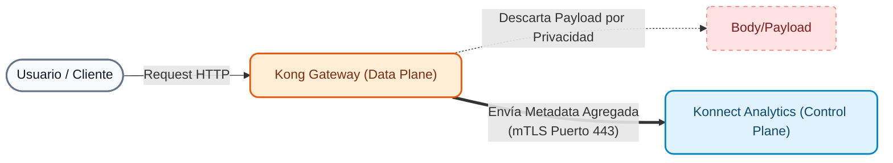

# Módulo 05: Observabilidade da API (Konnect Analytics)

Em arquiteturas distribuídas baseadas em microsserviços ou arquiteturas Cloud-Native, a perda de visibilidade do tráfego é um dos maiores riscos operacionais. Este módulo foi projetado para demonstrar como o **Kong Konnect** fornece telemetria, métricas e rastreabilidade *prontas para uso*, sem a necessidade de configurar e manter pilhas externas complexas (como ELK ou Datadog) desde o primeiro dia.

---

## 1. Conceitos Teóricos: Observabilidade no Konnect

**Observabilidade da API** no Konnect não se limita a saber se um serviço está "ativo ou inativo", mas sim a entender *por que* e *como* o tráfego flui através do ecossistema. Konnect coleta automaticamente métricas de planos de dados e as apresenta na nuvem por meio de seu pacote analítico.

As capacidades nativas do Konnect são divididas em:

1. **Resumo e Painéis:** Monitoramento em tempo real de latências, taxas de erro (4xx, 5xx) e volume de uso (incluindo consumo de token de IA).
2. **Explorador:** Análise multidimensional (observabilidade em tempo de execução cruzado). Permite isolar problemas cruzando métricas por Serviço, Rota, Consumidor ou Plano de Dados.
3. **Solicitações:** Inspeção profunda dos logs do Gateway (logs de acesso unificados).
4. **Relatórios:** Geração de relatórios programados e personalizados para diferentes partes interessadas (por exemplo, relatórios de uso para faturamento).
5. **Depurador (rastreamento ativo):** Rastreabilidade contextual para diagnosticar problemas de desempenho diretamente na cadeia de plug-ins do Gateway.

> [!NOTA]
> Kong Konnect permite, caso a organização assim o exija, exportar todas estas métricas de forma transparente para plataformas de terceiros (Dynatrace, Datadog, Prometheus, Splunk, Kafka) através de plugins, garantindo total flexibilidade no futuro.

### Arquitetura de telemetria: como os dados fluem?

É vital entender o que acontece por baixo da interface do Konnect ao monitorar nossas APIs.


!!! info "De onde é gerado?"
    A telemetria é sempre coletada pelos **Planos de Dados** locais, à medida que eles processam o tráfego. O plano de controle na nuvem nunca atinge o tráfego real do usuário.

!!! sucesso "Que tipo de informação viaja para a nuvem?"
    Apenas **metadados adicionados** são enviados. Isso inclui:
    
    * Contadores (solicitações, códigos de status).
    * Histogramas (latências Kong e Upstream).
    * Identificadores de rotas e serviços.
    * Metadados do log de acesso (IP do cliente, agente do usuário, tamanho da carga útil).
    
    **O *corpo* da solicitação ou resposta nunca é enviado**, garantindo a conformidade com os regulamentos de privacidade (GDPR, PCI).

!!! observe "Como é enviado e por quanto tempo é mantido?"
    * **Envio:** de forma assíncrona (para não afetar a latência) para o endpoint Konnect Telemetry, por meio de uma conexão segura **mTLS**.
    * **Retenção:** Por padrão, os dados granulares (como logs de acesso) são retidos por **30 dias** no banco de dados analítico do Konnect. Se precisar de retenção de longo prazo para auditoria, você pode encaminhar os logs para armazenamento frio (S3, Splunk, etc.).

---

## 2. Preparação: Geração de Telemetria (Instrutor)

Para que os painéis analíticos do Konnect exibam dados relevantes (e não fiquem vazios ou completamente "verdes"), o instrutor injetará um volume misto de solicitações (sucessos, erros 401 e erros 404).

1. Abra seu terminal e execute o script gerador de tráfego:    

```bash
    cd workshop-assets/dia-1/05-monitoring-logging
    ./scripts/generate_traffic.sh
    

```
2. Aguarde alguns segundos para que o script termine. As métricas serão enviadas de forma assíncrona dos seus planos de dados locais para o Konnect.

---

## 3. Demonstrações práticas guiadas no Konnect UI

O instrutor fará um tour de demonstração do console **Konnect -> Observabilidade**.

### Demonstração 1: Resumo (Resumo Executivo)
**Objetivo:** Mostrar uma visão geral (pássaro) da integridade do sistema.

1. No Konnect, navegue até **Observabilidade -> Resumo**.
2. Modifique o seletor de tempo (canto superior direito) para “Últimos 15 minutos” para limitar os dados à injeção que acabou de ser realizada.

3. **Análise detalhada da IU (o que observar):**
    - **KPIs (cartões) superiores:**
        - **Solicitações:** Volume total de tráfego processado.
        - **Taxa de erros:** Porcentagem de transações com falha (é normal ver uma porcentagem alta em nossa demonstração porque injetamos falhas intencionais através de Auth e Rate Limiting para preencher o log).
        - **Latência P99:** Mostra o tempo máximo que 99% dos usuários esperaram. É o indicador mais realista para medir SLAs, melhor que a média.
    - **Tráfego total ao longo do tempo (Centro-Esquerda):** Gráfico histórico que permite detectar rapidamente picos anômalos ou quedas abruptas no serviço (DDoS ou apagões).
    - **Kong vs latência upstream ao longo do tempo (abaixo):** Gráfico vital. Separe a latência do Kong versus a latência de back-end em diferentes cronogramas. Se a linha `Upstream` apresentar picos, os microsserviços foram degradados. Se `Kong` tiver picos, há uma sobrecarga na avaliação do plugin.

### Demonstração 2: Painéis (Métricas Detalhadas)
**Objetivo:** aprofundar-se em métricas específicas.

1. Navegue até **Observabilidade -> Painéis**.
2. **Visão geral do painel:** Mostre gráficos de pizza com os códigos de status HTTP gerados por nosso script (você verá ocorrências 2xx, junto com 401s e 404s).
3. **Latência do painel:** analise como os tempos de resposta variam ao longo do tempo.
4. **Dashboard AI Analytics:** Menciona que Konnect possui gráficos dedicados para AI Gateway (consumo de tokens LLM, fornecedores usados), prontos para quando habilitarmos plug-ins de IA.

### Demo 3: Explorer (Análise Multidimensional)
**Objetivo:** realizar consultas interativas complexas.

1. Navegue até **Observabilidade -> Explorador**.
2. **Caso de uso de filtragem:** Imagine que o *Resumo* mostrasse um aumento nos erros 4xx.
3. No painel **Agrupar por**, selecione `Código de status`.
4. Na barra de filtros acima, aplique o filtro `Status Code IS 401`.
5. Altere **Agrupar por** para `Serviço`.
6. A ferramenta revelará exatamente qual serviço está rejeitando tráfego! (Neste caso, deve apontar para `/clientes` no DP Interno).

### Demonstração 4: Relatórios (relatórios personalizados)
**Objetivo:** Criar um relatório operacional personalizado.

1. Navegue até **Observabilidade -> Relatórios**.
2. Clique em **Criar relatório** (canto superior direito).
3. **Configuração do relatório:**
    - **Nome:** Escreva "Relatório de Consumo de Serviços".
    - **Métrica:** Selecione `Contagem de solicitações`.
    - **Agrupar por:** Selecione `Serviço`.
    - **Intervalo de tempo:** Escolha os últimos 15 minutos (para ver os dados injetados).
4. Clique em **Salvar**.
5. **Valor do Negócio:** Mostre o gráfico gerado ao grupo e explique que esses relatórios (que podem ser baixados como CSV) são a ferramenta essencial para as equipes de Finanças e Produto auditarem taxas, cobrarem de terceiros (monetização) e medirem a adoção de cada API.

### Demonstração 5: Solicitações (inspeção de log de gateway)
**Objetivo:** visualizar os detalhes no nível da transação individual sem precisar usar SSH para o servidor.

1. Navegue até **Observabilidade -> Solicitações**.
2. Use **Filtros de pesquisa** (barra superior) para pesquisar anomalias. Digite `status_code >= 400` e pressione Enter ou selecione um código bem-sucedido.
3. Clique em uma das solicitações para abrir o **painel de detalhes**.
4. **Inspeção da aba Geral:**
    - **Barra de latência (acima):** Análise crítica. Mostra o tempo total, dividido em **Kong interno** (tempo de avaliação de plugins) e **Upstream** (tempo na lógica de processamento de backend). É a ferramenta definitiva para resolver a clássica disputa de *"A Rede ou o Servidor está lento?"*.
    - **IP do cliente:** O IP de origem da transação. Essencial para auditar invasores ou configurar listas negras no plugin de restrição de IP.
    - **Nó do plano de dados/Serviço de gateway:** Permite identificar exatamente qual nó físico ou pod Kong específico processou essa solicitação e para qual serviço ela foi roteada.

5. **Solicitar inspeção da guia:**
    - **Agente do usuário:** revela de qual ferramenta ou navegador a chamada foi originada.
    - **Método HTTP e URI de solicitação:** O endpoint exato que o invasor (ou usuário) tentou acessar.
    - **Tamanho da solicitação:** Mostra o peso da solicitação recebida. Muito útil para detectar anomalias onde enviam grandes cargas para saturar a API.

### Demonstração 6: Depurador (rastreamento ativo)
**Objetivo:** demonstrar o poder de diagnosticar problemas internos complexos em tempo real.

1. Navegue até **Observabilidade -> Depurador**.
2. **Teoria:** Quando uma solicitação falha ou é lenta, às vezes não é suficiente ver o log. Precisamos saber **qual plugin específico** (por exemplo, transformação, otimização, autenticação) introduziu a latência ou rejeitou a chamada. O Depurador permite iniciar uma sessão temporária de "Rastreamento Ativo".
3. *(Opcional)* Se o instrutor desejar, ele pode iniciar uma sessão do Debugger apontando para o IP do Data Plane e acionar uma solicitação manual do console para ver a cascata de execução do plugin.

---

## 4. Próximas etapas
Com a telemetria nativa instalada e em funcionamento e ferramentas analíticas comprovadas, temos uma base sólida de monitoramento. No entanto, para ambientes distribuídos e diagnósticos em nível de código, precisamos dar um passo adiante. No próximo módulo **(Observabilidade Avançada)**, configuraremos o OpenTelemetry para habilitar o rastreamento distribuído com um OpenTelemetry Collector, OpenObserve e Arize Phoenix.
