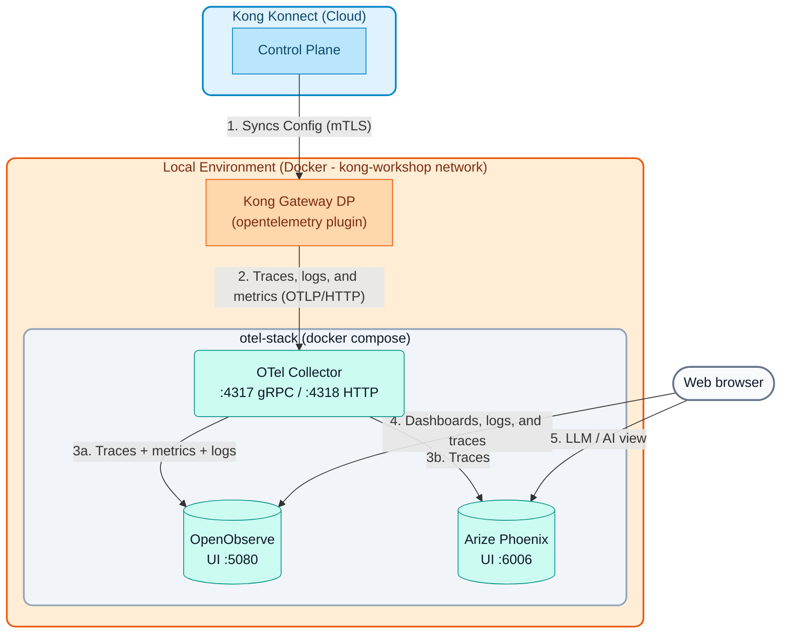

# Module 06: Advanced Observability and OpenTelemetry

Observability is not simply "having logs." It's the ability to understand the internal state of a complex system from its external outputs (Logs, Metrics, and Traces).

In microservices architectures, a single user request can traverse dozens of different services. If something fails or becomes slow, traditional monitoring tools (which look server by server) are insufficient. We need **Distributed Tracing**.

---

## 1. Kong Integration Options

Kong Gateway sits at the entry point of all traffic, making it the ideal place to generate centralized telemetry. Kong offers multiple integration options:

1.  **Specific Native Integrations:** Dedicated plugins for platforms like `datadog`, `prometheus`, `statsd`, or `zipkin`. They are easy to configure if you are already "tied" to one of these providers.
2.  **Logs to Aggregators:** Plugins like `http-log`, `tcp-log`, or `kafka-log` to output raw transactions to systems like ELK (Elasticsearch, Logstash, Kibana) or Splunk.
3.  **The Open Standard (OpenTelemetry):** The `opentelemetry` plugin exports traces, logs, and metrics using the industry-standard protocol (OTLP). This is the recommended option today because it avoids "vendor lock-in" (you can switch from Datadog to Dynatrace, OpenObserve, or any OTLP-compatible backend without touching Kong).

---

## 2. OpenTelemetry (OTel) Architectures

When using the OTLP protocol, there are two main deployment patterns:

### A. Direct Integration
Kong Gateway sends traces directly to the observability backend (e.g., Honeycomb or Datadog) using the `opentelemetry` plugin.
*   **Advantage:** Fewer moving parts.
*   **Disadvantage:** Kong uses network resources talking directly to the external provider, and if there are connectivity issues, traces can be lost. Also, every new backend means reconfiguring every Data Plane.

### B. Architecture with OTel Collector (Recommended)
Kong Gateway sends traces to a local component called the **OpenTelemetry Collector**. This collector receives the data, processes it, batches it, and then sends it asynchronously to one or more final backends.
*   **Advantage:** High performance. The Gateway does not block. The Collector can filter noise, enrich or anonymize data (remove PII), and **duplicate** telemetry to several destinations (*fan-out*) without Kong knowing about it.
*   **Disadvantage:** Requires maintaining the Collector's infrastructure.

In this course we use pattern **B**: Kong only talks to the Collector, and the Collector distributes the telemetry to two backends with different purposes.

---

## 3. The Course Observability Stack

The stack is defined in `workshop-assets/dia-1/06-observability/otel-stack/docker-compose.yml` and runs in Docker next to the Data Plane (`kong-workshop` network). It consists of **3 lightweight containers** (~1.2 GB of RAM in total):

| Container | Image (pinned version) | Ports | RAM limit | Role |
| :--- | :--- | :---: | :---: | :--- |
| `otel-collector` | `otel/opentelemetry-collector-contrib:0.161.0` | `4317` (gRPC), `4318` (HTTP) | 200 MB | Receives OTLP from Kong, filters/enriches, batches, and distributes: **traces → OpenObserve + Phoenix**, **metrics and logs → OpenObserve**. |
| `openobserve` | `openobserve/openobserve:v1.0.4` | `5080` | 512 MB | "All-in-one" observability backend: traces, metrics, logs, dashboards, log search (SQL / full text), and alerts. Compressed columnar storage in a single binary. |
| `phoenix` | `arizephoenix/phoenix:20.19.0` | `6006` | 512 MB | **Arize Phoenix**: LLM / AI-oriented trace viewer (OpenInference). Shows prompts, responses, tokens, costs, and latency per model call. |

**Why two backends?**

- **OpenObserve** is the day-to-day operations tool: "how many requests per second?, which route has 5xx errors?, what happened to the request with `x-correlation-id = ...`?". It covers the three pillars (traces, metrics, logs) in a single UI.
- **Phoenix** is built for AI traffic. When Kong acts as an **AI Gateway** (`ai-proxy`, `ai-prompt-guard` plugins, etc.) or when applications are instrumented with OpenInference, Phoenix shows each LLM call with its prompt, response, token usage, and latency. For "classic" HTTP traffic (like the one in this module) it shows the span tree and the latency of each span, like any trace viewer.
- Thanks to the Collector, both receive **the same traces** without any extra configuration in Kong.

**Architecture Diagram:**



> **Centralized mode (optional):** the same `docker-compose.yml` can run on an instructor server. In that case the Data Planes point to `http://<SERVER_IP>:4318` instead of `http://otel-collector:4318`, and ports `4318`, `5080`, and `6006` are opened in the firewall.

---

## 4. Demonstration Sequence

### Demonstration 1: Start the Observability Stack

1. **Prerequisite:** the `kong-dp` Data Plane must be running on the `kong-workshop` network (created by `docs/00-setup-entorno/scripts/start_dps.sh`).
2. **Start the stack:**

```bash
./workshop-assets/dia-1/06-observability/scripts/setup-observability.sh
```

The script:

- Checks that Docker and Docker Compose are available.
- Checks the images: if they are not in Docker, it loads them from `workshop-assets/dia-1/06-observability/docker-images/*.tar` (offline mode, generated with `scripts/save-images.sh`) or pulls them.
- Creates the `kong-workshop` network if it does not exist and runs `docker compose up -d`.
- Waits until OpenObserve (`/healthz`), Phoenix, and the Collector (`:13133`) respond, and prints the URLs and credentials.

Useful commands: `setup-observability.sh status` (status and URLs), `setup-observability.sh down` (stop, keeping data), and `setup-observability.sh reset` (stop and delete data).

3. **Walk through the Collector configuration** (`otel-stack/otel-collector-config.yaml`). Points to explain:
    - **Receivers:** `otlp` listening on `4317` (gRPC) and `4318` (HTTP).
    - **Processors:** `memory_limiter` (protects the Collector), `filter/health_checks` (drops `/health` and `/internal/status` spans), `attributes/enrich` (adds `pipeline.processed_by`), `transform/kong_spans` (derives `peer.service`), `transform/phoenix_project` (uses `service.name` as the Phoenix project), and `batch`.
    - **Exporters:** `otlphttp/openobserve` (with Basic Auth: the Collector holds the credentials, Kong does not know them) and `otlphttp/phoenix`.
    - **Pipelines:** `traces → [OpenObserve, Phoenix]`, `metrics → OpenObserve`, `logs → OpenObserve`.

### Demonstration 2: Enable OpenTelemetry and Generate Traffic
For Kong to start emitting telemetry, we enable the plugin globally pointing to the Collector. Since the Collector is on the same Docker network as the Data Plane, Kong resolves it by container name: `otel-collector`.

1.  **Review the configuration:**
    Open the file `workshop-assets/dia-1/06-observability/archivos-deck/solucion-kong.yaml`. Besides the `/mock` service, it contains the following block:

```yaml
plugins:
  - name: opentelemetry
    config:
      header_type: w3c
      traces_endpoint: http://otel-collector:4318/v1/traces
      logs_endpoint: http://otel-collector:4318/v1/logs
      access_logs:
        endpoint: http://otel-collector:4318/v1/logs
        custom_attributes_by_lua:
          request.id: "return kong.request.get_header('x-correlation-id') or 'none'"
      metrics:
        endpoint: http://otel-collector:4318/v1/metrics
        enable_request_metrics: true
        enable_latency_metrics: true
        enable_bandwidth_metrics: true
      resource_attributes:
        service.name: kong-gateway
        deployment.environment: workshop
  - name: correlation-id
    config:
      header_name: x-correlation-id
      echo_downstream: true
```

- `traces_endpoint`: spans for every request (including Kong's internal phases and the upstream call).
- `logs_endpoint` / `access_logs`: Gateway logs and one *access log* per request, enriched with attributes computed in Lua (IP, consumer, user-agent, correlation id).
- `metrics`: request, latency, and bandwidth metrics exported over OTLP (the `prometheus` plugin is not needed).
- `resource_attributes`: labels shared by all telemetry. `service.name` is the key to filter in OpenObserve and the project name in Phoenix.

2.  **Apply and Test:**
    Run the following block to sync, wait for the Data Plane to update, and generate a batch of 10 requests spaced half a second apart:

```bash
deck gateway sync workshop-assets/dia-1/06-observability/archivos-deck/solucion-kong.yaml && \
echo "Waiting 10s for Konnect to update the Data Plane..." && sleep 10 && \
echo "Generating 10 test requests..." && \
for i in {1..10}; do curl -k -s -o /dev/null -w "HTTP Code: %{http_code}\n" https://localhost:8443/mock; sleep 0.5; done
```

**Analyzing the result:**

-   You will see `HTTP Code: 200` printed in the console for all 10 requests.
-   Silently, Kong batched the telemetry for these transactions (including internal and backend processing times) and sent it asynchronously to the Collector, which forwarded it to OpenObserve and Phoenix.
-   This ensures that telemetry collection **does not add blocking latency** to end-client requests.
-   Metrics are sent in periodic batches (every 60 s by default): they can take up to a minute to appear.

### Demonstration 3: OpenObserve — Traces, Logs, Metrics, and Dashboards

1. Open `http://localhost:5080` and log in with the stack's root user (default email `admin@kong.com`; the password is **random**: `setup-observability.sh` generates it on its first run into `otel-stack/.env` —permissions 600, outside git— and prints it at the end; `setup-observability.sh status` shows it again).
2. **Traces (Distributed Tracing):**
    - Left menu → **Traces**. Select the `default` stream and a recent time range (e.g., *Past 15 minutes*).
    - Filter by service: `service_name = 'kong-gateway'` (OpenObserve turns dots in attribute names into underscores: `service.name` → `service_name`).
    - Click a trace to open the **Waterfall** view.
    - **What to explain to the student:**
        - The root span (e.g., `kong`) represents the total time from when the client made the request until it received a response.
        - The sub-spans detail how many milliseconds **Kong** consumed (`access` phase, plugins, DNS, balancer) and how many the **Backend** consumed (`kong.upstream` / HTTP call to the upstream).
        - The attributes panel shows `http.status_code`, the route, `pipeline.processed_by` (added by the Collector), and the `resource_attributes` defined in the plugin.
        - This demonstrates the ability to instantly isolate the source of latency in a complex system.
3. **Logs (search):**
    - Left menu → **Logs**, stream `default`.
    - Full-text search: `match_all('mock')`. Field search: `service_name = 'kong-gateway'`.
    - Copy an `x-correlation-id` value (visible with `curl -k -i https://localhost:8443/mock`) and search for it to find the exact *access log* of that request. Show that the log contains `trace_id`: from the log you can jump to the matching trace.
    - SQL mode: `SELECT * FROM "default" WHERE service_name = 'kong-gateway' ORDER BY _timestamp DESC LIMIT 20`.
4. **Metrics:**
    - Left menu → **Metrics**. Expand the metric list and look for the ones emitted by Kong (request count, latencies, bytes transferred).
    - Show how to chart a metric grouped by an attribute (e.g., status code or route).
5. **Dashboards:**
    - Left menu → **Dashboards → New Dashboard** (e.g., "Kong Workshop").
    - **Add Panel**: choose the request metric as a time series; add a second panel with latency. Save the dashboard.
    - Explain that OpenObserve also supports **alerts** on logs or metrics (e.g., 5xx rate).

### Demonstration 4: Arize Phoenix — LLM / AI-Oriented Trace View

1. Open `http://localhost:6006` (Phoenix requires no login in this stack).
2. The **Projects** screen shows the `kong-gateway` project: the Collector copies `service.name` into `openinference.project.name`, so every service (or every student, in Lab 07) gets its own project.
3. Open the project: the **Traces / Spans** table shows every request with its latency, status, and time. Click a trace to see the span tree and its attributes.
4. **What to explain to the student:**
    - For "classic" HTTP traffic Phoenix behaves like any other trace viewer (generic span kind).
    - Its value shows with **AI** traffic: when spans carry OpenInference attributes (for example, applications instrumented with the OpenInference SDKs, or LLM traffic going through Kong AI Gateway), Phoenix shows the **prompt** and **response**, input/output **tokens**, the model used, and the **latency** of each call, and also supports evaluations and experiment comparison.
    - OpenObserve and Phoenix see **the same trace** (same `trace_id`): the Collector performs the fan-out with no changes in Kong.

---

## 5. Summary

| Operational question | Where to look |
| :--- | :--- |
| Why was this request slow? Kong or the backend? | OpenObserve → Traces (Waterfall) or Phoenix |
| What happened to the request with `x-correlation-id = ...`? | OpenObserve → Logs |
| How many requests/errors/latency per route? | OpenObserve → Metrics / Dashboards |
| Which prompt was sent to the LLM, how many tokens did it use, and how long did it take? | Phoenix |
