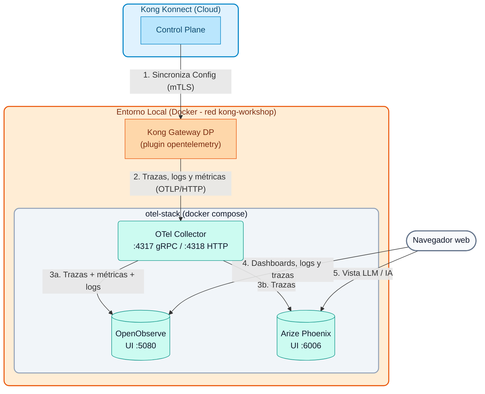

# Módulo 06: Observabilidad Avanzada y OpenTelemetry

La observabilidad no es simplemente "tener logs". Es la capacidad de entender el estado interno de un sistema complejo a partir de sus salidas externas (Logs, Métricas y Trazas). 

En arquitecturas de microservicios, una sola petición de usuario puede atravesar docenas de servicios distintos. Si algo falla o se vuelve lento, las herramientas de monitoreo tradicionales (que miran servidor por servidor) son insuficientes. Necesitamos **Trazabilidad Distribuida** (Distributed Tracing).

---

## 1. Opciones de Integración de Kong

Kong Gateway se sitúa en la entrada de todo el tráfico, lo que lo convierte en el punto ideal para generar telemetría centralizada. Kong ofrece múltiples opciones de integración:

1. **Integraciones Nativas Específicas:** Plugins dedicados para plataformas como `datadog`, `prometheus`, `statsd`, o `zipkin`. Son fáciles de configurar si ya estás "atado" a uno de esos proveedores.
2. **Logs a Agregadores:** Plugins como `http-log`, `tcp-log`, o `kafka-log` para escupir transacciones crudas a sistemas como ELK (Elasticsearch, Logstash, Kibana) o Splunk.
3. **El Estándar Abierto (OpenTelemetry):** El plugin `opentelemetry` exporta trazas, logs y métricas usando el protocolo estándar de la industria (OTLP). Es la opción recomendada hoy en día porque evita el "vendor lock-in" (puedes cambiar de Datadog a Dynatrace, a OpenObserve o a cualquier backend compatible con OTLP sin tocar Kong).

---

## 2. Arquitecturas de OpenTelemetry (OTel)

Al usar el protocolo OTLP, existen dos patrones principales de despliegue:

### A. Integración Directa
Kong Gateway envía las trazas directamente al backend de observabilidad (ej. Honeycomb o Datadog) usando el plugin `opentelemetry`.
* **Ventaja:** Menos piezas móviles.
* **Desventaja:** Kong gasta recursos de red hablando directamente con el proveedor externo, y si hay problemas de conectividad, se pueden perder trazas. Además, cada backend nuevo implica reconfigurar todos los Data Planes.

### B. Arquitectura con OTel Collector (Recomendado)
Kong Gateway envía las trazas a un componente local llamado **OpenTelemetry Collector**. Este colector recibe los datos, los procesa, los agrupa por lotes (batching) y luego los envía de forma asíncrona a uno o varios backends finales.
* **Ventaja:** Alto rendimiento. El Gateway no se bloquea. El Collector puede filtrar ruido, enriquecer o anonimizar datos (quitar PII) y **duplicar** la telemetría hacia varios destinos (*fan-out*) sin que Kong lo sepa.
* **Desventaja:** Requiere mantener la infraestructura del Collector.

En este curso usamos el patrón **B**: Kong habla solo con el Collector, y el Collector reparte la telemetría a dos backends con propósitos distintos.

---

## 3. El Stack de Observabilidad del Curso

El stack se define en `workshop-assets/dia-1/06-observability/otel-stack/docker-compose.yml` y corre en Docker junto al Data Plane (red `kong-workshop`). Son **3 contenedores** livianos (~1.2 GB de RAM en total):

| Contenedor | Imagen (versión fijada) | Puertos | Límite RAM | Rol |
| :--- | :--- | :---: | :---: | :--- |
| `otel-collector` | `otel/opentelemetry-collector-contrib:0.161.0` | `4317` (gRPC), `4318` (HTTP) | 200 MB | Recibe OTLP desde Kong, filtra/enriquece, hace *batching* y reparte: **trazas → OpenObserve + Phoenix**, **métricas y logs → OpenObserve**. |
| `openobserve` | `openobserve/openobserve:v1.0.4` | `5080` | 512 MB | Backend de observabilidad "todo en uno": trazas, métricas, logs, dashboards, búsqueda de logs (SQL / texto completo) y alertas. Almacenamiento columnar comprimido en un único binario. |
| `phoenix` | `arizephoenix/phoenix:20.19.0` | `6006` | 512 MB | **Arize Phoenix**: visor de trazas orientado a LLM / IA (OpenInference). Muestra prompts, respuestas, tokens, costos y latencia por llamada al modelo. |

**¿Por qué dos backends?**

- **OpenObserve** es la herramienta de operación del día a día: "¿cuántas peticiones por segundo?, ¿qué ruta tiene errores 5xx?, ¿qué pasó con la petición `x-correlation-id = ...`?". Cubre los tres pilares (trazas, métricas, logs) en una sola UI.
- **Phoenix** está pensado para tráfico de IA. Cuando Kong actúa como **AI Gateway** (plugins `ai-proxy`, `ai-prompt-guard`, etc.) o cuando las aplicaciones están instrumentadas con OpenInference, Phoenix muestra cada llamada al LLM con su prompt, su respuesta, el consumo de tokens y la latencia. Para tráfico HTTP "clásico" (como el de este módulo) muestra el árbol de spans y la latencia de cada uno, igual que cualquier visor de trazas.
- Gracias al Collector, ambos reciben **las mismas trazas** sin configurar nada extra en Kong.

**Diagrama de Arquitectura:**



> **Modo centralizado (opcional):** el mismo `docker-compose.yml` puede correr en un servidor del instructor. En ese caso los Data Planes apuntan a `http://<IP_DEL_SERVIDOR>:4318` en lugar de `http://otel-collector:4318`, y se abren en el firewall los puertos `4318`, `5080` y `6006`.

---

## 4. Secuencia de Demostraciones

### Demostración 1: Levantar el Stack de Observabilidad

1. **Prerrequisito:** el Data Plane `kong-dp` debe estar corriendo en la red `kong-workshop` (lo crea `docs/00-setup-entorno/scripts/start_dps.sh`).
2. **Levantar el stack:**

```bash
./workshop-assets/dia-1/06-observability/scripts/setup-observability.sh
```

El script:

- Verifica que Docker y Docker Compose estén disponibles.
- Comprueba las imágenes: si no están en Docker, las carga desde `workshop-assets/dia-1/06-observability/docker-images/*.tar` (modo offline, generado con `scripts/save-images.sh`) o las descarga.
- Crea la red `kong-workshop` si no existe y ejecuta `docker compose up -d`.
- Espera a que OpenObserve (`/healthz`), Phoenix y el Collector (`:13133`) respondan, e imprime las URLs y credenciales.

Comandos útiles: `setup-observability.sh status` (estado y URLs), `setup-observability.sh down` (detener conservando datos) y `setup-observability.sh reset` (detener y borrar datos).

3. **Recorrer la configuración del Collector** (`otel-stack/otel-collector-config.yaml`). Puntos a explicar:
    - **Receivers:** `otlp` escuchando en `4317` (gRPC) y `4318` (HTTP).
    - **Processors:** `memory_limiter` (protege al Collector), `filter/health_checks` (descarta spans de `/health` y `/internal/status`), `attributes/enrich` (agrega `pipeline.processed_by`), `transform/kong_spans` (deriva `peer.service`), `transform/phoenix_project` (usa `service.name` como proyecto de Phoenix) y `batch`.
    - **Exporters:** `otlphttp/openobserve` (con Basic Auth: las credenciales las pone el Collector, Kong no las conoce) y `otlphttp/phoenix`.
    - **Pipelines:** `traces → [OpenObserve, Phoenix]`, `metrics → OpenObserve`, `logs → OpenObserve`.

### Demostración 2: Habilitar OpenTelemetry y Generar Tráfico
Para que Kong empiece a emitir telemetría, habilitamos el plugin a nivel global apuntando al Collector. Como el Collector está en la misma red Docker que el Data Plane, Kong lo resuelve por nombre de contenedor: `otel-collector`.

1. **Revisar la configuración:**
Abre el archivo `workshop-assets/dia-1/06-observability/archivos-deck/solucion-kong.yaml`. Además del servicio `/mock`, contiene el siguiente bloque:

```yaml
plugins:
  - name: opentelemetry
    config:
      header_type: w3c
      traces_endpoint: http://otel-collector:4318/v1/traces
      logs_endpoint: http://otel-collector:4318/v1/logs
      access_logs:
        endpoint: http://otel-collector:4318/v1/logs
        custom_attributes_by_lua:
          request.id: "return kong.request.get_header('x-correlation-id') or 'none'"
      metrics:
        endpoint: http://otel-collector:4318/v1/metrics
        enable_request_metrics: true
        enable_latency_metrics: true
        enable_bandwidth_metrics: true
      resource_attributes:
        service.name: kong-gateway
        deployment.environment: workshop
  - name: correlation-id
    config:
      header_name: x-correlation-id
      echo_downstream: true
```

- `traces_endpoint`: spans de cada petición (incluye fases internas de Kong y la llamada al upstream).
- `logs_endpoint` / `access_logs`: logs del Gateway y un *access log* por petición, enriquecido con atributos calculados en Lua (IP, consumidor, user-agent, correlation id).
- `metrics`: métricas de peticiones, latencia y ancho de banda exportadas por OTLP (no hace falta el plugin `prometheus`).
- `resource_attributes`: etiquetas comunes a toda la telemetría. `service.name` es la clave para filtrar en OpenObserve y el nombre del proyecto en Phoenix.

2. **Aplicar y Probar:**
Ejecuta el siguiente bloque para sincronizar, esperar a que el Data Plane se actualice, y generar un lote de 10 peticiones espaciadas por medio segundo:

```bash
deck gateway sync workshop-assets/dia-1/06-observability/archivos-deck/solucion-kong.yaml && \
echo "Esperando 10s para que Konnect actualice el Data Plane..." && sleep 10 && \
echo "Generando 10 peticiones de prueba..." && \
for i in {1..10}; do curl -k -s -o /dev/null -w "HTTP Code: %{http_code}\n" https://localhost:8443/mock; sleep 0.5; done
```

**Analizando el resultado:**

- Verás impreso en consola los códigos `HTTP Code: 200` para las 10 peticiones.
- Silenciosamente, Kong agrupó la telemetría de estas transacciones (incluyendo tiempos de procesamiento internos y del backend) y la envió de manera asíncrona al Collector, que a su vez la reenvió a OpenObserve y Phoenix.
- Esto garantiza que la recolección de telemetría **no añada latencia bloqueante** a las peticiones del cliente final.
- Las métricas se envían en lotes periódicos (por defecto cada 60 s): pueden tardar hasta un minuto en aparecer.

### Demostración 3: OpenObserve — Trazas, Logs, Métricas y Dashboards

1. Abre `http://localhost:5080` e inicia sesión con el usuario root del stack (email por defecto `admin@kong.com`; la contraseña es **aleatoria**: `setup-observability.sh` la genera en la primera ejecución en `otel-stack/.env` —permisos 600, fuera de git— y la muestra al final; `setup-observability.sh status` la vuelve a mostrar).
2. **Traces (Distributed Tracing):**
    - Menú izquierdo → **Traces**. Selecciona el stream `default` y un rango de tiempo reciente (ej. *Past 15 minutes*).
    - Filtra por servicio: `service_name = 'kong-gateway'` (OpenObserve convierte los puntos de los atributos en guiones bajos: `service.name` → `service_name`).
    - Haz clic en una traza para abrir la vista de **Cascada (Waterfall)**.
    - **Qué explicar al alumno:**
        - El span raíz (ej. `kong`) representa el tiempo total desde que el cliente hizo la petición hasta que recibió respuesta.
        - Los sub-spans detallan cuántos milisegundos consumió **Kong** (fases `access`, plugins, DNS, balancer) y cuántos el **Backend** (`kong.upstream` / llamada HTTP al upstream).
        - En el panel de atributos se ven `http.status_code`, la ruta, `pipeline.processed_by` (agregado por el Collector) y los `resource_attributes` definidos en el plugin.
        - Esto demuestra la capacidad de aislar instantáneamente el origen de la latencia en un sistema complejo.
3. **Logs (búsqueda):**
    - Menú izquierdo → **Logs**, stream `default`.
    - Búsqueda por texto completo: `match_all('mock')`. Búsqueda por campo: `service_name = 'kong-gateway'`.
    - Copia un valor de `x-correlation-id` (visible con `curl -k -i https://localhost:8443/mock`) y búscalo para encontrar el *access log* exacto de esa petición. Muestra que el log contiene `trace_id`: desde el log se puede saltar a la traza correspondiente.
    - Modo SQL: `SELECT * FROM "default" WHERE service_name = 'kong-gateway' ORDER BY _timestamp DESC LIMIT 20`.
4. **Metrics:**
    - Menú izquierdo → **Metrics**. Despliega la lista de métricas y busca las emitidas por Kong (número de peticiones, latencias, bytes transferidos).
    - Muestra cómo graficar una métrica agrupando por un atributo (ej. código de estado o ruta).
5. **Dashboards:**
    - Menú izquierdo → **Dashboards → New Dashboard** (ej. "Kong Workshop").
    - **Add Panel**: elige la métrica de peticiones como serie temporal; agrega un segundo panel con la latencia. Guarda el dashboard.
    - Explica que OpenObserve también permite crear **alertas** sobre logs o métricas (ej. tasa de 5xx).

### Demostración 4: Arize Phoenix — Vista de Trazas Orientada a LLM / IA

1. Abre `http://localhost:6006` (Phoenix no requiere login en este stack).
2. En la pantalla **Projects** aparece el proyecto `kong-gateway`: el Collector copia `service.name` en `openinference.project.name`, así que cada servicio (o cada alumno, en el Lab 07) tiene su propio proyecto.
3. Entra al proyecto: la tabla de **Traces / Spans** muestra cada petición con su latencia, estado y hora. Haz clic en una traza para ver el árbol de spans y sus atributos.
4. **Qué explicar al alumno:**
    - Para tráfico HTTP "clásico" Phoenix se comporta como un visor de trazas más (spans de tipo genérico).
    - Su valor aparece con tráfico de **IA**: cuando los spans llevan atributos de OpenInference (por ejemplo, aplicaciones instrumentadas con los SDK de OpenInference, o tráfico de LLM que pasa por Kong AI Gateway), Phoenix muestra el **prompt** y la **respuesta**, los **tokens** de entrada/salida, el modelo usado y la **latencia** de cada llamada, además de permitir evaluaciones y comparación de experimentos.
    - OpenObserve y Phoenix ven **la misma traza** (mismo `trace_id`): el Collector hace el *fan-out* sin cambios en Kong.

---

## 5. Resumen

| Pregunta operativa | Dónde mirarla |
| :--- | :--- |
| ¿Por qué esta petición fue lenta? ¿Kong o el backend? | OpenObserve → Traces (Waterfall) o Phoenix |
| ¿Qué pasó con la petición `x-correlation-id = ...`? | OpenObserve → Logs |
| ¿Cuántas peticiones/errores/latencia por ruta? | OpenObserve → Metrics / Dashboards |
| ¿Qué prompt se envió al LLM, cuántos tokens consumió y cuánto tardó? | Phoenix |
