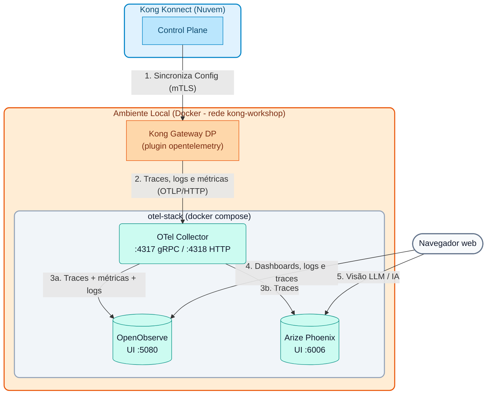

# Módulo 06: Observabilidade Avançada e OpenTelemetry

Observabilidade não é simplesmente "ter logs". É a capacidade de entender o estado interno de um sistema complexo a partir de suas saídas externas (Logs, Métricas e Rastreamentos).

Em arquiteturas de microsserviços, uma única solicitação de usuário pode atravessar dezenas de serviços diferentes. Se algo falhar ou ficar lento, as ferramentas de monitoramento tradicionais (que olham servidor por servidor) são insuficientes. Precisamos de **Rastreamento Distribuído** (Distributed Tracing).

---

## 1. Opções de Integração do Kong

O Kong Gateway fica na entrada de todo o tráfego, o que o torna o ponto ideal para gerar telemetria centralizada. O Kong oferece várias opções de integração:

1. **Integrações Nativas Específicas:** Plugins dedicados para plataformas como `datadog`, `prometheus`, `statsd` ou `zipkin`. São fáceis de configurar se você já está "preso" a um desses fornecedores.
2. **Logs para Agregadores:** Plugins como `http-log`, `tcp-log` ou `kafka-log` para enviar transações brutas a sistemas como ELK (Elasticsearch, Logstash, Kibana) ou Splunk.
3. **O Padrão Aberto (OpenTelemetry):** O plugin `opentelemetry` exporta traces, logs e métricas usando o protocolo padrão do setor (OTLP). É a opção recomendada hoje porque evita o "vendor lock-in" (você pode mudar de Datadog para Dynatrace, OpenObserve ou qualquer backend compatível com OTLP sem tocar no Kong).

---

## 2. Arquiteturas OpenTelemetry (OTel)

Ao usar o protocolo OTLP, existem dois padrões principais de implantação:

### A. Integração Direta
O Kong Gateway envia os traces diretamente para o backend de observabilidade (ex. Honeycomb ou Datadog) usando o plugin `opentelemetry`.
* **Vantagem:** Menos peças móveis.
* **Desvantagem:** O Kong gasta recursos de rede falando diretamente com o provedor externo e, se houver problemas de conectividade, traces podem ser perdidos. Além disso, cada novo backend exige reconfigurar todos os Data Planes.

### B. Arquitetura com OTel Collector (Recomendado)
O Kong Gateway envia os traces para um componente local chamado **OpenTelemetry Collector**. Esse coletor recebe os dados, processa, agrupa em lotes (batching) e os envia de forma assíncrona para um ou mais backends finais.
* **Vantagem:** Alto desempenho. O Gateway não bloqueia. O Collector pode filtrar ruído, enriquecer ou anonimizar dados (remover PII) e **duplicar** a telemetria para vários destinos (*fan-out*) sem que o Kong saiba.
* **Desvantagem:** Requer manter a infraestrutura do Collector.

Neste curso usamos o padrão **B**: o Kong fala apenas com o Collector, e o Collector distribui a telemetria para dois backends com propósitos diferentes.

---

## 3. A Stack de Observabilidade do Curso

A stack é definida em `workshop-assets/dia-1/06-observability/otel-stack/docker-compose.yml` e roda no Docker junto ao Data Plane (rede `kong-workshop`). São **3 contêineres** leves (~1,2 GB de RAM no total):

| Contêiner | Imagem (versão fixada) | Portas | Limite de RAM | Papel |
| :--- | :--- | :---: | :---: | :--- |
| `otel-collector` | `otel/opentelemetry-collector-contrib:0.161.0` | `4317` (gRPC), `4318` (HTTP) | 200 MB | Recebe OTLP do Kong, filtra/enriquece, faz *batching* e distribui: **traces → OpenObserve + Phoenix**, **métricas e logs → OpenObserve**. |
| `openobserve` | `openobserve/openobserve:v1.0.4` | `5080` | 512 MB | Backend de observabilidade "tudo em um": traces, métricas, logs, dashboards, busca de logs (SQL / texto completo) e alertas. Armazenamento colunar comprimido em um único binário. |
| `phoenix` | `arizephoenix/phoenix:20.19.0` | `6006` | 512 MB | **Arize Phoenix**: visualizador de traces orientado a LLM / IA (OpenInference). Mostra prompts, respostas, tokens, custos e latência por chamada ao modelo. |

**Por que dois backends?**

- **OpenObserve** é a ferramenta de operação do dia a dia: "quantas requisições por segundo?, qual rota tem erros 5xx?, o que aconteceu com a requisição `x-correlation-id = ...`?". Cobre os três pilares (traces, métricas, logs) em uma única UI.
- **Phoenix** foi pensado para tráfego de IA. Quando o Kong atua como **AI Gateway** (plugins `ai-proxy`, `ai-prompt-guard` etc.) ou quando as aplicações são instrumentadas com OpenInference, o Phoenix mostra cada chamada ao LLM com seu prompt, sua resposta, o consumo de tokens e a latência. Para tráfego HTTP "clássico" (como o deste módulo) mostra a árvore de spans e a latência de cada um, como qualquer visualizador de traces.
- Graças ao Collector, ambos recebem **os mesmos traces** sem nenhuma configuração extra no Kong.

**Diagrama de Arquitetura:**



> **Modo centralizado (opcional):** o mesmo `docker-compose.yml` pode rodar em um servidor do instrutor. Nesse caso os Data Planes apontam para `http://<IP_DO_SERVIDOR>:4318` em vez de `http://otel-collector:4318`, e as portas `4318`, `5080` e `6006` são abertas no firewall.

---

## 4. Sequência de Demonstrações

### Demonstração 1: Subir a Stack de Observabilidade

1. **Pré-requisito:** o Data Plane `kong-dp` deve estar rodando na rede `kong-workshop` (criada por `docs/00-setup-entorno/scripts/start_dps.sh`).
2. **Subir a stack:**

```bash
./workshop-assets/dia-1/06-observability/scripts/setup-observability.sh
```

O script:

- Verifica se o Docker e o Docker Compose estão disponíveis.
- Verifica as imagens: se não estiverem no Docker, carrega-as de `workshop-assets/dia-1/06-observability/docker-images/*.tar` (modo offline, gerado com `scripts/save-images.sh`) ou faz o download.
- Cria a rede `kong-workshop` se não existir e executa `docker compose up -d`.
- Aguarda até que OpenObserve (`/healthz`), Phoenix e o Collector (`:13133`) respondam, e imprime as URLs e credenciais.

Comandos úteis: `setup-observability.sh status` (estado e URLs), `setup-observability.sh down` (parar mantendo os dados) e `setup-observability.sh reset` (parar e apagar os dados).

3. **Percorrer a configuração do Collector** (`otel-stack/otel-collector-config.yaml`). Pontos a explicar:
    - **Receivers:** `otlp` escutando em `4317` (gRPC) e `4318` (HTTP).
    - **Processors:** `memory_limiter` (protege o Collector), `filter/health_checks` (descarta spans de `/health` e `/internal/status`), `attributes/enrich` (adiciona `pipeline.processed_by`), `transform/kong_spans` (deriva `peer.service`), `transform/phoenix_project` (usa `service.name` como projeto do Phoenix) e `batch`.
    - **Exporters:** `otlphttp/openobserve` (com Basic Auth: as credenciais ficam no Collector, o Kong não as conhece) e `otlphttp/phoenix`.
    - **Pipelines:** `traces → [OpenObserve, Phoenix]`, `metrics → OpenObserve`, `logs → OpenObserve`.

### Demonstração 2: Habilitar OpenTelemetry e Gerar Tráfego
Para que o Kong comece a emitir telemetria, habilitamos o plugin em nível global apontando para o Collector. Como o Collector está na mesma rede Docker que o Data Plane, o Kong o resolve pelo nome do contêiner: `otel-collector`.

1. **Revisar a configuração:**
Abra o arquivo `workshop-assets/dia-1/06-observability/archivos-deck/solucion-kong.yaml`. Além do serviço `/mock`, ele contém o seguinte bloco:

```yaml
plugins:
  - name: opentelemetry
    config:
      header_type: w3c
      traces_endpoint: http://otel-collector:4318/v1/traces
      logs_endpoint: http://otel-collector:4318/v1/logs
      access_logs:
        endpoint: http://otel-collector:4318/v1/logs
        custom_attributes_by_lua:
          request.id: "return kong.request.get_header('x-correlation-id') or 'none'"
      metrics:
        endpoint: http://otel-collector:4318/v1/metrics
        enable_request_metrics: true
        enable_latency_metrics: true
        enable_bandwidth_metrics: true
      resource_attributes:
        service.name: kong-gateway
        deployment.environment: workshop
  - name: correlation-id
    config:
      header_name: x-correlation-id
      echo_downstream: true
```

- `traces_endpoint`: spans de cada requisição (inclui as fases internas do Kong e a chamada ao upstream).
- `logs_endpoint` / `access_logs`: logs do Gateway e um *access log* por requisição, enriquecido com atributos calculados em Lua (IP, consumidor, user-agent, correlation id).
- `metrics`: métricas de requisições, latência e largura de banda exportadas via OTLP (não é necessário o plugin `prometheus`).
- `resource_attributes`: rótulos comuns a toda a telemetria. `service.name` é a chave para filtrar no OpenObserve e o nome do projeto no Phoenix.

2. **Aplicar e Testar:**
Execute o bloco a seguir para sincronizar, aguardar a atualização do Data Plane e gerar um lote de 10 requisições espaçadas por meio segundo:

```bash
deck gateway sync workshop-assets/dia-1/06-observability/archivos-deck/solucion-kong.yaml && \
echo "Aguardando 10s para o Konnect atualizar o Data Plane..." && sleep 10 && \
echo "Gerando 10 requisições de teste..." && \
for i in {1..10}; do curl -k -s -o /dev/null -w "HTTP Code: %{http_code}\n" https://localhost:8443/mock; sleep 0.5; done
```

**Analisando o resultado:**

- Você verá impresso no console `HTTP Code: 200` para as 10 requisições.
- Silenciosamente, o Kong agrupou a telemetria dessas transações (incluindo tempos de processamento internos e do backend) e a enviou de forma assíncrona ao Collector, que por sua vez a encaminhou ao OpenObserve e ao Phoenix.
- Isso garante que a coleta de telemetria **não adicione latência bloqueante** às requisições do cliente final.
- As métricas são enviadas em lotes periódicos (por padrão a cada 60 s): podem levar até um minuto para aparecer.

### Demonstração 3: OpenObserve — Traces, Logs, Métricas e Dashboards

1. Abra `http://localhost:5080` e faça login com o usuário root da stack (por padrão `admin@kong.com` / `Kong12345678!`, configurável em `otel-stack/.env`).
2. **Traces (Rastreamento Distribuído):**
    - Menu esquerdo → **Traces**. Selecione o stream `default` e um intervalo de tempo recente (ex. *Past 15 minutes*).
    - Filtre por serviço: `service_name = 'kong-gateway'` (o OpenObserve converte os pontos dos atributos em sublinhados: `service.name` → `service_name`).
    - Clique em um trace para abrir a visão em **Cascata (Waterfall)**.
    - **O que explicar ao aluno:**
        - O span raiz (ex. `kong`) representa o tempo total desde que o cliente fez a requisição até receber a resposta.
        - Os sub-spans detalham quantos milissegundos o **Kong** consumiu (fase `access`, plugins, DNS, balancer) e quantos o **Backend** consumiu (`kong.upstream` / chamada HTTP ao upstream).
        - No painel de atributos aparecem `http.status_code`, a rota, `pipeline.processed_by` (adicionado pelo Collector) e os `resource_attributes` definidos no plugin.
        - Isso demonstra a capacidade de isolar instantaneamente a origem da latência em um sistema complexo.
3. **Logs (busca):**
    - Menu esquerdo → **Logs**, stream `default`.
    - Busca de texto completo: `match_all('mock')`. Busca por campo: `service_name = 'kong-gateway'`.
    - Copie um valor de `x-correlation-id` (visível com `curl -k -i https://localhost:8443/mock`) e busque-o para encontrar o *access log* exato dessa requisição. Mostre que o log contém `trace_id`: a partir do log é possível ir ao trace correspondente.
    - Modo SQL: `SELECT * FROM "default" WHERE service_name = 'kong-gateway' ORDER BY _timestamp DESC LIMIT 20`.
4. **Metrics:**
    - Menu esquerdo → **Metrics**. Expanda a lista de métricas e procure as emitidas pelo Kong (número de requisições, latências, bytes transferidos).
    - Mostre como plotar uma métrica agrupando por um atributo (ex. código de status ou rota).
5. **Dashboards:**
    - Menu esquerdo → **Dashboards → New Dashboard** (ex. "Kong Workshop").
    - **Add Panel**: escolha a métrica de requisições como série temporal; adicione um segundo painel com a latência. Salve o dashboard.
    - Explique que o OpenObserve também permite criar **alertas** sobre logs ou métricas (ex. taxa de 5xx).

### Demonstração 4: Arize Phoenix — Visão de Traces Orientada a LLM / IA

1. Abra `http://localhost:6006` (o Phoenix não exige login nesta stack).
2. Na tela **Projects** aparece o projeto `kong-gateway`: o Collector copia `service.name` para `openinference.project.name`, então cada serviço (ou cada aluno, no Lab 07) tem seu próprio projeto.
3. Entre no projeto: a tabela de **Traces / Spans** mostra cada requisição com sua latência, status e horário. Clique em um trace para ver a árvore de spans e seus atributos.
4. **O que explicar ao aluno:**
    - Para tráfego HTTP "clássico" o Phoenix se comporta como mais um visualizador de traces (spans de tipo genérico).
    - Seu valor aparece com tráfego de **IA**: quando os spans trazem atributos OpenInference (por exemplo, aplicações instrumentadas com os SDKs do OpenInference, ou tráfego de LLM que passa pelo Kong AI Gateway), o Phoenix mostra o **prompt** e a **resposta**, os **tokens** de entrada/saída, o modelo usado e a **latência** de cada chamada, além de permitir avaliações e comparação de experimentos.
    - OpenObserve e Phoenix veem **o mesmo trace** (mesmo `trace_id`): o Collector faz o fan-out sem mudanças no Kong.

---

## 5. Resumo

| Pergunta operacional | Onde olhar |
| :--- | :--- |
| Por que esta requisição foi lenta? Kong ou backend? | OpenObserve → Traces (Waterfall) ou Phoenix |
| O que aconteceu com a requisição `x-correlation-id = ...`? | OpenObserve → Logs |
| Quantas requisições/erros/latência por rota? | OpenObserve → Metrics / Dashboards |
| Qual prompt foi enviado ao LLM, quantos tokens consumiu e quanto tempo levou? | Phoenix |
