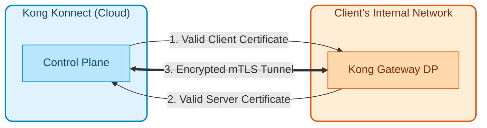
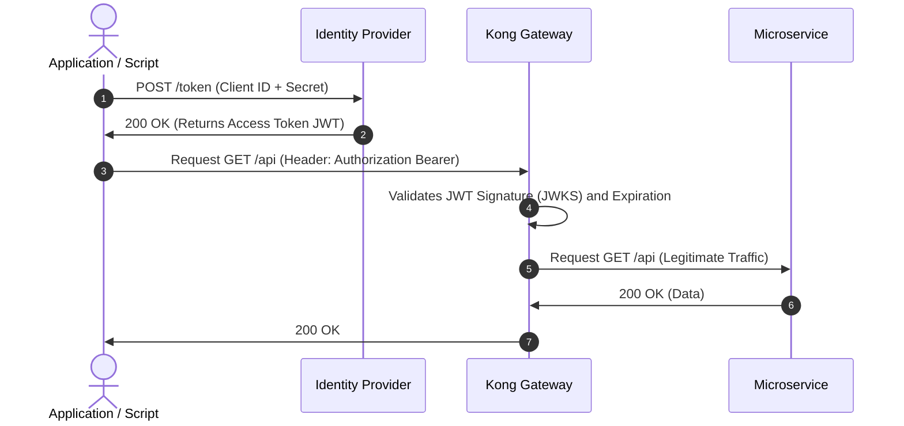
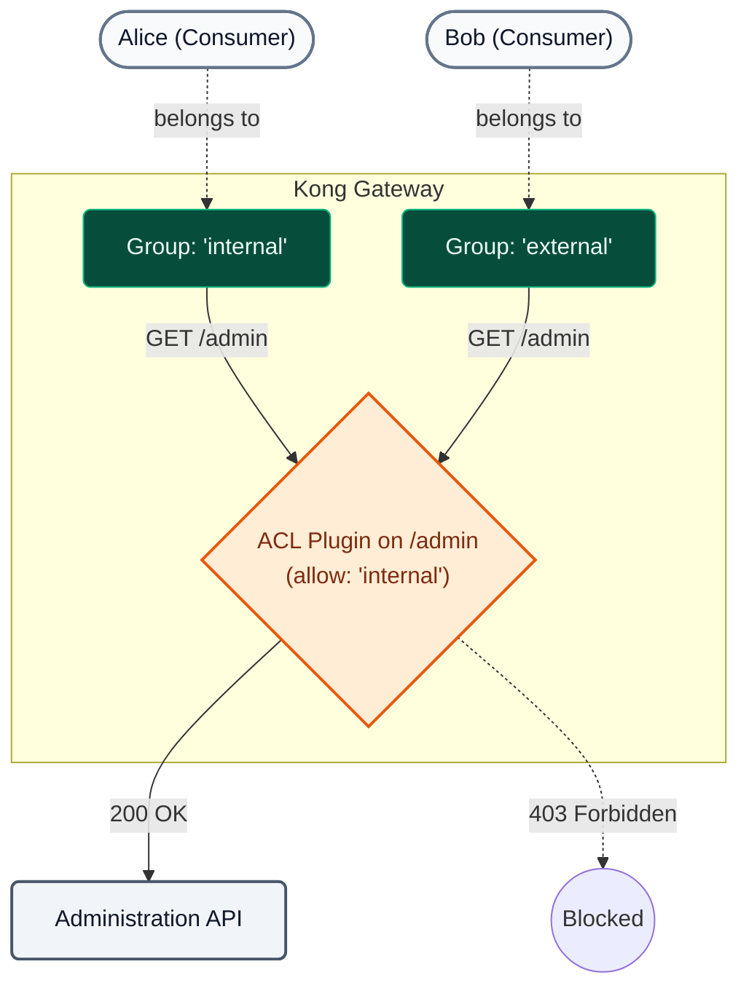

# Module 07: Securing API Traffic

In this module, we will address the practical application of the **Zero Trust** paradigm in our APIs. Kong Konnect allows orchestrating security across multiple layers (Transport, Identity, and Network), ensuring **Defense in Depth** without coupling security logic to the microservices' code.

---

## 1. Theoretical Concepts (Zero Trust)

### A. Transport Security (mTLS)

!!! info "Zero Trust Principle"
  The Zero Trust paradigm dictates that **the internal network is as hostile as the external one**. It's not enough to secure the external perimeter; every internal network hop must be validated and encrypted.

Kong Konnect automates certificate rotation and ensures that the Control Plane (cloud) and Data Plane (local nodes) communicate exclusively via encrypted tunnels using mTLS (Mutual TLS). The Data Plane will not trust any configuration instruction that does not originate from a Control Plane cryptographically signed by the same CA.



---

### B. Identity and Authentication (Authentication)

Who is calling the API? Kong acts as a centralized point to validate identity before traffic hits the microservices.

| Mechanism | Complexity Level | Ideal Use Cases | Main Feature |
| :--- | :--- | :--- | :--- |
| **Key Auth** | Low | Fast Machine-to-Machine (M2M) integrations, legacy systems. | The consumer sends a static secret in an HTTP header. |
| **Basic Auth** | Low | Simple internal APIs. | Sends username and password in base64. |
| **OpenID Connect (OIDC)** | High | SPAs, Mobile Apps, Enterprise Integrations (B2B/B2C). | Industry standard. Integrates natively with Identity Providers (Okta, Auth0, EntraID). |

!!! tip "The Advantage of OIDC in Kong"
  When using OIDC, the client never sends its passwords to the API. It authenticates against the IdP and sends Kong a short-lived JWT token. Kong cryptographically validates this token without the need to develop OIDC logic in each of your 50 microservices.

Depending on the client type, OIDC defines different **flows (grants)**.

**1. Web / SPA Flow (Authorization Code Flow):**
The Gateway intercepts the anonymous request, redirects the user to the IdP's login, and transparently exchanges the code for the token (Kong acts as a Relying Party by issuing a cookie).

**2. Machine-to-Machine Flow (Client Credentials Flow):**
This is the flow used for system-to-system integration (and the one we will use in our demonstration). The client independently requests a JWT token from the IdP using its service credentials. Then, it injects this token (`Authorization: Bearer`) when consuming the API. Kong simply intercepts the token and cryptographically validates its signature without having to contact the IdP on every request.



---

### C. Authorization (Authorization)

Knowing *who* the user is isn't enough; we need to know *what they can do*.

!!! note "Consumer Groups and ACLs"
  In Kong, clients are represented as `Consumers`. Using the **ACL (Access Control Lists)** plugin, we can group these consumers into roles (e.g., `external-partners`, `internal-devs`) and grant or deny their access to different routes in a granular way.



For extremely dynamic or complex business rules (e.g., *"Allow POST only from 9 AM to 5 PM if the user is from the finance department and the amount is less than $10,000"*), Kong delegates the decision to an external agent using the **OPA (Open Policy Agent)** plugin.

---

### D. Perimeter Network Security (IP Restriction)

**Defense in Depth** requires overlapping controls. Even if an API has strong authentication, implementing network controls adds a critical layer that mitigates credential theft.

!!! success "Benefits of IP Restriction"
  The `ip-restriction` plugin is a Layer 3/4 control that allows defining allowlists or denylists of IP addresses or entire CIDR blocks (e.g., `192.168.0.0/16`). It acts as an ultra-fast first line of defense: it rejects known attackers at the socket level *before* Kong spends CPU validating complex cryptographic signatures.

---

## 2. Demonstration Sequence

During **Day 2**, the instructor will use the automated demonstration script to illustrate how these plugins operate in a real environment.

### Demonstration 1: Strong Authentication and Access Control (Key Auth + ACL)
**Objective:** Demonstrate how to protect a route by blocking anonymous requests and differentiating permissions between two distinct consumers.

1. **Injection:** A declarative file (`03-b3-acl.yaml`) that applies the `key-auth` and `acl` plugins is synchronized:
  ```bash
  deck gateway sync workshop-assets/dia-1/07-securing-api-traffic/archivos-deck/03-b3-acl.yaml && sleep 5
  ```
2. **Anonymity Validation:** 
  
  The instructor generates traffic without credentials:
  
  ```bash
  curl -k -i https://localhost:8443/mock
  ```
  
  Using curl (alternative):
  ```bash
  curl -k -i https://localhost:8443/mock
  ```
  
  **Result:** `401 Unauthorized`. The API rejects unauthenticated traffic.
3. **Invalid Role Validation (Authorization):** 
  
  The route is invoked by sending a valid key from an internal user:
  
  ```bash
  curl -k -i -H "apikey: internal-secret-123" https://localhost:8443/mock
  ```
  
  Using curl (alternative):
  ```bash
  curl -k -i -H "apikey: internal-secret-123" https://localhost:8443/mock
  ```
  
  **Result:** `403 Forbidden`. The credential is valid, but the associated group (`internal`) is not authorized in the ACL for this particular route.
4. **Legitimate Consumption:** 
  
  The route is invoked using the correct role's credential:
  
  ```bash
  curl -k -i -H "apikey: external-secret-123" https://localhost:8443/mock
  ```
  
  Using curl (alternative):
  ```bash
  curl -k -i -H "apikey: external-secret-123" https://localhost:8443/mock
  ```
  
  **Result:** `200 OK`. Access permitted.

### Demonstration 2: Perimeter Defense (IP Restriction)
**Objective:** Protect the perimeter by blocking access to unwanted IPs, verifying the effectiveness of Defense in Depth (even if the key was stolen).

1. **Injection:** To apply the `08-b8-ip-restriction.yaml` policy, we need to export the Docker gateway's IP. This is the actual IP that Kong sees as the origin of our requests.
  ```bash
  export DECK_DOCKER_HOST_IP=$(docker network inspect kong-workshop -r '.[0].IPAM.Config[0].Gateway')
  deck gateway sync workshop-assets/dia-1/07-securing-api-traffic/archivos-deck/08-b8-ip-restriction.yaml && sleep 5
  ```
2. **Network Block Validation (Negative Case - Blocked IP):** 
  
  Since the host's IP (your machine) is on the allowlist to permit other demos, we will invoke the route from an unauthorized IP using a temporary container within the Docker network:
  
  ```bash
  docker run --rm --network kong-workshop curlimages/curl -k -i -H "apikey: external-secret-123" https://kong-dp:8443/mock
  ```
  
  **Result:** `403 Forbidden`. The request is immediately rejected by the network rule even before the gateway validates the key.
  
3. **Legitimate Consumption (Positive Case - Allowed IP):** 
  
  The instructor invokes the route again from the host's IP (which is on the `allow` list):
  
  ```bash
  curl -k -i -H "apikey: external-secret-123" https://localhost:8443/mock
  ```
  
  Using curl (alternative):
  ```bash
  curl -k -i -H "apikey: external-secret-123" https://localhost:8443/mock
  ```
  
  **Result:** `200 OK`. Access permitted because it originates from a trusted network.


### Demonstration 3: Mutual TLS and OpenID Connect
**Objective:** Demonstrate how Kong allows stacking security layers (Transport + User Identity) without modifying the microservice code. We will implement a flow where a valid client certificate (mTLS) is first required, and then, additionally, a valid JWT Token issued by Konnect (OIDC).

#### Phase A: Client Authentication (mTLS)

1. **On-the-Fly Certificate Generation:**
  
  The instructor generates a local Certificate Authority (CA) and a client certificate signed by that CA:
  
  ```bash
  # Create the Root CA
  openssl req -new -x509 -nodes -days 365 -subj "/CN=kong-ca/O=MyOrg" -keyout ca.key -out ca.crt
  
  # Create the Client Certificate (CN must match the Consumer's username in Kong)
  openssl req -new -nodes -subj "/CN=App-External/O=MyOrg" -keyout client.key -out client.csr
  
  # Sign the Client Certificate with our CA
  openssl x509 -req -in client.csr -CA ca.crt -CAkey ca.key -CAcreateserial -out client.crt -days 365
  
  # Export the CA certificate to an environment variable as a valid string for injection into decK
  export DECK_MTLS_CA_CERT=$(python3 -c 'import sys, json; print(json.dumps(sys.stdin.read()))' < ca.crt)
  ```

2. **CA and Policy Injection:**
  
  The `09-b9-mtls.yaml` file is synchronized, which associates our CA with Kong and activates the `mtls-auth` plugin. Since the Subject CN (`App-External`) matches our consumer, Kong will automatically map the identity.
  
  ```bash
  deck gateway sync workshop-assets/dia-1/07-securing-api-traffic/archivos-deck/09-b9-mtls.yaml && sleep 5
  ```

3. **Block Validation (Without Certificate):**
  
  The route is invoked without presenting the client certificate:
  
  Using curl:
  ```bash
  curl -k -i https://localhost:8443/mock
  ```
  
  ```bash
  curl -k -i https://localhost:8443
  ```
  
  **Result:** `401 Unauthorized`. (Message: "No required TLS certificate was sent").

4. **Legitimate Consumption (With Certificate):**
  
  The route is invoked by presenting the newly generated certificate:
  
  Using curl:
  ```bash
  curl -k -i --cert client.crt --key client.key https://localhost:8443/mock
  ```
  
  ```bash
  curl -k -i https://localhost:8443
  ```
  
  **Result:** `200 OK`. Kong validates the certificate against the CA, identifies the Subject, associates it with `App-External`, and allows passage.

#### Phase B: Defense in Depth (mTLS + OIDC)

At this point, traffic is encrypted and machine-level authenticated. Now, we will add Application/User Identity by delegating authentication to the Kong Konnect Issuer (OIDC).

1. **OIDC Policy Injection:**
  
  The `10-b10-mtls-oidc.yaml` file is synchronized, which adds the `openid-connect` plugin to the same route:
  
  ```bash
  export DECK_KONNECT_AUTH_ISSUER=$KONNECT_AUTH_ISSUER
  export DECK_KONNECT_AUTH_CLIENT_ID=$KONNECT_AUTH_CLIENT_ID
  export DECK_KONNECT_AUTH_CLIENT_SECRET=$KONNECT_AUTH_CLIENT_SECRET
  deck gateway sync workshop-assets/dia-1/07-securing-api-traffic/archivos-deck/10-b10-mtls-oidc.yaml && sleep 5
  ```

2. **Block Validation (Without Token):**
  
  The same previous request is attempted (which sent a valid certificate but NOT a JWT token):
  
  Using curl:
  ```bash
  curl -k -i --cert client.crt --key client.key https://localhost:8443/mock
  ```
  
  ```bash
  curl -k -i https://localhost:8443
  ```
  
  **Result:** `401 Unauthorized`. (Message returned by the OIDC plugin requesting a Bearer token).

3. **JWT Token Acquisition (Konnect Identity):**
  
  A token is requested from the local Issuer using Client Credentials.
  
  > **Note on the Issuer:** Since we are making the request from the host (your machine) to the Docker container, we will use `localhost` in the URL, but we will inject the `Host: mock-oidc:8081` header so that the generated JWT token contains the correct `iss` (Issuer) claim that Kong expects within the internal network.
  
  ```bash
  export LOCAL_ISSUER="${KONNECT_AUTH_ISSUER//mock-oidc/localhost}"
  export HOST_HEADER=$(echo $KONNECT_AUTH_ISSUER | awk -F/ '{print $3}')
    export ACCESS_TOKEN=$(curl -sX POST "${LOCAL_ISSUER}/token" \
    -H "Host: $HOST_HEADER" \
    -H 'Content-Type: application/x-www-form-urlencoded' \
    -d "client_id=${KONNECT_AUTH_CLIENT_ID}" \
    -d "client_secret=${KONNECT_AUTH_CLIENT_SECRET}" \
    -d 'grant_type=client_credentials' | jq -r .access_token)
   
  echo $ACCESS_TOKEN
  ```

4. **Final Legitimate Consumption (mTLS + Token):**
  
  The route is invoked by presenting **both** credentials (Certificate + Bearer Token):
  
  ```bash
  curl -k -i --cert client.crt --key client.key \
   -H "Authorization: Bearer $ACCESS_TOKEN" \
   https://localhost:8443/mock
  ```
  
  **Result:** `200 OK`. Defense in depth achieved! Kong validated the transport certificate and the cryptographic validity of the JWT issued by the IdP.