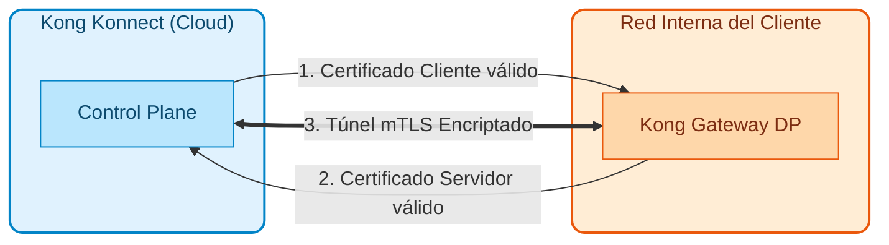
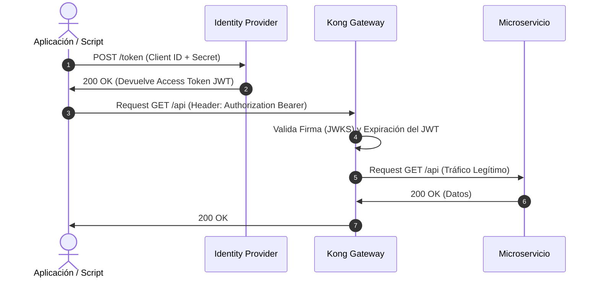
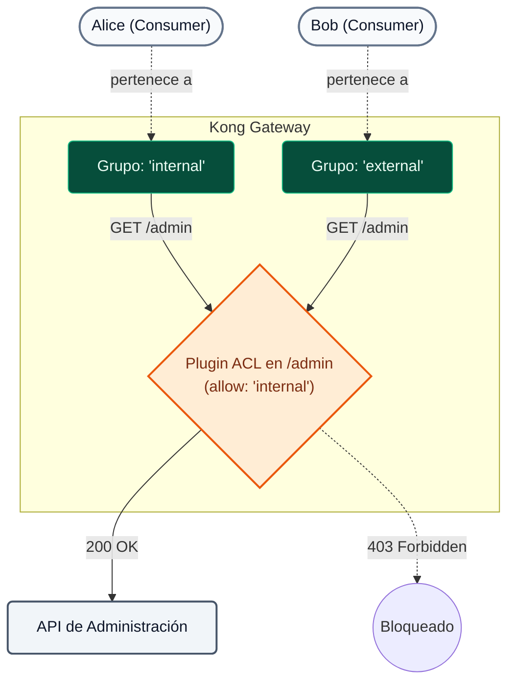

# Módulo 07: Securing API Traffic

En este módulo abordaremos la aplicación práctica del paradigma **Zero Trust** en nuestras APIs. Kong Konnect permite orquestar la seguridad en múltiples capas (Transporte, Identidad y Red) garantizando una **Defensa en Profundidad** sin acoplar lógica de seguridad al código de los microservicios.

---

## 1. Conceptos Teóricos (Zero Trust)

### A. Seguridad de Transporte (mTLS)

!!! info "Principio de Zero Trust"
  El paradigma Zero Trust dicta que **la red interna es tan hostil como la externa**. No basta con asegurar el perímetro externo; cada salto de red interno debe ser validado y encriptado.

Kong Konnect automatiza la rotación de certificados y asegura que el Control Plane (nube) y el Data Plane (nodos locales) se comuniquen exclusivamente mediante túneles cifrados vía mTLS (Mutual TLS). El Data Plane no confiará en ninguna instrucción de configuración que no provenga de un Control Plane firmado criptográficamente por la misma CA.



---

### B. Identidad y Autenticación (Authentication)

¿Quién está llamando a la API? Kong actúa como un punto centralizado para validar la identidad antes de que el tráfico golpee los microservicios.

| Mecanismo | Nivel de Complejidad | Casos de Uso Ideales | Característica Principal |
| :--- | :--- | :--- | :--- |
| **Key Auth** | Bajo | Integraciones Machine-to-Machine (M2M) rápidas, sistemas legacy. | El consumidor envía un secreto estático en un header HTTP. |
| **Basic Auth** | Bajo | APIs internas simples. | Envío de usuario y contraseña en base64. |
| **OpenID Connect (OIDC)** | Alto | SPAs, Mobile Apps, Integraciones Enterprise (B2B/B2C). | Estándar de la industria. Se integra nativamente con Identity Providers (Okta, Auth0, EntraID). |

!!! tip "La Ventaja de OIDC en Kong"
  Al usar OIDC, el cliente nunca envía sus contraseñas a la API. Se autentica contra el IdP, y envía a Kong un token JWT de corta duración. Kong valida criptográficamente este token sin necesidad de desarrollar lógica OIDC en cada uno de tus 50 microservicios.

Dependiendo del tipo de cliente, OIDC define distintos **flujos (grants)**.

**1. Flujo Web / SPA (Authorization Code Flow):**
El Gateway intercepta la petición anónima, redirige al usuario al login del IdP, y canjea el código por el token de forma transparente (Kong actúa como Relying Party emitiendo una cookie).

**2. Flujo Machine-to-Machine (Client Credentials Flow):**
Es el flujo usado para integración entre sistemas (y el que usaremos en nuestra demostración). El cliente solicita de manera independiente un token JWT al IdP usando sus credenciales de servicio. Luego, inyecta este token (`Authorization: Bearer`) al consumir la API. Kong simplemente intercepta el token y valida criptográficamente su firma sin tener que contactar al IdP en cada petición.



---

### C. Autorización (Authorization)

Saber *quién* es el usuario no basta; debemos saber *qué puede hacer*.

!!! note "Consumer Groups y ACLs"
  En Kong, los clientes se representan como `Consumers`. Mediante el plugin **ACL (Access Control Lists)**, podemos agrupar a estos consumidores en roles (ej. `external-partners`, `internal-devs`) y permitir o denegar su acceso a diferentes rutas de forma granular.



Para reglas empresariales extremadamente dinámicas o complejas (ej. *"Permitir POST solo de 9 a 17h si el usuario es del departamento de finanzas y el monto es menor a $10,000"*), Kong delega la decisión a un agente externo mediante el plugin **OPA (Open Policy Agent)**.

---

### D. Seguridad de Red Perimetral (IP Restriction)

La **Defensa en Profundidad** (Defense in Depth) requiere controles solapados. Aunque una API tenga autenticación fuerte, implementar controles de red agrega una capa crítica que mitiga el robo de credenciales.

!!! success "Beneficios de IP Restriction"
  El plugin `ip-restriction` es un control de Capa 3/4 que permite definir listas blancas (Allowlist) o negras (Denylist) de direcciones IP o bloques CIDR enteros (ej. `192.168.0.0/16`). Actúa como una primera línea de defensa ultrarrápida: rechaza atacantes conocidos a nivel de socket *antes* de que Kong gaste CPU validando firmas criptográficas complejas.

---

## 2. Secuencia de Demostraciones

Durante el **Día 2**, el instructor utilizará el script automatizado de demostraciones para ilustrar cómo operan estos plugins en un entorno real. 

### Demostración 1: Autenticación Fuerte y Control de Acceso (Key Auth + ACL)
**Objetivo:** Demostrar cómo se protege una ruta bloqueando peticiones anónimas y diferenciando permisos entre dos consumidores distintos.

1. **Inyección:** Se sincroniza un archivo declarativo (`03-b3-acl.yaml`) que aplica los plugins de `key-auth` y `acl`:
  ```bash
  deck gateway sync workshop-assets/dia-1/07-securing-api-traffic/archivos-deck/03-b3-acl.yaml && sleep 5
  ```
2. **Validación de Anonimato:** 
  
  El instructor genera tráfico sin credenciales:
  
  ```bash
  curl -k -i https://localhost:8443/mock
  ```
  
  Usando curl (alternativa):
  ```bash
  curl -k -i https://localhost:8443/mock
  ```
  
  **Resultado:** `401 Unauthorized`. La API rechaza el tráfico no autenticado.
3. **Validación de Rol Inválido (Autorización):** 
  
  Se invoca la ruta enviando una clave válida de un usuario interno:
  
  ```bash
  curl -k -i -H "apikey: internal-secret-123" https://localhost:8443/mock
  ```
  
  Usando curl (alternativa):
  ```bash
  curl -k -i -H "apikey: internal-secret-123" https://localhost:8443/mock
  ```
  
  **Resultado:** `403 Forbidden`. La credencial es válida, pero el grupo asociado (`internal`) no está autorizado en la ACL de esta ruta particular.
4. **Consumo Legítimo:** 
  
  Se invoca usando la credencial del rol correcto:
  
  ```bash
  curl -k -i -H "apikey: external-secret-123" https://localhost:8443/mock
  ```
  
  Usando curl (alternativa):
  ```bash
  curl -k -i -H "apikey: external-secret-123" https://localhost:8443/mock
  ```
  
  **Resultado:** `200 OK`. Acceso permitido.

### Demostración 2: Defensa Perimetral (IP Restriction)
**Objetivo:** Proteger el perímetro bloqueando el acceso a IPs indeseadas, comprobando la eficacia de la Defensa en Profundidad (incluso si la clave fue robada).

1. **Inyección:** Para aplicar la política `08-b8-ip-restriction.yaml` necesitamos exportar la IP del gateway de Docker. Esta es la IP real que Kong ve como origen de nuestras peticiones.
  ```bash
  export DECK_DOCKER_HOST_IP=$(docker network inspect kong-workshop -r '.[0].IPAM.Config[0].Gateway')
  deck gateway sync workshop-assets/dia-1/07-securing-api-traffic/archivos-deck/08-b8-ip-restriction.yaml && sleep 5
  ```
2. **Validación de Bloqueo de Red (Caso Negativo - IP Bloqueada):** 
  
  Como la IP del host (tu máquina) está en la lista blanca para permitir las otras demos, invocaremos la ruta desde una IP no autorizada usando un contenedor temporal dentro de la red de Docker:
  
  ```bash
  docker run --rm --network kong-workshop curlimages/curl -k -i -H "apikey: external-secret-123" https://kong-dp:8443/mock
  ```
  
  **Resultado:** `403 Forbidden`. La petición es rechazada inmediatamente por la regla de red antes siquiera de que el gateway valide la clave.
  
3. **Consumo Legítimo (Caso Positivo - IP Permitida):** 
  
  El instructor invoca de nuevo la ruta desde la IP del host (la cual está en la lista blanca `allow`):
  
  ```bash
  curl -k -i -H "apikey: external-secret-123" https://localhost:8443/mock
  ```
  
  Usando curl (alternativa):
  ```bash
  curl -k -i -H "apikey: external-secret-123" https://localhost:8443/mock
  ```
  
  **Resultado:** `200 OK`. Acceso permitido por provenir de una red confiable.


### Demostración 3: Mutual TLS y OpenID Connect
**Objetivo:** Demostrar cómo Kong permite apilar capas de seguridad (Transporte + Identidad de Usuario) sin modificar el código del microservicio. Implementaremos un flujo donde primero se requiere un certificado de cliente válido (mTLS) y luego, adicionalmente, un Token JWT válido emitido por Konnect (OIDC).

#### Fase A: Autenticación de Cliente (mTLS)

1. **Generación de Certificados "Al Vuelo":**
  
  El instructor genera una Autoridad Certificadora (CA) local y un certificado de cliente firmado por dicha CA:
  
  ```bash
  # Crear la CA Raíz
  openssl req -new -x509 -nodes -days 365 -subj "/CN=kong-ca/O=MyOrg" -keyout ca.key -out ca.crt
  
  # Crear el Certificado de Cliente (CN debe coincidir con el username del Consumer en Kong)
  openssl req -new -nodes -subj "/CN=App-External/O=MyOrg" -keyout client.key -out client.csr
  
  # Firmar el Certificado de Cliente con nuestra CA
  openssl x509 -req -in client.csr -CA ca.crt -CAkey ca.key -CAcreateserial -out client.crt -days 365
  
  # Exportar el certificado de la CA a una variable de entorno como un string válido para inyectarlo en decK
  export DECK_MTLS_CA_CERT=$(python3 -c 'import sys, json; print(json.dumps(sys.stdin.read()))' < ca.crt)
  ```

2. **Inyección de la CA y Política:**
  
  Se sincroniza el archivo `09-b9-mtls.yaml` que asocia nuestra CA a Kong y activa el plugin `mtls-auth`. Dado que el Subject CN (`App-External`) coincide con nuestro consumidor, Kong mapeará automáticamente la identidad.
  
  ```bash
  deck gateway sync workshop-assets/dia-1/07-securing-api-traffic/archivos-deck/09-b9-mtls.yaml && sleep 5
  ```

3. **Validación de Bloqueo (Sin Certificado):**
  
  Se invoca la ruta sin presentar el certificado de cliente:
  
  Usando curl:
  ```bash
  curl -k -i https://localhost:8443/mock
  ```
  
  ```bash
  curl -k -i https://localhost:8443
  ```
  
  **Resultado:** `401 Unauthorized`. (Mensaje: "No required TLS certificate was sent").

4. **Consumo Legítimo (Con Certificado):**
  
  Se invoca la ruta presentando el certificado recién generado:
  
  Usando curl:
  ```bash
  curl -k -i --cert client.crt --key client.key https://localhost:8443/mock
  ```
  
  ```bash
  curl -k -i https://localhost:8443
  ```
  
  **Resultado:** `200 OK`. Kong valida el certificado contra la CA, identifica el Subject, lo asocia a `App-External` y permite el paso.

#### Fase B: Seguridad en Profundidad (mTLS + OIDC)

Para este punto, el tráfico está cifrado y autenticado a nivel máquina. Ahora, agregaremos Identidad de Aplicación/Usuario delegando la autenticación al Issuer de Kong Konnect (OIDC).

1. **Inyección de la Política OIDC:**
  
  Se sincroniza el archivo `10-b10-mtls-oidc.yaml` que agrega el plugin `openid-connect` sobre la misma ruta:
  
  ```bash
  export DECK_KONNECT_AUTH_ISSUER=$KONNECT_AUTH_ISSUER
  export DECK_KONNECT_AUTH_CLIENT_ID=$KONNECT_AUTH_CLIENT_ID
  export DECK_KONNECT_AUTH_CLIENT_SECRET=$KONNECT_AUTH_CLIENT_SECRET
  deck gateway sync workshop-assets/dia-1/07-securing-api-traffic/archivos-deck/10-b10-mtls-oidc.yaml && sleep 5
  ```

2. **Validación de Bloqueo (Sin Token):**
  
  Se intenta la misma petición anterior (que enviaba un certificado válido pero NO un token JWT):
  
  Usando curl:
  ```bash
  curl -k -i --cert client.crt --key client.key https://localhost:8443/mock
  ```
  
  ```bash
  curl -k -i https://localhost:8443
  ```
  
  **Resultado:** `401 Unauthorized`. (Mensaje devuelto por el plugin OIDC solicitando Bearer token).

3. **Obtención del Token JWT (Konnect Identity):**
  
  Se solicita un token al Issuer local mediante Client Credentials.
  
  > **Nota sobre el Issuer:** Como estamos haciendo la petición desde el host (tu máquina) hacia el contenedor de Docker, usaremos `localhost` en la URL, pero inyectaremos la cabecera `Host: mock-oidc:8081` para que el token JWT generado contenga el claim `iss` (Issuer) correcto que espera Kong dentro de la red interna.
  
  ```bash
  export LOCAL_ISSUER="${KONNECT_AUTH_ISSUER//mock-oidc/localhost}"
  export HOST_HEADER=$(echo $KONNECT_AUTH_ISSUER | awk -F/ '{print $3}')
    export ACCESS_TOKEN=$(curl -sX POST "${LOCAL_ISSUER}/token" \
    -H "Host: $HOST_HEADER" \
    -H 'Content-Type: application/x-www-form-urlencoded' \
    -d "client_id=${KONNECT_AUTH_CLIENT_ID}" \
    -d "client_secret=${KONNECT_AUTH_CLIENT_SECRET}" \
    -d 'grant_type=client_credentials' | jq -r .access_token)
   
  echo $ACCESS_TOKEN
  ```

4. **Consumo Legítimo Final (mTLS + Token):**
  
  Se invoca la ruta presentando **ambas** credenciales (Certificado + Token Bearer):
  
  ```bash
  curl -k -i --cert client.crt --key client.key \
   -H "Authorization: Bearer $ACCESS_TOKEN" \
   https://localhost:8443/mock
  ```
  
  **Resultado:** `200 OK`. ¡Defensa en profundidad lograda! Kong validó el certificado de transporte y la validez criptográfica del JWT emitido por el IdP.
