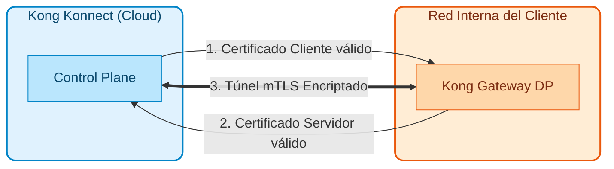
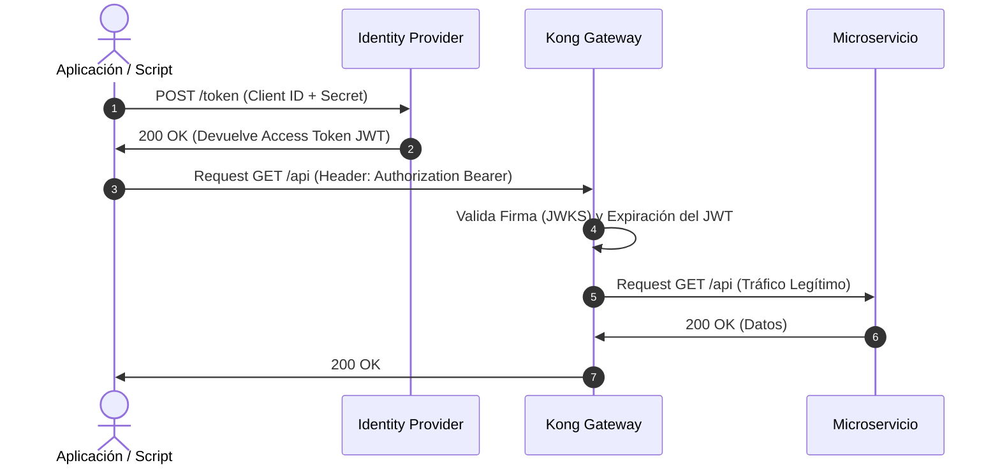
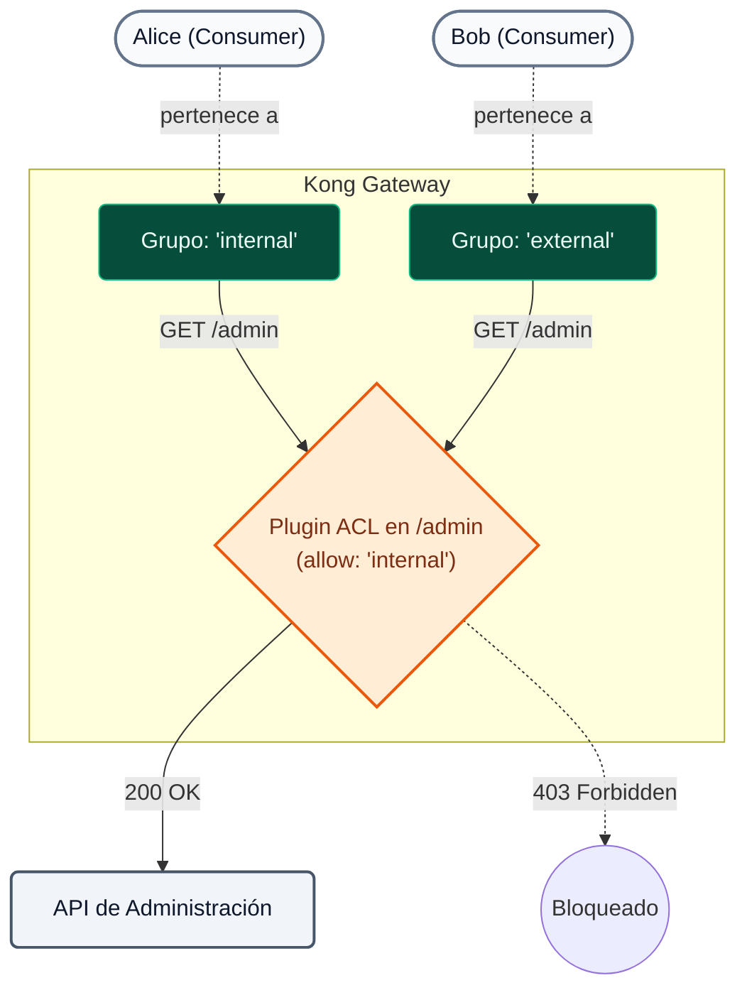

# Módulo 07: Protegendo o tráfego da API

Neste módulo abordaremos a aplicação prática do paradigma **Zero Trust** em nossas APIs. Kong Konnect permite orquestrar a segurança em múltiplas camadas (Transporte, Identidade e Rede) garantindo **Defesa em Profundidade** sem acoplar lógica de segurança ao código de microsserviços.

---

## 1. Conceitos Teóricos (Confiança Zero)

### A. Segurança de Transporte (mTLS)

!!! info "Princípio de Confiança Zero"
  O paradigma Zero Trust determina que **a rede interna é tão hostil quanto a externa**. Não basta proteger o perímetro externo; cada salto de rede interna deve ser validado e criptografado.

Kong Konnect automatiza a rotação de certificados e garante que o Plano de Controle (nuvem) e o Plano de Dados (nós locais) se comuniquem exclusivamente através de túneis criptografados via mTLS (TLS Mútuo). O Plano de Dados não confiará em nenhuma instrução de configuração que não venha de um Plano de Controle assinado criptograficamente pela mesma CA.


---

### B. Identidade e Autenticação (Autenticação)

Quem está chamando a API? Kong atua como um ponto centralizado para validar a identidade antes que o tráfego chegue aos microsserviços.

| Mecanismo | Nível de complexidade | Casos de uso ideais | Recurso principal |
| :--- | :--- | :--- | :--- |
| **Autorização chave** | Baixo | Integrações rápidas máquina a máquina (M2M), sistemas legados. | O consumidor envia um segredo estático em um cabeçalho HTTP. |
| **Autenticação Básica** | Baixo | APIs internas simples. | Enviando nome de usuário e senha em base64. |
| **OpenID Connect (OIDC)** | Alto | SPAs, aplicativos móveis, integrações empresariais (B2B/B2C). | Padrão da indústria. Integra-se nativamente com provedores de identidade (Okta, Auth0, EntraID). |

!!! dica "A vantagem do OIDC em Kong"
  Ao utilizar o OIDC, o cliente nunca envia suas senhas para a API. Ele autentica no IdP e envia ao Kong um token JWT de curta duração. Kong valida criptograficamente esse token sem a necessidade de desenvolver lógica OIDC em cada um dos seus 50 microsserviços.

Dependendo do tipo de cliente, o OIDC define diferentes **fluxos (concessões)**.

**1. Fluxo Web/SPA (Fluxo de Código de Autorização):**
O Gateway intercepta a solicitação anônima, redireciona o usuário para o login do IdP e troca o código pelo token de forma transparente (Kong atua como Parte Confiante emitindo um cookie).

**2. Fluxo máquina a máquina (fluxo de credenciais do cliente):**
É o fluxo utilizado para integração entre sistemas (e aquele que utilizaremos em nossa demonstração). O cliente solicita independentemente um token JWT do IdP usando suas credenciais de serviço. Em seguida, ele injeta esse token (`Autorização: Bearer`) ao consumir a API. Kong simplesmente intercepta o token e valida criptograficamente sua assinatura sem precisar entrar em contato com o IdP em cada solicitação.


---

### C. Autorização

Saber *quem* é o usuário não é suficiente; devemos saber *o que ele pode fazer*.

!!! observe "Grupos de consumidores e ACLs"
  Em Kong, os clientes são representados como «Consumidores». Usando o plugin **ACL (Access Control Lists)**, podemos agrupar esses consumidores em funções (por exemplo, `parceiros externos`, `desenvolvedores internos`) e permitir ou negar seu acesso a diferentes rotas de forma granular.


Para regras de negócios extremamente dinâmicas ou complexas (por exemplo, *"Permitir POST apenas das 9h às 17h se o usuário for do departamento financeiro e o valor for inferior a US$ 10.000"*), Kong delega a decisão a um agente externo usando o plugin **OPA (Open Policy Agent)**.

---

### D. Segurança de rede de perímetro (restrição de IP)

**Defesa em Profundidade** requer controles sobrepostos. Mesmo que uma API tenha autenticação forte, a implementação de controles de rede adiciona uma camada crítica que mitiga o roubo de credenciais.

!!! sucesso "Benefícios de restrição de IP"
  O plugin `ip-restriction` é um controle de camada 3/4 que permite definir listas brancas (Allowlist) ou listas negras (Denylist) de endereços IP ou blocos CIDR inteiros (por exemplo, `192.168.0.0/16`). Atua como uma primeira linha de defesa extremamente rápida: rejeitando invasores conhecidos no nível do soquete *antes* que Kong desperdice CPU validando assinaturas criptográficas complexas.

---

## 2. Sequência de Demonstrações

Durante o **Dia 2**, o instrutor usará o script de demonstração automatizado para ilustrar como esses plug-ins funcionam em um ambiente real. 

### Demonstração 1: Autenticação Forte e Controle de Acesso (Key Auth + ACL)
**Objetivo:** demonstrar como uma rota é protegida bloqueando solicitações anônimas e diferenciando permissões entre dois consumidores diferentes.

1. **Injeção:** Um arquivo declarativo (`03-b3-acl.yaml`) que aplica os plugins `key-auth` e `acl` é sincronizado:  

```bash
  deck gateway sync workshop-assets/dia-1/07-securing-api-traffic/archivos-deck/03-b3-acl.yaml && sleep 5
  

```
2. **Validação de anonimato:** 
  
  O instrutor gera tráfego sem credenciais:  

```bash
  curl -k -i https://localhost:8443/mock
  

```
Usando curl (alternativa):  

```bash
  curl -k -i https://localhost:8443/mock
  

```
**Resultado:** `401 Não autorizado`. A API rejeita tráfego não autenticado.
3. **Validação de função inválida (autorização):** 
  
  A rota é invocada enviando uma chave válida de um usuário interno:  

```bash
  curl -k -i -H "apikey: internal-secret-123" https://localhost:8443/mock
  

```
Usando curl (alternativa):  

```bash
  curl -k -i -H "apikey: internal-secret-123" https://localhost:8443/mock
  

```
**Resultado:** `403 Proibido`. A credencial é válida, mas o grupo associado (`interno`) não está autorizado na ACL desta rota específica.
4. **Consumo Legítimo:** 
  
  Invocado usando a credencial de função correta:  

```bash
  curl -k -i -H "apikey: external-secret-123" https://localhost:8443/mock
  

```
Usando curl (alternativa):  

```bash
  curl -k -i -H "apikey: external-secret-123" https://localhost:8443/mock
  

```
**Resultado:** `200 OK`. Acesso permitido.

### Demonstração 2: Defesa de Perímetro (Restrição de IP)
**Objetivo:** Proteger o perímetro bloqueando o acesso a IPs indesejados, verificando a eficácia da Defesa em Profundidade (mesmo que a chave tenha sido roubada).

1. **Injeção:** Para aplicar a política `08-b8-ip-restriction.yaml` precisamos exportar o IP do gateway Docker. Este é o verdadeiro IP que Kong vê como a origem dos nossos pedidos.  

```bash
  export DECK_DOCKER_HOST_IP=$(docker network inspect kong-workshop -r '.[0].IPAM.Config[0].Gateway')
  deck gateway sync workshop-assets/dia-1/07-securing-api-traffic/archivos-deck/08-b8-ip-restriction.yaml && sleep 5
  

```
2. **Validação de bloqueio de rede (caso negativo - IP bloqueado):** 
  
  Como o IP do host (sua máquina) está na lista de permissões para permitir outras demonstrações, invocaremos a rota de um IP não autorizado usando um contêiner temporário dentro da rede Docker:  

```bash
  docker run --rm --network kong-workshop curlimages/curl -k -i -H "apikey: external-secret-123" https://kong-dp:8443/mock
  

```
**Resultado:** `403 Proibido`. A solicitação é imediatamente rejeitada pela regra de rede antes mesmo que o gateway valide a chave.
  
3. **Consumo Legítimo (Caso Positivo - IP Permitido):** 
  
  O instrutor invoca novamente a rota do IP do host (que está na lista de permissões `allow`):  

```bash
  curl -k -i -H "apikey: external-secret-123" https://localhost:8443/mock
  

```
Usando curl (alternativa):  

```bash
  curl -k -i -H "apikey: external-secret-123" https://localhost:8443/mock
  

```
**Resultado:** `200 OK`. Acesso permitido porque vem de uma rede confiável.


### Demonstração 3: TLS mútuo e OpenID Connect
**Objetivo:** Demonstrar como o Kong permite empilhar camadas de segurança (Transporte + Identidade do usuário) sem modificar o código do microsserviço. Implementaremos um fluxo onde primeiro é necessário um certificado de cliente válido (mTLS) e, em seguida, adicionalmente um Token JWT válido emitido pela Konnect (OIDC).

#### Fase A: Autenticação do cliente (mTLS)

1. **Geração de Certificados "On the Fly":**
  
  O instrutor gera uma Autoridade de Certificação (CA) local e um certificado de cliente assinado por essa CA:  

```bash
  # Crear la CA Raíz
  openssl req -new -x509 -nodes -days 365 -subj "/CN=kong-ca/O=MyOrg" -keyout ca.key -out ca.crt
  
  # Crear el Certificado de Cliente (CN debe coincidir con el username del Consumer en Kong)
  openssl req -new -nodes -subj "/CN=App-External/O=MyOrg" -keyout client.key -out client.csr
  
  # Firmar el Certificado de Cliente con nuestra CA
  openssl x509 -req -in client.csr -CA ca.crt -CAkey ca.key -CAcreateserial -out client.crt -days 365
  
  # Exportar el certificado de la CA a una variable de entorno como un string válido para inyectarlo en decK
  export DECK_MTLS_CA_CERT=$(python3 -c 'import sys, json; print(json.dumps(sys.stdin.read()))' < ca.crt)
  

```
2. **Injeção e Política de CA:**
  
  O arquivo `09-b9-mtls.yaml` que associa nosso CA ao Kong é sincronizado e ativa o plugin `mtls-auth`. Como o Assunto CN (`App-External`) corresponde ao nosso consumidor, Kong mapeará automaticamente a identidade.  

```bash
  deck gateway sync workshop-assets/dia-1/07-securing-api-traffic/archivos-deck/09-b9-mtls.yaml && sleep 5
  

```
3. **Validação de bloqueio (sem certificado):**
  
  A rota é invocada sem apresentar o certificado do cliente:
  
  Usando ondulação:  

```bash
  curl -k -i https://localhost:8443/mock
  

```
  
  

```bash
  curl -k -i https://localhost:8443
  

```
  
  **Resultado:** `401 Unauthorized`. (Mensaje: "No required TLS certificate was sent").

4. **Consumo Legítimo (Con Certificado):**
  
  Se invoca la ruta presentando el certificado recién generado:
  
  Usando curl:
  

```bash
  curl -k -i --cert client.crt --key client.key https://localhost:8443/mock
  

```
  
  

```bash
  curl -k -i https://localhost:8443
  

```
**Resultado:** `200 OK`. Kong valida o certificado contra a CA, identifica o Assunto, associa-o ao `App-External` e permite a passagem.

#### Fase B: Segurança em profundidade (mTLS + OIDC)

Neste ponto, o tráfego é criptografado e autenticado no nível da máquina. Agora, adicionaremos a identidade do aplicativo/usuário delegando a autenticação ao Kong Konnect Issuer (OIDC).

1. **Injeção de política OIDC:**
  
  O arquivo `10-b10-mtls-oidc.yaml` adicionado pelo plugin `openid-connect` é sincronizado no mesmo caminho:  

```bash
  export DECK_KONNECT_AUTH_ISSUER=$KONNECT_AUTH_ISSUER
  export DECK_KONNECT_AUTH_CLIENT_ID=$KONNECT_AUTH_CLIENT_ID
  export DECK_KONNECT_AUTH_CLIENT_SECRET=$KONNECT_AUTH_CLIENT_SECRET
  deck gateway sync workshop-assets/dia-1/07-securing-api-traffic/archivos-deck/10-b10-mtls-oidc.yaml && sleep 5
  

```
2. **Validação de bloqueio (sem token):**
  
  A mesma solicitação acima é tentada (que enviou um certificado válido, mas NÃO um token JWT):
  
  Usando ondulação:  

```bash
  curl -k -i --cert client.crt --key client.key https://localhost:8443/mock
  

```
  
  

```bash
  curl -k -i https://localhost:8443
  

```
**Resultado:** `401 Não autorizado`. (Mensagem retornada pelo plugin OIDC solicitando token Bearer).

3. **Obtenção do token JWT (identidade Konnect):**
  
  Um token é solicitado ao emissor local usando credenciais do cliente.
  
  > **Observação sobre o Emissor:** Como estamos fazendo a solicitação do host (sua máquina) para o contêiner Docker, usaremos `localhost` na URL, mas injetaremos o cabeçalho `Host: mock-oidc:8081` para que o token JWT gerado contenha a afirmação `iss` (Emissor) correta que Kong espera dentro da rede interna.  

```bash
  export LOCAL_ISSUER="${KONNECT_AUTH_ISSUER//mock-oidc/localhost}"
  export HOST_HEADER=$(echo $KONNECT_AUTH_ISSUER | awk -F/ '{print $3}')
    export ACCESS_TOKEN=$(curl -sX POST "${LOCAL_ISSUER}/token" \
    -H "Host: $HOST_HEADER" \
    -H 'Content-Type: application/x-www-form-urlencoded' \
    -d "client_id=${KONNECT_AUTH_CLIENT_ID}" \
    -d "client_secret=${KONNECT_AUTH_CLIENT_SECRET}" \
    -d 'grant_type=client_credentials' | jq -r .access_token)
   
  echo $ACCESS_TOKEN
  

```
4. **Consumo Legítimo Final (mTLS + Token):**
  
  A rota é invocada apresentando **ambas** credenciais (Certificado + Token Bearer):  

```bash
  curl -k -i --cert client.crt --key client.key \
   -H "Authorization: Bearer $ACCESS_TOKEN" \
   https://localhost:8443/mock
  

```
**Resultado:** `200 OK`. Defesa em profundidade alcançada! Kong validou o certificado de transporte e a validade criptográfica do JWT emitido pelo IdP.
