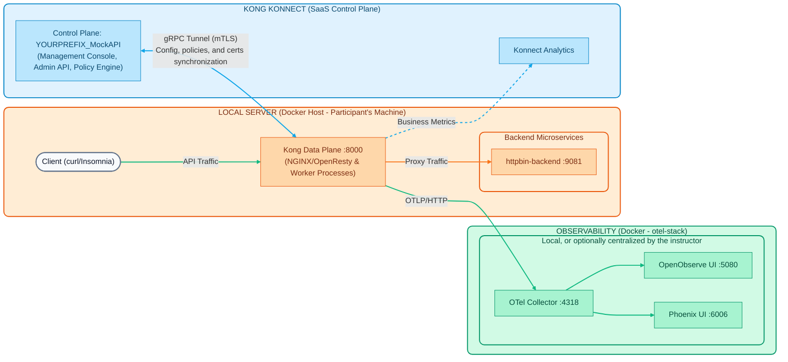

# Lab 00: Environment Setup
## Hybrid Architecture Review

Before setting up our lab, let's briefly recall the topology we will be interacting with throughout this practical day:

1.  **Observability Stack (OpenTelemetry)**: Lightweight Docker containers (OTel Collector, OpenObserve, and Arize Phoenix, ~1.2 GB of RAM) that receive and chart the Data Plane traces, metrics, and logs. They run on each participant's machine (or, optionally, on a centralized instructor server that consolidates telemetry from all participants).
2.  **Local Server (Participant's Machine)**: Each student's local environment where the Kong Gateway *Data Plane* (based on NGINX/OpenResty) and simulated APIs (backends) will run. All traffic occurs locally here.
3.  **Kong Konnect (SaaS Control Plane)**: The administration console and master database (Source of Truth) hosted in the Kong cloud, from which we will configure policies. It communicates with the *Data Plane* via a secure gRPC tunnel (mTLS).



---

## Environment Preparation

Everything we will do during the labs assumes you have this functional base environment. We have prepared two options for you to set up the environment:

### Option 1 (Recommended): GitHub Codespaces
If your instructor shared the `kong-workshop-assets.zip` file for use in the lab:

1.  Open a **blank Codespace** (or in your own GitHub repository).
2.  **Drag and drop** the `kong-workshop-assets.zip` file into the left sidebar (File Explorer) of your Codespace.
3.  Open a terminal and unzip the file by executing:
    ```bash
    unzip kong-workshop-assets.zip
    ```
4.  Done! You now have the assets folders and setup scripts in your environment. Skip directly to **Step 2**.

### Option 2: Local Installation
If you prefer to run everything on your own machine (Windows, Mac, or Linux), you need to have the following prerequisites installed:

-   **Docker / Docker Compose**

-   **decK** (version `1.65.1` or higher)
-   **cURL**

-   **Git**

> **Note:** You can see detailed instructions by operating system in [Workshop Prerequisites](../00-setup-entorno/Prerequisitos_Workshop_Kong_Konnect_Instalacion.md).

For Mac/Linux users, you can also run our automated script that installs CLI tools (like `decK`):
```bash
cd ../../00-setup-entorno
./scripts/install_prereqs.sh
```

### Step 2: Initialize Variables and Bring Up Containers
1.  **Credentials**: You will need a Kong Konnect Personal Access Token (`kpat_...`). Ask your instructor for it.
2.  Configure the variables in your terminal:

**On Mac/Linux (Bash):**
```bash
export KONNECT_TOKEN="kpat_xxxxx"
export DEMO_PREFIX="your_name_or_initials"
```
**On Windows (CMD):**
```cmd
set KONNECT_TOKEN=kpat_xxxxx
set DEMO_PREFIX=your_name_or_initials
```

3.  Execute the setup script that will bring up the mock backends and the Data Plane:

**On Mac/Linux (Bash):**
```bash
cd ../../00-setup-entorno
./scripts/setup.sh
```
**On Windows (CMD):**
```cmd
cd ..\..\00-setup-entorno
scripts\setup.bat
```

### Step 3: Validation
If everything was successful, you will see a green message indicating that the environment is ready.

1.  **Validate containers:** Run `docker ps` to confirm that you have the following containers running:
    -   `kong-dp` (The local API Gateway)
    -   `httpbin-backend` (Our mocked services API)
    -   `mock-oidc` (Mocked Identity Provider for advanced practices)
    -   `opa` (Open Policy Agent engine for Zero Trust demonstrations)
    -   `kafka` (Apache Kafka for Event Gateway testing)

2.  **Validate the Backend (httpbin):**
    Send a direct request to the mocked backend to verify that it is listening.
    ```bash
    curl -s -i http://localhost:9081/anything/ping
    ```
    **Expected result:** `200 OK` with a JSON format payload.

3.  **Validate Kong Data Plane and Synchronization:**
    Verify that the local Data Plane is alive and has successfully downloaded the configuration from the Control Plane. To do this, we will send a request to the `/healthcheck` route (which was automatically created by the Terraform script).
    ```bash
    curl -k -i https://localhost:8443/healthcheck
    ```
    **Expected result:** `200 OK` and a message indicating: `"Kong Gateway is Alive! Control Plane Sync is working."`. This confirms that your Data Plane has outbound connectivity to Konnect.

---
Excellent! You have your local infrastructure running and linked to the Control Plane in the cloud. You are ready to start with the labs.