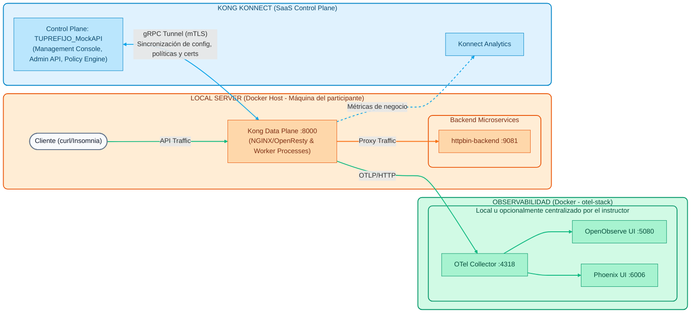

# Lab 00: Setup del Entorno
## Repaso de la Arquitectura Híbrida

Antes de montar nuestro laboratorio, recordemos brevemente la topología con la que vamos a interactuar a lo largo de este día práctico:

1. **Stack de Observabilidad (OpenTelemetry)**: Contenedores Docker livianos (OTel Collector, OpenObserve y Arize Phoenix, ~1.2 GB de RAM) que reciben y grafican las trazas, métricas y logs del Data Plane. Corren en la máquina de cada participante (o, opcionalmente, en un servidor centralizado del instructor que consolida la telemetría de todos los participantes).
2. **Local Server (Máquina del Participante)**: El entorno local de cada estudiante donde correrá el *Data Plane* de Kong Gateway (basado en NGINX/OpenResty) y las APIs simuladas (backends). Todo el tráfico ocurre localmente aquí.
3. **Kong Konnect (SaaS Control Plane)**: La consola de administración y base de datos maestra (Source of Truth) alojada en la nube de Kong, desde donde configuraremos las políticas. Se comunica con el *Data Plane* a través de un túnel seguro gRPC (mTLS).



---

## Preparación del Entorno

Todo lo que haremos durante los laboratorios asume que cuentas con este entorno base funcional. Hemos preparado dos opciones para que puedas levantar el entorno:

### Opción 1 (Recomendada): GitHub Codespaces
Si tu instructor te compartió el archivo `kong-workshop-assets.zip` para usar en el laboratorio:

1. Abre un **Codespace en blanco** (o en tu propio repositorio de GitHub).
2. **Arrastra y suelta** el archivo `kong-workshop-assets.zip` en la barra lateral izquierda (Explorador de archivos) de tu Codespace.
3. Abre una terminal y descomprime el archivo ejecutando:
  ```bash
  unzip kong-workshop-assets.zip
  ```
4. ¡Listo! Ya tienes las carpetas de assets y los scripts de setup en tu entorno. Salta directamente al **Paso 2**.


### Opción 2: Instalación Local
Si prefieres correr todo en tu propia máquina (Windows, Mac o Linux), necesitas tener instalados los siguientes prerrequisitos:

- **Docker / Docker Compose**

- **decK** (versión `1.65.1` o superior)
- **cURL**

- **Git**

> **Nota:** Puedes ver las instrucciones detalladas por sistema operativo en [Prerrequisitos Workshop](../00-setup-entorno/Prerequisitos_Workshop_Kong_Konnect_Instalacion.md).

Para usuarios de Mac/Linux, también puedes ejecutar nuestro script automatizado que instala las herramientas CLI (como `decK`):
```bash
cd ../../00-setup-entorno
./scripts/install_prereqs.sh
```

### Paso 2: Inicializar Variables y Levantar Contenedores
1. **Credenciales**: Necesitarás un Personal Access Token (`kpat_...`) de Kong Konnect. Pídeselo a tu instructor.
2. Configura las variables en tu terminal:

**En Mac/Linux (Bash):**
```bash
export KONNECT_TOKEN="kpat_xxxxx"
export DEMO_PREFIX="tu_nombre_o_iniciales"
```
**En Windows (CMD):**
```cmd
set KONNECT_TOKEN=kpat_xxxxx
set DEMO_PREFIX=tu_nombre_o_iniciales
```

3. Ejecuta el script de setup que levantará los mock backends y el Data Plane:

**En Mac/Linux (Bash):**
```bash
cd ../../00-setup-entorno
./scripts/setup.sh
```
**En Windows (CMD):**
```cmd
cd ..\..\00-setup-entorno
scripts\setup.bat
```

### Paso 3: Validación
Si todo fue exitoso, verás un mensaje verde indicando que el entorno está listo. 

1. **Validar contenedores:** Ejecuta `docker ps` para confirmar que tienes corriendo los siguientes contenedores:
  - `kong-dp` (El API Gateway local)
  - `httpbin-backend` (Nuestra API de servicios mockeada)
  - `mock-oidc` (Identity Provider mockeado para prácticas avanzadas)
  - `opa` (Motor de Open Policy Agent para demostraciones de Zero Trust)
  - `kafka` (Apache Kafka para pruebas de Event Gateway)

2. **Validar el Backend (httpbin):**
  Envía una petición directa al backend mockeado para verificar que esté escuchando.
  ```bash
  curl -s -i http://localhost:9081/anything/ping
  ```
  **Resultado esperado:** `200 OK` con un payload en formato JSON.

3. **Validar Kong Data Plane y Sincronización:**
  Verifica que el Data Plane local esté vivo y haya descargado exitosamente la configuración desde el Control Plane. Para ello, enviaremos una petición a la ruta `/healthcheck` (que fue creada automáticamente por el script de Terraform).
  ```bash
  curl -k -i https://localhost:8443/healthcheck
  ```
  **Resultado esperado:** `200 OK` y un mensaje indicando: `"Kong Gateway is Alive! Control Plane Sync is working."`. Esto confirma que tu Data Plane tiene conectividad de salida hacia Konnect.

---
¡Excelente! Tienes tu infraestructura local funcionando y enlazada al Control Plane en la nube. Estás listo para comenzar con los laboratorios.
