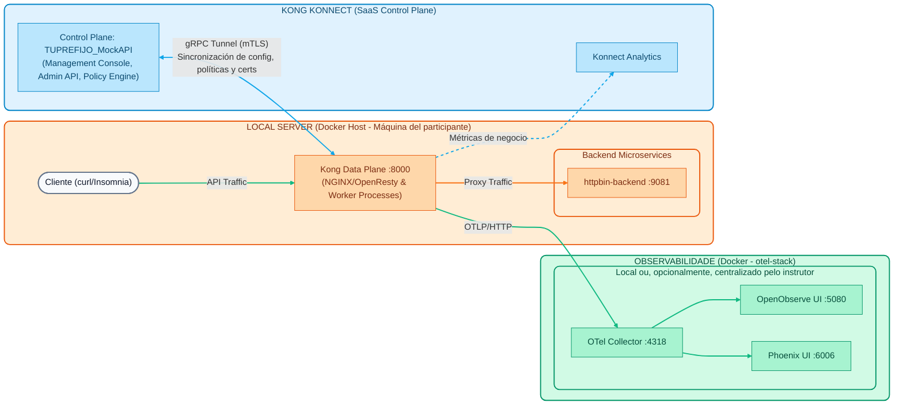

# Laboratório 00: Configuração do ambiente
## Revisão da arquitetura híbrida

Antes de montar nosso laboratório, vamos relembrar brevemente a topologia com a qual iremos interagir ao longo deste dia prático:

1. **Stack de Observabilidade (OpenTelemetry)**: Contêineres Docker leves (OTel Collector, OpenObserve e Arize Phoenix, ~1,2 GB de RAM) que recebem e representam graficamente os traces, métricas e logs do Data Plane. Rodam na máquina de cada participante (ou, opcionalmente, em um servidor centralizado do instrutor que consolida a telemetria de todos os participantes).
2. **Servidor Local (Máquina Participante)**: O ambiente local de cada aluno onde o Kong Gateway *Data Plane* (baseado em NGINX/OpenResty) e as APIs simuladas (backends) serão executadas. Todo o tráfego acontece localmente aqui.
3. **Kong Konnect (SaaS Control Plane)**: O console de administração e banco de dados mestre (Fonte da Verdade) hospedado na nuvem Kong, de onde configuraremos as políticas. Ele se comunica com o *Data Plane* por meio de um túnel gRPC seguro (mTLS).


---

## Preparação do Ambiente

Tudo o que faremos durante os laboratórios pressupõe que você tenha esse ambiente base funcional. Preparamos duas opções para que você possa elevar o meio ambiente:

### Opção 1 (recomendada): Codespaces GitHub
Se seu instrutor compartilhou o arquivo `kong-workshop-assets.zip` com você para usar no laboratório:

1. Abra um **Codespace em branco** (ou seu próprio repositório GitHub).
2. **Arraste e solte** o arquivo `kong-workshop-assets.zip` na barra lateral esquerda (File Explorer) do seu Codespace.
3. Abra um terminal e descompacte o arquivo executando:  

```bash
  unzip kong-workshop-assets.zip
  

```
4. Pronto! Você já tem as pastas de ativos e os scripts de configuração em seu ambiente. Vá diretamente para a **Etapa 2**.


### Opção 2: instalação local
Se preferir rodar tudo em sua própria máquina (Windows, Mac ou Linux), é necessário ter os seguintes pré-requisitos instalados:

- **Docker/Docker Compose**

- **decK** (versão `1.65.1` ou superior)
- **cURL**

- ** Idiota **

> **Nota:** Você pode ver instruções detalhadas por sistema operacional em [Prerequisitos Workshop](../00-setup-entorno/Prerequisitos_Workshop_Kong_Konnect_Instalacion.md).

Para usuários de Mac/Linux, você também pode executar nosso script automatizado que instala ferramentas CLI (como `decK`):

```bash
cd ../../00-setup-entorno
./scripts/install_prereqs.sh
```
### Etapa 2: inicializar variáveis e aumentar contêineres
1. **Credenciais**: Você precisará de um token de acesso pessoal (`kpat_...`) do Kong Konnect. Pergunte ao seu instrutor.
2. Defina as variáveis no seu terminal:

**No Mac/Linux (Bash):**

```bash
export KONNECT_TOKEN="kpat_xxxxx"
export DEMO_PREFIX="tu_nombre_o_iniciales"
```
**No Windows (CMD):**

```cmd
set KONNECT_TOKEN=kpat_xxxxx
set DEMO_PREFIX=tu_nombre_o_iniciales
```
3. Execute o script de configuração que configurará os back-ends simulados e o plano de dados:

**No Mac/Linux (Bash):**

```bash
cd ../../00-setup-entorno
./scripts/setup.sh
```
**No Windows (CMD):**

```cmd
cd ..\..\00-setup-entorno
scripts\setup.bat
```
### Etapa 3: Validação
Se tudo deu certo, você verá uma mensagem verde indicando que o ambiente está pronto. 

1. **Validar contêineres:** Execute `docker ps` para confirmar se você tem os seguintes contêineres em execução:
  - `kong-dp` (o gateway de API local)
  - `httpbin-backend` (Nossa API de serviços simulados)
  - `mock-oidc` (provedor de identidade simulado para práticas avançadas)
  - `opa` (mecanismo de agente de política aberta para demonstrações de confiança zero)
  - `kafka` (Apache Kafka para testes do Event Gateway)

2. **Validar o back-end (httpbin):**
  Envie uma solicitação direta ao back-end simulado para verificar se ele está escutando.  

```bash
  curl -s -i http://localhost:9081/anything/ping
  

```
**Resultado esperado:** `200 OK` com uma carga útil no formato JSON.

3. **Validar plano de dados e sincronização do Kong:**
  Verifique se o plano de dados local está ativo e baixou com êxito a configuração do plano de controle. Para isso, enviaremos uma solicitação para a rota `/healthcheck` (que foi criada automaticamente pelo script Terraform).  

```bash
  curl -k -i https://localhost:8443/healthcheck
  

```
**Resultado esperado:** `200 OK` e uma mensagem informando: `"Kong Gateway está ativo! Sincronização do plano de controle está funcionando."`. Isto confirma que o seu Data Plane tem conectividade de saída com o Konnect.

---
Excelente! Você tem sua infraestrutura local instalada e funcionando e vinculada ao Control Plane na nuvem. Você está pronto para iniciar os laboratórios.
