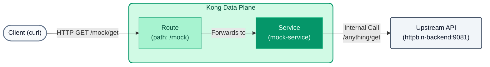

# Lab 01: Declarative Configuration and Plugins (GitOps)

In this lab, we will abandon the graphical interface to manage our API using declarative configuration with `decK` and YAML files.



## Objectives

- Use `decK` to synchronize configuration to Konnect.
- Configure routing to our simulated backend.
- Add our first plugin (`Rate Limiting`).

---

## Step 1: Examine the Configuration
Open the `lab_01_1.yaml` file located in the `workshop-assets/dia-2` folder. You will see the following content:

```yaml
_format_version: "3.0"
services:
  - name: mock-service
    url: http://httpbin-backend:9081/anything
    routes:
      - name: mock-route
        paths:
          - /api/v1/mock

plugins:
  - name: rate-limiting
    config:
      minute: 5
      policy: local
```

**Key Points:**

- **Services & Routes:** We are declaring a microservice (`mock-service`) that points to our mocked backend (`httpbin-backend:9081`). Kong will route traffic to it when it receives requests on the `/api/v1/mock` path.
- **Plugins:** At a global level (since it's not nested under a service or route), we apply the `rate-limiting` plugin, restricting consumption to 5 requests per minute.

## Step 2: Synchronize to Konnect
In your terminal, make sure you are in the lab folder (`workshop-assets/dia-2`) so that `decK` can find the YAML file.

```bash
cd workshop-assets/dia-2
```

Then, execute the following command to apply the configuration to your Control Plane. (Remember to have your token configured in the `KONNECT_TOKEN` variable).

```bash
deck gateway sync lab_01_1.yaml
```

*You will see in the output how `decK` detects the differences and creates the resources.*

## Step 3: Test Rate Limiting
Now that the configuration has been injected into the Control Plane, your local Data Plane will automatically receive it in seconds.

Let's saturate the endpoint with `curl`:

```bash
for i in {1..7}; do curl -i -s http://localhost:8000/api/v1/mock | head -n 1; done
```

**Expected Result:**
The first 5 requests will return `HTTP/1.1 200 OK`.
The sixth and seventh will return `HTTP/1.1 429 Too Many Requests`, indicating that the plugin is working correctly.

---
## Conclusion
You have managed the Gateway and its plugins from code (Infrastructure as Code), achieving a reproducible and immutable state.