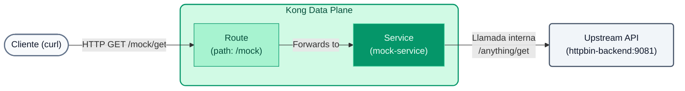

# Laboratorio 01: Configuración Declarativa y Plugins (GitOps)

En este laboratorio abandonaremos la interfaz gráfica para gestionar nuestra API utilizando configuración declarativa mediante `decK` y archivos YAML.



## Objetivos

- Usar `decK` para sincronizar configuración a Konnect.
- Configurar el ruteo hacia nuestro backend simulado.
- Añadir nuestro primer plugin (`Rate Limiting`).

---

## Paso 1: Examinar la Configuración
Abre el archivo `lab_01_1.yaml` ubicado en la carpeta `workshop-assets/dia-2`. Verás el siguiente contenido:

```yaml
_format_version: "3.0"
services:
  - name: mock-service
    url: http://httpbin-backend:9081/anything
    routes:
      - name: mock-route
        paths:
          - /api/v1/mock

plugins:
  - name: rate-limiting
    config:
      minute: 5
      policy: local
```

**Puntos Clave:**

- **Services & Routes:** Estamos declarando un microservicio (`mock-service`) que apunta a nuestro backend mockeado (`httpbin-backend:9081`). Kong enrutará el tráfico hacia él cuando reciba peticiones en la ruta `/api/v1/mock`.
- **Plugins:** A nivel global (ya que no está anidado bajo un servicio o ruta), aplicamos el plugin de `rate-limiting`, restringiendo el consumo a 5 peticiones por minuto.

## Paso 2: Sincronizar hacia Konnect
En tu terminal, asegúrate de estar posicionado en la carpeta de estos laboratorios (`workshop-assets/dia-2`) para que `decK` encuentre el archivo YAML. 

```bash
cd workshop-assets/dia-2
```

Luego, ejecuta el siguiente comando para aplicar la configuración a tu Control Plane. (Recuerda tener configurado tu token en la variable `KONNECT_TOKEN`).

```bash
deck gateway sync lab_01_1.yaml
```

*Verás en el output cómo `decK` detecta las diferencias y crea los recursos.*

## Paso 3: Probar el Rate Limiting
Ahora que la configuración ha sido inyectada al Control Plane, tu Data Plane local la recibirá automáticamente en segundos.

Vamos a saturar el endpoint con `curl`:

```bash
for i in {1..7}; do curl -i -s http://localhost:8000/api/v1/mock | head -n 1; done
```

**Resultado Esperado:** 
Las primeras 5 peticiones devolverán un `HTTP/1.1 200 OK`. 
La sexta y séptima devolverán un `HTTP/1.1 429 Too Many Requests`, indicando que el plugin funciona correctamente.

---
## Conclusión
Has gestionado el Gateway y sus plugins desde código (Infrastructure as Code), logrando un estado reproducible e inmutable.
