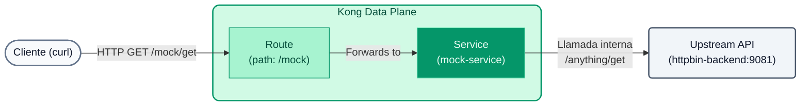

# Laboratório 01: Configuração declarativa e plug-ins (GitOps)

Neste laboratório abandonaremos a interface gráfica para gerenciar nossa API usando configuração declarativa usando arquivos `decK` e YAML.


## Objetivos

- Use `decK` para sincronizar a configuração com o Konnect.
- Configure o roteamento para nosso backend simulado.
- Adicione nosso primeiro plugin (`Rate Limiting`).

---

## Etapa 1: examinar as configurações
Abra o arquivo `lab_01_1.yaml` localizado na pasta `workshop-assets/dia-2`. Você verá o seguinte conteúdo:

```yaml
_format_version: "3.0"
services:
  - name: mock-service
    url: http://httpbin-backend:9081/anything
    routes:
      - name: mock-route
        paths:
          - /api/v1/mock

plugins:
  - name: rate-limiting
    config:
      minute: 5
      policy: local
```
**Pontos-chave:**

- **Serviços e Rotas:** Estamos declarando um microsserviço (`mock-service`) que aponta para nosso backend simulado (`httpbin-backend:9081`). Kong encaminhará o tráfego para ele quando receber solicitações no caminho `/api/v1/mock`.
- **Plugins:** A nível global (já que não está aninhado em um serviço ou rota), aplicamos o plugin `rate-limiting`, restringindo o consumo a 5 solicitações por minuto.

## Passo 2: Sincronizar com o Konnect
Em seu terminal, certifique-se de estar posicionado na pasta destes laboratórios (`workshop-assets/dia-2`) para que `decK` encontre o arquivo YAML.

```bash
cd workshop-assets/dia-2
```
Em seguida, execute o seguinte comando para aplicar as configurações ao seu plano de controle. (Lembre-se de ter seu token configurado na variável `KONNECT_TOKEN`).

```bash
deck gateway sync lab_01_1.yaml
```
*Você verá na saída como `decK` detecta as diferenças e cria os recursos.*

## Etapa 3: Limitação de taxa de teste
Agora que a configuração foi injetada no Plano de Controle, seu Plano de Dados local a receberá automaticamente em segundos.

Vamos saturar o endpoint com `curl`:

```bash
for i in {1..7}; do curl -i -s http://localhost:8000/api/v1/mock | head -n 1; done
```
**Resultado esperado:** 
As primeiras 5 solicitações retornarão `HTTP/1.1 200 OK`. 
O sexto e o sétimo retornarão `HTTP/1.1 429 Too Many Requests`, indicando que o plugin está funcionando corretamente.

---
## Conclusão
Você gerenciou o Gateway e seus plugins a partir do código (Infraestrutura como Código), alcançando um estado reproduzível e imutável.
