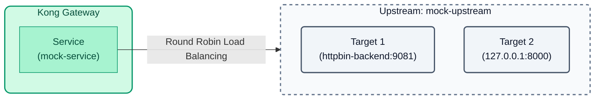
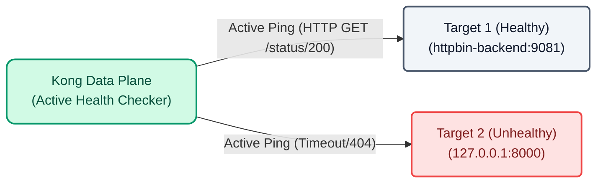

# Lab 02: Upstreams and Health Checks

Instead of pointing directly to a specific host (like `http://httpbin-backend:9081/anything`), Kong allows abstracting the backend using **Upstreams**. An Upstream acts as an internal load balancer that distributes traffic among multiple **Targets** (backend instances).



## Objectives

- Create an `Upstream` object in Kong.
- Add `Targets` to the Upstream to simulate load balancing.
- Experiment with what happens when a backend is down.
- Configure active **Health Checks** to automatically isolate unhealthy instances.

---

## Step 1: Configure the Upstream with decK

Open the `lab_02_1.yaml` file located in the `workshop-assets/dia-2` folder and analyze the following configuration:

```yaml
_format_version: "3.0"
services:
  - name: mock-service
    host: mock-upstream # We point to the upstream instead of a direct host
    path: /anything
    protocol: http
    routes:
      - name: mock-route
        paths:
          - /api/v1/mock
upstreams:
  - name: mock-upstream
    algorithm: round-robin
    targets:
      - target: httpbin-backend:9081
        weight: 100
      - target: 127.0.0.1:8000
        weight: 100
```

**Key Points:**

- **Upstreams & Targets:** We create the `mock-upstream` entity and assign two real servers to it:
  - `httpbin-backend:9081` (a healthy backend that will respond `200 OK` and a JSON).
  - `127.0.0.1:8000` (Kong's own proxy port intentionally used as a "broken" backend. By forwarding traffic to itself on a non-existent route, it will return a `404 Not Found` error in JSON).
  Now our `mock-service` points to `mock-upstream` instead of a direct host, allowing load balancing (Round Robin) between both.

## Step 2: Apply and Validate Balancing (and the error)

Let's apply this configuration. Since we haven't configured Health Checks yet, Kong will assume both nodes are healthy and send half of the traffic to the broken node.

Copy and run the following command. This command will:
1. Apply the configuration in Konnect (`deck gateway sync`).
2. Wait 10 seconds for Konnect to send the configuration to the local Data Plane.
3. Launch several requests where you will see it alternate between the healthy backend (`url...`) and the broken backend (`message...`).

```bash
deck gateway sync lab_02_1.yaml && \
echo "Waiting 10s for Konnect to update the Data Plane..." && sleep 10 && \
for i in {1..6}; do curl -s http://localhost:8000/api/v1/mock | grep -E '"url"|"message"'; sleep 1; done
```

You will notice that approximately half of your requests fail, returning the message `"no Route matched with those values"`. In a real environment, this means that 50% of your users are experiencing errors.

---

## Step 3: Configure Active Health Checks

To avoid impacting users, we will add Health Checks. Kong will send periodic pings (`interval: 5`) by making an HTTP GET request to the path `/status/200`. If the target fails (`127.0.0.1:8000` will return 404), Kong will stop sending real traffic to it.

Open the `lab_02_2.yaml` file and observe how the `healthchecks` block has been added to the upstream.



Apply this new configuration:

```bash
deck gateway sync lab_02_2.yaml && \
echo "Waiting 10s for the configuration to apply and the Health Check to isolate the node..." && sleep 10
```

## Step 4: Validate Resilience

Since the Health Check is configured, Kong should have already noticed that `127.0.0.1:8000` does not return a `200` or `302` code. Therefore, it has marked it as `unhealthy` and isolated it from the main load balancer.

Run the traffic test again:

```bash
for i in {1..6}; do curl -s http://localhost:8000/api/v1/mock | grep -E '"url"|"message"'; sleep 1; done
```

Now all responses should be successful, showing the `"url"`! Kong has automatically stopped sending traffic to the broken node, ensuring high availability of the service without your intervention.

---
## Conclusion
You have configured resilience and high availability for your services using Upstreams and Health Checks directly at the API Gateway layer.