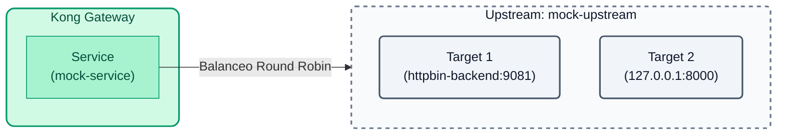
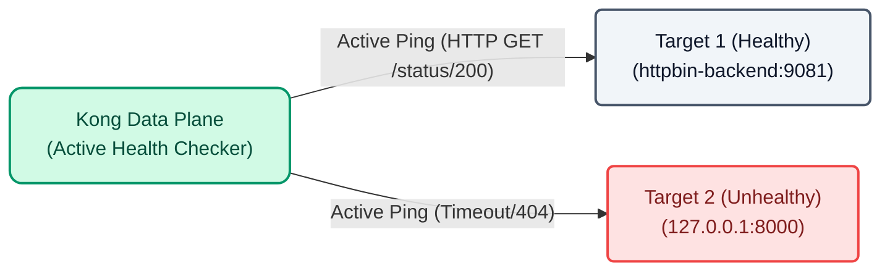

# Laboratorio 02: Upstreams y Chequeos de Salud (Health Checks)

En lugar de apuntar directamente a un host específico (como `http://httpbin-backend:9081/anything`), Kong permite abstraer el backend utilizando **Upstreams**. Un Upstream actúa como un balanceador de carga interno que distribuye el tráfico entre múltiples **Targets** (instancias del backend).



## Objetivos

- Crear un objeto `Upstream` en Kong.
- Añadir `Targets` al Upstream para simular balanceo de carga.
- Experimentar qué ocurre cuando un backend está caído.
- Configurar **Health Checks** activos para aislar instancias caídas automáticamente.

---

## Paso 1: Configurar el Upstream con decK

Abre el archivo `lab_02_1.yaml` ubicado en la carpeta `workshop-assets/dia-2` y analiza la siguiente configuración:

```yaml
_format_version: "3.0"
services:
  - name: mock-service
    host: mock-upstream # Apuntamos al upstream en vez de un host directo
    path: /anything
    protocol: http
    routes:
      - name: mock-route
        paths:
          - /api/v1/mock
upstreams:
  - name: mock-upstream
    algorithm: round-robin
    targets:
      - target: httpbin-backend:9081
        weight: 100
      - target: 127.0.0.1:8000
        weight: 100
```

**Puntos Clave:**

- **Upstreams & Targets:** Creamos la entidad `mock-upstream` y le asignamos dos servidores reales:
  - `httpbin-backend:9081` (un backend sano que responderá `200 OK` y un JSON).
  - `127.0.0.1:8000` (el propio puerto proxy de Kong usado intencionalmente como un backend "roto". Al reenviarse tráfico a sí mismo en una ruta que no existe, devolverá un error `404 Not Found` en JSON).
  Ahora nuestro servicio `mock-service` apunta a `mock-upstream` en lugar de a un host directo, permitiendo el balanceo de carga (Round Robin) entre ambos.

## Paso 2: Aplicar y Validar el Balanceo (y el error)

Vamos a aplicar esta configuración. Como aún no hemos configurado los Health Checks, Kong asumirá que ambos nodos están sanos y enviará la mitad del tráfico al nodo roto.

Copia y ejecuta el siguiente comando. Este comando:
1. Aplica la configuración en Konnect (`deck gateway sync`).
2. Espera 10 segundos para que Konnect envíe la configuración al Data Plane local.
3. Lanza varias peticiones donde verás alternar entre el backend sano (`url...`) y el backend roto (`message...`).

```bash
deck gateway sync lab_02_1.yaml && \
echo "Esperando 10s para que Konnect actualice el Data Plane..." && sleep 10 && \
for i in {1..6}; do curl -s http://localhost:8000/api/v1/mock | grep -E '"url"|"message"'; sleep 1; done
```

Notarás que aproximadamente la mitad de tus peticiones fallan devolviendo el mensaje `"no Route matched with those values"`. En un entorno real, esto significa que el 50% de tus usuarios están experimentando errores.

---

## Paso 3: Configurar Health Checks Activos

Para evitar impactar a los usuarios, agregaremos Health Checks. Kong enviará pings periódicos (`interval: 5`) haciendo una petición HTTP GET al path `/status/200`. Si el target falla (`127.0.0.1:8000` devolverá 404), Kong dejará de enviarle tráfico real.

Abre el archivo `lab_02_2.yaml` y observa cómo se ha añadido el bloque `healthchecks` al upstream.



Aplica esta nueva configuración:

```bash
deck gateway sync lab_02_2.yaml && \
echo "Esperando 10s para que la configuración se aplique y el Health Check aísle el nodo..." && sleep 10
```

## Paso 4: Validar la Resiliencia

Como el Health Check está configurado, Kong ya debió notar que `127.0.0.1:8000` no devuelve un código `200` ni `302`. Por ende, lo ha marcado como `unhealthy` y lo ha aislado del balanceador principal.

Vuelve a ejecutar la prueba de tráfico:

```bash
for i in {1..6}; do curl -s http://localhost:8000/api/v1/mock | grep -E '"url"|"message"'; sleep 1; done
```

¡Ahora todas las respuestas deberían ser exitosas mostrando la `"url"`! Kong ha dejado de enviarle tráfico al nodo roto de forma automática, garantizando la alta disponibilidad del servicio sin que tengas que intervenir.

---
## Conclusión
Has configurado resiliencia y alta disponibilidad para tus servicios mediante Upstreams y Health Checks directamente en la capa del API Gateway.
