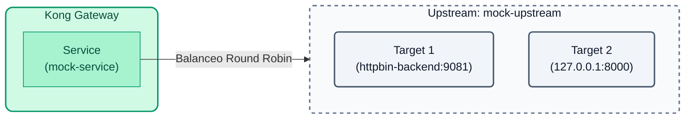
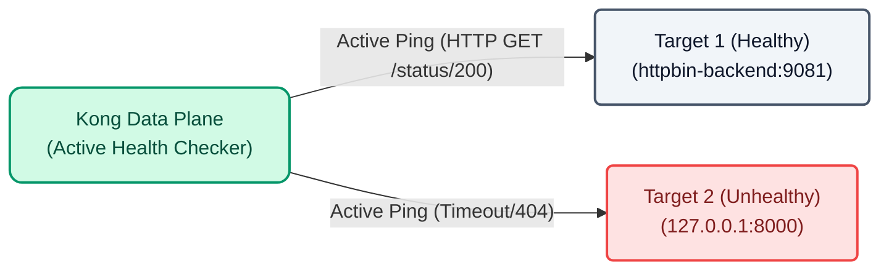

# Laboratorio 02: Upstreams y Chequeos de Salud (Health Checks)

En lugar de apuntar directamente a un host específico (como `http://httpbin-backend:9081/anything`), Kong permite abstraer el backend utilizando **Upstreams**. Un Upstream actúa como un balanceador de carga interno que distribuye el tráfico entre múltiples **Targets** (instancias del backend).


## Objetivos

- Crie um objeto `Upstream` no Kong.
- Adicione `Targets` ao Upstream para simular o balanceamento de carga.
- Experimente o que acontece quando um back-end está inativo.
- Configure **Verificações de integridade** ativas para isolar instâncias inativas automaticamente.

---

## Etapa 1: Configurar Upstream com deck

Abra o arquivo `lab_02_1.yaml` localizado na pasta `workshop-assets/dia-2` e analise a seguinte configuração:

```yaml
_format_version: "3.0"
services:
  - name: mock-service
    host: mock-upstream # Apuntamos al upstream en vez de un host directo
    path: /anything
    protocol: http
    routes:
      - name: mock-route
        paths:
          - /api/v1/mock
upstreams:
  - name: mock-upstream
    algorithm: round-robin
    targets:
      - target: httpbin-backend:9081
        weight: 100
      - target: 127.0.0.1:8000
        weight: 100
```
**Pontos-chave:**

- **Upstreams e Targets:** Criamos a entidade `mock-upstream` e atribuímos a ela dois servidores reais:
  - `httpbin-backend:9081` (um backend íntegro que responderá `200 OK` e um JSON).
  - `127.0.0.1:8000` (a própria porta proxy de Kong usada intencionalmente como um back-end "quebrado". Ao encaminhar o tráfego para si mesmo em um caminho que não existe, ele retornará um erro `404 Not Found` em JSON.)
  Agora nosso serviço `mock-service` aponta para `mock-upstream` em vez de um host direto, permitindo balanceamento de carga (Round Robin) entre os dois.

## Etapa 2: Aplicar e validar o balanceamento (e o erro)

Vamos aplicar esta configuração. Como ainda não configuramos as verificações de integridade, Kong assumirá que ambos os nós estão íntegros e enviará metade do tráfego para o nó quebrado.

Copie e execute o seguinte comando. Este comando:
1. Aplique a configuração no Konnect (`deck gateway sync`).
2. Aguarde 10 segundos para que o Konnect envie a configuração para o Data Plane local.
3. Inicie várias solicitações onde você verá alternância entre o backend íntegro (`url...`) e o backend quebrado (`message...`).

```bash
deck gateway sync lab_02_1.yaml && \
echo "Esperando 10s para que Konnect actualice el Data Plane..." && sleep 10 && \
for i in {1..6}; do curl -s http://localhost:8000/api/v1/mock | grep -E '"url"|"message"'; sleep 1; done
```
Você notará que cerca de metade de suas solicitações falham ao retornar a mensagem `"nenhuma rota corresponde a esses valores"`. Em um ambiente real, isso significa que 50% dos seus usuários estão enfrentando erros.

---

## Etapa 3: Configurar verificações de integridade ativas

Para evitar impactar os usuários, adicionaremos verificações de integridade. Kong enviará pings periódicos (`intervalo: 5`) fazendo uma solicitação HTTP GET para o caminho `/status/200`. Se o alvo falhar (`127.0.0.1:8000` retornará 404), Kong irá parar de enviar tráfego real para ele.

Abra o arquivo `lab_02_2.yaml` e observe como o bloco `healthchecks` foi adicionado ao upstream.


Aplique estas novas configurações:

```bash
deck gateway sync lab_02_2.yaml && \
echo "Esperando 10s para que la configuración se aplique y el Health Check aísle el nodo..." && sleep 10
```
## Etapa 4: Validar a resiliência

Como o Health Check está configurado, Kong já deve ter notado que `127.0.0.1:8000` não retorna um código `200` ou `302`. Portanto, você o marcou como 'não íntegro' e o isolou do balanceador principal.

Execute o teste de tráfego novamente:

```bash
for i in {1..6}; do curl -s http://localhost:8000/api/v1/mock | grep -E '"url"|"message"'; sleep 1; done
```
Agora todas as respostas devem ser bem sucedidas mostrando o `"url"`! Kong parou de enviar tráfego automaticamente para o nó quebrado, garantindo alta disponibilidade do serviço sem que você precise intervir.

---
## Conclusão
Você configurou resiliência e alta disponibilidade para seus serviços usando Upstreams e verificações de integridade diretamente na camada API Gateway.
