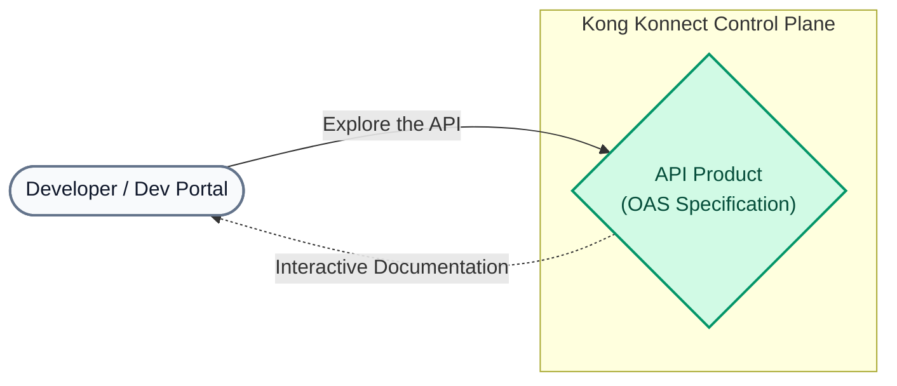
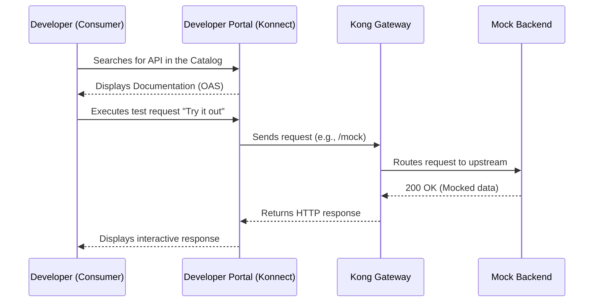

# Lab 03: Publishing an API Catalog and OAS Specifications

In this lab, we will use the `lab_03_1.yaml` file (an OpenAPI specification) to publish our Catalog API (MockAPI) to the Developer Portal.

## Objectives

- Learn to structure an API Catalog.
- Provide interactive Swagger documentation.
- Test the API from the Portal.

### Why is a Developer Portal important?
An API Gateway securely exposes your services, but for other teams (internal or external) to consume them, they need to **discover them and understand how to use them**. The Developer Portal acts as the showcase for your digital products (APIs). This process is called **"API Productization"**. By using standard specifications like **OAS (OpenAPI Specification)** or Swagger, you can automatically generate interactive documentation, allowing consumers to understand your endpoints, test requests, and reduce integration time.

### Consumption Flow (Sequence Diagram)

---

## Step 1: Review the Swagger specification
Open the `lab_03_1.yaml` file located in the `workshop-assets/dia-2/` folder of your repository. You will see that it describes the base URL (`http://localhost:8000`) and the `/mock` endpoint along with the expected responses.

## Step 2: Create the API and Upload the Specification
In the new Konnect interface, API creation and specification upload are done in a single step:

1. In the left-hand Konnect sidebar menu, click **Catalog**.
2. In the top right, click the **New** button (or the arrow next to it) and select **API**.
3. On the **New API** screen, you will see the **1. Add API spec** section. Drag and drop the `lab_03_1.yaml` file there (which is in your `workshop-assets/dia-2/` folder), or click "Select file" to browse for it.
4. In the **2. General Information** section, complete the fields:
   - **API name**: `MockAPI`
   - **API version**: `v1`
   - **API description**: `Test API for the bootcamp`
5. Click the save/create button at the bottom of the page.

## Step 3: Upload Supplementary Documentation (Markdown)
A good API product not only has a technical specification (Swagger) but also user guides, legal terms, and tutorials. In the `workshop-assets/dia-2/` folder, you will find two pre-created documents:
- `lab_03_manual_usuario.md`
- `lab_03_condiciones_legales.md`

1. On your API's details page (where you were redirected), go to the **Documents** tab.
2. Click **Add Document**.
3. Drag and drop the `lab_03_manual_usuario.md` file, or browse for it with "Select file".
4. Assign a friendly title like "User Manual" and save it.
5. Repeat the process for the `lab_03_condiciones_legales.md` file (Terms and Conditions).

## Step 4: Link to your Gateway Service
For the Developer Portal to know where to send real traffic, we must connect this catalog entry with our proxy in the Gateway.

1. Once the API is created, you will be redirected to its details page (**Overview** tab).
2. You will see "Next steps" cards. Click **Link a gateway service** (or go directly to the **Gateway** tab).
3. Select your `mock-service` (the one we created in Lab 01) and link it.

## Step 5: Publish to the Portal
1. From your API's page in the Catalog, click the **Publish to a portal** card (or go to the **Portals** tab).
2. Enable/publish the API so that it is available in your **default-portal** (Developer Portal).

## Step 6: Validate in the Developer Portal
1. In the left-hand Konnect sidebar menu, click **Dev Portal** and open your published portal (there is usually a link to open it in a new tab).
2. Within the Developer Portal, go to the **API Catalog**. You should see your `MockAPI` listed.
3. Enter the API and navigate through the auto-generated specification.
4. Use the **Try it Out** button on the `/mock` endpoint to make a real call. If everything is configured correctly, the request will travel from the portal to your local Data Plane (`localhost:8000/mock`) and you will see the response on the same screen.

---
## Conclusion
You have packaged a technical Gateway service into a consumable, self-documented **API**, ready for your organization's developers to use, employing Kong Konnect's new unified Catalog interface.