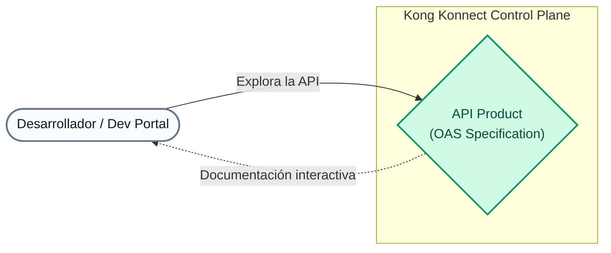
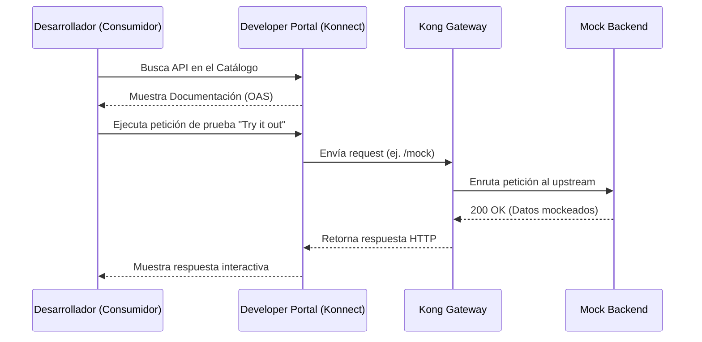

# Laboratorio 03: Publicación de Catálogo de APIs y Especificaciones OAS

En este laboratorio vamos a utilizar el archivo `lab_03_1.yaml` (una especificación OpenAPI) para publicar nuestro Catalog API (MockAPI) en el Developer Portal.

## Objetivos

- Aprender a estructurar una Catalog API.
- Proveer documentación Swagger interactiva.
- Probar el API desde el Portal.

### ¿Por qué es importante un Developer Portal?
Un API Gateway expone tus servicios de forma segura, pero para que otros equipos (internos o externos) los consuman, necesitan **descubrirlos y entender cómo usarlos**. El Developer Portal actúa como la vitrina de tus productos digitales (APIs). A este proceso se le llama **"Productización de APIs"**.
Al usar especificaciones estándar como **OAS (OpenAPI Specification)** o Swagger, puedes generar automáticamente documentación interactiva, permitiendo que los consumidores entiendan tus endpoints, prueben peticiones y reduzcan el tiempo de integración.

### Flujo de Consumo (Sequence Diagram)

---

## Paso 1: Revisar la especificación Swagger
Abre el archivo `lab_03_1.yaml` que se encuentra en la carpeta `workshop-assets/dia-2/` de tu repositorio.
Verás que describe la URL base (`http://localhost:8000`) y el endpoint `/mock` junto con las respuestas esperadas.

## Paso 2: Crear la API y Subir la Especificación
En la nueva interfaz de Konnect, la creación de la API y la subida de la especificación se realizan en un solo paso:

1. En el menú lateral izquierdo de Konnect, haz clic en **Catalog**.
2. En la parte superior derecha, haz clic en el botón **New** (o en la flecha a su lado) y selecciona **API**.
3. En la pantalla **New API**, verás la sección **1. Add API spec**. Arrastra y suelta allí el archivo `lab_03_1.yaml` (que se encuentra en tu carpeta `workshop-assets/dia-2/`), o haz clic en "Select file" para buscarlo.
4. En la sección **2. General Information**, completa los campos:
   - **API name**: `MockAPI`
   - **API version**: `v1`
   - **API description**: `API de prueba para el bootcamp`
5. Haz clic en el botón de guardar/crear al final de la página.

## Paso 3: Subir Documentación Complementaria (Markdown)
Un buen producto API no solo tiene una especificación técnica (Swagger), sino también guías de usuario, términos legales y tutoriales. En la carpeta `workshop-assets/dia-2/` encontrarás dos documentos pre-creados:
- `lab_03_manual_usuario.md`
- `lab_03_condiciones_legales.md`

1. En la página de detalles de tu API (donde fuiste redirigido), ve a la pestaña **Documents**.
2. Haz clic en **Add Document**.
3. Arrastra y suelta el archivo `lab_03_manual_usuario.md`, o búscalo con "Select file".
4. Asígnale un título amigable como "Manual de Usuario" y guárdalo.
5. Repite el proceso para el archivo `lab_03_condiciones_legales.md` (Términos y Condiciones).

## Paso 4: Enlazar con tu Gateway Service
Para que el Developer Portal sepa a dónde enviar el tráfico real, debemos conectar esta entrada del catálogo con nuestro proxy en el Gateway.

1. Una vez creada la API, serás redirigido a su página de detalles (pestaña **Overview**).
2. Verás unas tarjetas de "Next steps". Haz clic en **Link a gateway service** (o ve directamente a la pestaña **Gateway**).
3. Selecciona tu servicio `mock-service` (el que creamos en el Lab 01) y enlázalo.

## Paso 5: Publicar en el Portal
1. Desde la misma página de tu API en el Catálogo, haz clic en la tarjeta **Publish to a portal** (o ve a la pestaña **Portals**).
2. Habilita/publica la API para que esté disponible en tu **default-portal** (Developer Portal).

## Paso 6: Validar en el Developer Portal
1. En el menú lateral izquierdo de Konnect, haz clic en **Dev Portal** y abre tu portal publicado (suele haber un enlace para abrirlo en una nueva pestaña).
2. Dentro del Developer Portal, dirígete al **API Catalog**. Deberías ver listada tu `MockAPI`.
3. Entra a la API y navega por la especificación autogenerada.
4. Usa el botón **Try it Out** en el endpoint `/mock` para hacer una llamada real. Si todo está bien configurado, la petición viajará desde el portal hasta tu Data Plane local (`localhost:8000/mock`) y verás la respuesta en la misma pantalla.

---
## Conclusión
Has empaquetado un servicio técnico de Gateway en un **API** consumible, autodocumentado y listo para que los desarrolladores de tu organización lo utilicen, empleando la nueva interfaz unificada del Catálogo de Kong Konnect.
