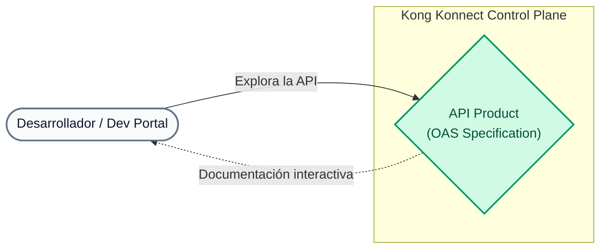
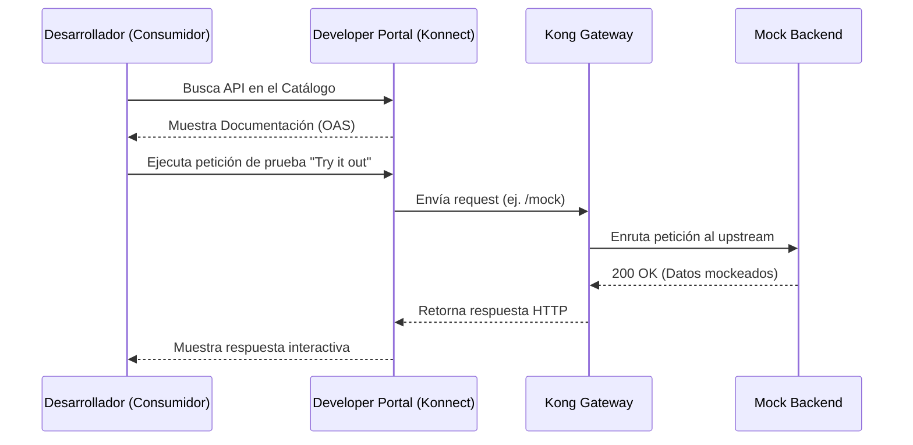

# Laboratório 03: Publicação do Catálogo API e Especificações da OEA

Neste laboratório usaremos o arquivo `lab_03_1.yaml` (uma especificação OpenAPI) para publicar nossa API de catálogo (MockAPI) no Portal do Desenvolvedor.

## Objetivos

- Aprenda a estruturar um Catálogo de APIs.
- Fornece documentação interativa do Swagger.
- Teste a API do Portal.

## # Por que um Portal do Desenvolvedor é importante?
Um API Gateway expõe seus serviços com segurança, mas para que outras equipes (internas ou externas) os consumam, elas precisam **descobri-los e entender como usá-los**. O Portal do Desenvolvedor funciona como vitrine para seus produtos digitais (APIs). Este processo é denominado **"Produtização de API"**.
Ao usar especificações padrão como **OAS (Especificação OpenAPI)** ou Swagger, você pode gerar automaticamente documentação interativa, permitindo que os consumidores entendam seus endpoints, testem solicitações e reduzam o tempo de integração.

## # Fluxo de Consumo (Diagrama de Sequência)

---

## Etapa 1: revise a especificação do Swagger
Abra o arquivo `lab_03_1.yaml` localizado na pasta `workshop-assets/dia-2/` do seu repositório.
Você verá que ele descreve a URL base (`http://localhost:8000`) e o endpoint `/mock` junto com as respostas esperadas.

## Etapa 2: Crie a API e carregue a especificação
Na nova interface Konnect, a criação da API e o upload da especificação são feitos em uma única etapa:

1. No menu lateral esquerdo do Konnect, clique em **Catálogo**.
2. No canto superior direito, clique no botão **Novo** (ou na seta ao lado dele) e selecione **API**.
3. Na tela **Nova API**, você verá a seção **1. Adicione especificações de API**. Arraste e solte o arquivo `lab_03_1.yaml` (localizado na pasta `workshop-assets/dia-2/`) ou clique em "Selecionar arquivo" para procurá-lo.
4. Na seção **2. Informações Gerais**, preencha os campos:
   - **Nome da API**: `MockAPI`
   - **Versão da API**: `v1`
   - **Descrição da API**: `API de teste Bootcamp`
5. Clique no botão salvar/criar na parte inferior da página.

## Passo 3: Carregar Documentação Complementar (Markdown)
Um bom produto API não possui apenas uma especificação técnica (Swagger), mas também guias de usuário, termos legais e tutoriais. Na pasta `workshop-assets/dia-2/` você encontrará dois documentos pré-criados:
- `lab_03_user_manual.md`
- `lab_03_legal_conditions.md`

1. Na página de detalhes da API (para onde você foi redirecionado), acesse a aba **Documentos**.
2. Clique em **Adicionar Documento**.
3. Arraste e solte o arquivo `lab_03_manual_usuario.md` ou pesquise-o com "Selecionar arquivo".
4. Dê um título amigável como "Manual do Usuário" e salve-o.
5. Repita o processo para o arquivo `lab_03_condiciones_legales.md` (Termos e Condições).

## Etapa 4: Link para seu serviço de gateway
Para que o Portal do Desenvolvedor saiba para onde enviar o tráfego real, precisamos conectar esta entrada do catálogo ao nosso proxy no Gateway.
1. Assim que a API for criada, você será redirecionado para sua página de detalhes (guia **Visão geral**).
2. Você verá alguns cartões "Próximas etapas". Clique em **Vincular um serviço de gateway** (ou vá diretamente para a guia **Gateway**).
3. Selecione seu serviço `mock-service` (aquele que criamos no Laboratório 01) e vincule-o.

## Etapa 5: Publicar no Portal
1. Na mesma página da sua API no Catálogo, clique no cartão **Publicar em um portal** (ou vá para a aba **Portais**).
2. Habilite/publice a API para que ela fique disponível em seu **default-portal** (Portal do Desenvolvedor).

## Etapa 6: Validar no Portal do Desenvolvedor
1. No menu lateral esquerdo do Konnect, clique em **Dev Portal** e abra seu portal publicado (geralmente há um link para abri-lo em uma nova aba).
2. No Portal do Desenvolvedor, acesse **Catálogo de APIs**. Você deverá ver seu `MockAPI` listado.
3. Entre na API e navegue na especificação gerada automaticamente.
4. Use o botão **Experimentar** no endpoint `/mock` para fazer uma chamada real. Se tudo estiver configurado corretamente, a solicitação viajará do portal para o seu plano de dados local (`localhost:8000/mock`) e você verá a resposta na mesma tela.

---
## Conclusão
Você empacotou um serviço técnico do Gateway em uma **API** consumível, autodocumentada e pronta para ser usada pelos desenvolvedores da sua organização, usando a nova interface unificada do Catálogo Kong Konnect.
