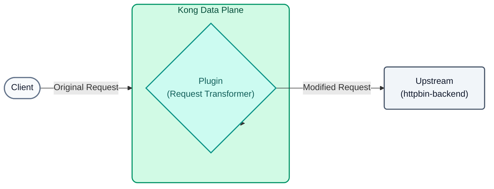
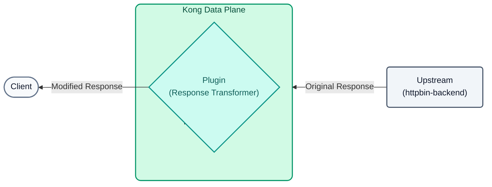
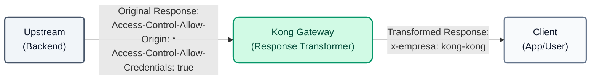
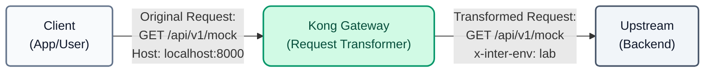

# Lab 04: Request and Response Transformation

In this lab, we will use Kong to modify traffic on the fly, injecting headers and altering the payload without having to touch the backend code.




## Objectives

- Use the `response-transformer` plugin to modify the response sent to the client.
- Use the `request-transformer` plugin to inject headers into the request sent to the backend.

---

## Step 1: Response Transformer
We want to hide internal information (such as the original permissive CORS headers from the backend `Access-Control-Allow-Origin` and `Access-Control-Allow-Credentials`) and inject a corporate header into all responses.

**Transformation Map:**


1. **(Optional) Pre-validation:** Before applying the policy, send a request to verify that the *httpbin* backend returns permissive CORS headers by default:
```bash
curl -s -D /dev/stderr http://localhost:8000/api/v1/mock
```

**For Windows (CMD):**
```cmd
curl -s -D /dev/stderr http://localhost:8000/api/v1/mock
```
You will notice in the console that the response includes `Access-Control-Allow-Origin: *` and `Access-Control-Allow-Credentials: true`.

2. Open the `lab_04_1.yaml` file located in the `workshop-assets/dia-2` folder and analyze its content:

```yaml
_format_version: "3.0"
services:
  - name: mock-service
    routes:
      - name: mock-route
        plugins:
          - name: response-transformer
            config:
              add:
                headers:
                  - "x-empresa: kong-kong"
              remove:
                headers:
                  - "Access-Control-Allow-Origin"
                  - "Access-Control-Allow-Credentials"
```

**Key Points:**

- **`response-transformer` Plugin:** Allows us to intercept the response before it reaches the client. We use the `remove` section to hide infrastructure headers (preventing information leaks) and `add` to inject a custom corporate header.

3. Apply the changes and test the result by executing the following consolidated block. This will synchronize the configuration and wait 15 seconds for the cloud (Konnect) to propagate the order to the local Data Plane before sending the request:

```bash
deck gateway sync lab_04_1.yaml && \
echo "Waiting 15s for Konnect to update the Data Plane..." && sleep 15 && \
curl -s -D /dev/stderr http://localhost:8000/api/v1/mock
```

**Analyzing the result:**

- In the terminal output, you will see the **HTTP response headers**. Notice how the `x-empresa: kong-kong` header magically appears injected by Kong.
- Additionally, the `Access-Control-Allow-Origin` and `Access-Control-Allow-Credentials` headers that the backend originally sent have disappeared, demonstrating how you can control and clean up your API responses centrally.

---

## Step 2: Request Transformer
Now, let's assume our backend requires a header called `x-inter-env: lab` to process the request, but external clients don't know how to send it. We will inject it from the Gateway.

**Transformation Map:**


1. Open the `lab_04_2.yaml` file located in the `workshop-assets/dia-2` folder and analyze its content:

```yaml
_format_version: "3.0"
services:
  - name: mock-service
    plugins:
      - name: request-transformer
        config:
          add:
            headers:
              - "x-inter-env: lab"
```

**Key Points:**

- **`request-transformer` Plugin:** Allows us to inject dynamic information (like the `x-inter-env` header) into the request *before* it reaches the backend. This is useful for interacting with legacy systems that require data that modern clients do not send.

2. Apply the changes and test the result by executing the following consolidated block:

```bash
deck gateway sync lab_04_2.yaml && \
echo "Waiting 15s for Konnect to update the Data Plane..." && sleep 15 && \
curl -s http://localhost:8000/api/v1/mock
```

**Analyzing the result:**

- Our mock service (httpbin) has the particularity of returning an echo in JSON format of everything it received.
- When reviewing the JSON printed in your console, look for the `"headers"` block. You will see that the backend received `X-Inter-Env: lab`, even though you (the curl client) never sent it. Kong intercepted and injected it in the middle of the path.

---
## Conclusion
You have successfully adapted HTTP contracts between clients and backends centrally at the Gateway. This is extremely useful for legacy integrations or for injecting authentication claims into downstream services.