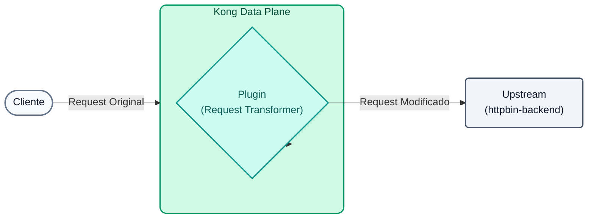
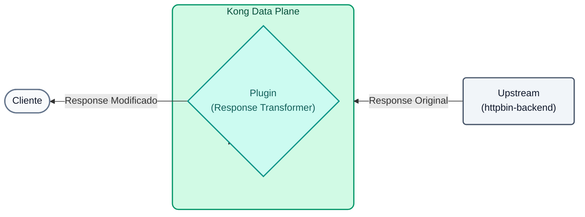
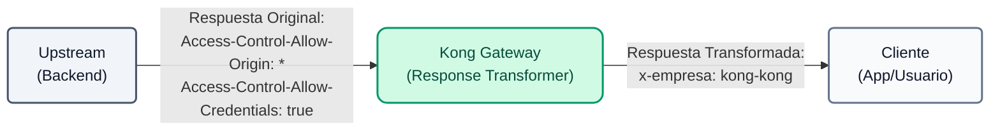
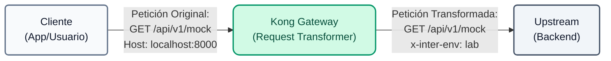

# Laboratorio 04: Transformación de Peticiones y Respuestas

En este laboratorio vamos a utilizar Kong para modificar el tráfico al vuelo, inyectando headers y alterando el payload sin tener que tocar el código del backend.




## Objetivos

- Usar el plugin `response-transformer` para modificar la respuesta que le llega al cliente.
- Usar el plugin `request-transformer` para inyectar headers en la petición hacia el backend.

---

## Paso 1: Response Transformer
Queremos ocultar información interna (como los headers CORS permisivos originales del backend `Access-Control-Allow-Origin` y `Access-Control-Allow-Credentials`) e inyectar un header corporativo en todas las respuestas.

**Mapa de Transformación:**


1. **(Opcional) Validación Previa:** Antes de aplicar la política, lanza una petición para comprobar que el backend de *httpbin* devuelve por defecto cabeceras de CORS permisivas:
```bash
curl -s -D /dev/stderr http://localhost:8000/api/v1/mock
```

**Para Windows (CMD):**
```cmd
curl -s -D /dev/stderr http://localhost:8000/api/v1/mock
```
Notarás en la consola que la respuesta incluye `Access-Control-Allow-Origin: *` y `Access-Control-Allow-Credentials: true`.

2. Abre el archivo `lab_04_1.yaml` ubicado en la carpeta `workshop-assets/dia-2` y analiza su contenido:

```yaml
_format_version: "3.0"
services:
  - name: mock-service
    routes:
      - name: mock-route
        plugins:
          - name: response-transformer
            config:
              add:
                headers:
                  - "x-empresa: kong-kong"
              remove:
                headers:
                  - "Access-Control-Allow-Origin"
                  - "Access-Control-Allow-Credentials"
```

**Puntos Clave:**

- **Plugin `response-transformer`:** Nos permite interceptar la respuesta antes de que llegue al cliente. Usamos la sección `remove` para ocultar cabeceras de infraestructura (evitando fugas de información) y `add` para inyectar una cabecera personalizada corporativa.

3. Aplica los cambios y prueba el resultado ejecutando el siguiente bloque consolidado. Esto sincronizará la configuración y esperará 10 segundos para que la nube (Konnect) propague la orden al Data Plane local antes de lanzar la petición:

```bash
deck gateway sync lab_04_1.yaml && \
echo "Esperando 15s para que Konnect actualice el Data Plane..." && sleep 15 && \
curl -s -D /dev/stderr http://localhost:8000/api/v1/mock
```

**Analizando el resultado:**

- En la salida del terminal verás los **headers HTTP de respuesta**. Nota cómo el header `x-empresa: kong-kong` aparece mágicamente inyectado por Kong.
- Además, los headers `Access-Control-Allow-Origin` y `Access-Control-Allow-Credentials` que originalmente enviaba el backend han desaparecido, demostrando cómo puedes controlar y limpiar las respuestas de tus APIs de forma centralizada.

---

## Paso 2: Request Transformer
Ahora, supongamos que nuestro backend requiere un header llamado `x-inter-env: lab` para procesar la petición, pero los clientes externos no saben enviarlo. Lo inyectaremos desde el Gateway.

**Mapa de Transformación:**


1. Abre el archivo `lab_04_2.yaml` ubicado en la carpeta `workshop-assets/dia-2` y analiza su contenido:

```yaml
_format_version: "3.0"
services:
  - name: mock-service
    plugins:
      - name: request-transformer
        config:
          add:
            headers:
              - "x-inter-env: lab"
```

**Puntos Clave:**

- **Plugin `request-transformer`:** Nos permite inyectar información dinámica (como el header `x-inter-env`) a la petición *antes* de que llegue al backend. Esto es útil para interactuar con sistemas legacy que requieren datos que los clientes modernos no envían.

2. Aplica los cambios y prueba el resultado ejecutando el siguiente bloque consolidado:

```bash
deck gateway sync lab_04_2.yaml && \
echo "Esperando 15s para que Konnect actualice el Data Plane..." && sleep 15 && \
curl -s http://localhost:8000/api/v1/mock
```

**Analizando el resultado:**

- Nuestro servicio mock (httpbin) tiene la particularidad de devolvernos en formato JSON un eco de todo lo que recibió.
- Al revisar el JSON impreso en tu consola, busca el bloque `"headers"`. Verás que el backend recibió `X-Inter-Env: lab`, a pesar de que tú (el cliente curl) nunca lo enviaste. Kong lo interceptó e inyectó en medio del camino.

---
## Conclusión
Has logrado adaptar los contratos HTTP entre clientes y backends de manera centralizada en el Gateway. Esto es extremadamente útil para integraciones legacy o para inyectar claims de autenticación hacia servicios downstream.
