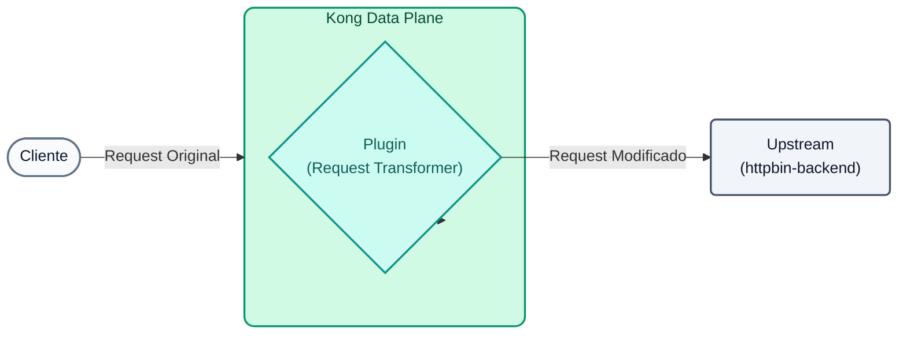
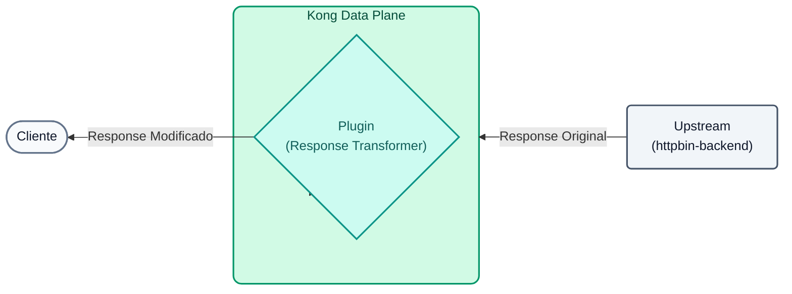
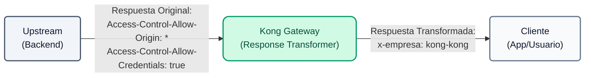
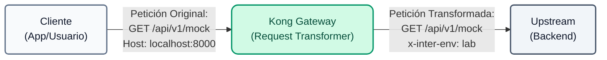

# Laboratório 04: Transformação de Solicitações e Respostas

Neste laboratório, usaremos o Kong para modificar o tráfego dinamicamente, injetando cabeçalhos e alterando a carga útil sem precisar mexer no código de back-end.



## Objetivos

- Use o plugin `response-transformer` para modificar a resposta que chega ao cliente.
- Use o plugin `request-transformer` para injetar cabeçalhos na solicitação para o backend.

---

## Etapa 1: Transformador de resposta
Queremos ocultar informações internas (como os cabeçalhos CORS permissivos originais do backend `Access-Control-Allow-Origin` e `Access-Control-Allow-Credentials`) e injetar um cabeçalho corporativo em todas as respostas.

**Mapa de Transformação:**



1. **(Opcional) Validación Previa:** Antes de aplicar la política, lanza una petición para comprobar que el backend de *httpbin* devuelve por defecto cabeceras de CORS permisivas:
```bash
curl -s -D /dev/stderr http://localhost:8000/api/v1/mock
```

**Para Windows (CMD):**
```cmd
curl -s -D /dev/stderr http://localhost:8000/api/v1/mock
```
Você notará no console que a resposta inclui `Access-Control-Allow-Origin: *` e `Access-Control-Allow-Credentials: true`.

2. Abra o arquivo `lab_04_1.yaml` localizado na pasta `workshop-assets/dia-2` e analise seu conteúdo:

```yaml
_format_version: "3.0"
services:
  - name: mock-service
    routes:
      - name: mock-route
        plugins:
          - name: response-transformer
            config:
              add:
                headers:
                  - "x-empresa: kong-kong"
              remove:
                headers:
                  - "Access-Control-Allow-Origin"
                  - "Access-Control-Allow-Credentials"
```
**Pontos-chave:**

- **Plugin `response-transformer`:** Permite interceptar a resposta antes que ela chegue ao cliente. Usamos a seção `remove` para ocultar cabeçalhos de infraestrutura (evitando vazamentos de informações) e `add` para injetar um cabeçalho corporativo personalizado.

3. Aplique as alterações e teste o resultado executando o seguinte bloco consolidado. Isso sincronizará a configuração e aguardará 10 segundos para que a nuvem (Konnect) propague o comando para o Data Plane local antes de iniciar a solicitação:

```bash
deck gateway sync lab_04_1.yaml && \
echo "Esperando 15s para que Konnect actualice el Data Plane..." && sleep 15 && \
curl -s -D /dev/stderr http://localhost:8000/api/v1/mock
```
**Analisando o resultado:**

- Na saída do terminal você verá os **cabeçalhos de resposta HTTP**. Observe como o cabeçalho `x-company: kong-kong` aparece injetado magicamente por Kong.
- Além disso, os cabeçalhos `Access-Control-Allow-Origin` e `Access-Control-Allow-Credentials` que foram originalmente enviados pelo back-end desapareceram, demonstrando como você pode controlar e limpar suas respostas de API centralmente.

---

## Etapa 2: Solicitar transformador
Agora, suponha que nosso backend exija um cabeçalho chamado `x-inter-env:lab` para processar a solicitação, mas os clientes externos não sabem como enviá-la. Vamos injetá-lo do Gateway.

**Mapa de Transformação:**


1. Abra o arquivo `lab_04_2.yaml` localizado na pasta `workshop-assets/dia-2` e analise seu conteúdo:

```yaml
_format_version: "3.0"
services:
  - name: mock-service
    plugins:
      - name: request-transformer
        config:
          add:
            headers:
              - "x-inter-env: lab"
```
**Pontos-chave:**

- **Plugin `request-transformer`:** Permite-nos injetar informações dinâmicas (como o cabeçalho `x-inter-env`) na solicitação *antes* de ela chegar ao backend. Isto é útil para interagir com sistemas legados que requerem dados que os clientes modernos não enviam.

2. Aplique as alterações e teste o resultado executando o seguinte bloco consolidado:

```bash
deck gateway sync lab_04_2.yaml && \
echo "Esperando 15s para que Konnect actualice el Data Plane..." && sleep 15 && \
curl -s http://localhost:8000/api/v1/mock
```

**Analizando el resultado:**

- Nuestro servicio mock (httpbin) tiene la particularidad de devolvernos en formato JSON un eco de todo lo que recibió.
- Al revisar el JSON impreso en tu consola, busca el bloque `"headers"`. Verás que el backend recibió `X-Inter-Env: lab`, a pesar de que tú (el cliente curl) nunca lo enviaste. Kong lo interceptó e inyectó en medio del camino.

---
## Conclusión
Has logrado adaptar los contratos HTTP entre clientes y backends de manera centralizada en el Gateway. Esto es extremadamente útil para integraciones legacy o para inyectar claims de autenticación hacia servicios downstream.

