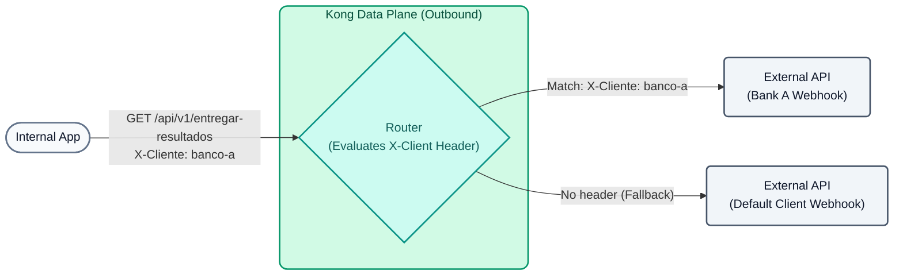

# Lab 05: Smart Routing (Outbound to Clients)

In this lab, we're going to put a twist on the classic use case. Instead of external clients consuming *our* APIs, let's imagine that **our company** processes commercial operations and, upon completion, needs to **deliver the results by directly calling its clients' Webhooks (APIs)**.

Instead of our internal applications having to know and manage the URLs and connection rules for each client, we will use Kong as an **Outbound Gateway**. Kong will receive all notifications at a single point and dynamically route them to the correct client based on the destination HTTP header.



## Objectives

- Configure Kong to act as an intermediary for outbound calls.
- Configure multiple routes that listen on the same path (`/api/v1/entregar-resultados`) but route traffic to different *Upstreams* (client APIs) depending on the `X-Cliente` header.

### The concept of Smart Routing
With **Smart Routing**, Kong can make routing decisions based on a multitude of combined criteria from HTTP requests and the transport layer:
- **Headers:** Useful for A/B testing, or as in our case, to decide which commercial partner to send a payload to (e.g., `X-Cliente: banco-a`).
- **Regex in Paths:** Capture dynamic variables (like an ID) directly from the URL.
- **SNI (Server Name Indication):** Route based on the TLS certificate.
- **Query Params:** Modify the request flow based on variables in the query string.

This allows for enormous flexibility without needing to touch the code of your internal microservices. If "Bank A" changes its webhook URL, our internal application is unaware; only the configuration in Kong is updated.

---

## Step 1: Configure Outbound Routing

Let's assume our internal application sends results by calling `/api/v1/entregar-resultados`. If it injects the header `X-Cliente: banco-a`, Kong will route the payload to Bank A's specific webhook. If it sends nothing, Kong will send the traffic to a default webhook (or a dead-letter system).

Open the `lab_05_1.yaml` file located in the `workshop-assets/dia-2` folder and analyze its content:

```yaml
_format_version: "3.0"
services:
 # DEFAULT Service (catch-all)
 - name: cliente-default
   url: http://httpbin-backend:9081/anything/cliente-default
   routes:
    - name: cliente-default-route
      paths: 
       - /api/v1/entregar-resultados
      methods: [GET]

 # BANK A Service (only activated with X-Cliente: banco-a)
 - name: cliente-banco-a
   url: http://httpbin-backend:9081/anything/webhook-banco-a
   routes:
    - name: cliente-banco-a-route
      paths: 
       - /api/v1/entregar-resultados
      methods: [GET]
      headers:
       x-cliente:
        - banco-a
```

**Key Points:**

- **Multiple Routes by Headers:** Both routes listen on exactly the same path `/api/v1/entregar-resultados`. The difference is that Bank A's route explicitly requires the header `x-cliente: banco-a`. Kong first evaluates the more specific routes (those requiring headers), using the generic ones as a fallback.

## Step 2: Apply and Test (Default Route)

Synchronize the changes and perform a test simulating your internal application sending a result, **without** specifying which client it's for (we don't send the special header). This will execute the fallback:

```bash
deck gateway sync lab_05_1.yaml && \
echo "Waiting 15s for Konnect to update the Data Plane..." && sleep 15 && \
curl -s http://localhost:8000/api/v1/entregar-resultados
```

**Analyzing the result:**

- Observe the value of the `"url"` field within the JSON returned by the mock.
- It should show `"url": "http://httpbin-backend:9081/anything/cliente-default"`. This confirms that Kong diverted the traffic to the default destination.

## Step 3: Test Routing to Bank A

Now, our internal application specifies that this result belongs to "Bank A" by injecting the `X-Cliente: banco-a` header. We don't need to sync again, just launch the request:

```bash
curl -s -H "X-Cliente: banco-a" http://localhost:8000/api/v1/entregar-resultados
```

**For Windows (CMD):**
```cmd
curl -s -H "X-Cliente: banco-a" http://localhost:8000/api/v1/entregar-resultados
```

**Analyzing the result:**

- Re-check the `"url"` field in the returned JSON.
- You will see that the traffic was automatically redirected to `"url": "http://httpbin-backend:9081/anything/webhook-banco-a"`.
- Kong detected the header, evaluated its higher priority, and diverted the traffic to the client's webhook without the sending internal application having to know that external URL.

## Step 4: Outbound Observability in Konnect (Custom Reports)

By having Kong route outbound calls, we gain immediate visibility into the behavior of our clients' APIs without having to instrument code in our internal application. We will create custom charts in Konnect to measure latencies, volume, and bandwidth for each client.

### 4.1 Generate test traffic
Execute the following commands to send simulated traffic to both clients:

```bash
# Traffic to Bank A
for i in {1..20}; do curl -s -o /dev/null -H "X-Cliente: banco-a" http://localhost:8000/api/v1/entregar-resultados; done

# Traffic to Default Client
for i in {1..15}; do curl -s -o /dev/null http://localhost:8000/api/v1/entregar-resultados; done
```

### 4.2 Import the Outbound Dashboard in Konnect
To simplify chart creation, we have prepared a pre-configured Dashboard with the most important metrics for this scenario.

1.  Log in to the **Kong Konnect** console.
2.  In the left menu, navigate to **Analytics > Custom Reports**.
3.  Click the three vertical dots button (options) or **Import Dashboard**.
4.  Upload the `dashboard_egresos.json` file located in your `workshop-assets/dia-2/` folder.
5.  Once imported, open it. You should see a panel similar to this:


### What do these charts show us?

**Chart 1: Volumetry by Client (Request Count)**
Shows comparative bars indicating how many requests were sent to each destination. In the example, we clearly see that `cliente-banco-a` received around 20 notifications, while `cliente-default` received about 16. This allows you to audit the volume of transactions delivered to each of the company's commercial partners.

**Chart 2: Average Webhook Latency (ms)**
Measures the response time (`upstream_latency_average`) of external services. If a client's bar (e.g., `cliente-banco-a`) spikes, it means that client's webhook is responding slowly. This allows you to complain to your partners if their API is degraded before it affects internal processes.

**Chart 3: Traffic over time**
A timeline that reveals activity peaks. In the example, we can observe a pronounced peak (more than 30 requests) at a specific instant, representing the exact moment you executed the load generation script.

> **💡 Pro Tip:** If strange or old services appear in your charts with the `(deleted)` label, use the **"Add filter"** button (top left), select **"Gateway Service"** and only tick `cliente-banco-a` and `cliente-default` to clear the noise.

---

## Conclusion
By using Kong as an Outbound Gateway, you have successfully decoupled third-party integration logic from your main application. Your application simply sends payloads to Kong, indicating the destination via headers or other metadata, and Kong handles the heavy routing, retry control, and injection of specific credentials for each commercial partner. Furthermore, we have just seen how **Analytics** provides you with "free" business and performance metrics for these external integrations.