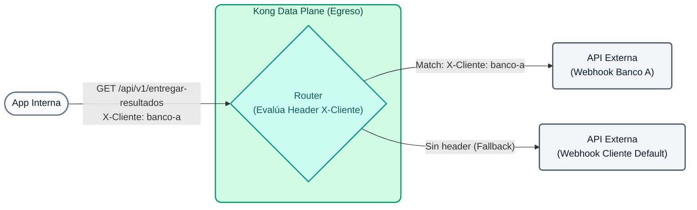
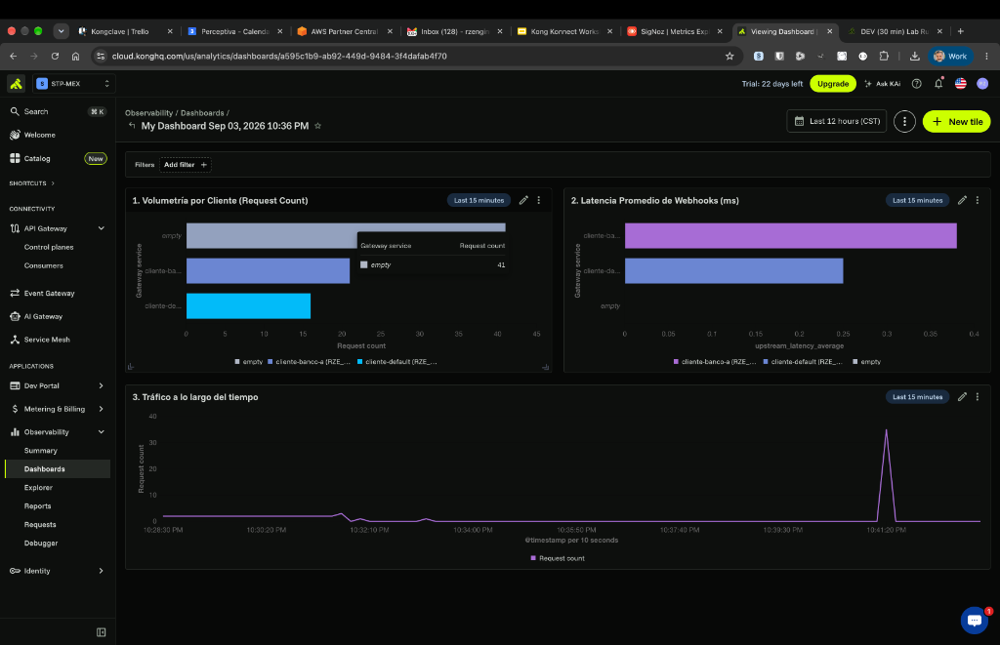

# Laboratorio 05: Ruteo Inteligente (Egresos a Clientes)

En este laboratorio vamos a darle un giro al caso de uso clásico. En lugar de que clientes externos consuman *nuestras* APIs, imaginemos que **nuestra empresa** procesa operaciones comerciales y, al finalizar, necesita **entregar los resultados llamando directamente a los Webhooks (APIs) de sus clientes**.

En lugar de que nuestras aplicaciones internas tengan que conocer y gestionar las URLs y reglas de conexión de cada cliente, usaremos Kong como un **Gateway de Egreso (Outbound Gateway)**. Kong recibirá todas las notificaciones en un solo punto y las ruteará dinámicamente al cliente correcto basándose en el header HTTP de destino.



## Objetivos

- Configurar Kong para actuar como intermediario en llamadas salientes.
- Configurar múltiples rutas que escuchen en el mismo path (`/api/v1/entregar-resultados`) pero deriven el tráfico a distintos *Upstreams* (APIs de clientes) dependiendo del header `X-Cliente`.

### El concepto de Smart Routing (Ruteo Inteligente)
Con **Smart Routing**, Kong puede tomar decisiones de enrutamiento basadas en una multitud de criterios combinados de las peticiones HTTP y la capa de transporte:
- **Cabeceras (Headers):** Útil para A/B testing, o como en nuestro caso, para decidir a qué partner comercial enviar un payload (ej. `X-Cliente: banco-a`).
- **Regex en Paths:** Capturar variables dinámicas (como un ID) directamente desde la URL.
- **SNI (Server Name Indication):** Rutear basándose en el certificado TLS.
- **Query Params:** Modificar el flujo de la petición basado en variables en la cadena de consulta.

Esto permite una flexibilidad enorme sin necesidad de tocar el código de tus microservicios internos. Si el "Banco A" cambia la URL de su webhook, nuestra aplicación interna no se entera; solo se actualiza la configuración en Kong.

---

## Paso 1: Configurar el Ruteo de Egreso

Supongamos que nuestra aplicación interna envía los resultados llamando a `/api/v1/entregar-resultados`. Si inyecta el header `X-Cliente: banco-a`, Kong enrutará el payload al webhook específico del Banco A. Si no envía nada, Kong enviará el tráfico a un webhook por defecto (o un sistema de dead-letter).

Abre el archivo `lab_05_1.yaml` ubicado en la carpeta `workshop-assets/dia-2` y analiza su contenido:

```yaml
_format_version: "3.0"
services:
 # Servicio DEFAULT (catch-all)
 - name: cliente-default
   url: http://httpbin-backend:9081/anything/cliente-default
   routes:
    - name: cliente-default-route
      paths: 
       - /api/v1/entregar-resultados
      methods: [GET]

 # Servicio BANCO A (solo se activa con X-Cliente: banco-a)
 - name: cliente-banco-a
   url: http://httpbin-backend:9081/anything/webhook-banco-a
   routes:
    - name: cliente-banco-a-route
      paths: 
       - /api/v1/entregar-resultados
      methods: [GET]
      headers:
       x-cliente:
        - banco-a
```

**Puntos Clave:**

- **Múltiples Rutas por Headers:** Ambas rutas escuchan exactamente el mismo path `/api/v1/entregar-resultados`. La diferencia es que la ruta del Banco A exige explícitamente el header `x-cliente: banco-a`. Kong evalúa primero las rutas más específicas (las que requieren headers), usando las genéricas como fallback.

## Paso 2: Aplicar y Probar (Ruta Default)

Sincroniza los cambios y realiza una prueba simulando a tu aplicación interna enviando un resultado, **sin** especificar hacia qué cliente va (no enviamos el header especial). Esto ejecutará el fallback:

```bash
deck gateway sync lab_05_1.yaml && \
echo "Esperando 15s para que Konnect actualice el Data Plane..." && sleep 15 && \
curl -s http://localhost:8000/api/v1/entregar-resultados
```

**Analizando el resultado:**

- Observa el valor del campo `"url"` dentro del JSON devuelto por el mock.
- Debería mostrar `"url": "http://httpbin-backend:9081/anything/cliente-default"`. Esto confirma que Kong desvió el tráfico al destino por defecto.

## Paso 3: Probar el Ruteo hacia el Banco A

Ahora, nuestra aplicación interna especifica que este resultado le pertenece al "Banco A" inyectando el header `X-Cliente: banco-a`. No necesitamos hacer sync de nuevo, solo lanzar la petición:

```bash
curl -s -H "X-Cliente: banco-a" http://localhost:8000/api/v1/entregar-resultados
```

**Para Windows (CMD):**
```cmd
curl -s -H "X-Cliente: banco-a" http://localhost:8000/api/v1/entregar-resultados
```

**Analizando el resultado:**

- Vuelve a revisar el campo `"url"` en el JSON devuelto.
- Verás que el tráfico fue redirigido automáticamente a `"url": "http://httpbin-backend:9081/anything/webhook-banco-a"`.
- Kong detectó el header, evaluó su mayor prioridad y desvió el tráfico al webhook del cliente sin que la aplicación interna emisora tuviera que conocer esa URL externa.

## Paso 4: Observabilidad de Egresos en Konnect (Custom Reports)

Al tener a Kong enrutando las llamadas salientes, ganamos visibilidad inmediata del comportamiento de las APIs de nuestros clientes sin tener que instrumentar código en nuestra aplicación interna. Vamos a crear gráficas personalizadas en Konnect para medir latencias, volumetría y ancho de banda por cada cliente.

### 4.1 Generar tráfico de prueba
Ejecuta los siguientes comandos para enviar tráfico simulado a ambos clientes:

```bash
# Tráfico hacia Banco A
for i in {1..20}; do curl -s -o /dev/null -H "X-Cliente: banco-a" http://localhost:8000/api/v1/entregar-resultados; done

# Tráfico hacia Cliente Default
for i in {1..15}; do curl -s -o /dev/null http://localhost:8000/api/v1/entregar-resultados; done
```

### 4.2 Importar el Dashboard de Egresos en Konnect
Para simplificar la creación de las gráficas, hemos preparado un Dashboard preconfigurado con las métricas más importantes para este escenario.

1. Entra a la consola de **Kong Konnect**.
2. En el menú izquierdo, navega a **Analytics > Custom Reports**.
3. Haz clic en el botón de los tres puntos verticales (opciones) o en **Import Dashboard**.
4. Sube el archivo `dashboard_egresos.json` que se encuentra en tu carpeta `workshop-assets/dia-2/`.
5. Una vez importado, ábrelo. Deberías ver un panel similar a este:



### ¿Qué nos muestran estas gráficas?

**Gráfica 1: Volumetría por Cliente (Request Count)**
Muestra barras comparativas indicando cuántas peticiones se enviaron a cada destino. En el ejemplo, vemos claramente que `cliente-banco-a` recibió alrededor de 20 notificaciones, mientras que `cliente-default` recibió unas 16. Esto te permite auditar el volumen de transacciones entregadas a cada partner comercial de la empresa.

**Gráfica 2: Latencia Promedio de Webhooks (ms)**
Mide el tiempo de respuesta (`upstream_latency_average`) de los servicios externos. Si la barra de un cliente (ej. `cliente-banco-a`) se dispara, significa que el webhook de ese cliente está respondiendo lento. Esto te permite reclamar a tus partners si su API está degradada antes de que afecte los procesos internos.

**Gráfica 3: Tráfico a lo largo del tiempo**
Una línea de tiempo que revela los picos de actividad. En el ejemplo, podemos observar un pico pronunciado (más de 30 peticiones) en un instante específico, representando el momento exacto en el que ejecutaste el script de generación de carga.

> **💡 Pro Tip:** Si en tus gráficas aparecen servicios extraños o antiguos con la etiqueta `(deleted)`, usa el botón **"Add filter"** (arriba a la izquierda), selecciona **"Gateway Service"** y tilda únicamente `cliente-banco-a` y `cliente-default` para limpiar el ruido.

---

## Conclusión
Al utilizar Kong como Gateway de Salida, has logrado desacoplar la lógica de integración con terceros de tu aplicación principal. Tu aplicación simplemente lanza payloads hacia Kong indicando el destino a través de headers u otros metadatos, y Kong se encarga del ruteo pesado, control de reintentos e inyección de credenciales específicas por cada partner comercial. Además, acabamos de ver cómo **Analytics** te da métricas de negocio y de rendimiento "gratis" sobre esas integraciones externas.
