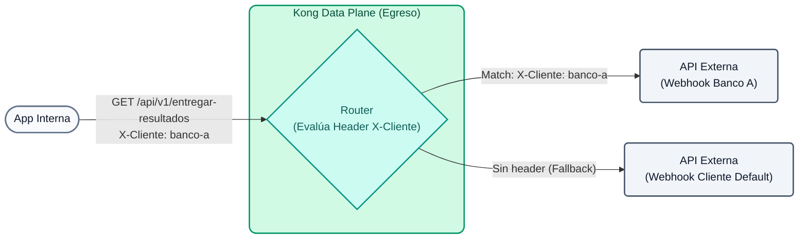

# Laboratório 05: Roteamento Inteligente (Saídas para Clientes)

Neste laboratório, daremos um toque diferente ao caso de uso clássico. Em vez de clientes externos consumirem *nossas* APIs, vamos imaginar que **nossa empresa** processa operações de negociação e, após a conclusão, precisa **entregar os resultados chamando diretamente os Webhooks (APIs) de seus clientes**.

Em vez de nossos aplicativos internos terem que conhecer e gerenciar as URLs e regras de conexão de cada cliente, usaremos o Kong como um **Outbound Gateway**. Kong receberá todas as notificações em um único ponto e as encaminhará dinamicamente para o cliente correto com base no cabeçalho HTTP de destino.


## Objetivos

- Configure o Kong para atuar como intermediário nas chamadas de saída.
- Configure múltiplas rotas que escutam no mesmo caminho (`/api/v1/deliver-results`), mas encaminham o tráfego para diferentes *Upstreams* (APIs de cliente) dependendo do cabeçalho `X-Client`.

### O conceito de roteamento inteligente
Com o **Roteamento Inteligente**, Kong pode tomar decisões de roteamento com base em vários critérios combinados de solicitações HTTP e da camada de transporte:
- **Cabeçalhos:** Útil para testes A/B, ou como no nosso caso, para decidir para qual parceiro comercial enviar uma carga útil (por exemplo, `X-Customer: bank-a`).
- **Regex em Paths:** Capture variáveis ​​dinâmicas (como um ID) diretamente do URL.
- **SNI (Server Name Indication):** Rota baseada no certificado TLS.
- **Parâmetros de consulta:** Modifique o fluxo de solicitação com base nas variáveis ​​da string de consulta.

Isto permite uma enorme flexibilidade sem ter que mexer no código dos seus microsserviços internos. Se o “Banco A” alterar sua URL de webhook, nossa aplicação interna não fica sabendo; apenas a configuração no Kong é atualizada.

---

## Etapa 1: Configurar roteamento de saída

Suponha que nosso aplicativo interno envie os resultados chamando `/api/v1/deliver-results`. Se você injetar o cabeçalho `X-Customer: bank-a`, Kong encaminhará a carga para o webhook específico do Banco A. Se você não enviar nada, o Kong enviará o tráfego para um webhook padrão (ou um sistema de mensagens mortas).

Abra o arquivo `lab_05_1.yaml` localizado na pasta `workshop-assets/dia-2` e analise seu conteúdo:

```yaml
_format_version: "3.0"
services:
 # Servicio DEFAULT (catch-all)
 - name: cliente-default
   url: http://httpbin-backend:9081/anything/cliente-default
   routes:
    - name: cliente-default-route
      paths: 
       - /api/v1/entregar-resultados
      methods: [GET]

 # Servicio BANCO A (solo se activa con X-Cliente: banco-a)
 - name: cliente-banco-a
   url: http://httpbin-backend:9081/anything/webhook-banco-a
   routes:
    - name: cliente-banco-a-route
      paths: 
       - /api/v1/entregar-resultados
      methods: [GET]
      headers:
       x-cliente:
        - banco-a
```

**Puntos Clave:**

- **Múltiples Rutas por Headers:** Ambas rutas escuchan exactamente el mismo path `/api/v1/entregar-resultados`. La diferencia es que la ruta del Banco A exige explícitamente el header `x-cliente: banco-a`. Kong evalúa primero las rutas más específicas (las que requieren headers), usando las genéricas como fallback.

## Paso 2: Aplicar y Probar (Ruta Default)

Sincroniza los cambios y realiza una prueba simulando a tu aplicación interna enviando un resultado, **sin** especificar hacia qué cliente va (no enviamos el header especial). Esto ejecutará el fallback:

```bash
deck gateway sync lab_05_1.yaml && \
echo "Esperando 15s para que Konnect actualice el Data Plane..." && sleep 15 && \
curl -s http://localhost:8000/api/v1/entregar-resultados
```

**Analizando el resultado:**

- Observa el valor del campo `"url"` dentro del JSON devuelto por el mock.
- Debería mostrar `"url": "http://httpbin-backend:9081/anything/cliente-default"`. Esto confirma que Kong desvió el tráfico al destino por defecto.

## Paso 3: Probar el Ruteo hacia el Banco A

Agora, nossa aplicação interna especifica que este resultado pertence ao "Banco A" injetando o cabeçalho `X-Cliente: banco-a`. Não precisamos fazer sync novamente, apenas enviar a requisição:

```bash
curl -s -H "X-Cliente: banco-a" http://localhost:8000/api/v1/entregar-resultados
```
**Para Windows (CMD):**

```cmd
curl -s -H "X-Cliente: banco-a" http://localhost:8000/api/v1/entregar-resultados
```
**Analisando o resultado:**

- Verifique novamente o campo `"url"` no JSON retornado.
- Você verá que o tráfego foi redirecionado automaticamente para `"url": "http://httpbin-backend:9081/anything/webhook-banco-a"`.
- Kong detectou o cabeçalho, avaliou sua prioridade mais alta e desviou o tráfego para o webhook do cliente sem que o aplicativo interno emissor precisasse conhecer aquela URL externa.

## Etapa 4: Observabilidade de despesas no Konnect (relatórios personalizados)

Ao fazer com que o Kong roteie as chamadas de saída, obtemos visibilidade imediata do comportamento das APIs de nossos clientes sem a necessidade de implementar código na nossa aplicação interna. Vamos criar gráficos customizados no Konnect para medir latências, volumetria e largura de banda de cada cliente.

### 4.1 Gerar tráfego de teste
Execute os seguintes comandos para enviar tráfego simulado para ambos os clientes:

```bash
# Tráfico hacia Banco A
for i in {1..20}; do curl -s -o /dev/null -H "X-Cliente: banco-a" http://localhost:8000/api/v1/entregar-resultados; done

# Tráfico hacia Cliente Default
for i in {1..15}; do curl -s -o /dev/null http://localhost:8000/api/v1/entregar-resultados; done
```
### 4.2 Importar o Painel de Despesas para o Konnect
Para simplificar a criação dos gráficos preparamos um Dashboard pré-configurado com as métricas mais importantes para este cenário.

1. Entre no console do **Kong Konnect**.
2. No menu esquerdo, navegue até **Analytics > Relatórios personalizados**.
3. Clique no botão de três pontos verticais (opções) ou **Importar painel**.
4. Faça upload do arquivo `dashboard_egresos.json` encontrado na pasta `workshop-assets/dia-2/`.
5. Depois de importado, abra-o. Você deverá ver um painel semelhante a este:


### O que esses gráficos nos mostram?

**Gráfico 1: Volumetria por Cliente (Contagem de Solicitações)**
Mostra barras comparativas indicando quantas solicitações foram enviadas para cada destino. No exemplo, vemos claramente que o `client-bank-a` recebeu cerca de 20 notificações, enquanto o `client-default` recebeu cerca de 16. Isto permite auditar o volume de transações entregues a cada parceiro comercial da empresa.

**Gráfico 2: Latência Média de Webhooks (ms)**
Mede o tempo de resposta (`upstream_latency_average`) de serviços externos. Se a barra de um cliente (por exemplo, `client-bank-a`) disparar, significa que o webhook do cliente está respondendo lentamente. Isso permite que você reclame com seus parceiros se a API deles for degradada antes de afetar os processos internos.

**Gráfico 3: Tráfego ao longo do tempo**
Uma linha do tempo revelando picos de atividade. No exemplo, podemos observar um pico pronunciado (mais de 30 solicitações) em um horário específico, representando o momento exato em que você executou o script de geração de carga.

> **💡 Dica Profissional:** Se serviços estranhos ou antigos com a tag `(deleted)` aparecerem em seus gráficos, use o botão **"Adicionar filtro"** (canto superior esquerdo), selecione **"Gateway Service"** e marque apenas `cliente-bank-a` e `cliente-default` para limpar o ruído.

---
## Conclusão
Ao usar Kong como gateway de saída, você conseguiu dissociar a lógica de integração de terceiros de seu aplicativo principal. Seu aplicativo simplesmente lança cargas úteis para Kong indicando o destino por meio de cabeçalhos ou outros metadados, e Kong cuida do roteamento pesado, do controle de novas tentativas e da injeção de credenciais específicas para cada parceiro comercial. Além disso, acabamos de ver como o **Analytics** oferece métricas "gratuitas" de negócios e desempenho nessas integrações externas.
