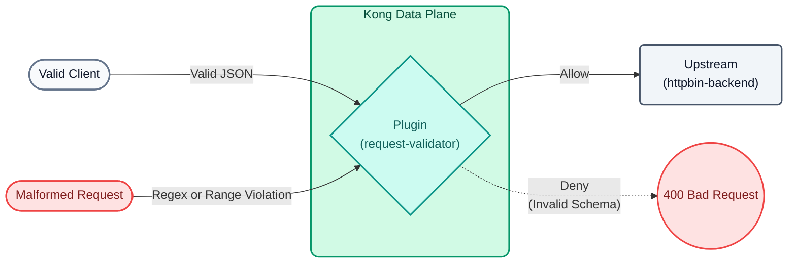

# Lab 06: Advanced JSON Schema Governance and Validation

In this lab, we will ensure that POST requests to our service comply with a strict data contract before even touching our backend. To demonstrate Kong's true power, we will use the **JSON Schema Draft 4** standard, which allows us to evaluate Regular Expressions (Regex), numeric ranges, and array size restrictions.



## Objectives

- Configure the `request-validator` plugin using `version: draft4`.
- Define an advanced data contract with logical constraints.
- Intercept payloads that violate business rules (e.g., invalid emails or negative values).

### API Governance and Shift-Left Security
In a modern architecture, delegating the responsibility of **validating data format** to each individual microservice carries several risks:
1.  **Wasted Compute:** Microservices process and deserialize malformed requests, consuming CPU cycles.
2.  **Attack Surface:** Deliberately giant requests or those with extreme values can cause problems in the backend.
3.  **Inconsistency:** Different teams may implement different validations, leading to a poor experience for consumers.

By implementing **Shift-Left Security**, we validate requests directly at the "edge" of the network (Kong Gateway). If the payload does not strictly comply with the JSON schema, the Gateway immediately rejects the request with a `400 Bad Request` without waking up the backend.

---

## Step 1: Configure Advanced Validation

Open the `lab_06_1.yaml` file located in the `workshop-assets/dia-2` folder. This configures a new POST route to process transactions (`/echo`), applying a strict contract:

```yaml
_format_version: "3.0"
services:
 - name: mock-echo
   url: http://httpbin-backend:9081/anything/echo
   routes:
    - name: echo-post-route
      paths: 
       - /api/v1/echo
      methods: [POST]
      plugins:
       - name: request-validator
         config:
           version: draft4
           body_schema: |
             {
               "type": "object",
               "properties": {
                 "user_name": { "type": "string", "minLength": 3 },
                 "email": { "type": "string", "pattern": "^[a-zA-Z0-9_.+-]+@[a-zA-Z0-9-]+\\.[a-zA-Z0-9-.]+$" },
                 "transaction_id": { "type": "string", "pattern": "^TX-[0-9]{4}$" },
                 "tier": { "type": "string", "enum": ["standard", "premium"] },
                 "amount": { "type": "number", "minimum": 1.0, "maximum": 10000.0 },
                 "tags": {
                   "type": "array",
                   "items": { "type": "string" },
                   "minItems": 1,
                   "maxItems": 5
                 }
               },
               "required": ["user_name", "email", "transaction_id", "tier", "amount"]
             }
           verbose_response: true
           allowed_content_types: ["application/json"]
```

**Key JSON Schema Points:**

-   **`pattern`**: Allows evaluating regular expressions (e.g., forcing `email` to have an `@` and a domain, and `transaction_id` to start with `TX-` followed by 4 numbers).
-   **`minimum` / `maximum`**: Prevents negative or exaggerated amounts from being sent.
-   **`enum`**: Limits the `tier` field exclusively to two possible values.

To apply this validation to your environment, run the following command:

```bash
deck gateway sync lab_06_1.yaml && \
echo "Waiting 15s for Konnect to update the Data Plane..." && sleep 15
```

## Step 2: Test (Success Scenario)
Perform the first test with a perfectly valid JSON that complies with all schema rules:

```bash
curl -s -D /dev/stderr -X POST http://localhost:8000/api/v1/echo \
 -H "Content-Type: application/json" \
 -d '{
   "user_name":"Juan Perez",
   "email":"juan.perez@empresa.com",
   "transaction_id":"TX-1045",
   "tier":"premium",
   "amount": 500.50,
   "tags":["vip", "urgente"]
 }' 
```

**For Windows (CMD):**
```cmd
curl -s -D /dev/stderr -X POST http://localhost:8000/api/v1/echo ^
 -H "Content-Type: application/json" ^
 -d "{ \"user_name\":\"Juan Perez\", \"email\":\"juan.perez@empresa.com\", \"transaction_id\":\"TX-1045\", \"tier\":\"premium\", \"amount\": 500.50, \"tags\":[\"vip\", \"urgente\"] }" 
```

**Analyzing the result:**
- You will observe a `200 OK`. The backend processed the request successfully because the payload passed all Kong validations.

## Step 3: Test Rejection Scenarios (Active Governance)
Let's try to break the data contract by sending requests that clients (or attackers) might generate by error or malice. You don't need to resync.

### 3.1 Invalid Regular Expression (Malformed Email)
Let's try to send a transaction with an erroneous email format and a Transaction ID that does not comply with the `TX-XXXX` format:

```bash
curl -s -D /dev/stderr -X POST http://localhost:8000/api/v1/echo \
 -H "Content-Type: application/json" \
 -d '{
   "user_name":"Ana",
   "email":"ana-en-empresa.com", 
   "transaction_id":"TX-ABC", 
   "tier":"premium",
   "amount": 100
 }' 
```

**For Windows (CMD):**
```cmd
curl -s -D /dev/stderr -X POST http://localhost:8000/api/v1/echo ^
 -H "Content-Type: application/json" ^
 -d "{ \"user_name\":\"Ana\", \"email\":\"ana-en-empresa.com\", \"transaction_id\":\"TX-ABC\", \"tier\":\"premium\", \"amount\": 100 }" 
```
**Result:** Kong returns a resounding `400 Bad Request`, informing in the JSON exactly what failed. When processing the rules, Kong stops at the first error it finds (for example: `failed to match pattern ^TX-[0-9]{4}$ with "TX-ABC"`), blocking the request instantly.

### 3.2 Negative Amount and False Enumeration
Now let's try to transfer an out-of-range amount and use an invented user tier:

```bash
curl -s -D /dev/stderr -X POST http://localhost:8000/api/v1/echo \
 -H "Content-Type: application/json" \
 -d '{
   "user_name":"Carlos",
   "email":"carlos@test.com",
   "transaction_id":"TX-9999",
   "tier":"hacker", 
   "amount": -50.00 
 }' 
```

**For Windows (CMD):**
```cmd
curl -s -D /dev/stderr -X POST http://localhost:8000/api/v1/echo ^
 -H "Content-Type: application/json" ^
 -d "{ \"user_name\":\"Carlos\", \"email\":\"carlos@test.com\", \"transaction_id\":\"TX-9999\", \"tier\":\"hacker\", \"amount\": -50.00 }" 
```
**Result:** Kong returns another `400 Bad Request`. Due to fast evaluation, it will throw the first detected error, which in this case is the invalid enum: `{"message":"property tier validation failed: matches none of the enum values"}`. It will never evaluate the negative amount or send this to your backend.

---
## Conclusion
You have implemented **JSON Schema Draft 4** in the API Gateway. By validating fields with regular expressions and mathematical limits directly at the edge, you offload unnecessary processing from your microservices, enhance security (preventing injections and overflows), and standardize the error codes you return to your consumers.