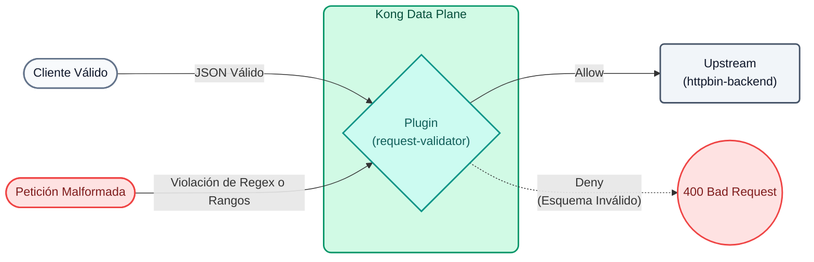

# Laboratorio 06: Gobernanza y Validación de Esquemas JSON Avanzada

En este laboratorio garantizaremos que las peticiones POST a nuestro servicio cumplan con un contrato estricto de datos antes de siquiera tocar nuestro backend. Para demostrar la verdadera potencia de Kong, utilizaremos el estándar **JSON Schema Draft 4**, el cual nos permite evaluar Expresiones Regulares (Regex), rangos numéricos y restricciones de tamaño en arreglos.



## Objetivos

- Configurar el plugin `request-validator` utilizando `version: draft4`.
- Definir un contrato de datos avanzado con restricciones lógicas.
- Interceptar payloads que violen reglas de negocio (ej. emails inválidos o valores negativos).

### Gobernanza de APIs y Shift-Left Security
En una arquitectura moderna, delegar la responsabilidad de **validar el formato de los datos** a cada uno de los microservicios individuales conlleva varios riesgos:
1. **Desperdicio de Cómputo:** Los microservicios procesan y deserializan peticiones malformadas consumiendo ciclos de CPU.
2. **Superficie de Ataque:** Peticiones deliberadamente gigantes o con valores extremos pueden causar problemas en el backend.
3. **Inconsistencia:** Diferentes equipos pueden implementar validaciones distintas, generando una mala experiencia para los consumidores.

Al implementar **Shift-Left Security**, validamos las peticiones directamente en el "borde" de la red (Kong Gateway). Si el payload no cumple estrictamente con el esquema JSON, el Gateway rechaza la petición inmediatamente con un `400 Bad Request` sin despertar al backend.

---

## Paso 1: Configurar la Validación Avanzada

Abre el archivo `lab_06_1.yaml` ubicado en la carpeta `workshop-assets/dia-2`. Este configura una nueva ruta POST para procesar transacciones (`/echo`), aplicando un contrato estricto:

```yaml
_format_version: "3.0"
services:
 - name: mock-echo
   url: http://httpbin-backend:9081/anything/echo
   routes:
    - name: echo-post-route
      paths: 
       - /api/v1/echo
      methods: [POST]
      plugins:
       - name: request-validator
         config:
           version: draft4
           body_schema: |
             {
               "type": "object",
               "properties": {
                 "user_name": { "type": "string", "minLength": 3 },
                 "email": { "type": "string", "pattern": "^[a-zA-Z0-9_.+-]+@[a-zA-Z0-9-]+\\.[a-zA-Z0-9-.]+$" },
                 "transaction_id": { "type": "string", "pattern": "^TX-[0-9]{4}$" },
                 "tier": { "type": "string", "enum": ["standard", "premium"] },
                 "amount": { "type": "number", "minimum": 1.0, "maximum": 10000.0 },
                 "tags": {
                   "type": "array",
                   "items": { "type": "string" },
                   "minItems": 1,
                   "maxItems": 5
                 }
               },
               "required": ["user_name", "email", "transaction_id", "tier", "amount"]
             }
           verbose_response: true
           allowed_content_types: ["application/json"]
```

**Puntos Clave de JSON Schema:**

- **`pattern`**: Permite evaluar expresiones regulares (Ej. forzar que `email` tenga un `@` y un dominio, y que `transaction_id` empiece con `TX-` seguido de 4 números).
- **`minimum` / `maximum`**: Evita que se envíen montos negativos o exagerados.
- **`enum`**: Limita el campo `tier` exclusivamente a dos valores posibles.

Para aplicar esta validación a tu entorno, ejecuta el siguiente comando:

```bash
deck gateway sync lab_06_1.yaml && \
echo "Esperando 15s para que Konnect actualice el Data Plane..." && sleep 15
```

## Paso 2: Probar (Escenario de Éxito)
Realiza la primera prueba con un JSON perfectamente válido que cumpla todas las reglas del esquema:

```bash
curl -s -D /dev/stderr -X POST http://localhost:8000/api/v1/echo \
 -H "Content-Type: application/json" \
 -d '{
   "user_name":"Juan Perez",
   "email":"juan.perez@empresa.com",
   "transaction_id":"TX-1045",
   "tier":"premium",
   "amount": 500.50,
   "tags":["vip", "urgente"]
 }' 
```

**Para Windows (CMD):**
```cmd
curl -s -D /dev/stderr -X POST http://localhost:8000/api/v1/echo ^
 -H "Content-Type: application/json" ^
 -d "{ \"user_name\":\"Juan Perez\", \"email\":\"juan.perez@empresa.com\", \"transaction_id\":\"TX-1045\", \"tier\":\"premium\", \"amount\": 500.50, \"tags\":[\"vip\", \"urgente\"] }" 
```

**Analizando el resultado:**
- Observarás un `200 OK`. El backend procesó la petición con éxito porque el payload superó todas las validaciones de Kong.

## Paso 3: Probar Escenarios de Rechazo (Gobernanza Activa)
Vamos a intentar romper el contrato de datos enviando peticiones que los clientes (o atacantes) podrían generar por error o malicia. No necesitas volver a sincronizar.

### 3.1 Expresión Regular Inválida (Email Mal Formateado)
Intentemos mandar una transacción con un formato de email erróneo y un Transaction ID que no cumple el formato `TX-XXXX`:

```bash
curl -s -D /dev/stderr -X POST http://localhost:8000/api/v1/echo \
 -H "Content-Type: application/json" \
 -d '{
   "user_name":"Ana",
   "email":"ana-en-empresa.com", 
   "transaction_id":"TX-ABC", 
   "tier":"premium",
   "amount": 100
 }' 
```

**Para Windows (CMD):**
```cmd
curl -s -D /dev/stderr -X POST http://localhost:8000/api/v1/echo ^
 -H "Content-Type: application/json" ^
 -d "{ \"user_name\":\"Ana\", \"email\":\"ana-en-empresa.com\", \"transaction_id\":\"TX-ABC\", \"tier\":\"premium\", \"amount\": 100 }" 
```
**Resultado:** Kong devuelve un rotundo `400 Bad Request` informando en el JSON exactamente qué falló. Al procesar las reglas, Kong se detiene en el primer error que encuentra (por ejemplo: `failed to match pattern ^TX-[0-9]{4}$ with "TX-ABC"`), bloqueando la petición al instante.

### 3.2 Monto Negativo y Enumeración Falsa
Ahora intentemos transferir un monto fuera de rango y utilizar un tier de usuario inventado:

```bash
curl -s -D /dev/stderr -X POST http://localhost:8000/api/v1/echo \
 -H "Content-Type: application/json" \
 -d '{
   "user_name":"Carlos",
   "email":"carlos@test.com",
   "transaction_id":"TX-9999",
   "tier":"hacker", 
   "amount": -50.00 
 }' 
```

**Para Windows (CMD):**
```cmd
curl -s -D /dev/stderr -X POST http://localhost:8000/api/v1/echo ^
 -H "Content-Type: application/json" ^
 -d "{ \"user_name\":\"Carlos\", \"email\":\"carlos@test.com\", \"transaction_id\":\"TX-9999\", \"tier\":\"hacker\", \"amount\": -50.00 }" 
```
**Resultado:** Kong devuelve otro `400 Bad Request`. Debido a la evaluación rápida, arrojará el primer error detectado, que en este caso es el enum inválido: `{"message":"property tier validation failed: matches none of the enum values"}`. Nunca llegará a evaluar el monto negativo ni enviará esto a tu backend.

---
## Conclusión
Has implementado **JSON Schema Draft 4** en el API Gateway. Al validar campos con expresiones regulares y límites matemáticos directamente en el borde, descargas de procesamiento innecesario a tus microservicios, elevas la seguridad (evitando inyecciones y desbordamientos) y estandarizas los códigos de error que devuelves a tus consumidores.
