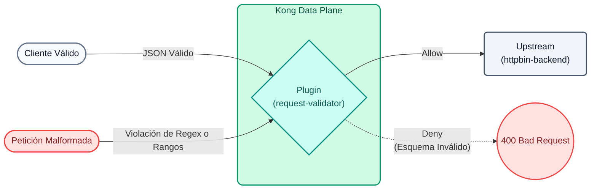

# Laboratório 06: Governança e validação avançadas do esquema JSON

Neste laboratório, garantiremos que as solicitações POST para nosso serviço cumpram um contrato de dados rigoroso antes mesmo de tocar em nosso back-end. Para demonstrar o verdadeiro poder do Kong, usaremos o padrão **JSON Schema Draft 4**, que nos permite avaliar Expressões Regulares (Regex), intervalos numéricos e restrições de tamanho em arrays.


## Objetivos

- Configure o plugin `request-validator` usando `version: draft4`.
- Definir um contrato de dados avançado com restrições lógicas.
- Interceptar cargas úteis que violam regras de negócios (por exemplo, e-mails inválidos ou valores negativos).

### Governança de API e segurança Shift-Left
Em uma arquitetura moderna, delegar a responsabilidade de **validar o formato dos dados** a cada um dos microsserviços individuais acarreta vários riscos:
1. **Desperdício de computação:** Os microsserviços processam e desserializam solicitações malformadas que consomem ciclos de CPU.
2. **Superfície de Ataque:** Solicitações deliberadamente grandes ou solicitações com valores extremos podem causar problemas no back-end.
3. **Inconsistência:** Equipes diferentes podem implementar validações diferentes, criando uma experiência ruim para os consumidores.

Ao implementar **Shift-Left Security**, validamos solicitações diretamente na "borda" da rede (Kong Gateway). Se a carga não estiver estritamente em conformidade com o esquema JSON, o Gateway rejeitará a solicitação imediatamente com um `400 Bad Request` sem ativar o back-end.

---

## Etapa 1: Configurar validação avançada

Abra o arquivo `lab_06_1.yaml` localizado na pasta `workshop-assets/dia-2`. Isso configura uma nova rota POST para processar transações (`/echo`), aplicando um contrato estrito:

```yaml
_format_version: "3.0"
services:
 - name: mock-echo
   url: http://httpbin-backend:9081/anything/echo
   routes:
    - name: echo-post-route
      paths: 
       - /api/v1/echo
      methods: [POST]
      plugins:
       - name: request-validator
         config:
           version: draft4
           body_schema: |
             {
               "type": "object",
               "properties": {
                 "user_name": { "type": "string", "minLength": 3 },
                 "email": { "type": "string", "pattern": "^[a-zA-Z0-9_.+-]+@[a-zA-Z0-9-]+\\.[a-zA-Z0-9-.]+$" },
                 "transaction_id": { "type": "string", "pattern": "^TX-[0-9]{4}$" },
                 "tier": { "type": "string", "enum": ["standard", "premium"] },
                 "amount": { "type": "number", "minimum": 1.0, "maximum": 10000.0 },
                 "tags": {
                   "type": "array",
                   "items": { "type": "string" },
                   "minItems": 1,
                   "maxItems": 5
                 }
               },
               "required": ["user_name", "email", "transaction_id", "tier", "amount"]
             }
           verbose_response: true
           allowed_content_types: ["application/json"]
```
**Pontos-chave do esquema JSON:**

- **`pattern`**: Permite avaliar expressões regulares (por exemplo, forçar `email` a ter um `@` e um domínio, e `transaction_id` a começar com `TX-` seguido por 4 números).
- **`mínimo` / `máximo`**: Evita o envio de valores negativos ou exagerados.
- **`enum`**: Limita o campo `tier` a apenas dois valores possíveis.

Para aplicar essa validação ao seu ambiente, execute o seguinte comando:

```bash
deck gateway sync lab_06_1.yaml && \
echo "Esperando 15s para que Konnect actualice el Data Plane..." && sleep 15
```
## Etapa 2: Teste (cenário de sucesso)
Execute o primeiro teste com um JSON perfeitamente válido que atenda todas as regras do esquema:

```bash
curl -s -D /dev/stderr -X POST http://localhost:8000/api/v1/echo \
 -H "Content-Type: application/json" \
 -d '{
   "user_name":"Juan Perez",
   "email":"juan.perez@empresa.com",
   "transaction_id":"TX-1045",
   "tier":"premium",
   "amount": 500.50,
   "tags":["vip", "urgente"]
 }' 
```
**Para Windows (CMD):**

```cmd
curl -s -D /dev/stderr -X POST http://localhost:8000/api/v1/echo ^
 -H "Content-Type: application/json" ^
 -d "{ \"user_name\":\"Juan Perez\", \"email\":\"juan.perez@empresa.com\", \"transaction_id\":\"TX-1045\", \"tier\":\"premium\", \"amount\": 500.50, \"tags\":[\"vip\", \"urgente\"] }" 
```
**Analisando o resultado:**
- Você verá um `200 OK`. O back-end processou a solicitação com êxito porque a carga passou em todas as validações do Kong.

## Etapa 3: Cenários de rejeição de teste (governança ativa)
Tentaremos quebrar o contrato de dados enviando solicitações que os clientes (ou invasores) possam gerar por engano ou malícia. Você não precisa sincronizar novamente.

### 3.1 Expressão regular inválida (e-mail mal formatado)
Vamos tentar enviar uma transação com o formato de e-mail errado e um ID de transação que não esteja de acordo com o formato `TX-XXXX`:

```bash
curl -s -D /dev/stderr -X POST http://localhost:8000/api/v1/echo \
 -H "Content-Type: application/json" \
 -d '{
   "user_name":"Ana",
   "email":"ana-en-empresa.com", 
   "transaction_id":"TX-ABC", 
   "tier":"premium",
   "amount": 100
 }' 
```
**Para Windows (CMD):**

```cmd
curl -s -D /dev/stderr -X POST http://localhost:8000/api/v1/echo ^
 -H "Content-Type: application/json" ^
 -d "{ \"user_name\":\"Ana\", \"email\":\"ana-en-empresa.com\", \"transaction_id\":\"TX-ABC\", \"tier\":\"premium\", \"amount\": 100 }" 
```
**Resultado:** Kong retorna um retumbante `400 Bad Request` relatando no JSON exatamente o que falhou. Ao processar as regras, Kong para no primeiro erro que encontra (por exemplo: `failed to match pattern ^TX-[0-9]{4}$ with "TX-ABC"`), bloqueando a solicitação instantaneamente.

### 3.2 Valor Negativo e Enumeração Falsa
Agora vamos tentar transferir uma quantia fora do intervalo e usar uma camada de usuário inventada:

```bash
curl -s -D /dev/stderr -X POST http://localhost:8000/api/v1/echo \
 -H "Content-Type: application/json" \
 -d '{
   "user_name":"Carlos",
   "email":"carlos@test.com",
   "transaction_id":"TX-9999",
   "tier":"hacker", 
   "amount": -50.00 
 }' 
```
**Para Windows (CMD):**

```cmd
curl -s -D /dev/stderr -X POST http://localhost:8000/api/v1/echo ^
 -H "Content-Type: application/json" ^
 -d "{ \"user_name\":\"Carlos\", \"email\":\"carlos@test.com\", \"transaction_id\":\"TX-9999\", \"tier\":\"hacker\", \"amount\": -50.00 }" 
```
**Resultado:** Kong retorna outro `400 Bad Request`. Devido à avaliação rápida, ele retornará o primeiro erro detectado, que neste caso é a enumeração inválida: `{"message":"falha na validação da camada de propriedade: não corresponde a nenhum dos valores da enumeração"}`. Ele nunca avaliará o valor negativo nem o enviará para o seu back-end.

---
## Conclusão
Você implementou **JSON Schema Draft 4** no API Gateway. Ao validar campos com expressões regulares e limites matemáticos diretamente na borda, você transfere processamento desnecessário para seus microsserviços, aumenta a segurança (evitando injeções e overflows) e padroniza os códigos de erro que retorna aos seus consumidores.
