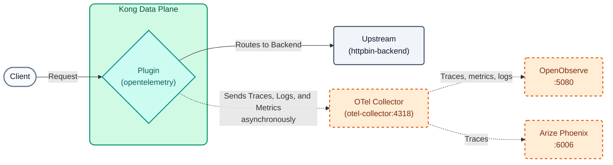
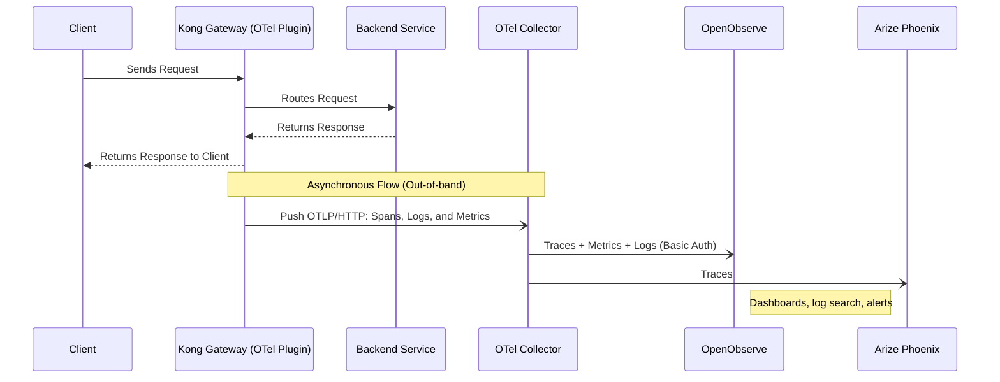

# Lab 07: Observability with OpenTelemetry, OpenObserve, and Arize Phoenix

In this lab we will start the course observability stack (OpenTelemetry Collector + OpenObserve + Arize Phoenix) and configure the OpenTelemetry (OTel) plugin to send our API Gateway's traces, logs, and metrics to it.

To identify our own data (and keep it separate from other students' data if the instructor uses a centralized stack), we will inject our `DEMO_PREFIX` as a service attribute.



## Objectives

- Start the local observability stack with a single script.
- Configure the `opentelemetry` plugin globally (traces, logs, and metrics).
- Connect the Data Plane to the OpenTelemetry Collector over the `kong-workshop` Docker network.
- Segment telemetry using a dynamic `service.name`.
- Analyze traces, search logs, and explore metrics in **OpenObserve**.
- See the same traces in **Arize Phoenix** and understand its focus on LLM / AI traffic.


### OpenTelemetry and RED Metrics
When you have dozens of microservices, the old approach of "checking logs in text files" no longer scales. Modern **Observability** is based on three pillars: Metrics, Traces, and Logs.
The industry standard for exporting this telemetry is **OpenTelemetry (OTel)**.

In this lab, we will implement monitoring focused on **RED Metrics**:

-   **Rate:** Number of requests per second.
-   **Errors:** Number of failed requests (e.g., 5xx, 4xx).
-   **Duration:** Response time or latency (P50, P90, P99).

Kong will collect this information in real-time without blocking the request flow, sending it asynchronously to an **OpenTelemetry Collector**, which distributes it to two Open Source backends:

-   **OpenObserve** (UI on `:5080`): traces, metrics, and logs in a single tool, with dashboards, log search, and alerts (a lightweight Open Source alternative to Datadog or New Relic).
-   **Arize Phoenix** (UI on `:6006`): trace viewer specialized in LLM / AI applications (prompts, tokens, latency per model call).

### Telemetry Flow (Sequence Diagram)




---

## Step 1: Start the Observability Stack

The stack runs in Docker on your own machine and uses ~1.2 GB of RAM. Make sure your Data Plane (`kong-dp`) is already running (Lab 00).

```bash
./workshop-assets/dia-1/06-observability/scripts/setup-observability.sh
```

When it finishes, the script prints something like:

```text
 OpenObserve (traces, métricas, logs, dashboards): http://localhost:5080
   Usuario:    admin@kong.com
   Contraseña: <contraseña aleatoria generada en la primera ejecución>
   (guardadas en .../otel-stack/.env; vuelve a verlas con: .../setup-observability.sh status)
 Arize Phoenix (trazas orientadas a LLM/IA):       http://localhost:6006
 OTLP (destino de Kong):
   Desde el Data Plane (red kong-workshop): http://otel-collector:4318/v1/{traces,logs,metrics}
```

!!! info "OpenObserve credentials"
    There is no default password: on its first run the script generates `workshop-assets/dia-1/06-observability/otel-stack/.env` (permissions `600`, excluded from git) with a **random password** and prints it at the end. To see it again at any time:

    ```bash
    ./workshop-assets/dia-1/06-observability/scripts/setup-observability.sh status
    # or: cat workshop-assets/dia-1/06-observability/otel-stack/.env
    ```

    The user email can be set when the file is generated: `ZO_ROOT_USER_EMAIL=you@email.com ./workshop-assets/dia-1/06-observability/scripts/setup-observability.sh`.

**Key Points:**

-   There are 3 containers: `otel-collector`, `openobserve`, and `phoenix`. You can list them with `docker ps --filter name=otel-collector --filter name=openobserve --filter name=phoenix`.
-   The Collector is attached to the `kong-workshop` network, the same as the Data Plane: that is why Kong can reach it by name (`otel-collector`) without exposing anything to the Internet.
-   Kong does **not** know the OpenObserve credentials: the Collector adds Basic authentication when forwarding the telemetry.
-   If the classroom network has no Internet access, the instructor can distribute the images as `.tar` files (generated with `scripts/save-images.sh`) in the `workshop-assets/dia-1/06-observability/docker-images/` folder; the script loads them automatically.

> **Centralized stack (optional):** if the instructor published a shared stack, you do not need Step 1. In Step 2 replace `otel-collector` with the IP given by the instructor (e.g., `http://203.0.113.50:4318/v1/traces`) and use the URLs `http://<IP>:5080` and `http://<IP>:6006`.

## Step 2: Configure Global OpenTelemetry

Open the `lab_07_1.yaml` file located in the `workshop-assets/dia-2` folder and analyze its content:

```yaml
_format_version: "3.0"
services:
- name: mock-default
  url: http://httpbin-backend:9081/anything/mock-default
  routes:
  - name: mock-default-route
    paths:
    - /api/v1/mock
    methods:
    - GET
plugins:
  - name: opentelemetry
    tags: ["core"]
    config:
      header_type: w3c
      traces_endpoint: http://otel-collector:4318/v1/traces
      logs_endpoint: http://otel-collector:4318/v1/logs
      access_logs_endpoint: http://otel-collector:4318/v1/logs
      access_logs:
        endpoint: http://otel-collector:4318/v1/logs
      metrics:
        enable_request_metrics: true
        enable_latency_metrics: true
        enable_bandwidth_metrics: true
        endpoint: http://otel-collector:4318/v1/metrics
      resource_attributes:
        service.name: TUPREFIJO_kong_dp
        alumno_id: TUPREFIJO
```
*(Note: Make sure to replace `TUPREFIJO` with your actual value and, if you use a centralized stack, `otel-collector` with the instructor's IP).*

**Key Points:**

-   **Global `opentelemetry` Plugin:** Unlike other labs, here the plugin is not tied to a specific service or route. Being at the root level, it injects instrumentation into all Gateway traffic.
-   **Traces, Logs, and Metrics:** We configure where Kong will send Spans (latency traces), logs (including one *access log* per request), and metrics (requests, latency, bandwidth) via the OTLP standard. Everything goes to the same Collector.
-   **Dynamic Attributes (`resource_attributes`):** This allows labeling telemetry so it can be segmented in OpenObserve (`service_name`) and in Phoenix (one project per `service.name`). In a shared stack this implements *Soft Multi-tenancy*.

## Step 3: Apply and Generate Traffic
Synchronize the state to apply the plugin globally. Then, we will wait 15 seconds for it to propagate and immediately launch a loop that will generate 10 requests to our API to feed the observability system.

```bash
deck gateway sync workshop-assets/dia-2/lab_07_1.yaml && \
echo "Waiting 15s for Konnect to update the Data Plane..." && sleep 15 && \
echo "Generating 10 test requests..." && \
for i in {1..10}; do curl -s -o /dev/null -w "HTTP Code: %{http_code}\n" http://localhost:8000/api/v1/mock; sleep 0.5; done
```

**Analyzing the result:**

-   In the console, you will only see the status codes `HTTP Code: 200` printed 10 times, as we silenced the payload.
-   In the background, Kong asynchronously packaged these 10 transactions (with latency metrics, IPs, and status codes) and sent them to the Collector on port 4318; the Collector forwarded them to OpenObserve and Phoenix.
-   Metrics are sent every 60 seconds (default `push_interval`): if you do not see them right away, wait a minute.

*(Optional)* Generate some "interesting" traffic to have more data to analyze:

```bash
# Requests to a non-existent route (404s generated by Kong)
for i in {1..5}; do curl -s -o /dev/null -w "HTTP Code: %{http_code}\n" http://localhost:8000/api/v1/no-existe; done
# A request with visible headers to copy the trace / correlation id
curl -s -i http://localhost:8000/api/v1/mock | head -20
```

## Step 4: Analyze in OpenObserve

1. Open your browser at `http://localhost:5080` and log in:
    - **User:** the email in `otel-stack/.env` (default `admin@kong.com`)
    - **Password:** the one generated in Step 1 (`./workshop-assets/dia-1/06-observability/scripts/setup-observability.sh status` shows it again)
2. **Traces:**
    - Go to the **Traces** section in the left menu and select the `default` stream.
    - Set the time range to *Past 15 minutes*.
    - To see **only** your requests, type in the filter bar: `service_name = 'TUPREFIJO_kong_dp'` (OpenObserve stores `service.name` as `service_name`) and click **Run query**.
    - Click one of your traces to analyze the **Waterfall** diagram. You will see exactly the milliseconds of overhead added by Kong (`kong`) versus the actual backend response time (`kong.upstream`). In the side panel review the attributes: `http.status_code`, `alumno_id`, `pipeline.processed_by` (added by the Collector).
3. **Logs:**
    - Go to **Logs**, stream `default`, and filter with `service_name = 'TUPREFIJO_kong_dp'`.
    - Open a record: you will see Kong's *access log* with method, route, status, latencies, and the request's `trace_id`.
    - Try full-text search: `match_all('no-existe')` to find the 404 requests from the optional step.
    - Try **SQL** mode: `SELECT * FROM "default" WHERE service_name = 'TUPREFIJO_kong_dp' ORDER BY _timestamp DESC LIMIT 20`.
4. **Metrics:**
    - Go to **Metrics** and expand the list of available metrics. Look for the ones emitted by Kong (requests, latency, bytes).
    - Select the request metric and group it by status code: do you see the ratio of 200 vs 404? Those are the **R** and **E** of the RED metrics; the **D** is in the latency metrics.
5. **Dashboard (optional):**
    - Go to **Dashboards → New Dashboard** and name it `TUPREFIJO Kong`.
    - **Add Panel** → choose the request metric (time series) → **Save**. Add a second panel with latency.

## Step 5: Analyze in Arize Phoenix

1. Open `http://localhost:6006` (no login).
2. In **Projects** you will see a project named `TUPREFIJO_kong_dp`: the Collector copies the `service.name` as the Phoenix project name.
3. Open the project and review the traces table: latency, status, and time of each request. Click a trace to see its span tree.
4. Compare with OpenObserve: it is **the same trace** (same `trace_id`), received by both backends thanks to the Collector's *fan-out*.
5. **What is Phoenix for?** For normal HTTP traffic it looks like a generic trace viewer. Its strength is **AI**: when traffic goes through Kong AI Gateway or through applications instrumented with OpenInference, Phoenix shows the prompt, the response, the tokens consumed, the model, and the latency of each LLM call, and lets you evaluate response quality.

---
## Conclusion
You have successfully instrumented your API Gateway using open standards (OpenTelemetry). Kong sends telemetry to a single destination (the Collector), and the Collector decides which backends receive it: OpenObserve for day-to-day operations (traces, metrics, logs, and dashboards) and Phoenix for AI traffic analysis. By using resource attributes (such as `service.name`), each operator can monitor their own infrastructure without visual noise, even in a shared environment (Soft Multi-tenancy).
