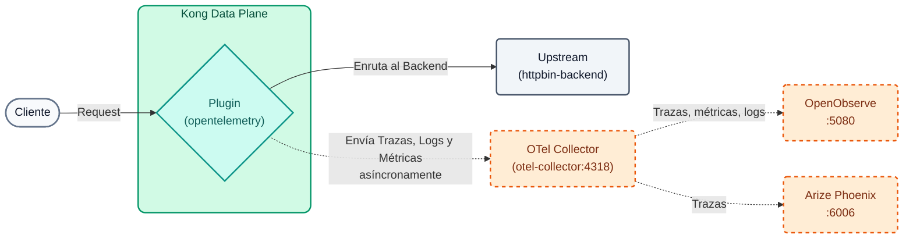
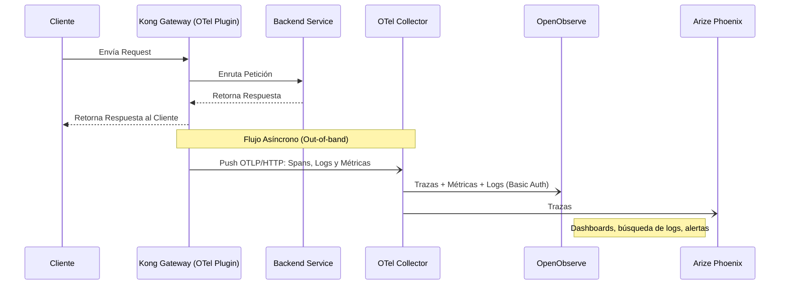

# Laboratorio 07: Observabilidad con OpenTelemetry, OpenObserve y Arize Phoenix

En este laboratorio levantaremos el stack de observabilidad del curso (OpenTelemetry Collector + OpenObserve + Arize Phoenix) y configuraremos el plugin de OpenTelemetry (OTel) para enviar las trazas, logs y métricas de nuestro API Gateway hacia él.

Para poder identificar nuestros datos (y no mezclarlos con los de otros alumnos si el instructor usa un stack centralizado), inyectaremos nuestro `DEMO_PREFIX` como atributo del servicio.



## Objetivos

- Levantar el stack de observabilidad local con un único script.
- Configurar el plugin `opentelemetry` a nivel global (trazas, logs y métricas).
- Conectar el Data Plane con el OpenTelemetry Collector por la red Docker `kong-workshop`.
- Segmentar la telemetría usando `service.name` dinámico.
- Analizar trazas, buscar logs y explorar métricas en **OpenObserve**.
- Ver las mismas trazas en **Arize Phoenix** y entender su enfoque en tráfico LLM / IA.


### OpenTelemetry y Métricas RED
Cuando tienes decenas de microservicios, el viejo enfoque de "revisar logs en archivos de texto" ya no escala. La **Observabilidad** moderna se basa en tres pilares: Métricas, Trazas (Traces) y Logs.
El estándar de la industria para exportar esta telemetría es **OpenTelemetry (OTel)**. 

En este laboratorio implementaremos monitoreo enfocado en las **Métricas RED**:

- **Rate (Tasa):** Número de peticiones por segundo.
- **Errors (Errores):** Número de peticiones fallidas (ej. 5xx, 4xx).
- **Duration (Duración):** Tiempo de respuesta o latencia (P50, P90, P99).

Kong recolectará esta información en tiempo real sin bloquear el flujo de las peticiones, enviándola asíncronamente a un **OpenTelemetry Collector**, que la reparte entre dos backends Open Source:

- **OpenObserve** (UI en `:5080`): trazas, métricas y logs en una sola herramienta, con dashboards, búsqueda de logs y alertas (una alternativa Open Source y liviana a Datadog o New Relic).
- **Arize Phoenix** (UI en `:6006`): visor de trazas especializado en aplicaciones LLM / IA (prompts, tokens, latencia por llamada al modelo).

### Flujo de Telemetría (Sequence Diagram)




---

## Paso 1: Levantar el Stack de Observabilidad

El stack se ejecuta en Docker en tu propia máquina y consume ~1.2 GB de RAM. Asegúrate de que tu Data Plane (`kong-dp`) ya esté corriendo (Lab 00).

```bash
./workshop-assets/dia-1/06-observability/scripts/setup-observability.sh
```

Al terminar, el script imprime algo como:

```text
 OpenObserve (traces, métricas, logs, dashboards): http://localhost:5080
   Usuario:    admin@kong.com
   Contraseña: <contraseña aleatoria generada en la primera ejecución>
   (guardadas en .../otel-stack/.env; vuelve a verlas con: .../setup-observability.sh status)
 Arize Phoenix (trazas orientadas a LLM/IA):       http://localhost:6006
 OTLP (destino de Kong):
   Desde el Data Plane (red kong-workshop): http://otel-collector:4318/v1/{traces,logs,metrics}
```

!!! info "Credenciales de OpenObserve"
    No hay contraseña por defecto: en la primera ejecución el script genera `workshop-assets/dia-1/06-observability/otel-stack/.env` (permisos `600`, excluido de git) con una **contraseña aleatoria** y la muestra al final. Para volver a verla en cualquier momento:

    ```bash
    ./workshop-assets/dia-1/06-observability/scripts/setup-observability.sh status
    # o bien: cat workshop-assets/dia-1/06-observability/otel-stack/.env
    ```

    El email del usuario es configurable al generar el archivo: `ZO_ROOT_USER_EMAIL=tu@email.com ./workshop-assets/dia-1/06-observability/scripts/setup-observability.sh`.

**Puntos Clave:**

- Son 3 contenedores: `otel-collector`, `openobserve` y `phoenix`. Puedes verlos con `docker ps --filter name=otel-collector --filter name=openobserve --filter name=phoenix`.
- El Collector está conectado a la red `kong-workshop`, la misma del Data Plane: por eso Kong puede alcanzarlo por nombre (`otel-collector`) sin exponer nada a Internet.
- Kong **no** conoce las credenciales de OpenObserve: el Collector agrega la autenticación Basic al reenviar la telemetría.
- Si la red del aula no tiene salida a Internet, el instructor puede distribuir las imágenes en `.tar` (generadas con `scripts/save-images.sh`) en la carpeta `workshop-assets/dia-1/06-observability/docker-images/`; el script las carga automáticamente.

> **Stack centralizado (opcional):** si el instructor publicó un stack compartido, no necesitas el Paso 1. En el Paso 2 reemplaza `otel-collector` por la IP que te indique el instructor (ej. `http://203.0.113.50:4318/v1/traces`) y usa las URLs `http://<IP>:5080` y `http://<IP>:6006`.

## Paso 2: Configurar OpenTelemetry Global

Abre el archivo `lab_07_1.yaml` ubicado en la carpeta `workshop-assets/dia-2` y analiza su contenido:

```yaml
_format_version: "3.0"
services:
- name: mock-default
  url: http://httpbin-backend:9081/anything/mock-default
  routes:
  - name: mock-default-route
    paths:
    - /api/v1/mock
    methods:
    - GET
plugins:
  - name: opentelemetry
    tags: ["core"]
    config:
      header_type: w3c
      traces_endpoint: http://otel-collector:4318/v1/traces
      logs_endpoint: http://otel-collector:4318/v1/logs
      access_logs_endpoint: http://otel-collector:4318/v1/logs
      access_logs:
        endpoint: http://otel-collector:4318/v1/logs
      metrics:
        enable_request_metrics: true
        enable_latency_metrics: true
        enable_bandwidth_metrics: true
        endpoint: http://otel-collector:4318/v1/metrics
      resource_attributes:
        service.name: TUPREFIJO_kong_dp
        alumno_id: TUPREFIJO
```
*(Nota: Asegúrate de reemplazar `TUPREFIJO` con tu valor real y, si usas un stack centralizado, `otel-collector` con la IP del instructor).*

**Puntos Clave:**

- **Plugin `opentelemetry` Global:** A diferencia de otros labs, aquí el plugin no está atado a un servicio o ruta específica. Al estar a nivel raíz, inyecta instrumentación a todo el tráfico del Gateway.
- **Trazas, Logs y Métricas:** Configuramos hacia dónde Kong enviará los Spans (trazas de latencia), los logs (incluido un *access log* por petición) y las métricas (peticiones, latencia, ancho de banda) vía el estándar OTLP. Todo va al mismo Collector.
- **Atributos Dinámicos (`resource_attributes`):** Esto permite etiquetar la telemetría para poder segmentarla en OpenObserve (`service_name`) y en Phoenix (un proyecto por `service.name`). En un stack compartido esto implementa *Soft Multi-tenancy*.

## Paso 3: Aplicar y Generar Tráfico
Sincroniza el estado para aplicar el plugin globalmente. Luego, esperaremos 15 segundos a que propague e inmediatamente lanzaremos un bucle que generará 10 peticiones a nuestra API para alimentar el sistema de observabilidad.

```bash
deck gateway sync workshop-assets/dia-2/lab_07_1.yaml && \
echo "Esperando 15s para que Konnect actualice el Data Plane..." && sleep 15 && \
echo "Generando 10 peticiones de prueba..." && \
for i in {1..10}; do curl -s -o /dev/null -w "HTTP Code: %{http_code}\n" http://localhost:8000/api/v1/mock; sleep 0.5; done
```

**Analizando el resultado:**

- En la consola sólo verás los códigos de estado `HTTP Code: 200` impresos 10 veces, ya que silenciamos el payload.
- En segundo plano, Kong empaquetó asíncronamente estas 10 transacciones (con métricas de latencia, IPs, y status codes) y las disparó hacia el Collector por el puerto 4318; el Collector las reenvió a OpenObserve y a Phoenix.
- Las métricas se envían cada 60 segundos (valor por defecto de `push_interval`): si no las ves de inmediato, espera un minuto.

*(Opcional)* Genera algo de tráfico "interesante" para tener más datos que analizar:

```bash
# Peticiones a una ruta inexistente (404 generados por Kong)
for i in {1..5}; do curl -s -o /dev/null -w "HTTP Code: %{http_code}\n" http://localhost:8000/api/v1/no-existe; done
# Una petición con cabeceras visibles para copiar el trace / correlation id
curl -s -i http://localhost:8000/api/v1/mock | head -20
```

## Paso 4: Analizar en OpenObserve

1. Abre el navegador en `http://localhost:5080` e inicia sesión:
    - **Usuario:** el email de `otel-stack/.env` (por defecto `admin@kong.com`)
    - **Contraseña:** la generada en el Paso 1 (`./workshop-assets/dia-1/06-observability/scripts/setup-observability.sh status` la vuelve a mostrar)
2. **Trazas:**
    - Ve a la sección **Traces** en el menú izquierdo y selecciona el stream `default`.
    - Ajusta el rango de tiempo a *Past 15 minutes*.
    - Para ver **solamente** tus peticiones, escribe en la barra de filtro: `service_name = 'TUPREFIJO_kong_dp'` (OpenObserve guarda `service.name` como `service_name`) y pulsa **Run query**.
    - Haz clic en una de tus trazas para analizar el **Waterfall** (diagrama de cascada). Podrás ver exactamente los milisegundos de overhead que añade Kong (`kong`) frente al tiempo de respuesta real del backend (`kong.upstream`). En el panel lateral revisa los atributos: `http.status_code`, `alumno_id`, `pipeline.processed_by` (agregado por el Collector).
3. **Logs:**
    - Ve a **Logs**, stream `default`, y filtra con `service_name = 'TUPREFIJO_kong_dp'`.
    - Abre un registro: verás el *access log* de Kong con método, ruta, status, latencias y el `trace_id` de la petición.
    - Prueba la búsqueda de texto completo: `match_all('no-existe')` para encontrar las peticiones 404 del paso opcional.
    - Prueba el modo **SQL**: `SELECT * FROM "default" WHERE service_name = 'TUPREFIJO_kong_dp' ORDER BY _timestamp DESC LIMIT 20`.
4. **Métricas:**
    - Ve a **Metrics** y despliega la lista de métricas disponibles. Busca las emitidas por Kong (peticiones, latencia, bytes).
    - Selecciona la métrica de peticiones y agrúpala por código de estado: ¿ves la proporción de 200 vs 404? Eso son las **R** y **E** de las métricas RED; la **D** está en las métricas de latencia.
5. **Dashboard (opcional):**
    - Ve a **Dashboards → New Dashboard** y llámalo `TUPREFIJO Kong`.
    - **Add Panel** → elige la métrica de peticiones (serie temporal) → **Save**. Agrega un segundo panel con la latencia.

## Paso 5: Analizar en Arize Phoenix

1. Abre `http://localhost:6006` (sin login).
2. En **Projects** verás un proyecto llamado `TUPREFIJO_kong_dp`: el Collector copia el `service.name` como nombre de proyecto de Phoenix.
3. Entra al proyecto y revisa la tabla de trazas: latencia, estado y hora de cada petición. Haz clic en una traza para ver su árbol de spans.
4. Compara con OpenObserve: es **la misma traza** (mismo `trace_id`), recibida por los dos backends gracias al *fan-out* del Collector.
5. **¿Para qué sirve Phoenix?** Para tráfico HTTP normal se ve como un visor de trazas genérico. Su fuerte es la **IA**: cuando el tráfico pasa por Kong AI Gateway o por aplicaciones instrumentadas con OpenInference, Phoenix muestra el prompt, la respuesta, los tokens consumidos, el modelo y la latencia de cada llamada al LLM, y permite evaluar la calidad de las respuestas.

---
## Conclusión
Has instrumentado exitosamente tu API Gateway utilizando estándares abiertos (OpenTelemetry). Kong envía la telemetría a un único destino (el Collector) y es el Collector quien decide a qué backends llega: OpenObserve para la operación diaria (trazas, métricas, logs y dashboards) y Phoenix para el análisis de tráfico de IA. Al usar atributos de recursos (como `service.name`), cada operador puede monitorear su propia infraestructura sin ruido visual, incluso en un entorno compartido (Soft Multi-tenancy).
