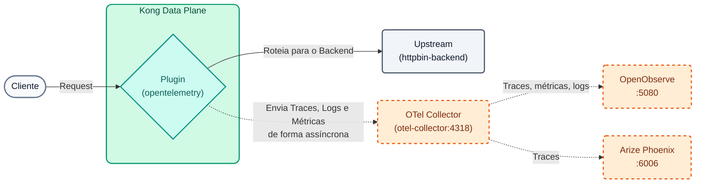
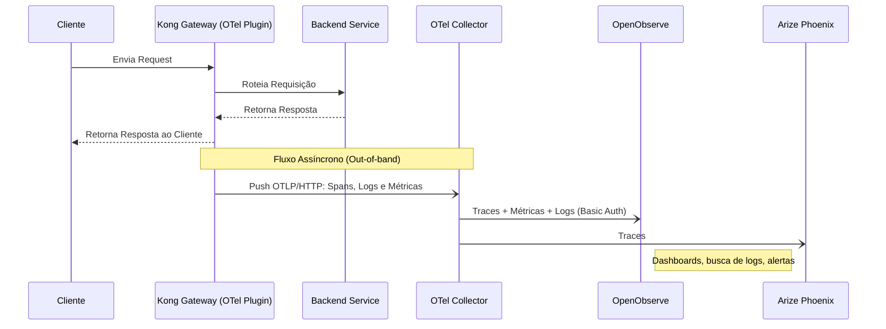

# Laboratório 07: Observabilidade com OpenTelemetry, OpenObserve e Arize Phoenix

Neste laboratório vamos subir a stack de observabilidade do curso (OpenTelemetry Collector + OpenObserve + Arize Phoenix) e configurar o plugin OpenTelemetry (OTel) para enviar os traces, logs e métricas do nosso API Gateway para ela.

Para identificar nossos dados (e não misturá-los com os de outros alunos caso o instrutor use uma stack centralizada), injetaremos nosso `DEMO_PREFIX` como atributo do serviço.



## Objetivos

- Subir a stack de observabilidade local com um único script.
- Configurar o plugin `opentelemetry` em nível global (traces, logs e métricas).
- Conectar o Data Plane ao OpenTelemetry Collector pela rede Docker `kong-workshop`.
- Segmentar a telemetria usando `service.name` dinâmico.
- Analisar traces, buscar logs e explorar métricas no **OpenObserve**.
- Ver os mesmos traces no **Arize Phoenix** e entender seu foco em tráfego LLM / IA.


### OpenTelemetry e Métricas RED
Quando você tem dezenas de microsserviços, a velha abordagem de "verificar logs em arquivos de texto" não escala mais. A **Observabilidade** moderna é baseada em três pilares: Métricas, Rastreamentos (Traces) e Logs.
O padrão da indústria para exportar essa telemetria é o **OpenTelemetry (OTel)**.

Neste laboratório implementaremos um monitoramento focado em **Métricas RED**:

- **Rate (Taxa):** Número de requisições por segundo.
- **Errors (Erros):** Número de requisições com falha (ex. 5xx, 4xx).
- **Duration (Duração):** Tempo de resposta ou latência (P50, P90, P99).

O Kong coletará essas informações em tempo real sem bloquear o fluxo de requisições, enviando-as de forma assíncrona a um **OpenTelemetry Collector**, que as distribui entre dois backends Open Source:

- **OpenObserve** (UI em `:5080`): traces, métricas e logs em uma única ferramenta, com dashboards, busca de logs e alertas (uma alternativa Open Source e leve ao Datadog ou New Relic).
- **Arize Phoenix** (UI em `:6006`): visualizador de traces especializado em aplicações LLM / IA (prompts, tokens, latência por chamada ao modelo).

### Fluxo de Telemetria (Diagrama de Sequência)




---

## Passo 1: Subir a Stack de Observabilidade

A stack roda no Docker na sua própria máquina e consome ~1,2 GB de RAM. Certifique-se de que seu Data Plane (`kong-dp`) já esteja rodando (Lab 00).

```bash
./workshop-assets/dia-1/06-observability/scripts/setup-observability.sh
```

Ao terminar, o script imprime algo como:

```text
 OpenObserve (traces, métricas, logs, dashboards): http://localhost:5080
   Usuario:    admin@kong.com
   Contraseña: <contraseña aleatoria generada en la primera ejecución>
   (guardadas en .../otel-stack/.env; vuelve a verlas con: .../setup-observability.sh status)
 Arize Phoenix (trazas orientadas a LLM/IA):       http://localhost:6006
 OTLP (destino de Kong):
   Desde el Data Plane (red kong-workshop): http://otel-collector:4318/v1/{traces,logs,metrics}
```

!!! info "Credenciais do OpenObserve"
    Não há senha padrão: na primeira execução o script gera `workshop-assets/dia-1/06-observability/otel-stack/.env` (permissões `600`, excluído do git) com uma **senha aleatória** e a exibe no final. Para vê-la novamente a qualquer momento:

    ```bash
    ./workshop-assets/dia-1/06-observability/scripts/setup-observability.sh status
    # ou: cat workshop-assets/dia-1/06-observability/otel-stack/.env
    ```

    O email do usuário é configurável ao gerar o arquivo: `ZO_ROOT_USER_EMAIL=voce@email.com ./workshop-assets/dia-1/06-observability/scripts/setup-observability.sh`.

**Pontos-chave:**

- São 3 contêineres: `otel-collector`, `openobserve` e `phoenix`. Você pode listá-los com `docker ps --filter name=otel-collector --filter name=openobserve --filter name=phoenix`.
- O Collector está conectado à rede `kong-workshop`, a mesma do Data Plane: por isso o Kong consegue alcançá-lo pelo nome (`otel-collector`) sem expor nada à Internet.
- O Kong **não** conhece as credenciais do OpenObserve: o Collector adiciona a autenticação Basic ao encaminhar a telemetria.
- Se a rede da sala não tiver acesso à Internet, o instrutor pode distribuir as imagens em `.tar` (geradas com `scripts/save-images.sh`) na pasta `workshop-assets/dia-1/06-observability/docker-images/`; o script as carrega automaticamente.

> **Stack centralizada (opcional):** se o instrutor publicou uma stack compartilhada, você não precisa do Passo 1. No Passo 2 substitua `otel-collector` pelo IP indicado pelo instrutor (ex. `http://203.0.113.50:4318/v1/traces`) e use as URLs `http://<IP>:5080` e `http://<IP>:6006`.

## Passo 2: Configurar OpenTelemetry Global

Abra o arquivo `lab_07_1.yaml` localizado na pasta `workshop-assets/dia-2` e analise seu conteúdo:

```yaml
_format_version: "3.0"
services:
- name: mock-default
  url: http://httpbin-backend:9081/anything/mock-default
  routes:
  - name: mock-default-route
    paths:
    - /api/v1/mock
    methods:
    - GET
plugins:
  - name: opentelemetry
    tags: ["core"]
    config:
      header_type: w3c
      traces_endpoint: http://otel-collector:4318/v1/traces
      logs_endpoint: http://otel-collector:4318/v1/logs
      access_logs_endpoint: http://otel-collector:4318/v1/logs
      access_logs:
        endpoint: http://otel-collector:4318/v1/logs
      metrics:
        enable_request_metrics: true
        enable_latency_metrics: true
        enable_bandwidth_metrics: true
        endpoint: http://otel-collector:4318/v1/metrics
      resource_attributes:
        service.name: TUPREFIJO_kong_dp
        alumno_id: TUPREFIJO
```
*(Observação: Certifique-se de substituir `TUPREFIJO` pelo seu valor real e, se usar uma stack centralizada, `otel-collector` pelo IP do instrutor).*

**Pontos-chave:**

- **Plugin `opentelemetry` Global:** Ao contrário de outros labs, aqui o plugin não está vinculado a um serviço ou rota específica. Por estar no nível raiz, injeta instrumentação em todo o tráfego do Gateway.
- **Traces, Logs e Métricas:** Configuramos para onde o Kong enviará os Spans (traces de latência), os logs (incluindo um *access log* por requisição) e as métricas (requisições, latência, largura de banda) via padrão OTLP. Tudo vai para o mesmo Collector.
- **Atributos Dinâmicos (`resource_attributes`):** Permitem rotular a telemetria para segmentá-la no OpenObserve (`service_name`) e no Phoenix (um projeto por `service.name`). Em uma stack compartilhada isso implementa *Soft Multi-tenancy*.

## Passo 3: Aplicar e Gerar Tráfego
Sincronize o estado para aplicar o plugin globalmente. Em seguida, aguardaremos 15 segundos para a propagação e imediatamente lançaremos um loop que gerará 10 requisições para nossa API para alimentar o sistema de observabilidade.

```bash
deck gateway sync workshop-assets/dia-2/lab_07_1.yaml && \
echo "Aguardando 15s para o Konnect atualizar o Data Plane..." && sleep 15 && \
echo "Gerando 10 requisições de teste..." && \
for i in {1..10}; do curl -s -o /dev/null -w "HTTP Code: %{http_code}\n" http://localhost:8000/api/v1/mock; sleep 0.5; done
```

**Analisando o resultado:**

- No console você verá apenas os códigos de status `HTTP Code: 200` impressos 10 vezes, pois silenciamos o payload.
- Em segundo plano, o Kong empacotou de forma assíncrona essas 10 transações (com métricas de latência, IPs e códigos de status) e as enviou ao Collector na porta 4318; o Collector as encaminhou ao OpenObserve e ao Phoenix.
- As métricas são enviadas a cada 60 segundos (valor padrão de `push_interval`): se não as vir imediatamente, aguarde um minuto.

*(Opcional)* Gere algum tráfego "interessante" para ter mais dados para analisar:

```bash
# Requisições para uma rota inexistente (404 gerados pelo Kong)
for i in {1..5}; do curl -s -o /dev/null -w "HTTP Code: %{http_code}\n" http://localhost:8000/api/v1/no-existe; done
# Uma requisição com cabeçalhos visíveis para copiar o trace / correlation id
curl -s -i http://localhost:8000/api/v1/mock | head -20
```

## Passo 4: Analisar no OpenObserve

1. Abra o navegador em `http://localhost:5080` e faça login:
    - **Usuário:** o email de `otel-stack/.env` (por padrão `admin@kong.com`)
    - **Senha:** a gerada no Passo 1 (`./workshop-assets/dia-1/06-observability/scripts/setup-observability.sh status` a exibe novamente)
2. **Traces:**
    - Vá para a seção **Traces** no menu esquerdo e selecione o stream `default`.
    - Ajuste o intervalo de tempo para *Past 15 minutes*.
    - Para ver **apenas** suas requisições, digite na barra de filtro: `service_name = 'TUPREFIJO_kong_dp'` (o OpenObserve armazena `service.name` como `service_name`) e clique em **Run query**.
    - Clique em um dos seus traces para analisar o **Waterfall** (diagrama em cascata). Você verá exatamente os milissegundos de overhead adicionados pelo Kong (`kong`) em relação ao tempo real de resposta do backend (`kong.upstream`). No painel lateral revise os atributos: `http.status_code`, `alumno_id`, `pipeline.processed_by` (adicionado pelo Collector).
3. **Logs:**
    - Vá para **Logs**, stream `default`, e filtre com `service_name = 'TUPREFIJO_kong_dp'`.
    - Abra um registro: você verá o *access log* do Kong com método, rota, status, latências e o `trace_id` da requisição.
    - Experimente a busca de texto completo: `match_all('no-existe')` para encontrar as requisições 404 do passo opcional.
    - Experimente o modo **SQL**: `SELECT * FROM "default" WHERE service_name = 'TUPREFIJO_kong_dp' ORDER BY _timestamp DESC LIMIT 20`.
4. **Métricas:**
    - Vá para **Metrics** e expanda a lista de métricas disponíveis. Procure as emitidas pelo Kong (requisições, latência, bytes).
    - Selecione a métrica de requisições e agrupe-a por código de status: você vê a proporção de 200 vs 404? Esses são o **R** e o **E** das métricas RED; o **D** está nas métricas de latência.
5. **Dashboard (opcional):**
    - Vá para **Dashboards → New Dashboard** e chame-o de `TUPREFIJO Kong`.
    - **Add Panel** → escolha a métrica de requisições (série temporal) → **Save**. Adicione um segundo painel com a latência.

## Passo 5: Analisar no Arize Phoenix

1. Abra `http://localhost:6006` (sem login).
2. Em **Projects** você verá um projeto chamado `TUPREFIJO_kong_dp`: o Collector copia o `service.name` como nome do projeto no Phoenix.
3. Entre no projeto e revise a tabela de traces: latência, status e horário de cada requisição. Clique em um trace para ver sua árvore de spans.
4. Compare com o OpenObserve: é **o mesmo trace** (mesmo `trace_id`), recebido pelos dois backends graças ao *fan-out* do Collector.
5. **Para que serve o Phoenix?** Para tráfego HTTP normal ele se parece com um visualizador de traces genérico. Seu ponto forte é a **IA**: quando o tráfego passa pelo Kong AI Gateway ou por aplicações instrumentadas com OpenInference, o Phoenix mostra o prompt, a resposta, os tokens consumidos, o modelo e a latência de cada chamada ao LLM, e permite avaliar a qualidade das respostas.

---
## Conclusão
Você instrumentou com sucesso seu API Gateway usando padrões abertos (OpenTelemetry). O Kong envia a telemetria para um único destino (o Collector) e é o Collector que decide quais backends a recebem: OpenObserve para a operação do dia a dia (traces, métricas, logs e dashboards) e Phoenix para a análise de tráfego de IA. Usando atributos de recurso (como `service.name`), cada operador pode monitorar sua própria infraestrutura sem ruído visual, mesmo em um ambiente compartilhado (Soft Multi-tenancy).
