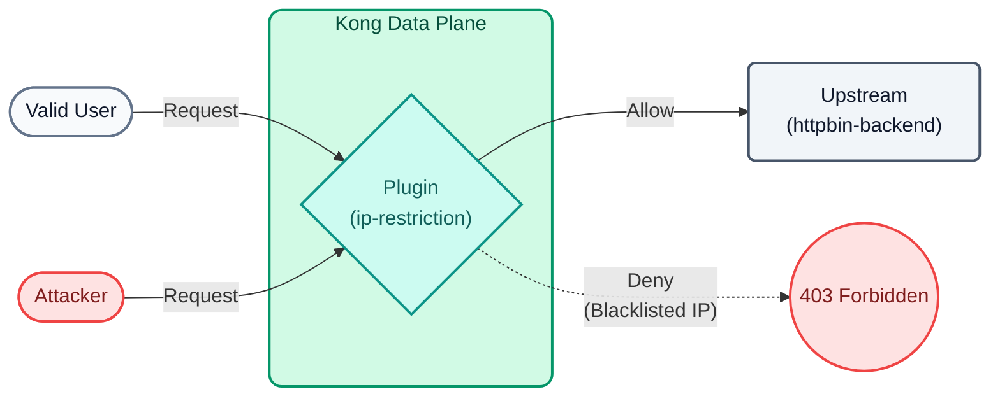
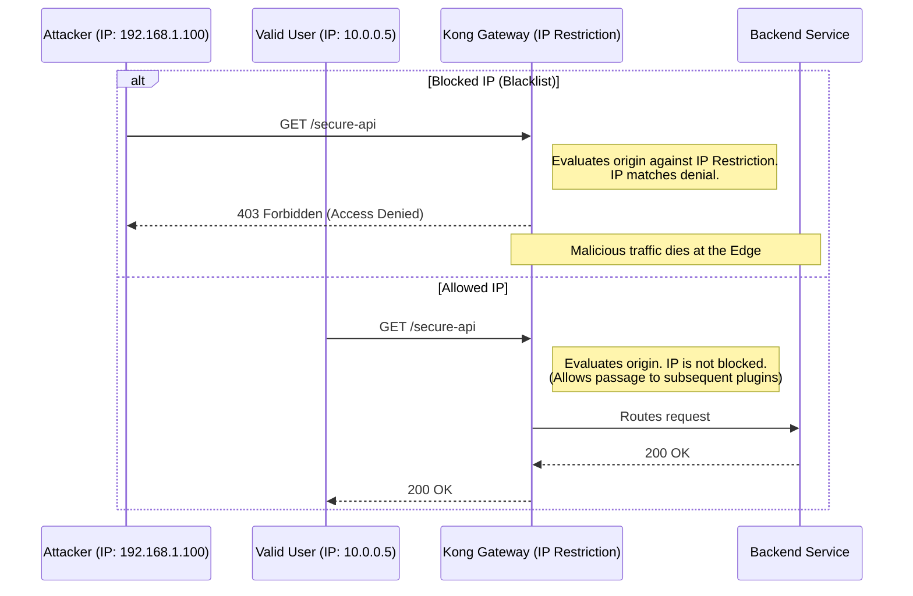

# Lab 09: IP Restriction

In this lab, we will protect an API at the network level (layer 3/4) using the `ip-restriction` plugin, ensuring that only specific addresses can consume back-office services.



## Objectives

- Configure an allowed IP whitelist.
- Use environment variable interpolation in decK files.

### Defense in Depth
Modern computer security does not rely on a single wall, but on multiple defensive layers. **IP restriction (OSI Model Layers 3 and 4)** is one of the most effective and computationally inexpensive first-line defenses.

Before Kong wastes CPU verifying cryptographic signatures of JWT tokens or evaluating complex routing rules, the **IP Restriction** plugin can immediately discard traffic if it comes from:
- Known malicious IP addresses (Blacklisting).
- Unauthorized geographies or CIDR ranges.
- Requests not originating from the corporate intranet (Whitelisting).

### IP Restriction Flow (Sequence Diagram)



---

## Step 1: Configure the Restriction

Imagine we have an internal reports endpoint that should only be accessible from the corporate network.

Open the `lab_09_1.yaml` file located in the `workshop-assets/dia-2` folder and analyze its content:

```yaml
_format_version: "3.0"
services:
 - name: mock-internal-reports
  url: http://httpbin-backend:9081/anything/reports
  routes:
   - name: internal-reports-route
    paths: 
     - /api/internal/reports
    plugins:
     - name: ip-restriction
      config:
       allow:
        - 127.0.0.1
 # decK allows interpolating environment variables from your local machine
         - ${{ env "DECK_DOCKER_HOST_IP" }}
```

**Key Points:**

- **`ip-restriction` Plugin:** This network layer plugin blocks all traffic by default (explicit `allow` behavior). Only the listed IPs (in this case, localhost and the Docker environment host IP) will be able to reach the `mock-internal-reports` service.
- **Interpolation in decK:** Using `${{ env "VARIABLE" }}` avoids hardcoding static IPs or secrets in YAML files, promoting portability across environments (Dev, QA, Prod).

## Step 2: Apply and Test Blocking (External Attacker)
We will export the necessary environment variable, synchronize, and then simulate being a user from an external network using the `X-Real-Ip` header.

```bash
export DECK_DOCKER_HOST_IP="192.168.65.1" && \
deck gateway sync lab_09_1.yaml && \
echo "Waiting 15s for Konnect to update the Data Plane..." && sleep 15 && \
curl -s -D /dev/stderr -H "X-Real-Ip: 200.150.10.20" http://localhost:8000/api/internal/reports 
```

**Analyzing the result:**

- Observe the HTTP response: You will get a resounding `403 Forbidden`.
- Kong has intercepted the traffic, returning the JSON `{"message":"Your IP address is not allowed"}`.
- Even if the attacker knows the secret reports path, the Gateway's network layer stopped them in milliseconds.

## Step 3: Test Valid Access (Internal Network)
Now we will launch the request simulating traffic genuinely coming from our local machine (or the Docker host), which is explicitly whitelisted by Kong.

```bash
curl -s -D /dev/stderr http://localhost:8000/api/internal/reports 
```

**For Windows (CMD):**
```cmd
curl -s -D /dev/stderr http://localhost:8000/api/internal/reports 
```

**Analyzing the result:**

- The HTTP code will now be `200 OK`.
- The payload successfully passed through the L4 Firewall implemented by Kong, and the `httpbin` backend returned the requested information.

---
## Conclusion
We have established a strong defense perimeter at the Gateway level without having to manipulate Cloud Security Groups or internal operating system Firewalls of the nodes, configuring everything declaratively with decK.